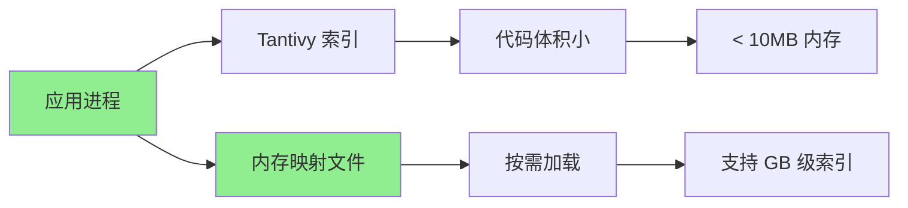
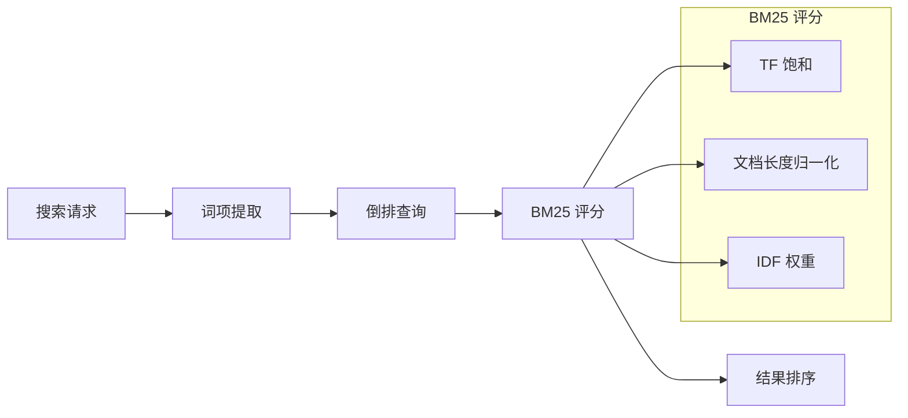
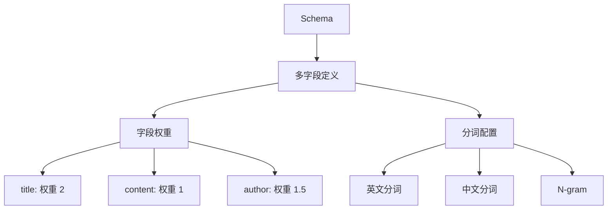

# Tantivy 功能特性

## 学习目标
- 理解 Tantivy 的低内存嵌入特性
- 掌握 BM25 排序和多字段索引能力
- 了解分词器配置和高亮功能

## 正文

### 低内存嵌入

Tantivy 设计的核心优势是低内存占用：



**内存占用对比**：

| 搜索引擎 | 内存占用 | 启动方式 |
|----------|----------|----------|
| Elasticsearch | > 1GB | 独立服务 |
| Meilisearch | > 100MB | 独立服务 |
| Tantivy | < 10MB | 嵌入式 |

**性能指标**：

```rust
// 性能基准测试
Index::create_in_ram(schema);          // 内存索引
Index::open_in_dir(dir);               // 磁盘索引
Index::open_mmap(dir);                 // 内存映射

// 搜索性能
// - 100万文档: < 10ms
// - 1000万文档: < 50ms
// - 内存占用: ~100MB (1000万文档)
```

### BM25 排序

Tantivy 内置 BM25 排序算法：



**排序配置**：

```rust
use tantivy::collector::TopDocs;
use tantivy::query::QueryParser;

// 创建查询解析器
let query_parser = QueryParser::for_index(&index, vec!["title", "content"]);

// 解析查询
let query = query_parser.parse_query("rust programming")?;

// 执行搜索
let searcher = index.reader()?.searcher();
let top_docs = searcher.search(&query, &TopDocs::with_limit(10))?;

// 输出结果
for (score, doc_address) in top_docs {
    let doc: TantivyDocument = searcher.doc(doc_address)?;
    println!("Score: {}, Doc: {:?}", score, doc);
}
```

### 多字段索引



**多字段索引配置**：

```rust
use tantivy::schema::*;

// 创建带权重的 Schema
let mut schema_builder = Schema::builder();

// title 字段，权重 2（更重要）
let title = TextFieldIndexing::default()
    .set_tokenizer("default")
    .set_index_option(IndexRecordOption::WithFreqsAndPositions);
let title_options = TextOptions::default()
    .set_indexing_options(title)
    .set_stored();
schema_builder.add_text_field("title", title_options);

// content 字段，标准权重
schema_builder.add_text_field("content", TEXT | STORED);

// author 字段，权重 1.5
let author = TextFieldIndexing::default()
    .set_tokenizer("default")
    .set_index_option(IndexRecordOption::WithFreqsAndPositions);
let author_options = TextOptions::default()
    .set_indexing_options(author);
schema_builder.add_text_field("author", author_options);

// 多字段搜索
let query = query_parser.parse_multi_query(vec![
    ("title", "rust tutorial"),    // 在 title 中搜索
    ("content", "rust tutorial"),  // 在 content 中搜索
])?;
```

### 分词器配置

```rust
use tantivy::tokenizer::*;

let tokenizer_manager = index.tokenizers();

// 注册自定义分词器
tokenizer_manager.register("my_analyzer", 
    TextAnalyzer::from(SimpleTokenizer::default())
        .filter(LowerCaser)
        .filter(Stemmer::new(Language::English))
        .filter(StopWordFilter::new(
            vec!["a", "an", "the"].into_iter().collect()
        ))
);

// 使用自定义分词器
let mut schema_builder = Schema::builder();
let text_field = TextFieldIndexing::default()
    .set_tokenizer("my_analyzer")
    .set_index_option(IndexRecordOption::WithFreqsAndPositions);
```

### 高亮显示

```rust
use tantivy::highlighter::*;

let mut highlight_builder = HighlightBuilder::default();
highlight_builder.set_pre_tag("<em>");
highlight_builder.set_post_tag("</em>");
highlight_builder.set_field("content");

let searcher = index.reader()?.searcher();
let hit_metas = searcher.search(&query, &top_docs, highlight_builder)?;

for hit_meta in hit_metas {
    println!("Snippet: {}", hit_meta.snippet);
    // 输出: "Tantivy is a <em>rust</em> based search engine"
}
```

## 要点总结

1. **低内存**：嵌入式设计，内存占用 < 10MB，支持 GB 级索引
2. **BM25 排序**：经典相关性算法，内置实现，无需配置
3. **多字段索引**：支持字段权重、分词配置、灵活 Schema
4. **分词器**：可插拔分词器，支持自定义过滤器
5. **高亮**：内置高亮功能，标记匹配位置

## 思考题

1. Tantivy 的低内存设计适合哪些应用场景？
2. 如何为中文搜索配置合适的分词器？
3. 在嵌入式场景下，如何平衡索引大小和搜索性能？
