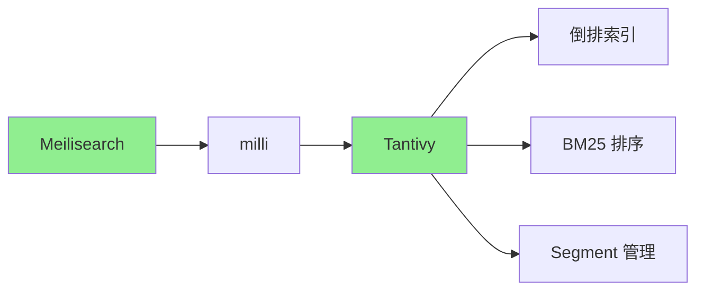
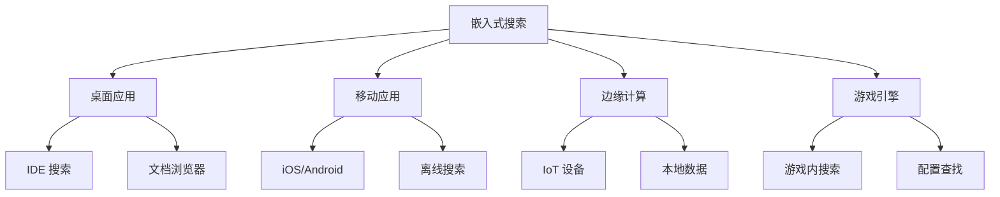

# Tantivy 应用场景

## 学习目标
- 理解 Tantivy 作为 Meilisearch 底层引擎的角色
- 掌握嵌入式搜索的典型应用场景
- 了解从桌面应用到边缘计算的部署模式

## 正文

### Meilisearch 底层引擎

Meilisearch 使用 Tantivy 作为底层搜索引擎：



**架构层次**：

| 层 | 组件 | 职责 |
|------|------|------|
| API 层 | Meilisearch | HTTP 接口、任务队列 |
| 引擎层 | milli | 索引管理、搜索协调 |
| 索引层 | Tantivy | 倒排索引、评分算法 |

**Meilisearch 的 Tantivy 封装**：

```rust
// milli 内部使用 Tantivy 的方式
use tantivy::{Index, IndexWriter, ReloadPolicy};

// 创建索引
let index = Index::create_in_ram(schema);

// 创建写入器
let mut writer: IndexWriter = index.writer(50_000_000)?;

// 添加文档
writer.add_document(doc)?;
writer.commit()?;

// 创建读取器
let reader = index
    .reader_builder()
    .reload_policy(ReloadPolicy::OnCommitWithDelay)
    .try_into()?;

// 搜索
let searcher = reader.searcher();
let top_docs = searcher.search(&query, &TopDocs::with_limit(10))?;
```

### 嵌入式搜索场景



**桌面应用场景**：

| 应用 | 搜索需求 | Tantivy 优势 |
|------|----------|--------------|
| IDE | 代码搜索 | 快速、离线 |
| 文档浏览器 | 内容检索 | 低内存 |
| 邮件客户端 | 全文搜索 | 嵌入式 |
| RSS 阅读器 | 文章搜索 | 轻量级 |

**Rust 集成示例**：

```rust
use tantivy::schema::*;
use tantivy::{Index, IndexWriter, TantivyDocument};

// 创建内存索引
let mut schema_builder = Schema::builder();
schema_builder.add_text_field("title", TEXT | STORED);
schema_builder.add_text_field("content", TEXT);
let schema = schema_builder.build();

let index = Index::create_in_ram(schema);

// 索引数据
let mut writer: IndexWriter = index.writer(50_000_000)?;
for doc in documents {
    let mut tantivy_doc = TantivyDocument::default();
    tantivy_doc.add_text("title", &doc.title);
    tantivy_doc.add_text("content", &doc.content);
    writer.add_document(tantivy_doc)?;
}
writer.commit()?;

// 搜索
let reader = index.reader()?;
let searcher = reader.searcher();
let query_parser = QueryParser::for_index(&index, vec!["title", "content"]);
let query = query_parser.parse_query("search term")?;
let top_docs = searcher.search(&query, &TopDocs::with_limit(10))?;
```

### 移动端搜索

```rust
// iOS/Android 集成 (通过 Rust FFI 或 WASM)
// 编译为 iOS Framework 或 Android AAR

// 使用 wasm-bindgen 编译为 WebAssembly
use wasm_bindgen::prelude::*;

#[wasm_bindgen]
pub struct SearchEngine {
    index: Index,
    reader: IndexReader,
}

#[wasm_bindgen]
impl SearchEngine {
    #[wasm_bindgen(constructor)]
    pub fn new(schema_json: &str, index_path: &str) -> Result<SearchEngine, JsValue> {
        // 从 WASM 加载索引
    }
    
    #[wasm_bindgen]
    pub fn search(&self, query: &str, limit: usize) -> Result<String, JsValue> {
        // 执行搜索并返回 JSON 结果
    }
}
```

**React 前端集成**：

```typescript
// 使用 wasm-bindgen 生成的 JS 绑定
import init, { SearchEngine } from './pkg/tantivy_wasm';

async function main() {
    await init();
    const engine = new SearchEngine(schemaJson, indexPath);
    
    const results = await engine.search("rust tutorial", 10);
    console.log(JSON.parse(results));
}
```

## 要点总结

1. **Meilisearch 底层**：Tantivy 是 Meilisearch 的核心，贡献高性能搜索能力
2. **嵌入式优势**：零网络开销、低内存占用、即时响应
3. **桌面应用**：IDE、文档浏览器、邮件客户端等本地搜索场景
4. **移动端**：WASM 编译，iOS/Android 原生集成，离线搜索
5. **边缘计算**：IoT 设备本地数据搜索，无需网络连接

## 思考题

1. 在移动端使用 Tantivy 时，如何管理索引的更新和同步？
2. WASM 编译的 Tantivy 相比原生编译有哪些限制？
3. 如何设计一个支持增量索引更新的嵌入式搜索方案？
