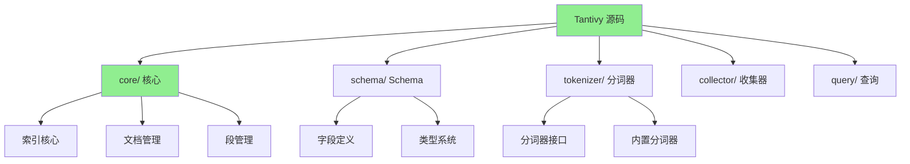
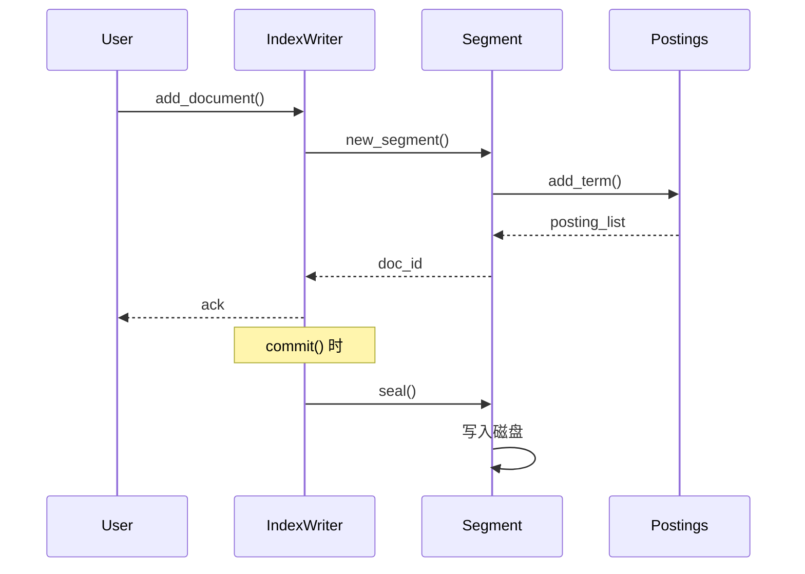
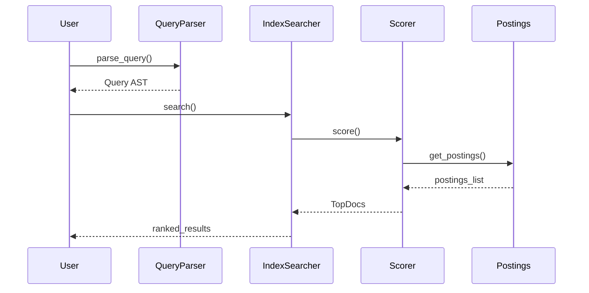

# Tantivy 源码阅读指南

## 学习目标
- 了解 Tantivy 的源码结构
- 掌握核心模块的阅读路径
- 理解倒排索引和 BM25 的实现细节

## 正文

### 源码架构概览



### 源码目录结构

```
tantivy/
├── Cargo.toml
├── src/
│   ├── lib.rs                     # 库入口
│   ├── index.rs                   # 索引核心
│   ├── directory/                 # 目录管理
│   │   ├── mod.rs
│   │   ├── ram_directory.rs       # 内存目录
│   │   └── mmap_directory.rs      # 内存映射目录
│   ├── schema/                    # Schema 模块
│   │   ├── mod.rs
│   │   ├── schema.rs              # Schema 定义
│   │   ├── field_entry.rs         # 字段条目
│   │   └── field_type.rs          # 字段类型
│   ├── tokenizer/                 # 分词器模块
│   │   ├── mod.rs
│   │   ├── tokenizer.rs           # 分词器接口
│   │   ├── simple_tokenizer.rs    # 简单分词器
│   │   └── stemmer.rs             # 词干提取器
│   ├── collector/                 # 结果收集器
│   │   ├── mod.rs
│   │   ├── top_docs.rs            # TopDocs 收集器
│   │   └── count.rs               # 计数收集器
│   ├── query/                     # 查询模块
│   │   ├── mod.rs
│   │   ├── query_parser.rs        # 查询解析器
│   │   ├── term_query.rs          # 词项查询
│   │   └── boolean_query.rs       # 布尔查询
│   └── doc/                       # 文档模块
│       ├── mod.rs
│       └── tantivy_document.rs    # 文档结构
│
├── core/
│   └── src/
│       ├── lib.rs
│       ├── index_writer.rs        # 索引写入器
│       ├── index_reader.rs        # 索引读取器
│       ├── segment.rs             # 段管理
│       ├── postings/              # 倒排列表
│       │   ├── mod.rs
│       │   ├── writer.rs          # 写入
│       │   └── reader.rs          # 读取
│       ├── fieldnorm.rs           # 字段长度规范
│       └── scorer.rs              # 评分器
│
└── Cargo.toml
```

### 关键源码阅读路径

#### 1. 索引写入路径



**核心文件**：

| 文件 | 职责 | 关键方法 |
|------|------|----------|
| `index_writer.rs` | 索引写入器 | `add_document()`, `commit()` |
| `segment.rs` | 段管理 | `new_document()`, `save()` |
| `postings/writer.rs` | 倒排写入 | `add_term()`, `write()` |

#### 2. 搜索执行路径



**核心文件**：

| 文件 | 职责 | 关键方法 |
|------|------|----------|
| `query_parser.rs` | 查询解析 | `parse_query()` |
| `index_searcher.rs` | 索引搜索 | `search()` |
| `scorer.rs` | 评分器 | `score()`, `bm25()` |

#### 3. BM25 实现

```rust
// core/src/scorer.rs 中的 BM25 实现
impl Scorer {
    fn bm25_score(&self, tf: u64, doc_len: u64, 
                  idf: f32, avgdl: f32) -> f32 {
        let k1: f32 = 1.2;
        let b: f32 = 0.75;
        
        // BM25 公式
        let tf_part = (tf as f32 * (k1 + 1.0)) / 
                      (tf as f32 + k1 * (1.0 - b + b * doc_len as f32 / avgdl));
        
        idf * tf_part
    }
}
```

### 阅读建议

**入门路径**：
1. 从 `src/index.rs` 入手，理解索引的创建和管理
2. 阅读 `src/schema/schema.rs`，理解 Schema 定义
3. 阅读 `core/src/index_writer.rs`，理解索引写入流程
4. 阅读 `core/src/scorer.rs`，理解 BM25 评分实现

**进阶路径**：
1. 阅读 `core/src/postings/`，理解倒排索引结构
2. 阅读 `src/tokenizer/`，理解分词器实现
3. 阅读 `src/query/`，理解查询解析和执行

**工具推荐**：
- Rust 工具链：rustc, cargo, rust-analyzer
- IDE：VS Code + rust-analyzer, CLion

## 要点总结

1. **模块化设计**：core/schema/tokenizer/collector/query 五个核心模块
2. **索引核心**：IndexWriter 管理写入，IndexReader 管理读取
3. **倒排结构**：postings 模块实现倒排列表的读写
4. **BM25 实现**：scorer.rs 中实现完整的 BM25 评分
5. **阅读策略**：从索引入口开始，顺着写入和搜索两条路径深入

## 思考题

1. Tantivy 的 Segment 结构与 Lucene 有什么异同？
2. BM25 的 k1 和 b 参数是如何确定的？
3. 为什么 postings 模块需要 writer 和 reader 两个子模块？
