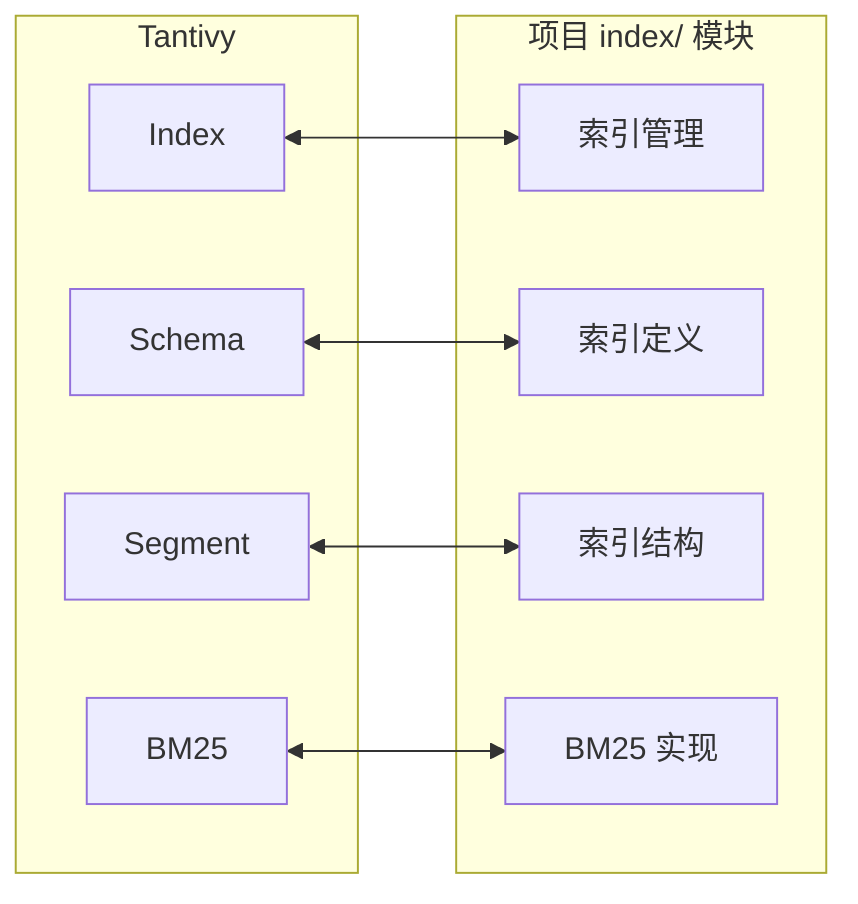
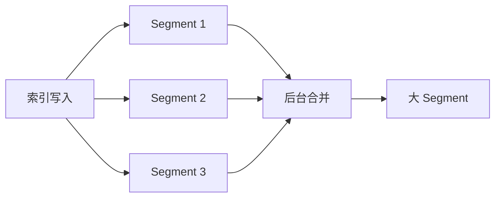
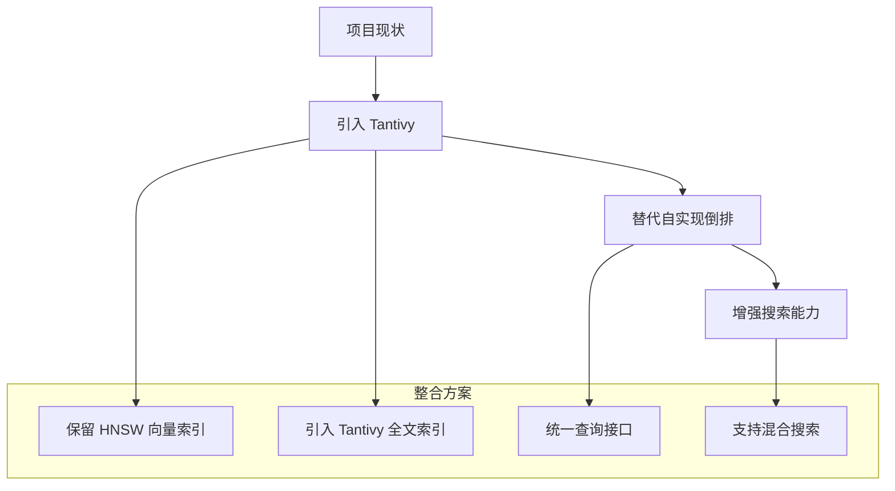

# Tantivy 与项目关联

## 学习目标
- 理解 Tantivy 与项目 index/ 模块的关系
- 掌握嵌入式搜索与项目架构的整合点
- 借鉴 Tantivy 的设计优化项目实现

## 正文

### 与项目 index/ 模块的关联



**功能对比**：

| 能力 | Tantivy | 项目 index/ | 说明 |
|------|---------|-------------|------|
| 索引管理 | Index 类 | 索引管理器 | 功能相当 |
| Schema 定义 | Schema 类 | 索引元数据 | 可借鉴 |
| 倒排索引 | postings | 自实现 | 项目已有 |
| BM25 排序 | 内置 | 已有实现 | 可比较 |
| 分词器 | 可插拔 | 需扩展 | 可借鉴 |

### 架构设计借鉴

#### 1. Segment 结构

Tantivy 的 Segment 设计支持增量更新：



**项目可借鉴**：
```c
// 项目中的 Segment 设计
typedef struct {
    uint64_t segment_id;
    uint64_t doc_count;
    uint64_t del_doc_count;
    postings_t *postings;      // 倒排列表
    docvalue_t *docvalues;     // 列式存储
    store_t *store;            // 文档存储
    bool is_active;
} segment_t;

typedef struct {
    segment_t **segments;
    size_t num_segments;
    size_t capacity;
    uint64_t next_segment_id;
} index_segments_t;
```

#### 2. Schema 定义

Tantivy 的 Schema 设计灵活：

```rust
// Tantivy Schema 定义
let mut schema = Schema::builder();
schema.add_text_field("title", TEXT | STORED);
schema.add_i64_field("id", STORED | INDEXED);
```

**项目可借鉴**：
```c
// 项目中的 Schema 定义
typedef struct {
    char *name;
    field_type_t type;        // TEXT, INTEGER, FLOAT, DATE
    uint32_t options;         // INDEXED, STORED, SORTED
    tokenizer_t *tokenizer;   // 分词器配置
} field_entry_t;

typedef struct {
    field_entry_t *fields;
    size_t num_fields;
    size_t capacity;
} index_schema_t;
```

#### 3. BM25 实现对比

```rust
// Tantivy BM25 实现（简化）
fn bm25_score(tf: u64, doc_len: u64, idf: f32, avgdl: f32) -> f32 {
    let k1: f32 = 1.2;
    let b: f32 = 0.75;
    
    let tf_part = (tf as f32 * (k1 + 1.0)) / 
                  (tf as f32 + k1 * (1.0 - b + b * doc_len as f32 / avgdl));
    
    idf * tf_part
}
```

**项目 BM25 实现**：
```c
// 参考项目中的 BM25 实现
double bm25_score(bm25_params_t *params, 
                  double tf, double dl, double idf) {
    double k1 = 1.2;
    double b = 0.75;
    return idf * (tf * (k1 + 1.0)) / 
           (tf + k1 * (1.0 - b + b * dl / params->avgdl));
}
```

### 技术整合路径



**整合步骤**：
1. 评估项目当前 BM25 实现与 Tantivy 的差距
2. 决定是使用 Tantivy 替代还是作为参考改进
3. 如需集成，通过 FFI 或直接编译 Rust 代码
4. 设计统一的搜索接口支持多种索引类型

## 要点总结

1. **功能相似**：Tantivy 的核心功能与项目 index/ 模块高度重叠
2. **Segment 设计**：Tantivy 的分段索引设计值得借鉴
3. **BM25 对比**：项目已有 BM25 实现，可与 Tantivy 比较优化
4. **整合价值**：可考虑引入 Tantivy 作为高性能全文搜索后端
5. **演进路径**：保留 HNSW，引入 Tantivy，实现混合搜索

## 思考题

1. 项目当前的 BM25 实现与 Tantivy 相比有哪些不足？
2. 如何设计统一接口来支持项目现有的 HNSW 和 Tantivy 全文索引？
3. 在项目中引入 Rust 库（如通过 FFI）会带来哪些复杂度？
