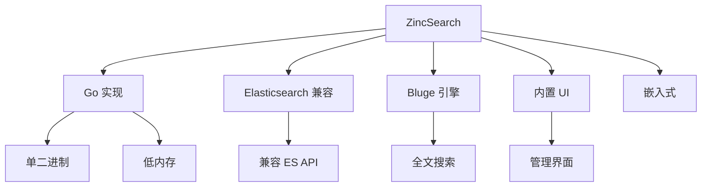

# ZincSearch 项目概览

## 学习目标

- 了解 ZincSearch 作为 Elasticsearch 轻量级替代品的定位
- 掌握 ZincSearch 的 Go 实现和简化设计

## 项目定位

> ZincSearch 是一个轻量级的全文搜索引擎，Go 实现，作为 Elasticsearch 的替代品，资源占用更低。

**基本信息**：
- 开发方：ZincSearch 社区
- 首次发布：2021 年
- 开源协议：Apache 2.0
- GitHub Stars：约 17k

## 核心设计



## 核心特性

```bash
# Docker 一键启动
docker run -d --name zincsearch \
  -p 4080:4080 \
  -e ZINC_FIRST_ADMIN_USER=admin \
  -e ZINC_FIRST_ADMIN_PASSWORD=admin \
  public.ecr.aws/zinclabs/zincsearch:latest

# 创建索引
curl -u admin:admin -X POST 'http://localhost:4080/api/index' \
  -H 'Content-Type: application/json' \
  -d '{"name": "products", "storage_type": "disk"}'

# 添加文档
curl -u admin:admin -X POST 'http://localhost:4080/api/products/_doc' \
  -H 'Content-Type: application/json' \
  -d '{"title": "Laptop", "description": "Gaming laptop"}' \

# 搜索
curl -u admin:admin -X POST 'http://localhost:4080/api/products/_search' \
  -H 'Content-Type: application/json' \
  -d '{"search_type": "match", "query": {"term": "laptop"}}'
```

## 要点总结

- Go 实现，轻量级
- Elasticsearch API 兼容
- 内置 UI 管理
- 单二进制部署
