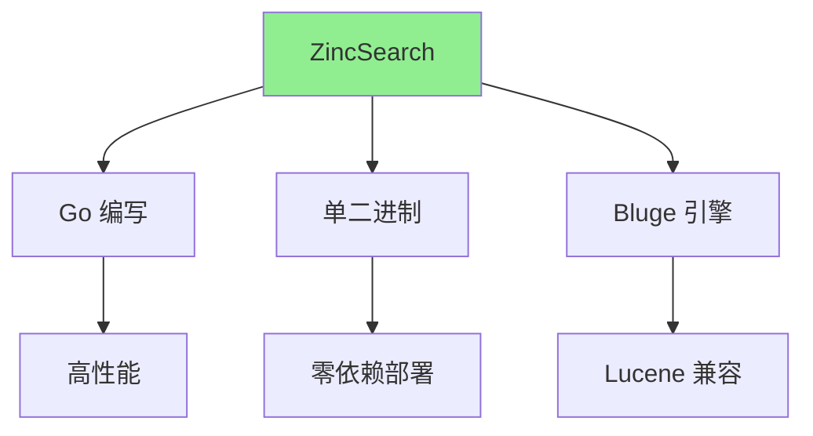
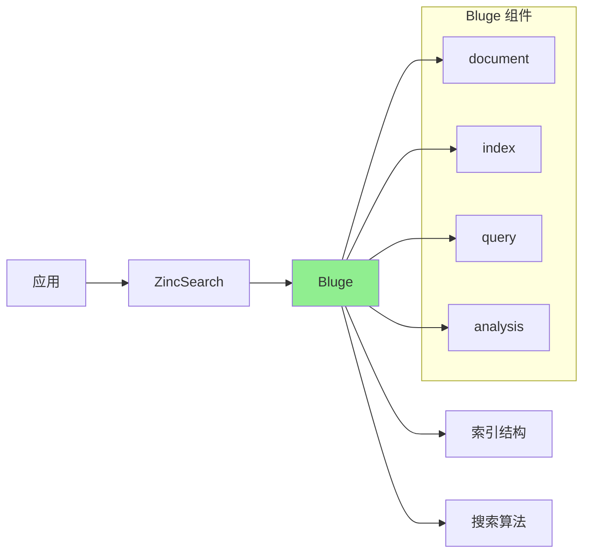
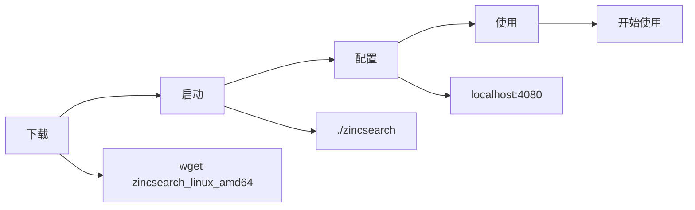
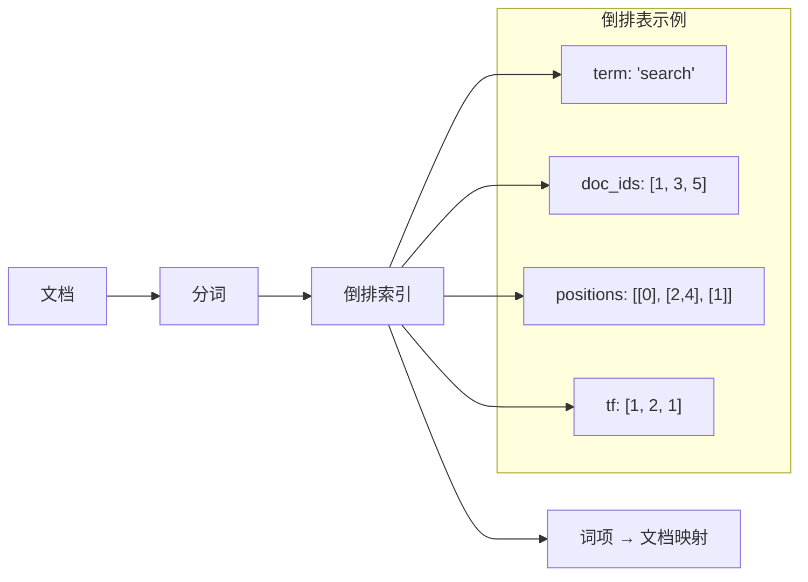

# ZincSearch 架构解析

## 学习目标
- 理解 ZincSearch 的 Go 轻量级架构
- 掌握 Bluge 引擎（Lucene 的 Go 移植）原理
- 了解单二进制部署和倒排索引结构

## 正文

### Go 轻量级架构

ZincSearch 是一个用 Go 编写的轻量级全文搜索引擎：



**核心特点**：

| 特点 | 说明 | 优势 |
|------|------|------|
| Go 语言 | 编译为单一可执行文件 | 部署简单 |
| Bluge 引擎 | Lucene 的 Go 移植 | 功能完整 |
| 单二进制 | 无需 JVM 或外部依赖 | 资源占用低 |
| ES 兼容 | 兼容 Elasticsearch API | 迁移成本低 |

### Bluge 引擎

Bluge 是 Lucene 的 Go 移植版本：



**Bluge vs Lucene**：

| 维度 | Bluge | Lucene | 说明 |
|------|-------|--------|------|
| 语言 | Go | Java | 编译为单一二进制 |
| 内存占用 | 低 (~50MB) | 高 (~500MB+) | Go 优势 |
| 启动时间 | 秒级 | 十秒级 | Go 优势 |
| 功能完整性 | 中等 | 完整 | Lucene 更丰富 |
| 性能 | 高 | 高 | 相当 |

### 单二进制部署



**部署步骤**：

```bash
# 1. 下载二进制
wget https://github.com/zinclabs/zinc/releases/latest/download/zincsearch_linux_amd64.tar.gz
tar -xzf zincsearch_linux_amd64.tar.gz

# 2. 启动服务
./zincsearch

# 3. 访问 Web UI
# http://localhost:4080

# 4. 配置认证（可选）
export BASIC_AUTH_USER=admin
export BASIC_AUTH_PASSWORD=admin123
```

### 倒排索引结构



**与 Elasticsearch 的对比**：

| 组件 | ZincSearch | Elasticsearch |
|------|------------|---------------|
| 底层引擎 | Bluge (Go) | Lucene (Java) |
| 索引结构 | Segment | Segment |
| 评分算法 | BM25 | BM25 |
| 聚合 | 基础 | 完整 |

## 要点总结

1. **Go 语言**：单一二进制，部署极简，无需 JVM
2. **Bluge 引擎**：Lucene 的 Go 实现，功能相对完整
3. **ES 兼容**：兼容 Elasticsearch API，降低迁移成本
4. **轻量设计**：资源占用低，适合小型团队
5. **Segment 结构**：与 Lucene 相同的分段索引设计

## 思考题

1. ZincSearch 的 Bluge 引擎与 Lucene 相比有哪些功能缺失？
2. 单二进制部署相比 ES 的 Docker 部署有什么优缺点？
3. 为什么 ZincSearch 选择 Go 而不是 Java 来实现搜索引擎？
