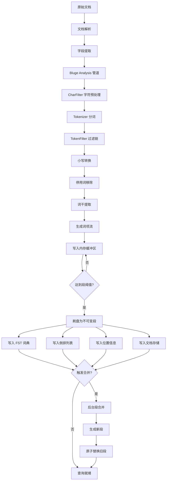

# 索引引擎

## 学习目标

- 理解 ZincSearch 倒排索引的构建与存储机制
- 掌握 Bluge 引擎分词器设计原理及多语言支持
- 熟悉段（Segment）管理与合并策略
- 能够对比分析 ZincSearch 索引引擎与本项目 index/ 模块的异同

## 核心概念

### 1. 倒排索引（Inverted Index）

倒排索引是全文搜索引擎的核心数据结构。与正向索引（文档 -> 词项）相反，倒排索引记录的是 **词项 -> 文档列表** 的映射关系。

```
正向索引: 文档1 -> {词A, 词B, 词C}
倒排索引: 词A -> {文档1, 文档3, 文档5}
        词B -> {文档1, 文档4}
```

ZincSearch 基于 Bluge 引擎构建倒排索引，其结构包含：

- **词典（Term Dictionary）**：所有被索引的词项及其元数据，Bluge 使用 FST（Finite State Transducer）进行高效压缩存储
- **倒排列表（Posting List）**：每个词项对应的文档 ID 列表，附带词频和位置信息
- **位置信息（Position）**：词项在文档中出现的具体位置，用于短语查询和邻近搜索

#### 索引条目结构

```
词项 "zincsearch"
├── 文档频率 (DF): 15
├── 倒排列表
│   ├── 文档1: 词频=3, 位置=[2, 8, 15]
│   ├── 文档3: 词频=1, 位置=[5]
│   └── 文档5: 词频=2, 位置=[1, 10]
└── 元数据: 字段来源、标准化因子
```

### 2. 分词器（Tokenizer）

ZincSearch 通过 Bluge 引擎的 analysis 模块实现分词，支持多种语言的分词规则。

#### 分词器流程

```
输入文本 -> 字符归一化 -> 分词边界识别 -> 词项过滤 -> 输出词项列表
```

#### 分词器组件

Bluge 的 analysis 模块采用**管道（Pipeline）**设计，每个阶段可插拔：

| 组件 | 功能 | 说明 |
|------|------|------|
| CharFilter | 字符预处理 | 去除 HTML 标签、特殊字符替换 |
| Tokenizer | 分词器 | 按规则切分文本为词项 |
| TokenFilter | 词项过滤器 | 大小写转换、停用词过滤、词干提取 |

#### 内置分词器类型

| 分词器 | 适用场景 | 特点 |
|--------|----------|------|
| Standard | 通用英文 | 按 Unicode 文本分割规则切分 |
| Whitespace | 空格分词 | 仅按空白字符切分，保留原始词形 |
| Letter | 字母序列 | 保留连续字母，过滤数字/符号 |
| Single | 单字分词 | 每个字符独立成词，适合 CJK 语言 |
| Ngram | 模糊搜索 | 滑动窗口 N-gram 切分 |
| Web | 网页文本 | 针对 HTML 内容优化 |

#### 中文分词策略

ZincSearch 对中文主要采用**单字切分（Unigram）**方式，同时支持自定义词典扩展：

```
输入: "搜索引擎"
     -> 单字切分: ["搜", "索", "引", "擎"]
     -> 支持自定义词典: ["搜索", "引擎"]
     -> 索引词项: ["搜", "索", "引", "擎", "搜索", "引擎"]
```

**注意**：ZincSearch 的默认中文分词能力较弱，实际生产环境中建议：
- 使用外部分词器（如 jieba、HanLP）预处理文本
- 在索引端写入已分词内容，通过 Whitespace 分词器索引
- 使用自定义 TokenFilter 扩展中文词项

#### 词项过滤器链

```
原始词项流
    |
    v
[LowercaseFilter]  -> 转小写
    |
    v
[StopTokenFilter]  -> 移除停用词（"the", "a", "is" 等）
    |
    v
[StemmerFilter]    -> 词干提取（"running" -> "run"）
    |
    v
[LengthFilter]     -> 过滤过长/过短词项
    |
    v
最终词项流
```

### 3. 段（Segment）管理

ZincSearch 采用与 Lucene 类似的**分段存储**策略管理索引数据。每个段是一个独立的、不可变的倒排索引。

#### 段的结构

每个段包含以下文件（Bluge 内部格式）：

```
segment_xxx/
├── .dict           # FST 词典文件
├── .idx            # 倒排索引文件（Doc ID 列表）
├── .pos            # 位置索引文件
├── .nrm            # 字段归一化值
├── .stored         # 原始文档存储
└── .meta           # 段元数据（文档数、段大小等）
```

#### 段生命周期

```
写入缓冲区 (内存)
    |
    v
内存段 (Memory Segment)  <- 新文档写入
    |
    | (达到阈值，默认 1MB 或 1000 文档)
    v
不可变段 (Immutable Segment)  -> 刷入磁盘
    |
    | (后台合并线程)
    v
合并段 (Merged Segment)  -> 删除旧段
```

#### 段合并策略

ZincSearch 采用**对数合并（Log Merge）**策略，按段的大小分层管理：

| 层级 | 段大小范围 | 合并触发条件 | 合并后大小 |
|------|-----------|-------------|-----------|
| L0   | 0 - 1 MB    | 段数量 >= 4 | ~ 4 MB  |
| L1   | 1 - 4 MB    | 段数量 >= 4 | ~ 16 MB |
| L2   | 4 - 16 MB   | 段数量 >= 4 | ~ 64 MB |
| L3   | 16 - 64 MB  | 段数量 >= 4 | ~ 256 MB |
| Ln   | 4^n MB      | 持续向上合并 | 4^(n+1) MB |

**合并过程**：

1. 后台线程监控当前段列表
2. 当某一层级段数量达到阈值时，选取该层所有段
3. 逐条合并倒排列表，生成新的段
4. 原子切换：删除旧段，添加新段
5. 释放旧段占用的磁盘空间

**合并收益**：

| 收益 | 说明 |
|------|------|
| 减少段数量 | 降低文件句柄开销，提升查询速度 |
| 回收删除标记 | 物理删除已标记删除的文档 |
| 压缩词典 | 合并后的 FST 更紧凑，词项查找更快 |
| 统一统计信息 | 合并后的段拥有全局 IDF 统计 |

### 4. 索引构建流程



### 5. 索引存储格式

ZincSearch 使用 Bluge 引擎的磁盘存储格式，核心文件说明：

| 文件 | 内容 | 存储格式 |
|------|------|----------|
| .dict | 词项词典 | FST（Finite State Transducer），支持前缀压缩 |
| .idx | 倒排索引 | Doc ID 差分编码 + 跳表加速 |
| .pos | 位置索引 | 位置差分编码 |
| .nrm | 归一化因子 | 每个字段的 | 文档长度归一化值 |
| .stored | 原始文档 | 键值对存储，文档 ID 可检索 |
| .meta | 段元数据 | JSON 格式，含段统计信息 |

**FST 词典压缩原理**：

```
词项列表: ["apple", "app", "application", "apply"]

FST 压缩表示:
    a -> p -> p -> l -> e       (apple)
                  -> y          (apply)
             -> l -> i -> c -> a -> t -> i -> o -> n  (application)
    （共享前缀 "app" 只存储一次）
```

**倒排列表差分编码**：

```
原始 Doc ID 列表: [1, 3, 7, 12, 20]
差分编码:         [1, 2, 4, 5, 8]  (相邻差值)
存储量:           从 5 个整数 → 只需 5 个更小的整数
```

## 与项目 index/ 模块的对比

| 维度 | ZincSearch (Bluge) | 本项目 index/ |
|------|--------------------|----------------|
| 核心索引 | 倒排索引（词项 -> 文档列表） | BM25/HNSW/DiskANN/IVF 等多种索引 |
| 词典存储 | FST（Finite State Transducer） | 哈希表 / 有序数组 |
| 分词器 | Bluge analysis 管道，多种内置分词器 | 词典分词（algo/dict/） |
| 段管理 | 对数合并（Log Merge） | 无段概念，采用页面管理 |
| 更新策略 | 不可变段 + 合并 | 原地更新（Buffer Pool 脏页刷盘） |
| 文档存储 | 独立 .stored 文件 | 自定义页面存储 |
| 并发控制 | 读写分离（内存段 + 磁盘段） | 锁机制（db/lock/） |
| 评分算法 | BM25（Bluge 实现） | 自有 BM25 实现 |

### 可借鉴的设计

1. **FST 词典压缩**：本项目索引模块的词项词典可借鉴 FST 的前缀压缩技术，减少内存占用
2. **段合并机制**：本项目 index/ 模块目前缺少类似的分层合并策略，写入放大问题有待优化
3. **Analysis 管道**：Bluge 的 CharFilter -> Tokenizer -> TokenFilter 管道设计清晰，可复用模式
4. **差分编码**：倒排列表的差分编码 + 跳表加速，可应用于本项目的顺序 ID 列表存储

## 要点总结

1. 倒排索引是全文搜索的核心，ZincSearch 通过 Bluge 引擎实现词项到文档的映射
2. Bluge 的 analysis 模块采用管道设计，支持 CharFilter、Tokenizer、TokenFilter 三阶段可插拔处理
3. 段管理采用对数合并策略，不可变段设计简化了并发控制
4. FST 词典通过前缀压缩大幅减少词项存储空间
5. 差分编码 + 跳表加速倒排列表的存储和遍历
6. 中文分词支持较弱，生产环境需配合外部分词器

## 思考题

1. 倒排索引中位置信息为什么对短语查询至关重要？如果不存储位置信息，如何近似实现短语查询？
2. FST 词典相比哈希表在词项查找和存储空间上有什么优劣？各自适合什么场景？
3. ZincSearch 的对数合并策略与 Meilisearch 的分层合并策略有何异同？为什么选择不同的合并策略？
4. 本项目 index/ 模块的 BM25 实现能否借鉴 Bluge 的段合并策略来优化增量索引？
5. 对于中文分词，ZincSearch 的单字切分存在哪些局限性？如何通过外部分词器弥补？