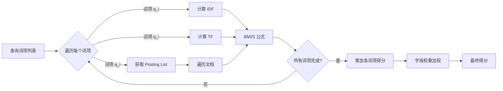
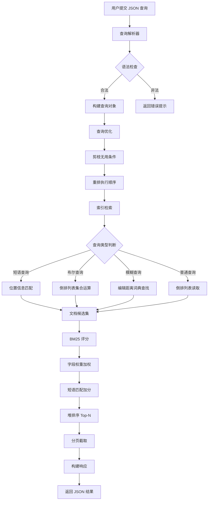

# 查询引擎

## 学习目标

- 理解 ZincSearch 查询解析与执行的整体流程
- 掌握 BM25/TF-IDF 评分算法的原理与实现细节
- 区分布尔查询、短语查询、模糊查询的处理方式
- 熟悉结果排序与分页机制
- 建立与本项目 algo/ 模块中 BM25 实现的关联

## 核心概念

### 1. 查询解析与执行流程

ZincSearch 的查询引擎遵循 **解析 -> 构建 -> 执行 -> 评分 -> 排序 -> 输出** 的流水线设计。

#### 查询执行流水线

```
用户查询串（JSON 格式）
    |
    v
+----------------+
| 查询解析器      |  将 JSON 查询解析为查询对象
| Parser         |  识别查询类型、字段限定、参数
+-------+--------+
        |
        v
+----------------+
| 查询构建器      |  构建查询树，优化查询计划
| Builder        |  合并相同条件，剪枝无用分支
+-------+--------+
        |
        v
+----------------+
| 索引检索器      |  从倒排索引中读取匹配的文档列表
| Retriever      |  执行集合运算（交/并/差）
+-------+--------+
        |
        v
+----------------+
| 评分引擎        |  BM25 计算相关性得分
| Scorer         |  字段权重、短语匹配加分
+-------+--------+
        |
        v
+----------------+
| 排序器          |  按得分降序 + 自定义排序规则
| Sorter         |  Top-N 堆排序
+-------+--------+
        |
        v
+----------------+
| 分页器          |  Offset/Limit 截取结果
| Paginator      |  返回最终结果集
+-------+--------+
        |
        v
    查询结果（JSON 响应）
```

#### ZincSearch 查询语法

ZincSearch 使用 **JSON 格式** 定义查询，与 Elasticsearch 兼容：

```json
{
  "search_type": "match",
  "query": {
    "term": "search engine"
  },
  "fields": ["title", "content"],
  "max_results": 20,
  "from": 0
}
```

#### 查询类型分类

| 查询类型 | JSON 参数 | 说明 | 典型场景 |
|----------|-----------|------|----------|
| Term Query | `{"term": "word"}` | 词条精确匹配 | 关键词搜索 |
| Match Query | `{"match": {"field": "text"}}` | 全文匹配（分词后搜索） | 文本搜索 |
| Phrase Query | `{"match_phrase": {"field": "phrase"}}` | 短语匹配（顺序敏感） | 精确短语 |
| Boolean Query | `{"bool": {...}}` | 布尔组合（must/should/must_not） | 多条件组合 |
| Fuzzy Query | `{"fuzzy": {"field": {"value": "term", "fuzziness": 2}}}` | 模糊匹配 | 拼写纠正 |
| Range Query | `{"range": {"field": {"gte": 10, "lte": 100}}}` | 范围查询 | 数值/日期筛选 |
| Wildcard Query | `{"wildcard": {"field": "app*"}}` | 通配符匹配 | 模式匹配 |
| Prefix Query | `{"prefix": {"field": "search"}}` | 前缀匹配 | 自动补全 |

### 2. BM25/TF-IDF 评分算法

ZincSearch 默认使用 **BM25** 作为相关性评分算法，Bluge 引擎提供了完整的 BM25 实现。

#### BM25 公式

```
score(D, Q) = Sum(IDF(q_i) * TF(q_i, D) * (k1 + 1)) / (TF(q_i, D) + k1 * (1 - b + b * |D| / avgdl))

其中:
  IDF(q_i) = ln(1 + (N - n(q_i) + 0.5) / (n(q_i) + 0.5))
  TF(q_i, D) = 词项 q_i 在文档 D 中的频率
  |D| = 文档 D 的长度（词项数）
  avgdl = 所有文档的平均长度
  k1 = 饱和控制参数（默认 1.2）
  b = 长度归一化参数（默认 0.75）
  N = 文档总数
  n(q_i) = 包含词项 q_i 的文档数
```

#### 参数调优

| 参数 | 默认值 | 作用 | 调大 | 调小 |
|------|--------|------|------|------|
| k1   | 1.2    | 控制词频饱和度 | 高频词贡献更大 | 抑制高频词 |
| b    | 0.75   | 文档长度归一化 | 惩罚长文档 | 忽略文档长度 |

**词频饱和效应**：

```
TF（词频）  TF-IDF 得分  BM25 得分（k1=1.2）
    1         1.0            0.55
    2         2.0            0.78
    5         5.0            0.95
   10        10.0            0.98
   20        20.0            0.99
```

BM25 的词频饱和特性避免了高频词对得分的过度影响。

#### TF-IDF 公式（可选）

Bluge 也支持 TF-IDF 评分（需显式配置）：

```
score(D, Q) = Sum(TF(q_i, D) * IDF(q_i))

其中:
  TF(q_i, D) = f(q_i, D) / Sum(f(t, D))  （词项频率归一化）
  IDF(q_i) = log(N / n(q_i))             （逆文档频率）
```

#### 评分流程



### 3. 查询类型详解

#### 3.1 布尔查询（Boolean Query）

布尔查询通过 `must`、`should`、`must_not` 逻辑组合多个查询条件。

```json
{
  "bool": {
    "must": [
      {"match": {"title": "zincsearch"}}
    ],
    "should": [
      {"match": {"content": "go"}},
      {"match": {"content": "lightweight"}}
    ],
    "must_not": [
      {"term": {"status": "deprecated"}}
    ],
    "minimum_should_match": 1
  }
}
```

**逻辑语义**：

| 子句 | 含义 | 集合操作 |
|------|------|----------|
| must | 必须匹配（AND） | 交集 |
| should | 应该匹配（OR） | 并集 |
| must_not | 必须不匹配（NOT） | 差集 |
| minimum_should_match | should 子句最少匹配数 | 条件阈值 |

**执行优化**：

```
must 子句执行顺序：
  1. 按 Posting List 长度升序排序
  2. 先执行短列表，快速缩小候选集
  3. 使用跳表加速交集计算

should 子句执行：
  1. 并行执行各子句
  2. 合并结果并去重
  3. 累加多个子句的得分
```

#### 3.2 短语查询（Phrase Query）

短语查询要求词项按指定顺序连续出现。

```json
{
  "match_phrase": {
    "content": {
      "query": "search engine",
      "slop": 0
    }
  }
}
```

**slop 参数**：允许词项之间的位置偏移量

| slop 值 | 匹配情况 |
|---------|----------|
| 0       | 必须 "search" 后紧接 "engine" |
| 1       | 允许中间间隔 1 个词（如 "search fast engine"） |
| 2       | 允许中间间隔 2 个词 |

**实现方式**：利用倒排索引中的位置信息，检查词项位置连续性。

```
词项 "search" 的位置: 文档1 -> [3, 17, 45]
词项 "engine" 的位置: 文档1 -> [4, 18, 52]

位置差为 1 的匹配: 3->4, 17->18
-> 文档中存在 2 处 "search engine" 短语
```

#### 3.3 模糊查询（Fuzzy Query）

模糊查询允许词项之间的编辑距离在一定范围内，用于拼写纠正。

```json
{
  "fuzzy": {
    "title": {
      "value": "zincserch",
      "fuzziness": 2
    }
  }
}
```

**编辑距离阈值**：

| 查询词长度 | 默认最大编辑距离 |
|-----------|-----------------|
| 1-2 字符   | 0（精确匹配）|
| 3-5 字符   | 1               |
| 6+ 字符    | 2               |

**实现方式**：

1. 在词典中查找与查询词编辑距离 <= 阈值的所有词项
2. 取这些词项的倒排列表并集
3. 评分时按编辑距离给予折扣（越接近原始词得分越高）

**Levenshtein 距离计算**：

```
d(s, t) = min {
  d(s-1, t) + 1     // 删除
  d(s, t-1) + 1     // 插入
  d(s-1, t-1) + cost  // 替换
}
```

### 4. 结果排序与分页

#### 排序规则

ZincSearch 支持多级排序，优先级由高到低：

1. **相关性得分**（默认 BM25 降序）
2. **自定义字段排序**（如时间降序、价格升序）
3. **文档 ID 排序**（稳定排序兜底）

```json
{
  "query": {...},
  "sort": [
    {"_score": "desc"},
    {"created_at": "desc"},
    {"_id": "asc"}
  ]
}
```

#### Top-N 堆排序

对于大规模结果集，ZincSearch 使用**最小堆**获取 Top-N 结果：

```
算法流程:
  1. 建立大小为 N 的最小堆
  2. 遍历所有候选文档:
     - 如堆未满，直接插入
     - 如堆已满且当前得分 > 堆顶，替换堆顶并下沉
  3. 最终堆中即为 Top-N 结果

时间复杂度: O(M log N)，M 为候选文档数，N 为返回条数
空间复杂度: O(N)
```

#### 分页

```json
{
  "query": {...},
  "from": 40,
  "max_results": 20
}
```

| 参数 | 默认值 | 最大值 | 说明 |
|------|--------|--------|------|
| from | 0 | 无限制 | 跳过的结果数（偏移量）|
| max_results | 10 | 10000 | 每页结果数 |

**深分页问题**：

```
查询第 10000 页，每页 10 条:
- 需要排序前 100010 条文档
- 内存和计算开销大

建议:
- 使用 max_results 上限控制
- 避免超过 10000 条的深分页
- 可考虑游标分页（Cursor-based Pagination）
```

### 5. 查询执行完整流程



## 与项目 algo/ 模块的关联

### BM25 实现对比

本项目 `db/index/vector_index/BM25/` 目录下包含 BM25 的 C 语言实现。

| 维度 | ZincSearch (Bluge) BM25 | 本项目 BM25 |
|------|-------------------------|-------------|
| 公式 | 标准 BM25 | 标准 BM25 |
| 参数 | k1=1.2, b=0.75（可配置） | 需自定义参数 |
| 实现语言 | Go（Bluge 库） | C |
| 倒排索引 | FST + Posting List | 内存结构 |
| 短语加分 | 支持（slop 可配置） | 待实现 |
| 字段权重 | 支持多字段加权 | 单字段模式 |
| IDF 缓存 | 段级别统计信息缓存 | 需手动管理 |

### 可迁移的设计

**1. 评分流水线**：查询 -> 检索 -> 评分 -> 排序的分阶段设计，适合本项目重构查询模块。

**2. 堆排序算法**：Top-N 堆排序策略可直接复用到本项目的 `algo-prod/sort/` 排序实现中。

```c
// 堆选择算法示意
void top_k_select(doc_score_t *docs, int n, int k) {
    priority_queue_t *heap = pq_create(k, compare_min);
    for (int i = 0; i < n; i++) {
        if (pq_size(heap) < k) {
            pq_push(heap, docs[i]);
        } else if (docs[i].score > pq_peek(heap)->score) {
            pq_pop(heap);
            pq_push(heap, docs[i]);
        }
    }
    // 输出堆中结果
}
```

**3. 编辑距离计算**：模糊查询中的 Levenshtein 距离计算可与本项目 `algo/` 模块中的字符串算法结合。

**4. 跳表加速**：布尔查询中的跳表交集算法可应用于本项目的有序列表合并。

```c
// 跳表加速交集
int intersect_sorted_lists(int *a, int n, int *b, int m, int *result) {
    int i = 0, j = 0, k = 0;
    while (i < n && j < m) {
        if (a[i] == b[j]) {
            result[k++] = a[i++];
            j++;
        } else if (a[i] < b[j]) {
            i = skip_forward(a, i, n, b[j]);  // 跳表跳跃
        } else {
            j = skip_forward(b, j, m, a[i]);
        }
    }
    return k;
}
```

## 要点总结

1. 查询引擎采用流水线架构：解析 -> 构建 -> 执行 -> 评分 -> 排序 -> 分页
2. BM25 是默认相关性评分算法，k1 控制词频饱和度，b 控制文档长度归一化
3. 布尔查询通过 must/should/must_not 组合条件，使用集合运算实现
4. 短语查询依赖倒排索引中的位置信息，实现词项顺序匹配
5. 模糊查询通过编辑距离在词典中展开近似词项
6. 结果排序采用多级排序规则，Top-N 堆排序避免全量排序开销
7. 分页使用 from 和 max_results 参数，建议避免深分页

## 思考题

1. BM25 公式中参数 k1 和 b 分别控制什么？在短文本搜索和长文档搜索中，应该分别如何调整这两个参数？
2. 短语查询依赖位置信息，但如果索引不存储位置信息，如何设计一种近似方案来支持短语查询？
3. 模糊查询的编辑距离阈值随查询词长度变化，这种设计是否合理？对于中文查询（每个字符独立成词），阈值策略是否需要调整？
4. 堆排序获取 Top-N 结果的时间复杂度是 O(M log N)，与全量排序 O(M log M) 相比在什么场景下优势最大？
5. 本项目的 BM25 实现（db/index/vector_index/BM25/）如果集成 ZincSearch 的字段权重和短语加分机制，需要修改哪些核心代码？