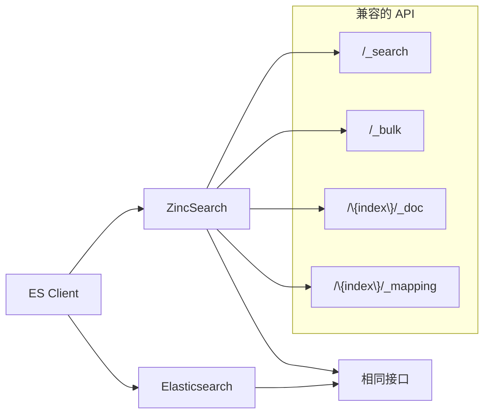
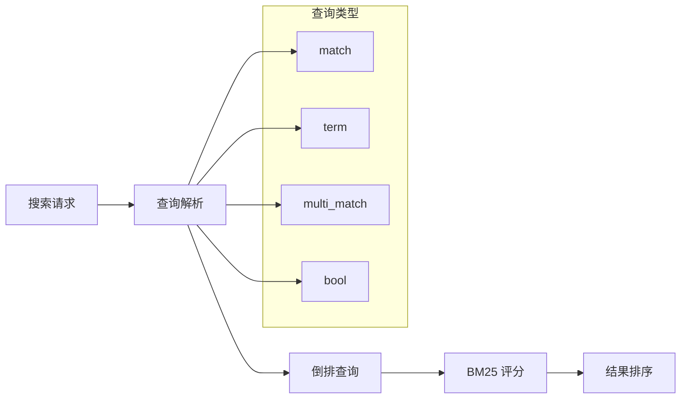
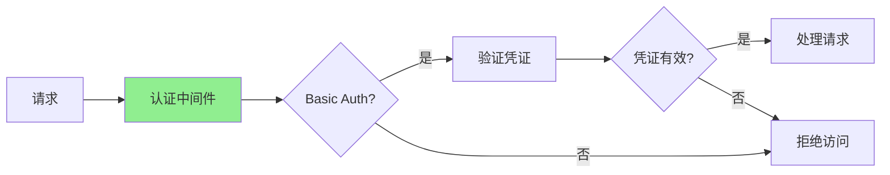

# ZincSearch 功能特性

## 学习目标
- 理解 ZincSearch 的 Elasticsearch 兼容 API
- 掌握全文检索和聚合分析功能
- 了解身份认证和索引管理能力

## 正文

### Elasticsearch 兼容 API

ZincSearch 提供了与 Elasticsearch 高度兼容的 API：



**API 兼容对照**：

| ES API | ZincSearch 支持 | 说明 |
|--------|-----------------|------|
| `/_search` | ✅ | 搜索接口 |
| `/_bulk` | ✅ | 批量操作 |
| `/{index}/_doc` | ✅ | 文档 CRUD |
| `/{index}/_mapping` | ✅ | 映射定义 |
| `/{index}/_settings` | ✅ | 索引设置 |
| `/_cat/indices` | ✅ | 索引列表 |

### 全文检索



**搜索示例**：

```bash
# 1. 基本搜索
curl -X POST 'http://localhost:4080/api/default/movies/_search' \
  -H 'Content-Type: application/json' \
  -u 'admin:admin123' \
  -d '{
    "query": {
      "match": {
        "title": "action movie"
      }
    }
  }'

# 2. 多字段搜索
curl -X POST 'http://localhost:4080/api/default/movies/_search' \
  -H 'Content-Type: application/json' \
  -u 'admin:admin123' \
  -d '{
    "query": {
      "multi_match": {
        "query": "action adventure",
        "fields": ["title^2", "description", "tags"]
      }
    }
  }'

# 3. 布尔组合查询
curl -X POST 'http://localhost:4080/api/default/movies/_search' \
  -H 'Content-Type: application/json' \
  -u 'admin:admin123' \
  -d '{
    "query": {
      "bool": {
        "must": [
          { "match": { "title": "marvel" } }
        ],
        "should": [
          { "match": { "description": "superhero" } }
        ],
        "filter": [
          { "range": { "rating": { "gte": 8.0 } } }
        ]
      }
    }
  }'

# 4. 高亮显示
curl -X POST 'http://localhost:4080/api/default/movies/_search' \
  -H 'Content-Type: application/json' \
  -u 'admin:admin123' \
  -d '{
    "query": { "match": { "title": "action" } },
    "highlight": {
      "fields": {
        "title": {},
        "description": {}
      }
    }
  }'
```

### 聚合分析

```bash
# 1. 桶聚合（分类统计）
curl -X POST 'http://localhost:4080/api/default/movies/_search' \
  -H 'Content-Type: application/json' \
  -u 'admin:admin123' \
  -d '{
    "query": { "match_all": {} },
    "aggs": {
      "by_genre": {
        "terms": { "field": "genre.keyword", "size": 10 }
      },
      "by_year": {
        "terms": { "field": "year" }
      }
    }
  }'

# 2. 指标聚合（数值统计）
curl -X POST 'http://localhost:4080/api/default/movies/_search' \
  -H 'Content-Type: application/json' \
  -u 'admin:admin123' \
  -d '{
    "query": { "match_all": {} },
    "aggs": {
      "avg_rating": { "avg": { "field": "rating" } },
      "max_rating": { "max": { "field": "rating" } },
      "rating_stats": { "stats": { "field": "rating" } }
    }
  }'
```

### 身份认证



**认证配置**：

```bash
# 启动时配置认证
export BASIC_AUTH_USER=admin
export BASIC_AUTH_PASSWORD=secure_password
./zincsearch

# API 请求带认证
curl -u 'admin:secure_password' \
  'http://localhost:4080/api/default/movies/_search' \
  -d '{"query": {"match_all": {}}}'
```

### 索引管理

```bash
# 1. 创建索引
curl -X PUT 'http://localhost:4080/api/default/new_index' \
  -u 'admin:admin123'

# 2. 查看索引列表
curl -X GET 'http://localhost:4080/api/index' \
  -u 'admin:admin123'

# 3. 删除索引
curl -X DELETE 'http://localhost:4080/api/default/old_index' \
  -u 'admin:admin123'

# 4. 查看索引映射
curl -X GET 'http://localhost:4080/api/default/movies/_mapping' \
  -u 'admin:admin123'
```

## 要点总结

1. **ES 兼容**：API 与 Elasticsearch 高度兼容，现有工具可直接使用
2. **全文检索**：支持 match/term/multi_match/bool 等查询类型
3. **聚合分析**：支持桶聚合和指标聚合，满足基本分析需求
4. **身份认证**：支持 Basic Auth，保护数据安全
5. **索引管理**：提供完整的索引 CRUD 操作

## 思考题

1. ZincSearch 的 ES 兼容 API 能支持哪些现有工具？
2. 在聚合分析方面，ZincSearch 比 Elasticsearch 少了哪些功能？
3. Basic Auth 认证在生产环境中是否足够安全？
