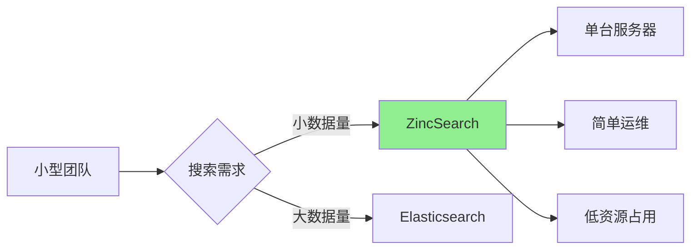
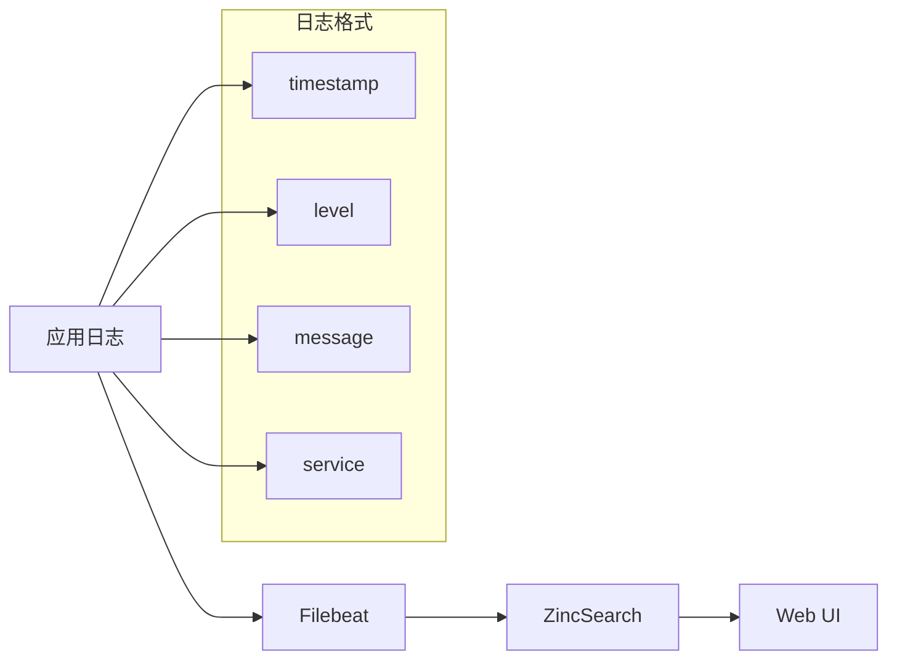
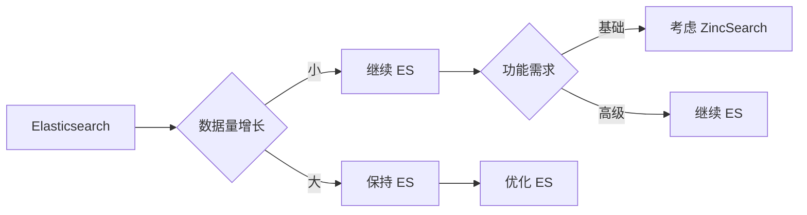

# ZincSearch 应用场景

## 学习目标
- 理解 ZincSearch 在小型团队搜索场景的应用
- 掌握日志分析的基本实现
- 了解与 Elasticsearch 的选择策略

## 正文

### 小型团队搜索

ZincSearch 专为资源有限的小型团队设计：



**适用场景**：

| 场景 | ZincSearch | Elasticsearch | 说明 |
|------|------------|---------------|------|
| 数据量 | < 1000 万 | 无限制 | ES 无限 |
| 团队规模 | < 10 人 | 任意 | 资源决定 |
| 运维能力 | 简单 | 复杂 | ES 需要专人 |
| 预算 | 有限 | 充足 | 硬件成本 |
| 功能需求 | 基础搜索 | 高级分析 | 功能决定 |

### 日志分析



**日志分析示例**：

```bash
# 1. 定义日志索引映射
curl -X PUT 'http://localhost:4080/api/default/app_logs' \
  -u 'admin:admin123' \
  -H 'Content-Type: application/json' \
  -d '{
    "mappings": {
      "properties": {
        "timestamp": { "type": "date" },
        "level": { "type": "keyword" },
        "message": { "type": "text" },
        "service": { "type": "keyword" },
        "host": { "type": "keyword" }
      }
    }
  }'

# 2. 搜索错误日志
curl -X POST 'http://localhost:4080/api/default/app_logs/_search' \
  -u 'admin:admin123' \
  -H 'Content-Type: application/json' \
  -d '{
    "query": {
      "bool": {
        "must": [
          { "match": { "message": "error exception" } }
        ],
        "filter": [
          { "term": { "level": "ERROR" } },
          { "range": { "timestamp": { "gte": "now-24h" } } }
        ]
      }
    }
  }'

# 3. 按服务统计错误数
curl -X POST 'http://localhost:4080/api/default/app_logs/_search' \
  -u 'admin:admin123' \
  -H 'Content-Type: application/json' \
  -d '{
    "query": { "term": { "level": "ERROR" } },
    "aggs": {
      "errors_by_service": {
        "terms": { "field": "service" }
      }
    }
  }'
```

### 数据看板

```bash
# 创建简单的数据看板

# 1. 统计总文档数
curl -X POST 'http://localhost:4080/api/default/movies/_search' \
  -u 'admin:admin123' \
  -H 'Content-Type: application/json' \
  -d '{
    "size": 0,
    "aggs": {
      "total_count": { "value_count": { "field": "_id" } }
    }
  }'

# 2. 评分分布
curl -X POST 'http://localhost:4080/api/default/movies/_search' \
  -u 'admin:admin123' \
  -H 'Content-Type: application/json' \
  -d '{
    "size": 0,
    "aggs": {
      "rating_histogram": {
        "histogram": { "field": "rating", "interval": 1 }
      }
    }
  }'

# 3. 高评分电影（评分 >= 9）
curl -X POST 'http://localhost:4080/api/default/movies/_search' \
  -u 'admin:admin123' \
  -H 'Content-Type: application/json' \
  -d '{
    "query": { "range": { "rating": { "gte": 9 } } },
    "sort": [{ "rating": "desc" }],
    "size": 10
  }'
```

### 迁移策略



**迁移时机**：

| 指标 | ZincSearch 上限 | 建议 |
|------|-----------------|------|
| 数据量 | < 1000 万文档 | 监控增长率 |
| 写入 QPS | < 1000/s | 监控峰值 |
| 查询延迟 | < 100ms | 监控 P99 |
| 聚合复杂度 | 简单聚合 | 复杂聚合需 ES |

## 要点总结

1. **小型团队**：资源有限、运维能力不足的场景首选
2. **日志分析**：基本日志搜索和统计，满足小规模需求
3. **轻量替代**：Elasticsearch 的轻量替代方案
4. **迁移评估**：数据量超过千万或需要高级功能时考虑迁移
5. **ES 兼容**：降低从 ES 迁移的成本

## 思考题

1. 在什么情况下应该从 ZincSearch 迁移到 Elasticsearch？
2. ZincSearch 的 Web UI 能满足小型团队的日常需求吗？
3. 如何设计数据增长监控来决定是否需要迁移？
