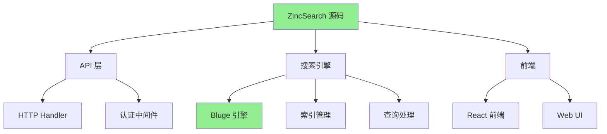
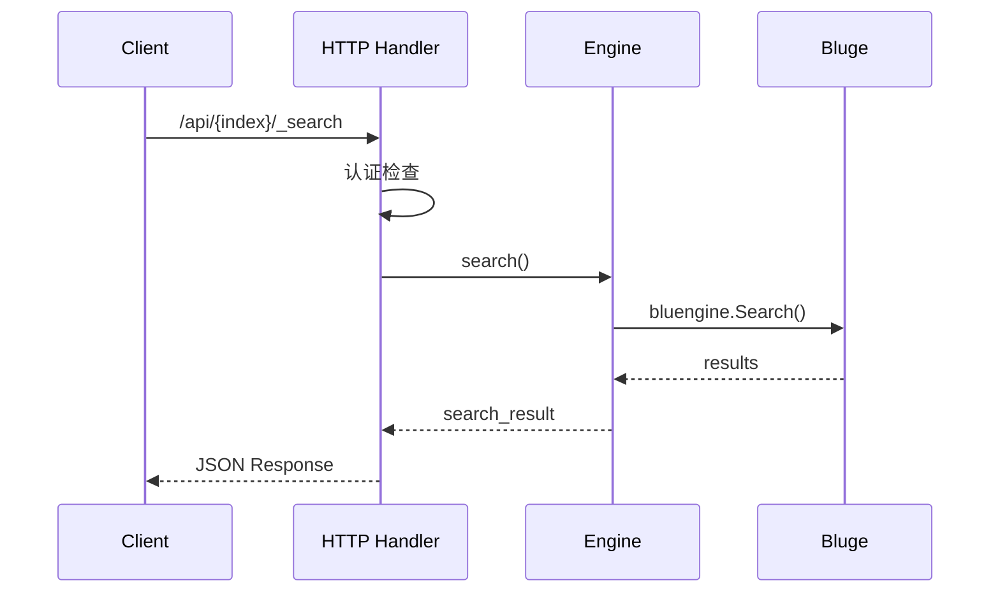
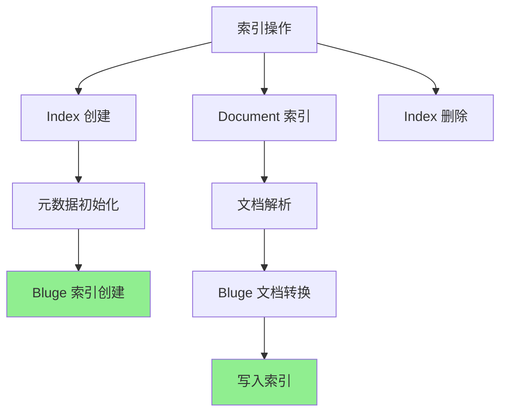

# ZincSearch 源码阅读指南

## 学习目标
- 了解 ZincSearch 的源码结构
- 掌握核心模块的阅读路径
- 理解 Bluge 引擎的集成方式

## 正文

### 源码架构概览



### 源码目录结构

```
zincsearch/
├── cmd/
│   └── server/
│       └── main.go                # 程序入口
│
├── go.mod                         # Go 模块
│
├── pkg/
│   ├── meta/
│   │   ├── index.go               # 索引元数据
│   │   └── mapping.go             # 映射定义
│   │
│   ├── engine/
│   │   ├── engine.go              # 搜索引擎接口
│   │   ├── bluengine.go           # Bluge 引擎实现
│   │   └── search.go              # 搜索处理
│   │
│   ├── handler/
│   │   ├── handler.go             # HTTP 处理器
│   │   ├── index.go               # 索引操作
│   │   ├── document.go            # 文档操作
│   │   └── search.go              # 搜索操作
│   │
│   ├── auth/
│   │   └── auth.go                # 认证中间件
│   │
│   └── utils/
│       └── utils.go               # 工具函数
│
└── web/
    ├── src/                       # React 前端
    ├── package.json
    └── vite.config.ts
```

### 关键源码阅读路径

#### 1. API 入口路径



**核心文件**：

| 文件 | 职责 | 关键方法 |
|------|------|----------|
| `handler/search.go` | 搜索 HTTP 处理 | `handleSearch()` |
| `engine/bluengine.go` | Bluge 引擎封装 | `Search()`, `Index()` |
| `engine/search.go` | 搜索逻辑 | `buildQuery()`, `executeQuery()` |

#### 2. 索引管理路径



**核心文件**：

| 文件 | 职责 |
|------|------|
| `handler/index.go` | 索引 CRUD 操作 |
| `handler/document.go` | 文档批量操作 |
| `engine/bluengine.go` | Bluge 索引管理 |

#### 3. Bluge 引擎集成

```go
// engine/bluengine.go 中的 Bluge 集成
import (
    "github.com/blugelabs/bluge"
)

type BluEngine struct {
    index *bluge.Index
}

func (e *BluEngine) Search(query string) (*SearchResult, error) {
    // 构建 Bluge 查询
    bq := bluge.NewBooleanQuery()
    bq.AddMust(bluge.NewMatchQuery(query))
    
    // 执行搜索
    reader, _ := e.index.Reader()
    defer reader.Close()
    
    match, _ := bluge.NewTopNSearch(10, bq)
    iterator, _ := reader.Search(ctx, match)
    
    // 处理结果
    var results []Hit
    for {
        hit, err := iterator.Next()
        if err != nil {
            break
        }
        results = append(results, parseHit(hit))
    }
    
    return &SearchResult{Hits: results}, nil
}
```

### 阅读建议

**入门路径**：
1. 从 `cmd/server/main.go` 入手，理解服务启动流程
2. 阅读 `handler/search.go`，理解搜索请求处理
3. 阅读 `engine/bluengine.go`，理解 Bluge 引擎封装
4. 阅读 `handler/document.go`，理解文档索引流程

**进阶路径**：
1. 阅读 Bluge 源码，理解倒排索引实现
2. 阅读 `meta/mapping.go`，理解映射定义
3. 阅读 `auth/auth.go`，理解认证机制

**工具推荐**：
- Go 工具链：go, gofmt, goimports
- IDE：VS Code + Go 插件, GoLand
- 代码阅读：Sourcegraph

## 要点总结

1. **Go 实现**：简洁的目录结构，易于阅读
2. **Bluge 集成**：通过 `engine/bluengine.go` 封装 Bluge
3. **API 驱动**：以 HTTP API 为入口组织代码
4. **前后分离**：Web UI 使用 React 独立开发
5. **阅读策略**：从 main.go 开始，顺着 API 路径深入引擎

## 思考题

1. ZincSearch 的代码结构与 Meilisearch 相比有什么异同？
2. Bluge 引擎的查询构建与 Lucene 有什么差异？
3. 为什么 ZincSearch 选择前后分离的架构？
