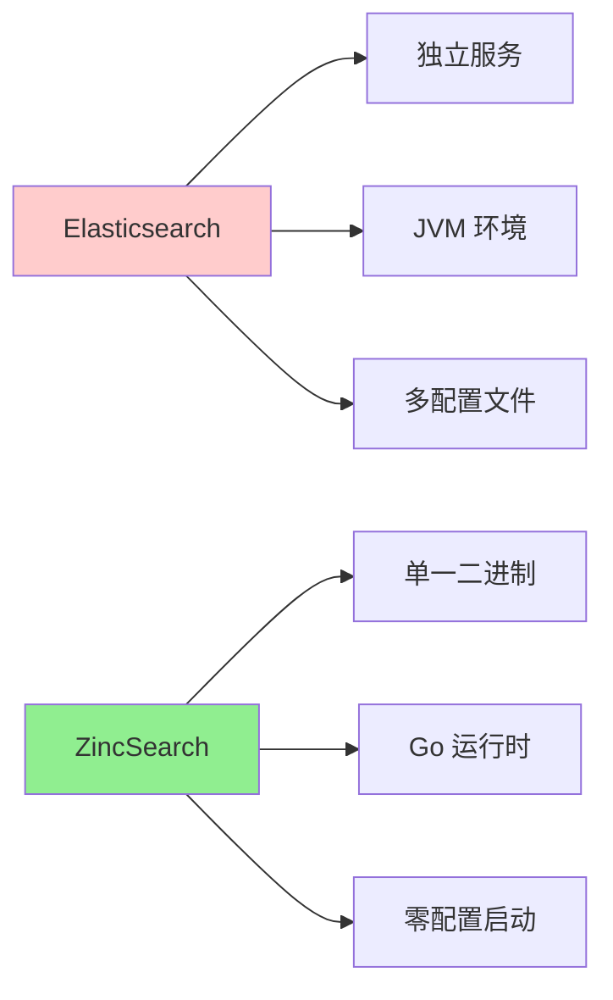
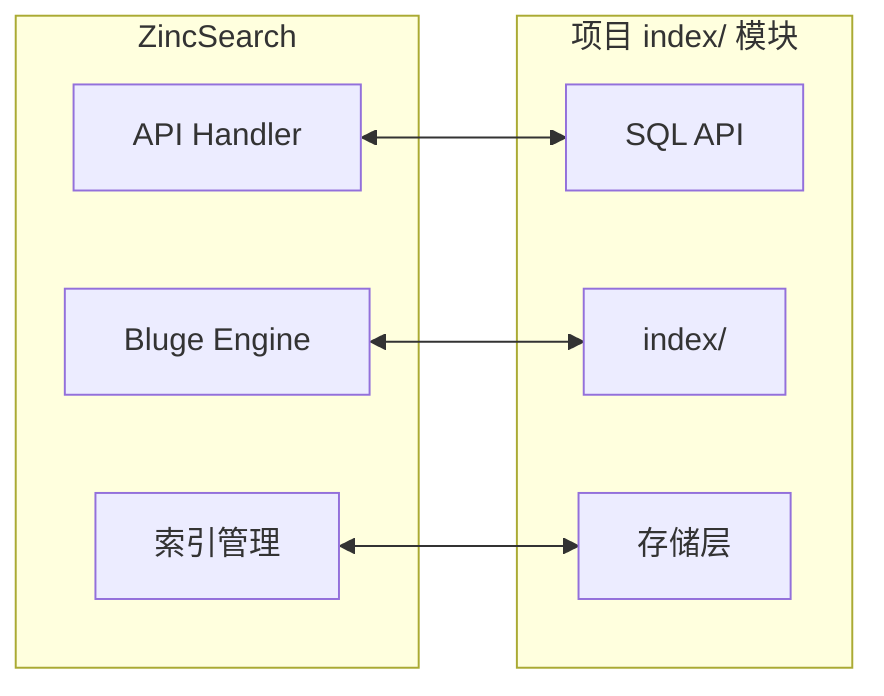
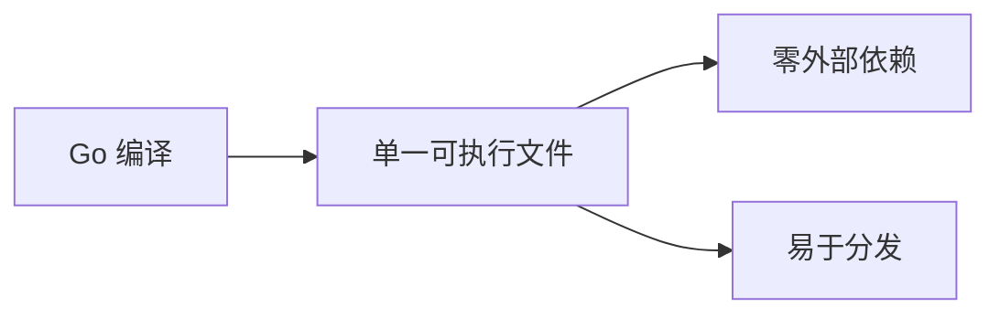
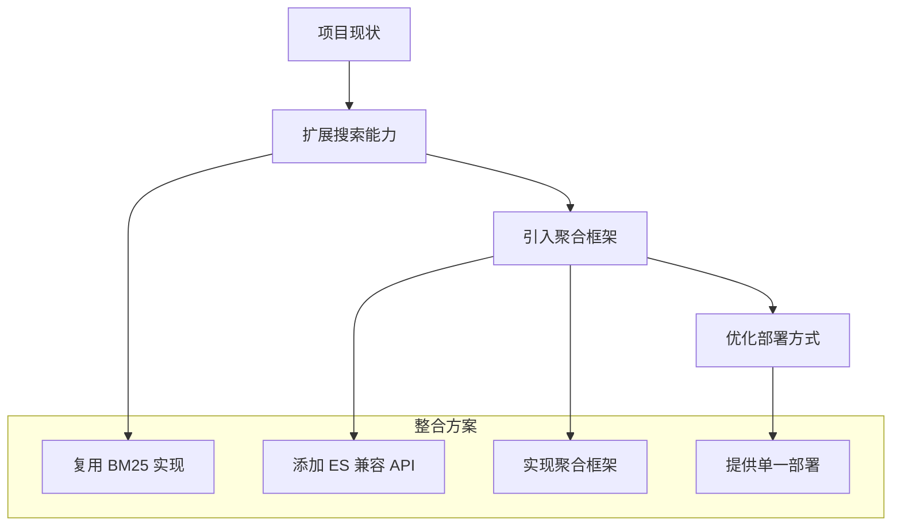

# ZincSearch 与项目关联

## 学习目标
- 理解 ZincSearch 的轻量级设计理念
- 掌握与项目搜索模块的关联
- 借鉴 ZincSearch 的设计优化项目架构

## 正文

### 轻量级设计理念

ZincSearch 的核心理念是简化部署和降低资源占用：



**资源占用对比**：

| 指标 | Elasticsearch | ZincSearch |
|------|---------------|------------|
| 内存占用 | > 1GB | < 100MB |
| 启动时间 | 30s+ | < 5s |
| 部署复杂度 | 高 | 低 |
| 运维需求 | 专人 | 兼职 |

### 与项目搜索模块的关联



**功能对比**：

| 能力 | ZincSearch | 项目 | 说明 |
|------|------------|------|------|
| 全文搜索 | Bluge 倒排 | 自实现 | 项目已有 BM25 |
| 向量搜索 | 无 | HNSW | 项目优势 |
| 聚合分析 | 基础 | 缺失 | 可借鉴 |
| ES 兼容 | 完整 | 需实现 | 项目可考虑 |
| 部署方式 | 单一二进制 | 嵌入式 | 项目优势 |

### 设计思想借鉴

#### 1. 单一二进制部署

ZincSearch 的单一二进制设计值得借鉴：



**项目可借鉴**：
- 使用 CGO 或外部工具链将项目编译为单一可执行文件
- 提供 Docker 镜像简化部署
- 支持环境变量配置，减少配置文件

#### 2. ES 兼容 API

```bash
# ZincSearch 的 ES 兼容接口
curl -X POST 'http://localhost:4080/api/default/movies/_search' \
  -d '{"query": {"match": {"title": "action"}}}'
```

**项目可借鉴**：
```c
// 项目中实现 ES 兼容的搜索 API
typedef struct {
    char *endpoint;
    HttpMethod method;
    JsonObject *body;
} SearchRequest;

typedef struct {
    int status;
    JsonObject *hits;
    int total;
} SearchResponse;

// 实现 /{index}/_search 接口
SearchResponse *handle_search(SearchRequest *req) {
    // 解析查询
    Query *query = parse_es_query(req->body);
    
    // 执行搜索
    SearchResult *result = index_search(query);
    
    // 格式化为 ES 兼容响应
    return format_es_response(result);
}
```

#### 3. 聚合框架

```bash
# ZincSearch 聚合
{
  "aggs": {
    "by_category": {
      "terms": { "field": "category.keyword" },
      "aggs": {
        "avg_price": { "avg": { "field": "price" } }
      }
    }
  }
}
```

**项目可借鉴**：
```c
// 项目中的聚合框架
typedef enum AggType {
    AGG_TERMS,
    AGG_AVG,
    AGG_SUM,
    AGG_MAX,
    AGG_MIN,
    AGG_STATS
} AggType;

typedef struct {
    AggType type;
    char *field;
    struct Aggregation *sub_agg;  // 嵌套聚合
} Aggregation;

typedef struct {
    char *key;
    double value;
    AggregationResult *sub_result;
} BucketResult;

// 执行聚合
AggregationResult *execute_agg(index_t *idx, Aggregation *agg) {
    switch (agg->type) {
        case AGG_TERMS:
            return execute_terms_agg(idx, agg->field, agg->sub_agg);
        case AGG_AVG:
            return execute_avg_agg(idx, agg->field);
        // ...
    }
}
```

### 技术整合路径



**整合步骤**：
1. 扩展现有搜索 API，支持 ES 兼容语法
2. 实现基本的聚合框架（terms, avg, sum, stats）
3. 优化编译流程，支持单一二进制输出
4. 添加 Docker 支持，简化部署

## 要点总结

1. **轻量设计**：单一二进制、零配置启动是 ZincSearch 的核心优势
2. **ES 兼容**：API 兼容降低用户学习成本和迁移成本
3. **功能互补**：项目有向量搜索，ZincSearch 有完整全文搜索
4. **借鉴价值**：聚合框架、ES 兼容 API、部署方式值得学习
5. **演进路径**：扩展项目搜索 API，实现聚合，简化部署

## 思考题

1. 如何设计项目的 API 来平衡易用性和功能性？
2. 项目的聚合框架应该如何实现以支持多种聚合类型？
3. 如何将项目编译为单一二进制以简化部署？
