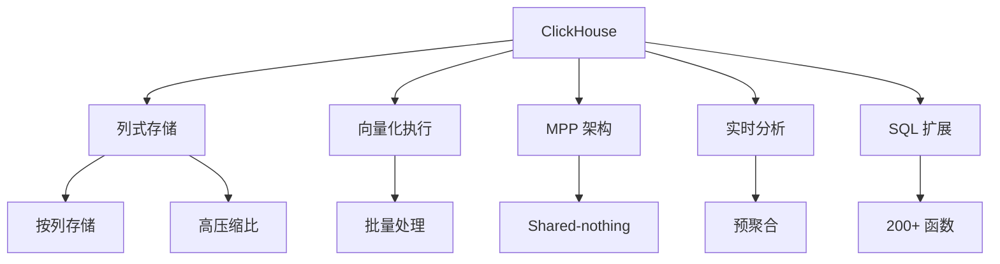

# ClickHouse 项目概览

## 学习目标

- 了解 ClickHouse 作为列式 OLAP 数据库的定位
- 掌握 ClickHouse 的列式存储和向量化执行

## 项目定位

> ClickHouse 是开源的列式 OLAP 数据库，以极快的查询速度著称，擅长实时分析。

**基本信息**：
- 开发方：ClickHouse Inc.（原 Yandex）
- 首次发布：2016 年
- 开源协议：Apache 2.0
- GitHub Stars：约 38k

## 核心设计



## 核心特性

```sql
-- 创建 MergeTree 表
CREATE TABLE sensor_data (
    event_date Date,
    sensor_id UInt32,
    temperature Float32,
    humidity Float32
) ENGINE = MergeTree
ORDER BY (event_date, sensor_id);

-- 插入数据
INSERT INTO sensor_data VALUES
    ('2024-01-01', 1, 22.5, 60.0),
    ('2024-01-01', 2, 23.0, 58.5);

-- 聚合查询（秒级响应）
SELECT
    event_date,
    sensor_id,
    avg(temperature) AS avg_temp,
    count() AS cnt
FROM sensor_data
WHERE event_date >= '2024-01-01'
GROUP BY event_date, sensor_id
ORDER BY event_date;
```

## 要点总结

- 列式存储，高压缩比
- 向量化执行，SIMD 加速
- MPP 分布式架构
- 丰富 SQL 函数
