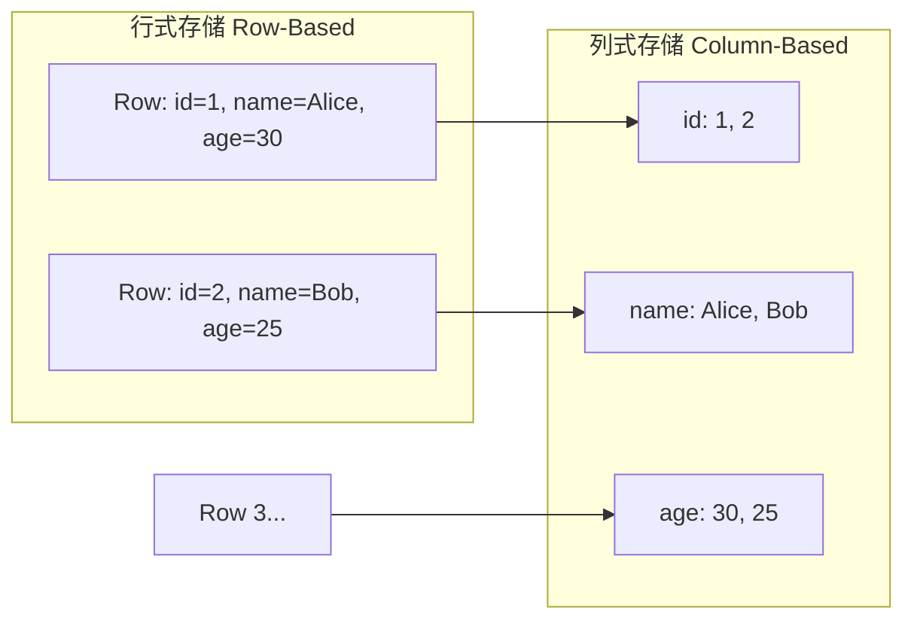
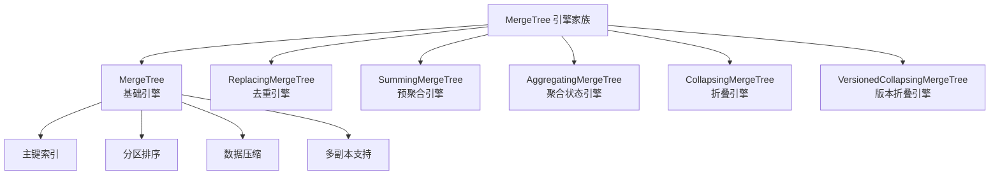
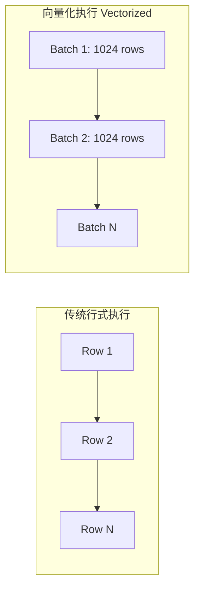
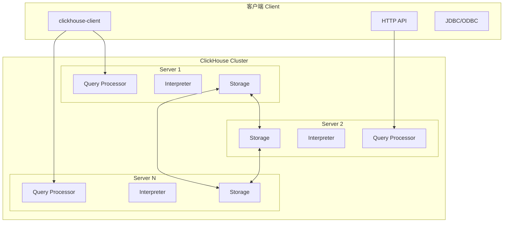
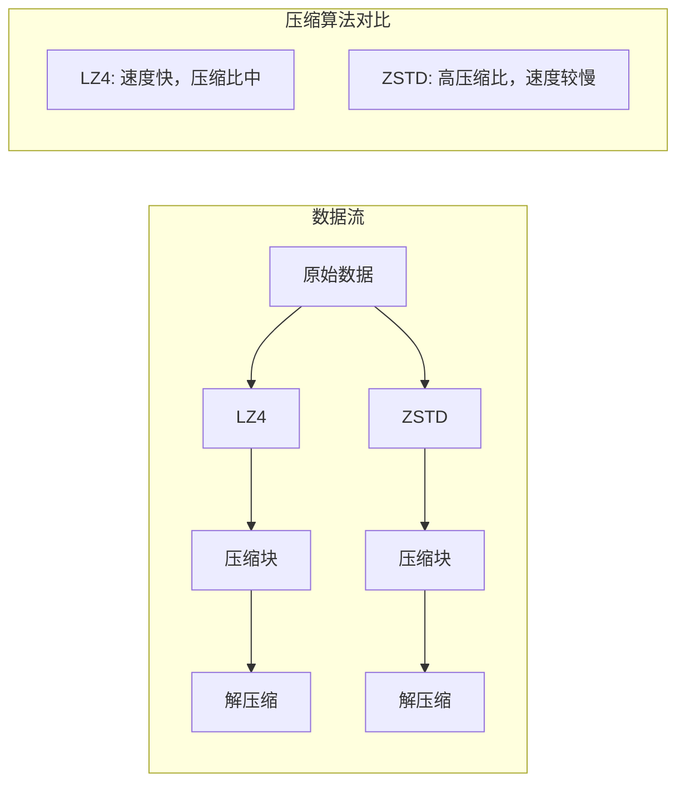
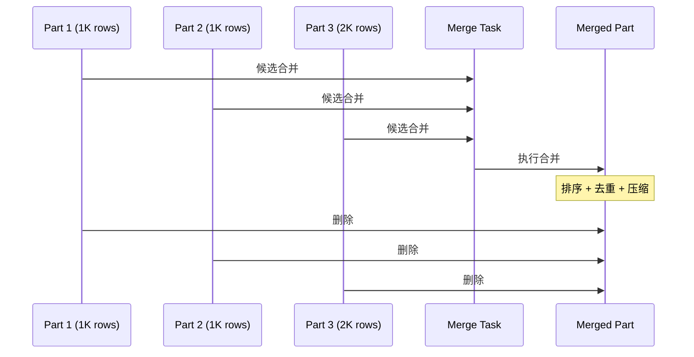

# ClickHouse 架构设计

## 学习目标

- 理解 ClickHouse 的列式存储原理和数据压缩机制
- 掌握 MergeTree 引擎家族的核心设计
- 了解 MPP 分布式架构和向量化执行引擎

## 列式存储

ClickHouse 采用纯列式存储架构，每个列数据独立存储在单独的文件中。



**列式存储的优势**：

| 优势 | 说明 |
|------|------|
| 列裁剪 | 只读取查询涉及的列，减少 I/O |
| 高压缩比 | 同类型数据连续存储，压缩效率高 |
| 向量化 | SIMD 指令批量处理同列数据 |
| 聚合高效 | COUNT/SUM 等聚合只需读取目标列 |

**ClickHouse 数据类型**：

```sql
-- 整数类型
UInt8, UInt16, UInt32, UInt64
Int8, Int16, Int32, Int64

-- 浮点类型
Float32, Float64

-- 字符串类型
String     -- 不限长度的 UTF-8 字符串
FixedString(N)  -- 固定长度 N 的字符串

-- 日期时间类型
Date, DateTime, DateTime64

-- 枚举类型
Enum8, Enum16

-- 数组类型
Array(T)

-- 元组类型
Tuple(T1, T2, ...)

-- Nullable 类型
Nullable(T)
```

## MergeTree 引擎家族

MergeTree 是 ClickHouse 最核心的表引擎，其他引擎都基于它扩展。



### MergeTree 核心机制

```sql
CREATE TABLE events (
    event_date Date,
    event_time DateTime,
    event_type String,
    user_id UInt64,
    payload String
) ENGINE = MergeTree
ORDER BY (event_type, user_id)          -- 排序键（主键）
PARTITION BY toYYYYMM(event_date)       -- 分区键
SAMPLE BY user_id SETTINGS index_granularity = 8192;
```

**关键参数**：

- `ORDER BY`：数据排序的键，同时也是主键，决定索引结构
- `PARTITION BY`：分区表达式，用于将数据划分为多个分区目录
- `SAMPLE BY`：采样键，用于 SAMPLE 查询
- `index_granularity`：索引粒度，默认 8192 条记录产生一个索引项

### ReplacingMergeTree

用于去重，保留相同主键的最后一条（或第一条）记录。

```sql
CREATE TABLE dedup_events (
    event_date Date,
    event_id UInt64,
    payload String
) ENGINE = ReplacingMergeTree(event_date)  -- 可选版本列
ORDER BY event_id;
```

### SummingMergeTree

自动对相同排序键的数值列进行求和聚合。

```sql
CREATE TABLE metrics_hourly (
    hour DateTime,
    metric_name String,
    value Int64
) ENGINE = SummingMergeTree()
ORDER BY (hour, metric_name);
```

## 向量化执行引擎

ClickHouse 采用向量化执行模型，利用 SIMD 指令集批量处理数据。



**SIMD 指令支持**：

```cpp
// ClickHouse 使用 AVX2/AVX512 加速计算

// 批量比较操作（伪代码）
__m256d a = _mm256_load_pd(values);      // 加载 4 个 Double
__m256d b = _mm256_load_pd(filter);       // 加载 4 个过滤值
__m256d result = _mm256_cmp_pd(a, b, _CMP_GT_OQ);  // SIMD 比较

// 批量求和
__m256d sum = _mm256_setzero_pd();
for (int i = 0; i < n; i += 4) {
    sum = _mm256_add_pd(sum, _mm256_load_pd(values + i));
}
```

**向量化操作示例**：

```sql
-- 这些操作在底层会利用 SIMD 向量化执行
SELECT sum(revenue) FROM sales WHERE date >= '2024-01-01';

SELECT uniqExact(user_id) FROM events WHERE event_type = 'purchase';

SELECT quantile(0.5)(latency) FROM request_logs;
```

## MPP 分布式架构

ClickHouse 采用 Shared-nothing 的 MPP（Massively Parallel Processing）架构。



**集群配置示例**：

```xml
<!-- /etc/clickhouse-server/config.xml -->
<clickhouse>
    <remote_servers>
        <production>
            <shard>
                <replica>
                    <host>node1.example.com</host>
                    <port>9000</port>
                </replica>
            </shard>
            <shard>
                <replica>
                    <host>node2.example.com</host>
                    <port>9000</port>
                </replica>
            </shard>
        </production>
    </remote_servers>
</clickhouse>
```

**分布式表查询**：

```sql
-- 创建分布式表
CREATE TABLE events_distributed AS events
ENGINE = Distributed(production, default, events, rand());

-- 分布式查询自动路由到各分片
SELECT
    event_type,
    count() AS cnt
FROM events_distributed
WHERE event_date = '2024-01-01'
GROUP BY event_type;
```

## 数据压缩

ClickHouse 支持多种压缩算法，根据数据类型自动选择最优压缩方式。



**压缩配置**：

```sql
CREATE TABLE compressed_data (
    id UInt64 CODEC(ZSTD),
    data String CODEC(LZ4),
    flag UInt8 CODEC(T64, ZSTD)
) ENGINE = MergeTree()
ORDER BY id
SETTINGS index_granularity = 8192;
```

**支持的编解码器**：

| 编码器 | 说明 | 适用场景 |
|--------|------|----------|
| LZ4 | 高速解压 | 通用场景 |
| LZ4HC | 高压缩率 LZ4 | 需要高压缩的场景 |
| ZSTD | 均衡压缩 | 平衡场景 |
| Delta | 增量编码 | 有序数值 |
| T64 | 64位分桶 | UInt/Int 类型 |
| Goroutine |Goroutine编码 | 低基数列 |

## 后台 Merge 机制

MergeTree 的核心机制之一是后台合并，将多个小数据 parts 合并成更大的 parts。



**Merge 执行流程**：

```cpp
// MergeTree 数据结构
struct MergeTreeData {
    String partition_id;           // 分区 ID
    std::vector<MergeTreeDataPartPtr> parts;  // 数据 parts
    MergeTreeDataPartPtr data_part; // 当前活跃 part
};

// 后台合并任务
class MergeWorker {
    // 1. 选择待合并的 parts（同分区、同排序键）
    void selectPartsToMerge();

    // 2. 读取源 parts 的数据
    void readParts();

    // 3. 排序和去重
    void sortAndDeduplicate();

    // 4. 写入新 part（压缩）
    void writeMergedPart();

    // 5. 原子替换 old parts -> new part
    void atomicReplace();
};
```

**控制 Merge 策略**：

```sql
-- 查看 Merge 队列
SELECT * FROM system.merges;

-- 查看 parts 状态
SELECT * FROM system.parts WHERE table = 'events';

-- 手动触发 Merge（通过设置）
ALTER TABLE events FETCH PARTITION '202401' FROM
    'clickhouse://replica2:9000';
```

## 要点总结

1. **列式存储**：按列独立存储，支持列裁剪、高压缩、向量化
2. **MergeTree 引擎**：主键索引 + 分区 + 排序，是其他引擎的基类
3. **向量化执行**：利用 SIMD 批量处理数据，显著提升聚合查询性能
4. **MPP 架构**：无共享设计，水平扩展，支持分布式表查询
5. **后台 Merge**：自动合并小 parts，保持数据文件数量可控
6. **数据压缩**：支持 LZ4、ZSTD 等多种算法，根据列类型自适应

## 思考题

1. MergeTree 的 `ORDER BY` 和 `PARTITION BY` 有什么区别？各自的作用是什么？
2. 为什么 ClickHouse 的向量化执行比传统行式执行更快？
3. ReplacingMergeTree 去重的时机是什么时候？有什么注意事项？
4. 在分布式架构中，如何保证数据的一致性和高可用？
