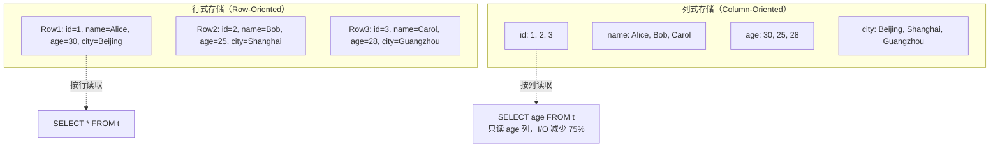
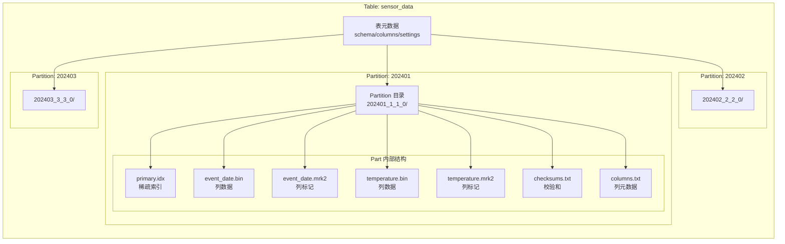
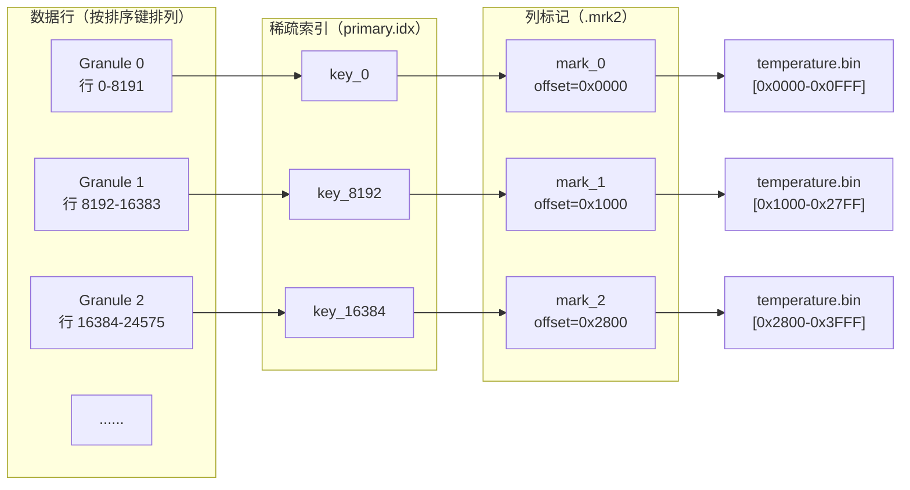
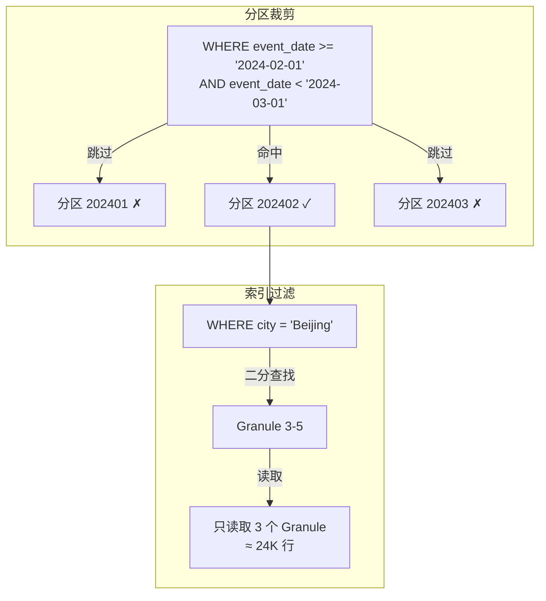
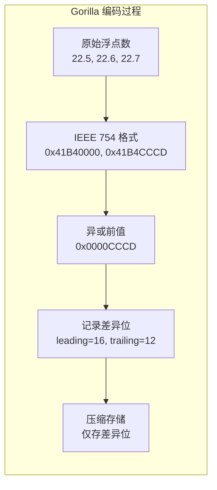
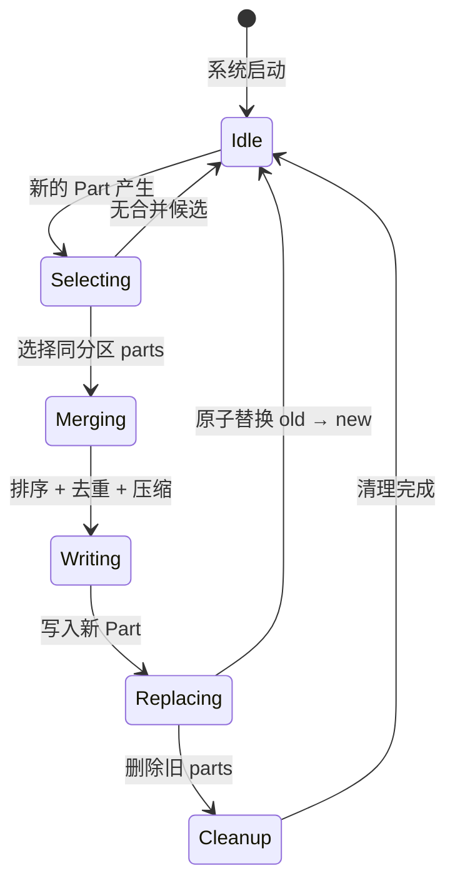

# ClickHouse 列式存储引擎

## 学习目标

- 理解 ClickHouse 列式存储的核心设计（MergeTree 分区、Segment 存储）
- 掌握数据压缩算法（LZ4、ZSTD、Delta、DoubleDelta 等）的原理与选型
- 理解数据分区与排序键的设计及其对查询性能的影响
- 对比 ClickHouse 列式存储与本项目 storage/ 模块的设计差异

## 列式存储的基本概念

与传统行式存储不同，列式存储将同一列的数据连续存储在磁盘上。ClickHouse 采用纯列式架构，每个列数据独立存储在单独的文件中。

### 行式 vs 列式



**列式存储的核心优势**：

| 优势 | 说明 | 量化效果 |
|------|------|----------|
| 列裁剪 | 只读取查询涉及的列，跳过无关列 | I/O 减少 50%-90% |
| 高压缩比 | 同类型数据连续存储，局部性极好 | 压缩比 5:1 到 20:1 |
| 向量化执行 | SIMD 指令批量处理同列数据 | 吞吐提升 5-10 倍 |
| 聚合高效 | COUNT/SUM/AVG 只需读取目标列 | 聚合查询秒级响应 |

## MergeTree 存储架构

MergeTree 是 ClickHouse 最核心的存储引擎，数据以 **Part**（Segment）为单位组织。

### 存储层次



**Part 命名规则**：`partition_id_minBlockNum_maxBlockNum_level`

- `202401_1_1_0`：Partition 202401，第 1 个 Block，第 1 个 Block，level 0
- 每次 Merge 后 level + 1，如 `202401_1_3_1` 表示由 1、2、3 合并而成

### Part 内部结构

一个 Part 包含以下核心文件：

| 文件 | 类型 | 说明 |
|------|------|------|
| `primary.idx` | 索引 | 稀疏主键索引，每 `index_granularity` 行记录一个主键值 |
| `*.bin` | 数据 | 列数据文件，压缩存储 |
| `*.mrk2` | 标记 | 列标记文件，记录每个 granule 在 .bin 中的偏移量 |
| `checksums.txt` | 元数据 | 文件校验和 |
| `columns.txt` | 元数据 | 列定义 |
| `partition.dat` | 元数据 | 分区信息 |
| `minmax_*.idx` | 索引 | 分区列的 MinMax 索引 |

### 索引粒度与 Granule

ClickHouse 将数据划分为 **Granule**（粒度单元），默认每 8192 行一个 Granule。



**查询过程**：

1. 根据 WHERE 条件在 `primary.idx` 中二分查找，定位可能包含结果的 Granule 范围
2. 通过 `.mrk2` 文件找到对应 Granule 在 `.bin` 中的偏移量
3. 只读取命中的 Granule 对应的列数据，解压后执行过滤

这种设计使得 ClickHouse 即使扫描数亿行数据，也能在毫秒级完成过滤。

## 排序键与分区键

### 排序键（ORDER BY）

排序键是 ClickHouse 最核心的设计决策，它决定了数据的物理存储顺序。

```sql
CREATE TABLE sensor_data (
    event_date Date,
    sensor_id UInt32,
    temperature Float32,
    city String
) ENGINE = MergeTree
ORDER BY (city, event_date, sensor_id)
```

**排序键的作用**：

1. **稀疏索引**：排序键值直接作为主键索引，决定了 Granule 的划分
2. **数据局部性**：相同排序键值的数据物理连续，提升压缩率
3. **前缀过滤优化**：对排序键前缀的 WHERE 条件可以高效定位

```sql
-- 高效：排序键前缀过滤，直接定位 Granule
SELECT * FROM sensor_data WHERE city = 'Beijing' AND event_date >= '2024-01-01';

-- 低效：不是排序键前缀，需要全表扫描
SELECT * FROM sensor_data WHERE temperature > 30.0;
```

### 分区键（PARTITION BY）

分区键将数据按表达式值划分为独立目录，每个分区可以独立管理。

```sql
CREATE TABLE sensor_data (
    event_date Date,
    sensor_id UInt32,
    temperature Float32
) ENGINE = MergeTree
PARTITION BY toYYYYMM(event_date)
ORDER BY (sensor_id, event_date)
```

**分区策略对比**：

| 分区粒度 | 优点 | 缺点 | 适用场景 |
|----------|------|------|----------|
| 按天 | 精细控制，分区裁剪高效 | 分区数过多，后台 Merge 压力大 | 高频写入，实时查询 |
| 按月 | 分区数适中，管理方便 | 分区裁剪粒度较粗 | 通用场景，日志存储 |
| 按年 | 分区极少，Merge 开销小 | 裁剪粒度太粗，无法有效跳过 | 归档数据，低频查询 |
| 不分区 | 写入最快，无分区管理开销 | 全表扫描无法跳过 | 小表，< 1000 万行 |

### 排序键与分区键的配合



最佳实践：分区键用于粗粒度裁剪，排序键用于细粒度过滤，两者配合实现高效的数据跳过。

## 数据压缩算法

ClickHouse 支持多种压缩算法，每列可以独立指定，也可以组合使用。

### 压缩算法总览

| 算法 | 类型 | 速度 | 压缩比 | 适用场景 |
|------|------|------|--------|----------|
| LZ4 | 通用 | 极快（~500 MB/s） | 2:1 ~ 3:1 | 默认，高频查询 |
| LZ4HC | 通用 | 压缩慢，解压快 | 3:1 ~ 4:1 | 冷数据，存储优化 |
| ZSTD | 通用 | 快（~200 MB/s） | 3:1 ~ 5:1 | 平衡场景 |
| ZSTD(1-22) | 通用 | 可调 | 3:1 ~ 8:1 | 按需调节压缩比 |
| Delta | 专用 | 极快 | 与数据相关 | 有序整数/时间戳 |
| DoubleDelta | 专用 | 极快 | 与数据相关 | 规律变化的时间序列 |
| Gorilla | 专用 | 快 | 与数据相关 | 浮点数时间序列 |
| T64 | 专用 | 极快 | 3:1 ~ 10:1 | 低基数整数列 |
| LZ4 + Delta | 组合 | 快 | 高 | 时间戳列 |
| ZSTD + T64 | 组合 | 中等 | 极高 | 整数列 |

### Delta 编码

将原始值替换为相邻值的差值，适用于有序数据。

```
原始值:    [100, 105, 110, 120, 131, 140]
Delta:     [100, 5,   5,   10,  11,  9]    ← 首值保留，后续存增量
Bit-width:  64   3    3    4    4    4
```

**效果**：64-bit 整数 → 3-4 bit 增量，压缩比 16:1 以上。

### DoubleDelta 编码

对 Delta 再做一次 Delta，适用于二阶规律的数据。

```
原始值:        [100, 105, 110, 115, 120, 125]    ← 线性增长
Delta:         [100, 5,   5,   5,   5,   5]
DoubleDelta:   [100, 5,   0,   0,   0,   0]       ← 二阶差值全为 0
```

**效果**：规律性强的时间序列可达到极高压缩比。

### Gorilla 编码

Facebook Gorilla TSDB 采用的浮点数压缩算法，利用异或运算。



**效果**：变化缓慢的浮点数序列压缩比可达 5:1 以上。

### T64 编码

将 64-bit 整数分桶存储，适用于低基数整数列。

```
原始值: [3, 7, 3, 7, 3, 7, 3, 7, ...]    ← 只有 2 个不同值
桶:     [3, 7]                            ← 字典
编码:   [0, 1, 0, 1, 0, 1, 0, 1, ...]    ← 1 bit 即可表示
```

### 压缩配置示例

```sql
CREATE TABLE compressed_sensor (
    event_date Date CODEC(ZSTD(3)),           -- 通用压缩，平衡模式
    sensor_id UInt32 CODEC(LZ4),               -- 高频查询，追求速度
    temperature Float32 CODEC(Gorilla, LZ4),   -- 浮点数专用 + 通用
    timestamp_ms  UInt64 CODEC(DoubleDelta, ZSTD), -- 时间戳专用
    status_code   UInt8 CODEC(T64, LZ4),       -- 低基数整数
    payload       String CODEC(ZSTD(12))       -- 大文本，高压缩比
) ENGINE = MergeTree
ORDER BY (event_date, sensor_id)
```

**压缩算法选择原则**：

1. **查询频率优先**：热数据用 LZ4，冷数据用 ZSTD
2. **数据类型匹配**：时间戳用 Delta/DoubleDelta，浮点数用 Gorilla，整数用 T64
3. **组合使用**：专用算法 + 通用算法，如 `Gorilla, LZ4`
4. **压缩级别权衡**：ZSTD(1) vs ZSTD(22)，压缩时间相差 10 倍，压缩比相差 1.5 倍

## 数据分区与排序键的协同

### 分区裁剪（Partition Pruning）

查询时，ClickHouse 会检查每个分区的 MinMax 索引，跳过不满足条件的分区。

```sql
-- 创建表
CREATE TABLE events (
    event_date Date,
    event_type String,
    value UInt64
) ENGINE = MergeTree
PARTITION BY toYYYYMM(event_date)
ORDER BY (event_type, event_date);

-- 查询
SELECT sum(value) FROM events
WHERE event_date >= '2024-06-01'
  AND event_date < '2024-07-01'
  AND event_type = 'purchase';

-- 执行过程：
-- 1. 分区裁剪：只扫描 202406 分区，跳过其余 11 个月
-- 2. 索引过滤：在 202406 分区的 primary.idx 中定位 'purchase' 的 Granule
-- 3. 列读取：只读取 value 列对应的 .bin 文件
-- 4. 解压聚合：对命中的 Granule 解压并求和
```

### 分区过多问题

每个分区都有独立的索引和标记文件，分区数过多会导致：

- 后台 Merge 线程繁忙，影响写入性能
- 查询时需要打开大量文件，增加元数据开销
- 内存中维护的 Part 列表膨胀

**建议**：分区数控制在 100-1000 之间，避免超过 10000。

## 后台 Merge 机制

### Merge 触发的条件



### Merge 策略

| 策略 | 说明 | 触发条件 |
|------|------|----------|
| Simple | 合并同分区相邻的小 parts | Part 数量 > threshold |
| Vertical | 按列垂直合并，减少内存占用 | Part 行数 > 1 亿 |
| Move | 将 Part 移动到目标分片 | 分布式表重新平衡 |

### Merge 对查询的影响

- Merge 期间旧 Part 仍然可读，不影响查询
- 合并完成后新 Part 原子替换旧 Part
- 查询优化器优先选择更大的 Part，减少读取的文件数

## 与本项目 storage/ 模块的对比

### 项目列式存储实现

项目在 `engineering/include/db/core/columnar_store.h` 中实现了 Parquet 风格的列式存储：

```c
// 列式存储核心结构
typedef struct ColumnarStore_s {
    char *file_path;
    ColumnarFooter *footer;
    CompressionType compression;
    void *file_handle;
} ColumnarStore;

// 行组元数据
typedef struct RowGroupMeta_s {
    int64_t num_rows;
    int64_t total_size;
    ColumnChunkMeta *columns;
    size_t num_columns;
} RowGroupMeta;
```

项目时序引擎 `ts_columnar.h` 还实现了 Delta 编码、RLE 编码、Bit-packing 等专用压缩算法。

### 架构对比

| 维度 | ClickHouse MergeTree | 项目 columnar_store | 项目 ts_columnar |
|------|---------------------|---------------------|------------------|
| 存储模型 | 列式，Part 为单位 | 列式，行组为单位 | 列式，时间块为单位 |
| 索引 | 稀疏主键索引 + MinMax | MinMax 索引 | 块跳过索引 |
| 分区 | 物理分区目录 | 行组逻辑分区 | 时间块分区 |
| 压缩 | LZ4/ZSTD/Delta/Gorilla/T64 | Snappy/GZip/ZSTD/LZ4 | Delta/RLE/Bitpack/Gorilla |
| 排序键 | 物理排序 + 稀疏索引 | 不支持 | 时间戳排序 |
| 后台 Merge | 自动合并 | 不支持 | 不支持 |
| 向量化读取 | 列裁剪 + 批量读取 | 列范围读取 | 列式读取 |

### 项目可借鉴的设计

1. **稀疏索引**：项目已有 MinMax 索引，可扩展为 ClickHouse 风格的稀疏主键索引
2. **Granule 标记**：项目目前缺少 `.mrk2` 等价物，导致无法精确定位数据块
3. **组合压缩**：项目支持单一压缩算法，可扩展到 ClickHouse 的组合 Codec 模式
4. **后台 Merge**：项目暂时没有 Merge 机制，大量小文件写入后性能会退化

```c
// 项目可实现的稀疏索引（借鉴 ClickHouse）
typedef struct {
    uint64_t index_granularity;   // 索引粒度，默认 8192
    uint64_t num_granules;        // Granule 数量

    struct {
        void   *key_value;        // 排序键值
        uint64_t granule_offset;  // Granule 在 .bin 中的偏移
        uint64_t granule_size;    // Granule 压缩大小
    } *marks;                     // 标记数组（类似 .mrk2）
} SparseIndex;
```

## 要点总结

1. **列式存储**：每列独立存储，支持列裁剪、高压缩比、向量化执行
2. **MergeTree 架构**：Part（Segment）为单位，每个 Part 包含列数据、索引、标记文件
3. **稀疏索引**：每 `index_granularity`（8192）行记录一个索引项，支持高效二分查找
4. **排序键**：决定物理存储顺序，作为稀疏索引的键，前缀过滤效率最高
5. **分区键**：粗粒度物理分区，支持分区裁剪跳过无关分区
6. **压缩算法体系**：LZ4（高速）、ZSTD（平衡）、Delta（有序差量）、DoubleDelta（二阶差量）、Gorilla（浮点数）、T64（低基数整数）
7. **组合 Codec**：每列可独立指定，支持专用 + 通用算法组合
8. **后台 Merge**：自动合并小 Part，减少文件数，提升查询性能
9. **项目对比**：项目已有列式存储和压缩基础，可借鉴稀疏索引、Granule 标记、组合压缩等设计

## 思考题

1. ClickHouse 的 `index_granularity` 默认 8192，如果改为 1024 会有什么影响？改为 65536 呢？
2. 为什么 ClickHouse 选择 LZ4 作为默认压缩算法而不是 ZSTD？在什么场景下应该切换到 ZSTD？
3. 对于一个时间序列表，分区键按月、排序键按（sensor_id, timestamp）设计，以下查询哪些能有效利用索引：
   - `SELECT * FROM t WHERE sensor_id = 1 AND timestamp >= '2024-06-01'`
   - `SELECT * FROM t WHERE timestamp >= '2024-06-01' AND timestamp < '2024-07-01'`
   - `SELECT * FROM t WHERE value > 100`
4. 项目 `columnar_store` 的 RowGroup 和 ClickHouse 的 Part 在概念上有何异同？如何将 ClickHouse 的 Merge 机制引入项目？
5. DoubleDelta 编码在什么场景下会失效？如果时间戳间隔不规则，压缩比会如何变化？