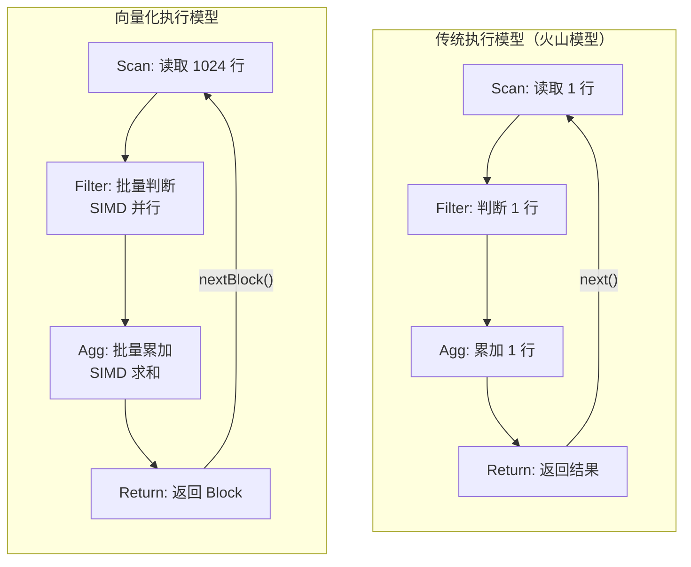
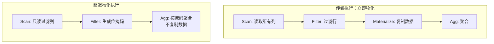
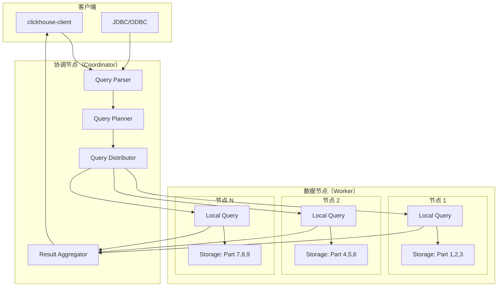
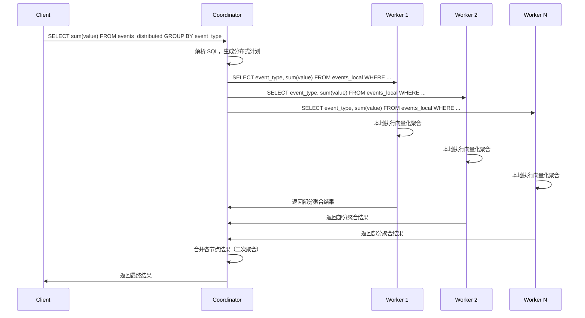
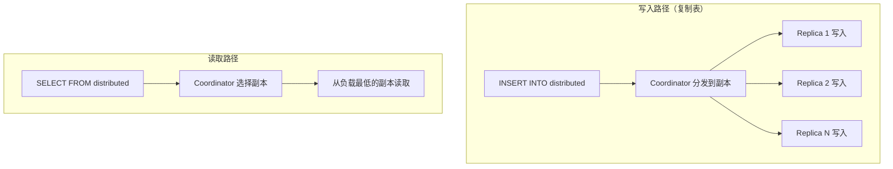
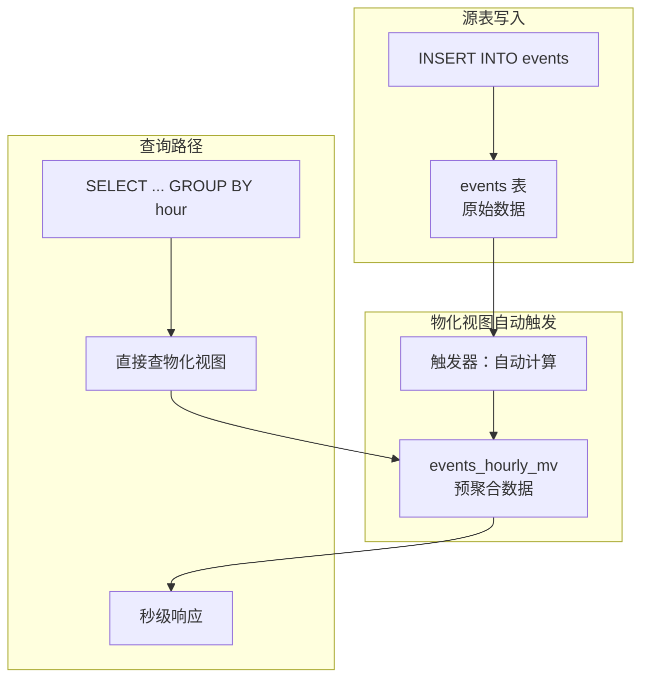
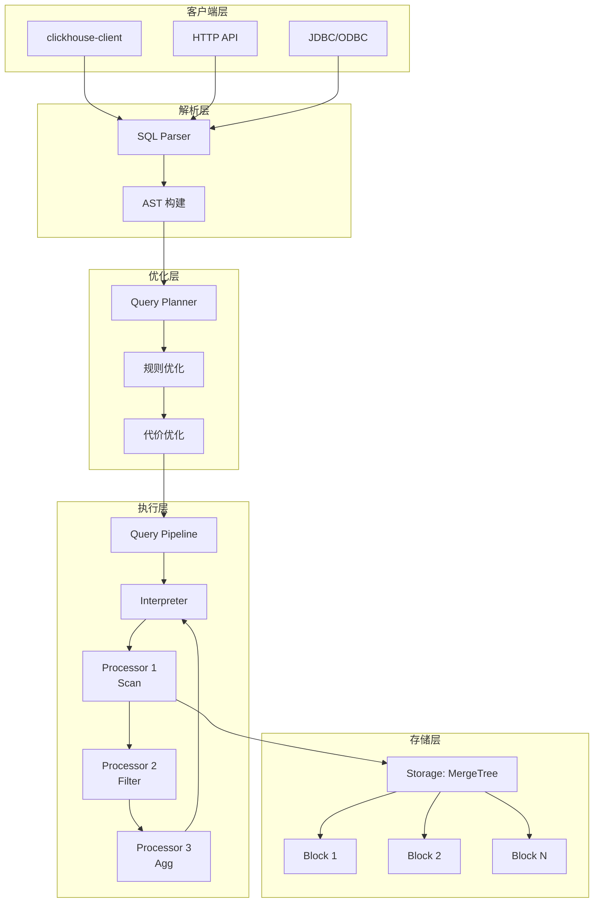

# ClickHouse 查询执行引擎

## 学习目标

- 理解向量化查询执行的原理与 SIMD 加速机制
- 掌握 MPP 分布式查询调度的设计
- 理解物化视图与预聚合的原理和应用
- 分析与项目 algo/ 模块的关联与借鉴点

## 向量化查询执行

ClickHouse 采用向量化执行模型，利用 SIMD 指令集批量处理数据，是高性能分析查询的核心技术。

### 向量化 vs 传统执行



**性能对比**：

| 维度 | 传统火山模型 | 向量化执行 |
|------|-------------|-----------|
| 函数调用开销 | 每行调用一次 | 每 1024 行调用一次 |
| CPU 缓存 | 指针跳转，缓存失效 | 顺序访问，缓存友好 |
| SIMD 利用 | 难以利用 | 天然适配 SIMD 批量处理 |
| 分支预测 | 频繁分支 | 分支减少，预测准确 |
| 吞吐量 | ~1M 行/秒/核 | ~100M+ 行/秒/核 |

### Block 数据结构

ClickHouse 的基本处理单位是 **Block**，包含多个列，每个列包含相同数量的行。

```cpp
// ClickHouse Block 结构（简化）
struct Block {
    std::vector<ColumnPtr> columns;  // 列数据数组
    std::vector<String> names;        // 列名
    size_t rows;                      // 所有列行数一致
};

// 列数据接口（IColumn）
class IColumn {
    // 批量操作
    virtual void insertFrom(const IColumn & src, size_t n) = 0;
    virtual void insertRangeFrom(const IColumn & src, size_t start, size_t length) = 0;

    // SIMD 友好的批量操作
    virtual void getPermutation(Permutation & out) const = 0;
};
```

### SIMD 加速示例

ClickHouse 大量使用 AVX2/AVX512/NEON 等 SIMD 指令集加速计算。

```cpp
// 批量整数比较（伪代码，展示 SIMD 思想）
void filterInt64Vector(const int64_t *data, size_t n, int64_t threshold,
                       uint8_t *result_mask) {
    const __m256i v_threshold = _mm256_set1_epi64x(threshold);

    for (size_t i = 0; i < n; i += 4) {
        // 加载 4 个 int64
        __m256i v_data = _mm256_loadu_si256((__m256i*)(data + i));

        // SIMD 比较：data[i] > threshold
        __m256i v_cmp = _mm256_cmpgt_epi64(v_data, v_threshold);

        // 将比较结果转换为位掩码
        uint8_t mask = _mm256_movemask_epi8(v_cmp);
        result_mask[i / 8] = mask;  // 4 个比较结果压缩为位掩码
    }
}

// 批量浮点数求和（伪代码）
float sumFloat32Vector(const float *data, size_t n) {
    __m256 v_sum = _mm256_setzero_ps();

    for (size_t i = 0; i < n; i += 8) {
        __m256 v_data = _mm256_loadu_ps(data + i);
        v_sum = _mm256_add_ps(v_sum, v_data);  // 8 个 float32 同时累加
    }

    // 水平求和：将 8 个通道的和合并
    float result[8];
    _mm256_storeu_ps(result, v_sum);
    return result[0] + result[1] + result[2] + result[3] +
           result[4] + result[5] + result[6] + result[7];
}
```

**SIMD 加速效果**：

- 单条指令处理 4-16 个数据元素
- 结合向量化执行模型，吞吐提升 5-10 倍
- 典型场景：聚合（sum/avg/min/max）、比较（WHERE 条件）、排序（部分）

### 向量化聚合

ClickHouse 的聚合函数设计为批量处理接口。

```cpp
// 聚合函数接口（简化）
class IAggregateFunction {
    // 批量添加数据（SIMD 友好）
    virtual void addBatch(size_t start, size_t end,
                          AggregateDataPtr *places,
                          const IColumn **columns,
                          size_t num_args) const = 0;

    // 合并多个聚合状态
    virtual void merge(AggregateDataPtr to, ConstAggregateDataPtr from) const = 0;

    // 序列化/反序列化聚合状态
    virtual void serialize(ConstAggregateDataPtr to, WriteBuffer & buf) const = 0;
    virtual void deserialize(AggregateDataPtr to, ReadBuffer & buf) const = 0;
};
```

**典型聚合函数实现**：

| 聚合函数 | SIMD 加速 | 说明 |
|---------|----------|------|
| `sum` | SSE/AVX 加法 | 批量累加，水平求和 |
| `avg` | sum + count | 分别 SIMD 加速，最后除法 |
| `min/max` | SSE/AVX 比较 | 并行比较，保留极值 |
| `count` | 位掩码统计 | 对位掩码 popcount |
| `uniqExact` | 哈希表 | 批量插入哈希表 |
| `uniq` (近似) | HyperLogLog | HLL 寄存器合并 |

### 延迟物化

ClickHouse 在可能的情况下尽量延迟列的物化，减少内存分配和复制。



**延迟物化的关键优化**：

1. **Filter Pushdown**：WHERE 条件下推到存储层，只读取满足条件的 Granule
2. **Column Pruning**：只读取 SELECT 中出现的列
3. **Projection Pushdown**：在存储层完成投影，避免复制
4. **Early Aggregation**：在数据源附近完成部分聚合，减少数据传输

## MPP 分布式查询调度

ClickHouse 采用 Shared-nothing 的 MPP（Massively Parallel Processing）架构，查询在各节点并行执行。

### 分布式查询架构



### 分布式表与本地表

```sql
-- 本地表（Local Table）：每个节点独立存储
CREATE TABLE events_local ON CLUSTER production (
    event_date Date,
    event_type String,
    user_id UInt64
) ENGINE = MergeTree
PARTITION BY toYYYYMM(event_date)
ORDER BY (event_type, user_id);

-- 分布式表（Distributed Table）：逻辑视图，路由到各分片
CREATE TABLE events_distributed ON CLUSTER production AS events_local
ENGINE = Distributed(production, default, events_local, rand());

-- 分布式查询
SELECT event_type, count() FROM events_distributed
WHERE event_date = today()
GROUP BY event_type;
```

### 查询分发策略

| 策略 | 说明 | 适用场景 |
|------|------|----------|
| `rand()` | 随机分发到分片 | 均匀写入 |
| `user_id` | 按 user_id 分发 | 用户维度查询 |
| `shard_key % N` | 自定义哈希 | 特定业务场景 |
| `hop(event_date, 86400, 0, 86400)` | 按时间窗口分发 | 时间序列 |

### 分布式查询执行流程



### 两阶段聚合

分布式聚合采用两阶段设计：

1. **本地聚合**：各节点在本地完成部分聚合
2. **全局聚合**：协调节点合并各节点的部分聚合结果

```sql
-- 第一阶段（各节点本地执行）
SELECT event_type, sum(value) AS partial_sum, count() AS partial_count
FROM events_local
WHERE event_date = today()
GROUP BY event_type;

-- 第二阶段（协调节点执行）
SELECT event_type, sum(partial_sum) AS total_sum, sum(partial_count) AS total_count
FROM received_partial_results
GROUP BY event_type;
```

**两阶段聚合的优势**：

- 减少网络传输：只传输聚合结果，不传输原始数据
- 并行计算：各节点独立执行，无锁竞争
- 线性扩展：增加节点即可提升聚合吞吐

### 数据分发与复制



**复制配置**：

```xml
<clickhouse>
    <remote_servers>
        <production>
            <shard>
                <replica>
                    <host>node1.example.com</host>
                    <port>9000</port>
                </replica>
                <replica>
                    <host>node1-replica.example.com</host>
                    <port>9000</port>
                </replica>
            </shard>
        </production>
    </remote_servers>
</clickhouse>
```

## 物化视图与预聚合

物化视图是 ClickHouse 实现预聚合的核心机制，显著加速重复查询。

### 物化视图原理



### 创建物化视图

```sql
-- 源表
CREATE TABLE events (
    event_time DateTime,
    event_type String,
    user_id UInt64,
    value UInt64
) ENGINE = MergeTree
ORDER BY (event_time, event_type);

-- 物化视图：按小时预聚合
CREATE MATERIALIZED VIEW events_hourly_mv
ENGINE = SummingMergeTree()
ORDER BY (hour, event_type)
AS SELECT
    toStartOfHour(event_time) AS hour,
    event_type,
    sum(value) AS total_value,
    count() AS event_count,
    uniqExact(user_id) AS unique_users
FROM events
GROUP BY hour, event_type;

-- 插入数据到源表，物化视图自动更新
INSERT INTO events VALUES
    ('2024-01-01 10:05:00', 'purchase', 1, 100),
    ('2024-01-01 10:15:00', 'purchase', 2, 200),
    ('2024-01-01 10:25:00', 'click', 3, 1);

-- 查询预聚合结果（秒级）
SELECT hour, total_value, unique_users
FROM events_hourly_mv
WHERE hour >= '2024-01-01 10:00:00';
```

### 物化视图类型

| 类型 | 引擎 | 说明 |
|------|------|------|
| 预聚合 | `SummingMergeTree` | 自动求和数值列 |
| 聚合状态 | `AggregatingMergeTree` | 存储 aggState，支持后续聚合 |
| 去重 | `ReplacingMergeTree` | 去重视图 |
| 投影 | `MergeTree` + POPULATE | 选择列子集 |

### 聚合状态物化

`AggregatingMergeTree` 可以存储聚合函数的中间状态，支持增量聚合。

```sql
-- 聚合状态物化视图
CREATE MATERIALIZED VIEW user_stats_mv
ENGINE = AggregatingMergeTree()
ORDER BY (day, user_id)
AS SELECT
    toDate(event_time) AS day,
    user_id,
    uniqState(user_id) AS unique_visitors,
    sumState(value) AS total_value_state
FROM events
GROUP BY day, user_id;

-- 查询时合并聚合状态
SELECT
    day,
    uniqMerge(unique_visitors) AS unique_users,
    sumMerge(total_value_state) AS total_value
FROM user_stats_mv
GROUP BY day;
```

### 物化视图的维护

```sql
-- 查看物化视图状态
SELECT * FROM system.tables WHERE name LIKE '%_mv';

-- 查看物化视图的数据部分
SELECT * FROM system.parts WHERE table = 'events_hourly_mv';

-- 手动刷新物化视图（不推荐，通常由写入触发）
ALTER TABLE events_hourly_mv OPTIMIZE;

-- 删除物化视图
DROP TABLE events_hourly_mv;
```

### 使用场景

| 场景 | 物化视图设计 | 优势 |
|------|-------------|------|
| 实时报表 | 按分钟/小时预聚合 | 查询秒级响应 |
| 用户画像 | 按用户 ID 聚合行为 | 单用户查询极快 |
| 实时监控 | 按指标维度聚合 | 聚合查询秒级 |
| 数据立方体 | 多维度预计算 | 下钻查询加速 |

### 注意事项

1. **写入放大**：每次写入源表，所有物化视图都会触发计算，写入开销倍增
2. **存储成本**：物化视图占用额外存储空间，需权衡查询加速与存储成本
3. **延迟**：物化视图的数据是异步更新的，可能有短暂延迟
4. **不完整历史**：物化视图只处理创建后的数据，历史数据需手动回填

## 与项目 algo/ 模块的关联

### 项目 SIMD 实现现状

项目在 `engineering/src/algo/simd/` 目录下已有 SIMD 距离计算实现：

```c
// engineering/src/algo-prod/distance/distance.c
// SIMD 欧氏距离计算

#include <immintrin.h>

void simd_float_euclidean_distance(
    const float *a, const float *b,
    float *result, size_t n) {
    __m256 v_sum = _mm256_setzero_ps();

    for (size_t i = 0; i < n; i += 8) {
        __m256 v_a = _mm256_loadu_ps(a + i);
        __m256 v_b = _mm256_loadu_ps(b + i);
        __m256 v_diff = _mm256_sub_ps(v_a, v_b);
        v_sum = _mm256_fmadd_ps(v_diff, v_diff, v_sum);  // FMA: v_diff^2 + v_sum
    }

    // 水平求和
    float temp[8];
    _mm256_storeu_ps(temp, v_sum);
    *result = 0.0f;
    for (int i = 0; i < 8; i++) {
        *result += temp[i];
    }
    *result = sqrtf(*result);
}
```

### 可扩展的向量化操作

借鉴 ClickHouse 的向量化执行设计，项目可扩展以下操作：

```c
// 建议新增：engineering/include/algo/simd/simd_aggregate.h

// 向量化求和（已有基础）
void simd_float_sum(const float *data, size_t n, float *result);

// 向量化最大值
void simd_float_max(const float *data, size_t n, float *result);

// 向量化最小值
void simd_float_min(const float *data, size_t n, float *result);

// 向量化计数（条件满足）
size_t simd_count_greater_than(const float *data, size_t n, float threshold);

// 向量化过滤
size_t simd_filter_greater_than(const float *data, size_t n,
                                 float threshold,
                                 float *output, size_t max_output);

// 向量化位掩码生成
void simd_generate_mask(const float *data, size_t n,
                         float threshold,
                         uint8_t *mask);
```

### 项目向量化执行器

项目在 `engineering/include/db/core/vector_exec.h` 中已有向量化执行框架：

```c
// 项目向量化执行器
typedef struct VectorExecState_s {
    VectorOp *ops;              // 操作符数组
    size_t num_ops;             // 操作符数量
    size_t batch_size;          // 批量大小（默认 1024）
    void **input_vectors;       // 输入向量
    void **output_vectors;      // 输出向量
    uint8_t *filter_mask;       // 过滤位掩码
} VectorExecState;

// 向量化操作符接口
typedef struct VectorOp_s {
    int (*execute)(VectorExecState *state, void *input, void *output);
    int (*init)(VectorOp *op);
    void (*cleanup)(VectorOp *op);
} VectorOp;
```

**借鉴 ClickHouse 的扩展点**：

1. **批量处理接口**：将操作符改为批量处理（每批 1024 行）
2. **位掩码过滤**：用位掩码表示过滤结果，避免数据复制
3. **SIMD 算子**：为 Filter、Agg、Sort 等操作实现 SIMD 版本
4. **延迟物化**：用标记数组记录行号，延迟到最终输出时才物化

### 两阶段聚合在项目中的应用

项目的分布式层（Phase 9）已实现分布式事务和协调器，可以借鉴两阶段聚合：

```c
// 建议新增：engineering/include/db/dist/dist_agg.h

// 部分聚合结果
typedef struct {
    char group_key[256];        // 分组键
    double partial_sum;         // 部分和
    uint64_t partial_count;     // 部分计数
    double partial_min;         // 部分最小值
    double partial_max;         // 部分最大值
} PartialAggResult;

// 分布式聚合接口
typedef struct {
    // 本地聚合（第一阶段）
    void (*local_agg)(const void *data, size_t n, PartialAggResult *out);

    // 全局聚合（第二阶段）
    void (*global_agg)(const PartialAggResult *partials, size_t n,
                       void *final_result);

    // 合并两个部分结果
    void (*merge_partial)(PartialAggResult *to, const PartialAggResult *from);
} DistAggFuncs;
```

### 项目物化视图实现

项目在 `engineering/include/db/storage/ts/ts_mview.h` 中已有时序物化视图实现：

```c
// 项目时序物化视图
typedef struct TsMView_s {
    char name[64];                      // 视图名称
    char target_table[64];              // 目标表名
    char select_sql[512];               // 预计算 SQL

    // 刷新策略
    TsMViewRefreshPolicy refresh_policy;
    uint64_t refresh_interval_ms;

    // 触发器
    bool trigger_on_insert;             // 插入时触发
    bool trigger_on_time;               // 定时触发
} TsMView;
```

**可借鉴 ClickHouse 的扩展**：

1. **多表物化视图**：支持跨表 JOIN 的预计算
2. **增量更新**：只处理新增数据，避免全量重算
3. **聚合状态存储**：支持存储 aggState，实现增量聚合
4. **级联物化视图**：物化视图可以依赖其他物化视图

## 查询执行流程图



## 要点总结

1. **向量化执行**：以 Block（1024 行）为单位批量处理，减少函数调用开销，提高 CPU 缓存命中率
2. **SIMD 加速**：利用 AVX2/AVX512 等指令集，单条指令处理 4-16 个数据元素
3. **延迟物化**：用位掩码表示过滤结果，延迟到必要时才复制数据
4. **MPP 架构**：Shared-nothing 设计，各节点并行执行，协调节点合并结果
5. **两阶段聚合**：本地聚合 + 全局聚合，减少网络传输，线性扩展
6. **物化视图**：预聚合加速重复查询，写入触发更新，支持聚合状态存储
7. **项目关联**：项目已有 SIMD 距离计算和向量化执行框架，可扩展聚合算子和两阶段分布式聚合
8. **借鉴点**：批量处理接口、位掩码过滤、SIMD 聚合算子、增量物化视图

## 思考题

1. 向量化执行模型中，Block 大小为什么选择 1024 行？如果改为 100 或 10000 会有什么影响？
2. SIMD 加速对哪些聚合函数效果最明显？对哪些聚合函数效果有限？
3. 两阶段聚合在什么场景下会退化为单阶段聚合？如何避免？
4. 物化视图的写入放大问题如何缓解？是否有一种"按需刷新"的机制？
5. 项目的 `simd_float_euclidean_distance` 实现是否可以用于查询执行引擎中的距离过滤？如何集成到向量化执行框架中？
6. 如果项目要实现类似 ClickHouse 的 Query Pipeline，需要哪些关键组件？如何与现有的存储引擎对接？