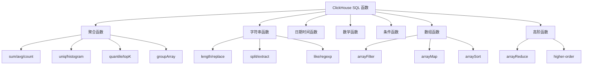
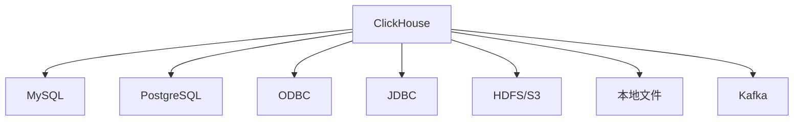
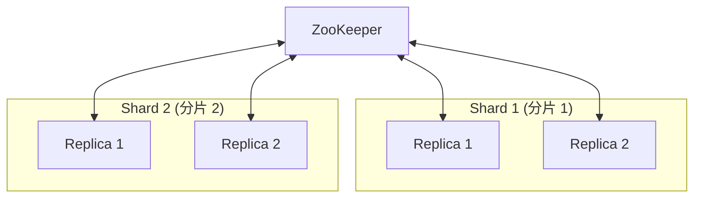

# ClickHouse 核心特性

## 学习目标

- 掌握 ClickHouse 的 SQL 语法和丰富函数库
- 理解物化视图、采样查询等高级特性
- 了解副本分片和数据导入导出机制

## SQL 支持与函数库

ClickHouse 支持 ANSI SQL 的扩展版本，提供 200+ 内置函数，覆盖各类分析场景。



### 聚合函数

```sql
-- 基本聚合
SELECT
    count() AS total,
    sum(revenue) AS total_revenue,
    avg(latency) AS avg_latency,
    min(timestamp) AS first_event,
    max(timestamp) AS last_event
FROM events;

-- 去重计数
SELECT uniq(user_id) AS unique_users FROM events;

-- 近似计数（大数据集）
SELECT uniqExact(user_id) AS exact_users,
       formatReadableQuantity(uniq(user_id)) AS approx_users
FROM events;

-- 分位数
SELECT
    quantile(0.5)(latency) AS p50,
    quantile(0.95)(latency) AS p95,
    quantile(0.99)(latency) AS p99
FROM request_logs;

-- Top-K 分析
SELECT topK(10)(product_name) AS top_products
FROM orders;

-- 直方图
SELECT histogram(10)(price) AS price_distribution
FROM products;
```

### 字符串函数

```sql
-- 字符串操作
SELECT
    length(content) AS len,
    upper(name) AS upper_name,
    lower(email) AS lower_email
FROM users;

-- 正则匹配
SELECT *
FROM logs
WHERE match(message, 'ERROR|WARN');

-- 字符串提取
SELECT
    extract(message, 'user=(\\w+)') AS user_name,
    extractAll(message, 'id=(\\d+)') AS all_ids
FROM logs;

-- JSON 解析
SELECT
    JSONExtractString(data, 'name') AS name,
    JSONExtractInt(data, 'age') AS age
FROM json_logs;
```

### 日期时间函数

```sql
-- 日期提取
SELECT
    toDate(timestamp) AS date,
    toHour(timestamp) AS hour,
    toMinute(timestamp) AS minute,
    toDayOfWeek(timestamp) AS weekday
FROM events;

-- 日期计算
SELECT
    dateDiff('day', created_at, now()) AS days_ago,
    dateAdd(day, 7, created_at) AS next_week,
    toStartOfHour(timestamp) AS hour_bucket,
    toStartOfDay(timestamp) AS day_bucket
FROM events;

-- 时间序列
SELECT
    toStartOfInterval(timestamp, INTERVAL 5 minute) AS bucket,
    count() AS cnt
FROM events
GROUP BY bucket
ORDER BY bucket;
```

### 数组与高阶函数

```sql
-- 数组操作
SELECT
    array([1, 2, 3, 4, 5]) AS arr,
    arrayFilter(x -> x > 2, arr) AS filtered,
    arrayMap(x -> x * 2, arr) AS doubled,
    arraySort(arr) AS sorted,
    arrayJoin([1, 2, 3]) AS element
FROM table;

-- 高阶函数
SELECT
    arrayReduce('sum', [1, 2, 3, 4, 5]) AS total,
    arrayFilter(x -> x > 0, [-1, 2, -3, 4]) AS positives
FROM table;
```

## 物化视图

物化视图将查询结果预先计算并存储，大幅加速重复查询。


### 创建物化视图

```sql
-- 创建目标表
CREATE TABLE daily_stats (
    event_date Date,
    event_type String,
    user_count UInt64,
    event_count UInt64
) ENGINE = SummingMergeTree()
ORDER BY (event_date, event_type);

-- 创建物化视图
CREATE MATERIALIZED VIEW daily_stats_mv
TO daily_stats
AS
SELECT
    toDate(event_time) AS event_date,
    event_type,
    uniqState(user_id) AS user_count,
    countState() AS event_count
FROM events
GROUP BY event_date, event_type;

-- 自动刷新：数据写入 events 时自动同步到物化视图
INSERT INTO events VALUES ('2024-01-01 10:00:00', 'click', 12345);
```

### 物化视图类型

```sql
-- 1. 普通物化视图（手动目标表）
CREATE MATERIALIZED VIEW mv1 TO target_table AS SELECT ...;

-- 2. Populating 物化视图（自动创建目标表）
CREATE MATERIALIZED VIEW mv2
ENGINE = SummingMergeTree()
ORDER BY key
AS SELECT ...;

-- 3. 物化视图 + 聚合状态
CREATE MATERIALIZED VIEW users_agg_mv
ENGINE = SummingMergeTree()
ORDER BY key
AS
SELECT
    date,
    uniqState(user_id) AS users,
    sumState(amount) AS total_amount
FROM orders
GROUP BY date;
```

## 采样查询

SAMPLE BY 支持对数据进行采样，适用于超大规模数据集的分析。

```sql
-- 定义采样键
CREATE TABLE events (
    event_date Date,
    event_time DateTime,
    user_id UInt64,
    event_type String
) ENGINE = MergeTree()
ORDER BY (event_date, user_id)
SAMPLE BY user_id;

-- 采样查询（使用 SAMPLE 修饰符）
SELECT
    count() AS total_events,
    uniq(user_id) AS unique_users
FROM events
SAMPLE 0.1;  -- 采样 10% 的数据

-- 指定采样比例
SELECT *
FROM events
SAMPLE 0.01  -- 1% 采样
WHERE event_type = 'purchase';

-- 采样 + 结果自动放大
SELECT
    count() * 10 AS estimated_total,  -- 需要手动乘以倍数
    uniq(user_id) * 10 AS estimated_users
FROM events
SAMPLE 0.1;
```

## 外部表与数据源

ClickHouse 支持多种外部数据源，实现联邦查询。



### MySQL 外部表

```sql
-- 创建 MySQL 数据库引擎
CREATE DATABASE mysql_db
ENGINE = MySQL('host:port', 'database', 'user', 'password');

-- 查询 MySQL 表
SELECT * FROM mysql_db.users LIMIT 10;

-- 表函数方式
SELECT * FROM mysql('host:port', 'database', 'table', 'user', 'password')
WHERE id > 100;
```

### ODBC/JDBC 连接

```sql
-- ODBC 表函数
SELECT * FROM odbc('DSN=mydb', 'schema', 'table');

-- JDBC 表函数
SELECT * FROM jdbc('mysql://host:port/database', 'SELECT * FROM table');
```

### HDFS/S3 文件

```sql
-- 读取 Parquet 文件
SELECT * FROM file('hdfs://namenode:9000/data/*.parquet', Parquet);

-- 读取 S3 文件
SELECT * FROM s3('s3://bucket/path/*.csv', 'csv');

-- 写入 S3
INSERT INTO FUNCTION s3('s3://bucket/data.csv')
SELECT * FROM table;
```

### Kafka 集成

```sql
-- 创建 Kafka 引擎表
CREATE TABLE events_queue (
    event_time DateTime,
    event_type String,
    user_id UInt64,
    payload String
) ENGINE = Kafka()
SETTINGS kafka_broker_list = 'broker1:9092',
         kafka_topic_list = 'events',
         kafka_group_name = 'clickhouse-consumer',
         kafka_format = 'JSONEachRow';

-- 创建物化视图消费 Kafka 数据
CREATE MATERIALIZED VIEW events_mv TO events
AS SELECT ... FROM events_queue;
```

## 副本与分片

ClickHouse 支持多副本和高可用，通过 ZooKeeper 协调。



### 副本表引擎

```sql
-- 创建副本表（使用 ReplicatedMergeTree）
CREATE TABLE events_replicated (
    event_date Date,
    event_id UInt64,
    payload String
) ENGINE = ReplicatedMergeTree('/clickhouse/tables/{shard}/events', '{replica}')
ORDER BY event_id
PARTITION BY toYYYYMM(event_date);

-- ZooKeeper 配置
-- /clickhouse/tables/shard01/events/replicas
-- {
--   "replicas": ["replica1", "replica2"],
--   "leader": "replica1"
-- }
```

### 分布式表配置

```sql
-- 创建分布式表
CREATE TABLE events_distributed (
    event_date Date,
    event_id UInt64,
    payload String
) ENGINE = Distributed(clickhouse_cluster, default, events, rand());

-- 集群配置
-- <remote_servers>
--   <clickhouse_cluster>
--     <shard>
--       <replica><host>replica1</host><port>9000</port></replica>
--     </shard>
--     <shard>
--       <replica><host>replica2</host><port>9000</port></replica>
--     </shard>
--   </clickhouse_cluster>
-- </remote_servers>
```

## 数据类型与转换

```sql
-- 类型转换函数
SELECT
    toInt8(123) AS i8,
    toInt64('12345') AS i64,
    toFloat64(3.14) AS f64,
    toDateTime('2024-01-01 10:00:00') AS dt,
    toString(123) AS str,
    toUUID('550e8400-e29b-41d4-a716-446655440000') AS uuid;

-- 类型推断
SELECT
    toTypeName(123) AS int_type,
    toTypeName(3.14) AS float_type,
    toTypeName('text') AS string_type;

-- Nullable 和默认值
SELECT
    coalesce(nullable_col, 'default') AS filled,
    ifNull(nullable_col, -1) AS if_null,
    assumeNotNull(nullable_col) AS not_null;
```

## 要点总结

1. **200+ SQL 函数**：覆盖聚合、字符串、日期、数组、JSON 等场景
2. **物化视图**：预计算查询结果，支持自动刷新和增量更新
3. **采样查询**：SAMPLE BY 支持大规模数据的采样分析
4. **外部表**：联邦查询 MySQL/PostgreSQL/HDFS/S3/Kafka
5. **副本分片**：ReplicatedMergeTree + ZooKeeper 实现高可用
6. **丰富数据类型**：支持 Nullable、Array、Tuple、JSON 等复杂类型

## 思考题

1. 物化视图的 `TO` 语法和 `ENGINE = SummingMergeTree()` 语法有什么区别？
2. 如何选择合适的采样比例来平衡查询速度和准确性？
3. ReplicatedMergeTree 如何保证副本间数据一致性？
4. 外部表和表函数两种方式访问 MySQL 数据的优缺点？
