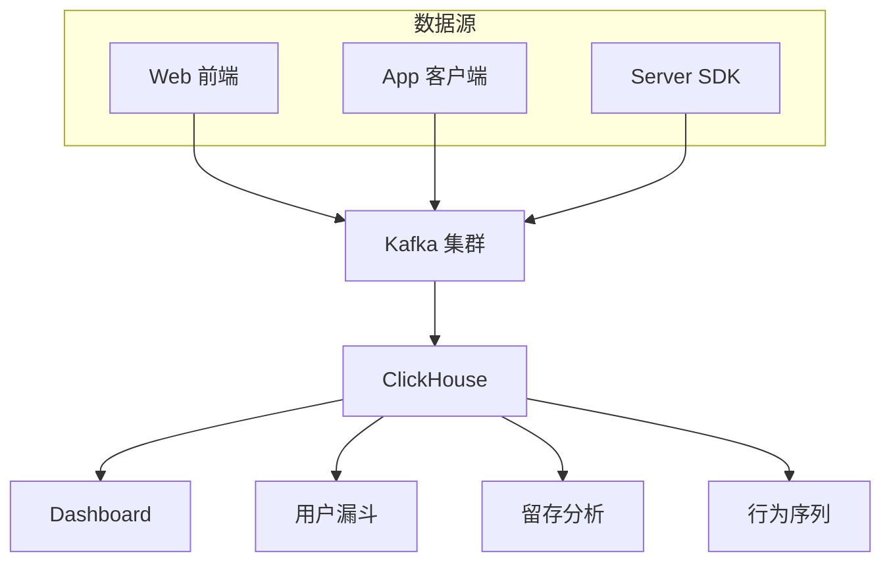
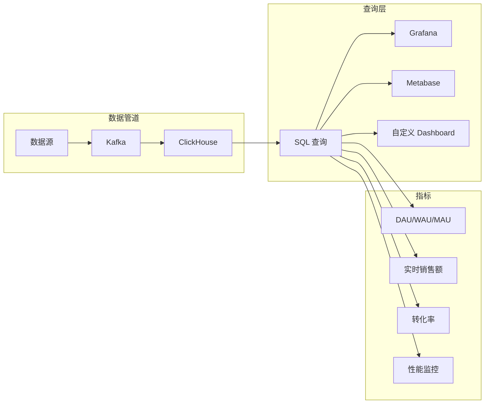
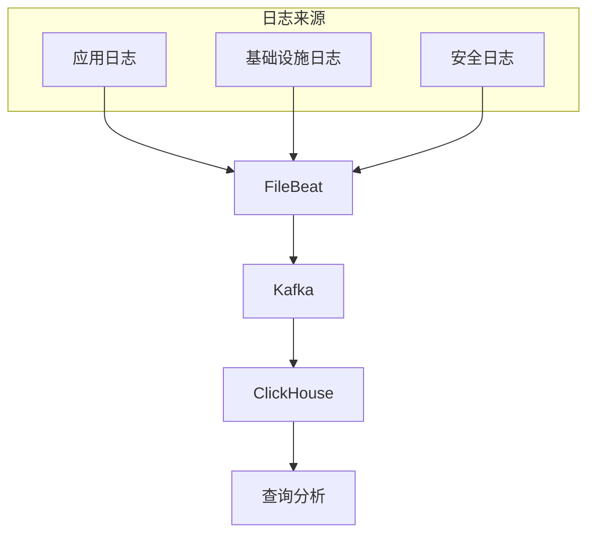
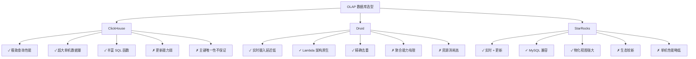

# ClickHouse 典型应用场景

## 学习目标

- 了解 ClickHouse 在用户行为分析中的应用
- 掌握实时分析看板和日志分析场景
- 对比 ClickHouse 与 Druid、StarRocks 的适用场景

## 用户行为分析

ClickHouse 是用户行为分析的首选方案，适合 Event Log 类型的海量数据分析。



### 用户事件表设计

```sql
-- 用户事件表
CREATE TABLE user_events (
    event_date Date,
    event_time DateTime,
    event_type String,          -- click, view, purchase, search
    user_id UInt64,
    session_id String,
    page_url String,
    referrer String,
    device_type String,         -- mobile, desktop, tablet
    os String,
    country String,
    payload String               -- JSON 格式扩展数据
) ENGINE = MergeTree()
ORDER BY (event_type, user_id, event_time)
PARTITION BY toYYYYMM(event_date);

-- 物化视图：用户会话聚合
CREATE MATERIALIZED VIEW session_stats_mv
ENGINE = SummingMergeTree()
ORDER BY (event_date, session_id)
AS
SELECT
    event_date,
    session_id,
    user_id,
    countState() AS event_count,
    sumState(length(extractURLParameter(page_url, 'duration'))) AS total_duration
FROM user_events
GROUP BY event_date, session_id, user_id;
```

### 用户漏斗分析

```sql
-- 漏斗转化分析：浏览 → 加入购物车 → 下单
SELECT
    toDate(event_time) AS date,
    uniqExactIf(user_id, event_type = 'product_view') AS views,
    uniqExactIf(user_id, event_type = 'add_cart') AS carts,
    uniqExactIf(user_id, event_type = 'checkout') AS checkouts,
    uniqExactIf(user_id, event_type = 'purchase') AS purchases,
    round(100.0 * carts / views, 2) AS view_to_cart_rate,
    round(100.0 * purchases / carts, 2) AS cart_to_purchase_rate
FROM user_events
WHERE event_date = today()
GROUP BY date;
```

### 留存分析

```sql
-- 用户留存率分析
WITH
    -- 获取首日活跃用户
    first_day_users AS (
        SELECT DISTINCT user_id
        FROM user_events
        WHERE event_date = '2024-01-01'
          AND event_type = 'login'
    ),
    -- 获取次日活跃用户
    second_day_users AS (
        SELECT DISTINCT user_id
        FROM user_events
        WHERE event_date = '2024-01-02'
          AND event_type = 'login'
    )
SELECT
    '2024-01-01' AS cohort_date,
    count() AS cohort_size,
    countIf(user_id IN (SELECT user_id FROM second_day_users)) AS retained,
    round(100.0 * countIf(user_id IN (SELECT user_id FROM second_day_users)) / count(), 2) AS retention_rate
FROM first_day_users;
```

## 实时分析看板

ClickHouse 的高速查询能力非常适合实时分析看板场景。



### 实时指标计算

```sql
-- 实时 DAU
SELECT
    toStartOfHour(now()) AS hour,
    uniqExact(user_id) AS dau
FROM user_events
WHERE event_time >= now() - INTERVAL 1 DAY;

-- 实时销售额
SELECT
    toStartOfMinute(now()) AS minute,
    sumIf(revenue, event_type = 'purchase') AS sales,
    countIf(event_type = 'purchase') AS orders,
    avgIf(revenue, event_type = 'purchase') AS avg_order_value
FROM user_events
WHERE event_time >= now() - INTERVAL 1 HOUR;

-- 性能指标
SELECT
    toStartOfInterval(event_time, INTERVAL 1 minute) AS minute,
    count() AS total_requests,
    avg(latency_ms) AS avg_latency,
    quantile(0.95)(latency_ms) AS p95_latency,
    countIf(status >= 500) AS errors
FROM request_logs
WHERE event_time >= now() - INTERVAL 10 MINUTE
GROUP BY minute
ORDER BY minute;
```

### Grafana 集成

```sql
-- 创建 Grafana 数据源查询
-- 格式：Prometheus 风格
SELECT
    toStartOfInterval(event_time, INTERVAL 1 minute) AS time,
    uniqExact(user_id) AS value
FROM user_events
WHERE $timeFilter
GROUP BY time
ORDER BY time;
```

## 日志存储与分析

ClickHouse 是日志分析的理想选择，存储量大、查询快。



### 日志表设计

```sql
-- 应用日志表
CREATE TABLE application_logs (
    log_date Date,
    log_time DateTime,
    level Enum8('DEBUG' = 1, 'INFO' = 2, 'WARN' = 3, 'ERROR' = 4),
    service String,
    host String,
    message String,
    trace_id String,
    span_id String,
    attributes String              -- JSON 格式
) ENGINE = MergeTree()
ORDER BY (level, service, log_time)
PARTITION BY toYYYYMM(log_date);

-- 安全审计日志
CREATE TABLE audit_logs (
    log_date Date,
    log_time DateTime,
    user_id UInt64,
    action String,
    resource String,
    ip_address IPv4,
    user_agent String,
    result Enum8('SUCCESS' = 1, 'FAILURE' = 2),
    details String
) ENGINE = MergeTree()
ORDER BY (log_date, user_id, log_time);
```

### 日志分析查询

```sql
-- 错误日志统计
SELECT
    toStartOfInterval(log_time, INTERVAL 5 minute) AS time,
    service,
    countIf(level = 'ERROR') AS error_count,
    countIf(level = 'WARN') AS warn_count
FROM application_logs
WHERE log_time >= now() - INTERVAL 1 HOUR
GROUP BY time, service
ORDER BY time;

-- 慢日志分析
SELECT
    service,
    histogram(10)(latency_ms) AS latency_dist,
    count() AS total,
    avg(latency_ms) AS avg_latency,
    quantile(0.99)(latency_ms) AS p99_latency
FROM application_logs
WHERE message LIKE '%slow%'
  AND log_time >= today()
GROUP BY service;

-- 安全威胁检测
SELECT
    ip_address,
    countIf(result = 'FAILURE') AS failures,
    uniq(user_id) AS target_users
FROM audit_logs
WHERE log_time >= now() - INTERVAL 1 HOUR
GROUP BY ip_address
HAVING failures > 10
ORDER BY failures DESC;
```

## ClickHouse vs Druid vs StarRocks

三种数据库各有优势，选择取决于具体场景。



### 详细对比

| 维度 | ClickHouse | Druid | StarRocks |
|------|------------|-------|-----------|
| **数据模型** | 追加写入 | 不可变 Segment | 支持更新 |
| **实时摄入** | Kafka → 表函数 | 原生 Kafka 索引服务 | Routine Load |
| **查询性能** | 极快 | 快 | 快 |
| **SQL 兼容性** | 扩展 SQL | 有限 SQL | MySQL 兼容 |
| **更新能力** | 弱（ReplacingMergeTree） | 不支持 | 强（主键模型） |
| **副本机制** | ZooKeeper | ZooKeeper | 无（FE 高可用） |
| **生态成熟度** | 高 | 高 | 中 |
| **适用场景** | 日志分析、Clickstream | 实时监控、指标分析 | 实时 BI、报表 |

### 场景选型建议

```sql
-- 场景 1: 海量日志分析
-- 推荐: ClickHouse
-- 原因: 超大单机数据量、丰富聚合函数、高速查询

-- 场景 2: 实时监控看板
-- 推荐: Druid
-- 原因: 低延迟摄入、Lambda 架构、Segment 预聚合

-- 场景 3: 需要实时更新的报表
-- 推荐: StarRocks
-- 原因: 主键模型支持更新、物化视图强大

-- 场景 4: Clickstream 用户行为分析
-- 推荐: ClickHouse
-- 原因: 高吞吐写入、采样查询、漏斗分析
```

## 要点总结

1. **用户行为分析**：Event Log 模型 + 漏斗分析 + 留存分析
2. **实时看板**：高速聚合查询 + Grafana 集成 + 秒级延迟
3. **日志分析**：高吞吐写入 + 正则匹配 + JSON 解析
4. **场景选型**：根据数据模型（追加 vs 更新）、实时性、SQL 能力选择
5. **ClickHouse 优势**：极致查询速度、超大单机容量、丰富函数库
6. **ClickHouse 劣势**：更新能力弱、副本一致性依赖 ZooKeeper

## 思考题

1. 在用户行为分析场景中，为什么 ClickHouse 的 MergeTree 引擎比传统行式数据库更高效？
2. ClickHouse 的实时摄入延迟主要受哪些因素影响？
3. 如果需要同时支持实时更新和历史分析，应该选择哪种数据库？为什么？
4. 在对比 Druid 和 ClickHouse 时，哪些场景更适合 Druid？
