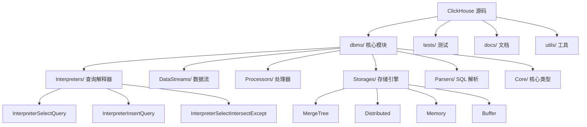
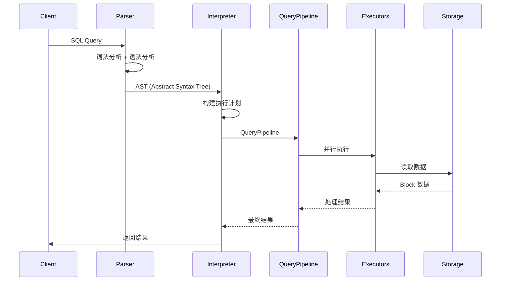

# ClickHouse 源码阅读指南

## 学习目标

- 掌握 ClickHouse 源码的目录结构和核心模块
- 理解查询执行的完整流程（Interpreter → QueryPipeline → 执行）
- 了解 MergeTree 存储引擎的关键实现

## 源码结构概览



### 关键目录

| 目录 | 说明 |
|------|------|
| `dbms/src/Interpreters/` | 查询解释器，将 AST 转换为执行计划 |
| `dbms/src/Processors/` | QueryPipeline 2.0 处理器架构 |
| `dbms/src/Storages/MergeTree/` | MergeTree 存储引擎核心实现 |
| `dbms/src/Core/` | Block、Column、Settings 等核心类型 |
| `dbms/src/DataStreams/` | 数据流管道 |
| `dbms/src/Functions/` | 函数实现（200+ 内置函数） |
| `dbms/src/Compression/` | 压缩算法实现 |

## 查询执行流程



### 核心类型

```cpp
// dbms/src/Core/Block.h

// Block: 一批行数据 + 列信息
class Block {
public:
    // 列数据
    ColumnsWithTypeAndName data;

    // 行数
    size_t rows() const;

    // 列数
    size_t columns() const;

    // 列类型
    const DataTypePtr & getByPosition(size_t) const;

    // 列数据
    const ColumnPtr & getByName(const String &) const;
};

// Column: 列数据抽象
class IColumn {
public:
    virtual ~IColumn() = default;
    virtual size_t size() const = 0;
    virtual void insert(const Field &) = 0;
    virtual StringRef serializeValueIntoArena(size_t, Arena &) const = 0;
    // ... 向量化操作
};

// DataType: 列类型
class IDataType {
public:
    virtual String getName() const = 0;
    virtual DataTypePtr createColumn() const = 0;
    virtual void serializeBinaryBulk() const = 0;
    // ... 压缩/序列化方法
};
```

## 核心文件详解

### MergeTreeData

```cpp
// dbms/src/Storages/MergeTree/MergeTreeData.h

// MergeTree 表的核心数据结构
class MergeTreeData {
public:
    // 表结构
    NamesAndTypesList columns;
    String sorting_key;
    String partition_key;
    String sampling_key;

    // 分区管理
    const MergeTreePartition & getPartition() const;
    MergeTreeDataPartsVector getDataParts() const;

    // 读取接口
    MergeTreeReadTaskPtr reader(
        const MergeTreeReadTaskSettings & settings,
        const RangesInDataParts & ranges);

    // 写入接口
    void writer(std::unique_ptr<MergeTreeWriter> writer);
};

// MergeTreeDataPart: 单个数据 part
class MergeTreeDataPart {
public:
    String name;                    // part 名称
    size_t rows;                    // 行数
    size_t marks;                   // 索引标记数
    UInt64 bytes_on_disk;           // 磁盘大小

    MergeTreeDataPartType type;     // Wide / Compact / Memory

    // 列文件
    ColumnFileByName files;
};
```

### 向量化聚合

```cpp
// dbms/src/Interpreters/AggregateFunction.h

// 聚合函数接口
class IAggregateFunction {
public:
    // 创建聚合状态
    virtual IAggregateFunctionHelper * create(AggregateFunctionContext *) const = 0;

    // 添加数据到状态（向量化接口）
    virtual void addBatch(
        size_t batch_size,
        ColumnRawPtrs & raw_columns,
        const sizes & column_indices,
        AggregateFunctionContext * context,
        Arena * arena) const = 0;
};

// 示例：Sum 聚合的实现
class AggregateFunctionSum : public IAggregateFunction {
public:
    void addBatch(
        size_t batch_size,
        ColumnRawPtrs & raw_columns,
        const sizes & column_indices,
        AggregateFunctionContext * context,
        Arena * arena) const override {
        // SIMD 优化的批量添加
        const auto * column = checkColumn<ColumnVector<Int64>>(raw_columns[0]);
        for (size_t i = 0; i < batch_size; ++i) {
            ((Int64 *)context->state)[0] += column->getElement(i);
        }
    }
};
```

### QueryPipeline 2.0

```cpp
// dbms/src/Processors/QueryPipeline.h

// 查询管道
class QueryPipeline {
public:
    // 添加处理器
    void resize(size_t max_threads);
    void addPipeline(QueryPipeline pipeline);

    // 源处理器
    SourcePtr asSources();
    SourcePtr asSourcesSource();

    // 执行
    PullingPipelineExecutor executor();
};

// 处理器基类
class IProcessor {
public:
    virtual Status work() = 0;
    virtual InputPort & getInputPort() = 0;
    virtual OutputPort & getOutputPort() = 0;
};

// 常用处理器
class FilterTransform : public IProcessor { /* 过滤 */ };
class AggregatingTransform : public IProcessor { /* 聚合 */ };
class SortingTransform : public IProcessor { /* 排序 */ };
class LimitTransform : public IProcessor { /* 限制 */ };
class JoinTransform : public IProcessor { /* 连接 */ };
```

## 源码阅读路径

### 路径 1: 查询执行路径

```
dbms/src/Interpreters/
├── InterpreterSelectQuery.cpp   # 查询入口
│   ├── buildQueryPipeline()     # 构建执行管道
│   └── executeQuery()           # 执行查询
│
├── InterpreterInsertQuery.cpp   # 插入入口
│   └── execute()                # 执行插入
│
└── ExpressionAnalyzer.cpp        # 表达式分析
    ├── optimize()               # 查询优化
    └── getQueryProcessingStage() # 处理阶段
```

### 路径 2: MergeTree 存储引擎

```
dbms/src/Storages/MergeTree/
├── MergeTreeData.cpp            # 表核心操作
│   ├── read()                    # 读取数据
│   ├── write()                   # 写入数据
│   └── alter()                   # 表结构变更
│
├── MergeTreeDataSelectProcessor.cpp  # 数据读取
│   ├── readRange()               # 读取指定范围
│   └── readMarks()               # 读取索引
│
├── MergeTreeWriter.cpp           # 数据写入
│   ├── writePart()               # 写入 part
│   └── finishPart()              # 完成 part
│
├── MergeTreeMerger.cpp           # Part 合并
│   ├── mergeParts()              # 合并多个 parts
│   └── mergeColumn()             # 合并列数据
│
└── MergeTreeIndex.cpp            # 索引
    └── calculateBloomFilter()    # 布隆过滤器
```

### 路径 3: 向量化执行

```
dbms/src/Processors/
├── QueryPipeline.cpp            # 管道构建
│   ├── addSource()              # 添加数据源
│   ├── addTransform()           # 添加处理器
│   └── setConcurrency()         # 设置并发度
│
├── Transforms/
│   ├── AggregatingTransform.cpp  # 聚合变换
│   ├── SortingTransform.cpp      # 排序变换
│   ├── FilterTransform.cpp       # 过滤变换
│   └── LimitTransform.cpp        # 限制变换
│
└── Executors/
    └── PipelineExecutor.cpp      # 并行执行
        ├── executeStep()         # 单步执行
        └── executeSingleStream()  # 单流执行
```

### 路径 4: 数据压缩

```
dbms/src/Compression/
├── CompressionFactory.cpp        # 压缩工厂
│   └── createCodec()            # 创建编解码器
│
├── CodecZSTD.cpp                # ZSTD 压缩
├── CodecLZ4.cpp                 # LZ4 压缩
├── CodecDelta.cpp               # Delta 编码
└── CodecGoroutine.cpp          # Goroutine 编码
```

## 关键文件速查表

| 文件 | 行数 | 说明 |
|------|------|------|
| `dbms/src/Core/Settings.h` | 10k+ | 配置参数定义 |
| `dbms/src/Core/Block.h` | 500 | 数据块核心类 |
| `dbms/src/Storages/MergeTree/MergeTreeData.h` | 1000+ | MergeTree 核心 |
| `dbms/src/Storages/MergeTree/MergeTreeData.cpp` | 2000+ | MergeTree 实现 |
| `dbms/src/Interpreters/InterpreterSelectQuery.cpp` | 1500 | 查询解释器 |
| `dbms/src/Processors/QueryPipeline.h` | 300 | 管道架构 |
| `dbms/src/Compression/CompressionFactory.cpp` | 500 | 压缩工厂 |

## 推荐的阅读顺序

1. **Block/Column**：`dbms/src/Core/Block.h` - 理解数据在内存中的表示
2. **MergeTree 读取**：`dbms/src/Storages/MergeTree/MergeTreeDataSelectProcessor.cpp` - 理解如何读取数据
3. **向量化聚合**：`dbms/src/Interpreters/AggregateFunction.h` - 理解聚合执行
4. **QueryPipeline**：`dbms/src/Processors/QueryPipeline.h` - 理解执行管道
5. **存储格式**：`dbms/src/Storages/MergeTree/MergeTreeDataPart.cpp` - 理解数据组织

## 外部资源

- 官方文档: https://clickhouse.com/docs
- GitHub: https://github.com/ClickHouse/ClickHouse
- 中文社区: https://clickhouse.com.cn
- 设计论文: https://clickhouse.com/docs/en/architecture/clickhouse-at-yandex

## 要点总结

1. **核心类型**：Block/Column/DataType 是 ClickHouse 内存表示的基础
2. **查询流程**：Parser → AST → Interpreter → QueryPipeline → Processor → Storage
3. **MergeTree**：基于排序键的列式存储，支持分区和索引
4. **向量化执行**：利用 SIMD 批量处理 Block 数据
5. **QueryPipeline 2.0**：模块化的处理器架构，支持并行执行
6. **压缩**：支持 LZ4/ZSTD/Delta 等多种压缩算法

## 思考题

1. ClickHouse 的 Block 和 Arrow 的 RecordBatch 有什么异同？
2. 为什么 MergeTree 的排序键对查询性能至关重要？
3. QueryPipeline 的「拉取模型」和「推送模型」各有什么优缺点？
4. 在实际阅读源码时，如何定位一个 SQL 函数（如 `quantile`）的实现？
