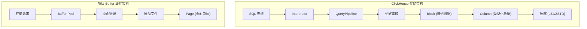
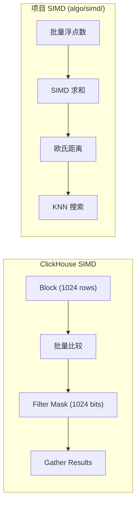
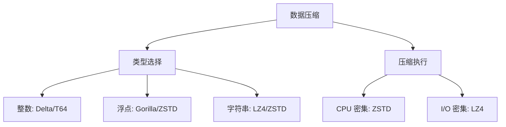

# ClickHouse 与项目关联

## 学习目标

- 理解 ClickHouse 的列式存储与项目 Buffer 缓存的关联
- 掌握向量化执行与项目 SIMD 算法的对应关系
- 借鉴 ClickHouse 设计优化项目存储架构

## ClickHouse 列式存储与项目 Buffer 缓存

### 架构对比



### 列式存储设计借鉴

**ClickHouse Block 结构**：

```cpp
// ClickHouse 列式存储核心
struct Column {
    String name;
    DataTypePtr type;
    ColumnPtr data;           // 列数据
    ColumnPtr null_map;        // Nullable 标记
};

struct Block {
    std::vector<Column> columns;
    size_t rows;               // 所有列行数一致
    size_t allocated_bytes;    // 已分配内存
};
```

**项目 Page 结构（可借鉴）**：

```c
// 项目中可设计的列式页面结构
typedef struct {
    uint32_t page_type;        // PAGE_COLUMNAR
    uint32_t column_count;     // 列数量
    uint64_t row_count;        // 行数

    // 列元数据
    ColumnMeta {
        uint32_t type;         // 列类型
        uint64_t offset;       // 列数据偏移
        uint64_t size;         // 列数据大小
        uint64_t compressed_size;
        uint8_t  codec;        // 压缩算法
    } columns[MAX_COLUMNS];

    // 列数据区域
    uint8_t data[0];
} ColumnarPage;
```

### 列裁剪优化

ClickHouse 只读取查询涉及的列，这一设计可以借鉴到项目 Buffer Pool：

```c
// 项目可实现的列裁剪接口
typedef struct {
    uint32_t column_count;
    uint32_t requested_columns[MAX_COLUMNS];  // 只需要这些列
} ColumnProjection;

// 读取时只加载需要的列
BufferResult columnar_read(BufferPool *pool, PageID page_id,
                          ColumnProjection *projection) {
    ColumnarPage *page = buffer_get_page(pool, page_id);

    // 只解压缩请求的列
    for (int i = 0; i < projection->column_count; i++) {
        uint32_t col_idx = projection->requested_columns[i];
        decompress_column(&page->columns[col_idx]);
    }

    return page;
}
```

## 向量化执行与项目 SIMD 算法

### SIMD 应用对比



### 项目已有 SIMD 实现

项目 `engineering/src/algo/simd/` 目录下已有 SIMD 算法实现：

```c
// 项目 SIMD 距离计算接口
#include "algo/simd/simd_distance.h"

// 欧氏距离（已有实现）
void simd_float_euclidean_distance(
    const float *a, const float *b,
    float *result, size_t n);

// 曼哈顿距离（可扩展）
void simd_float_manhattan_distance(
    const float *a, const float *b,
    float *result, size_t n);
```

### ClickHouse 向量化聚合借鉴

ClickHouse 的向量化聚合设计可以借鉴到项目中：

```cpp
// ClickHouse 向量化聚合模式
template <typename T>
struct VectorizedAggregator {
    void addBatch(const T *data, size_t batch_size, T *state) {
        // SIMD 优化的批量聚合
        for (size_t i = 0; i < batch_size; i += SIMD_WIDTH) {
            __m256 chunk = _mm256_loadu_ps(&data[i]);
            // SIMD 加法到 state
        }
    }

    T computeFinal(const T *state) {
        return *state;
    }
};
```

项目可实现的向量化聚合函数：

```c
// 项目可扩展的向量化聚合
// simd_aggregator.h

// 向量化求和
void simd_float_sum(const float *data, size_t n, float *result);

// 向量化最大值
void simd_float_max(const float *data, size_t n, float *result);

// 向量化平均值
void simd_float_avg(const float *data, size_t n, float *result);

// 向量化计数（条件满足）
size_t simd_count_where(const float *data, size_t n,
                        bool (*predicate)(float));
```

## 数据压缩机制借鉴

### ClickHouse 压缩策略



### 项目压缩接口设计

```c
// 项目压缩接口（可借鉴 ClickHouse Codec 设计）
#include "db/compression.h"

// 压缩算法枚举
typedef enum {
    CODEC_NONE = 0,
    CODEC_LZ4,
    CODEC_ZSTD,
    CODEC_DELTA,
    CODEC_T64,
} CompressionCodec;

// 压缩上下文
typedef struct {
    CompressionCodec codec;
    void *options;             // 算法特定参数
    uint64_t compressed_size;
    uint64_t original_size;
} CompressionContext;

// 压缩函数
int compress(const uint8_t *src, size_t src_size,
             uint8_t *dst, size_t dst_size,
             CompressionCodec codec);

// 解压函数
int decompress(const uint8_t *src, size_t src_size,
               uint8_t *dst, size_t dst_size,
               CompressionCodec codec);

// 自动选择最佳压缩算法
CompressionCodec select_best_codec(const ColumnMeta *meta);
```

## MergeTree 与项目存储引擎

### 存储结构对比

| 维度 | ClickHouse MergeTree | 项目存储引擎 |
|------|---------------------|--------------|
| 存储模型 | 列式存储 | 行式/列式可选 |
| 索引 | 主键排序 + 稀疏索引 | 页面索引 |
| 分区 | 时间分区 | 可扩展 |
| 压缩 | 多级压缩 | 可扩展 |
| 后台任务 | Merge / Mutation | 页面刷脏 |

### 项目可借鉴的 MergeTree 特性

```c
// 项目可实现的 MergeTree 特性

// 1. 稀疏索引（项目已有类似实现）
typedef struct {
    uint64_t index_granularity;   // 索引粒度
    SparseIndex {
        uint64_t key_value;        // 索引键值
        uint64_t mark;             // 数据位置标记
    } *index;
} MergeTreeIndex;

// 2. 后台 Merge 调度
typedef struct {
    MergeTaskQueue *pending_merges;
    BackgroundExecutor *executor;
    MergeConfig config;
} MergeScheduler;

// 3. 分区管理
typedef struct {
    String partition_id;
    DataPartVector parts;
    PartitionStats stats;
} MergeTreePartition;
```

## 设计模式借鉴

### 1. Visitor 模式（解释器）

ClickHouse 使用 Interpreter 模式处理不同类型的 SQL：

```cpp
// ClickHouse Interpreter 模式
class IInterpreter {
public:
    virtual ~IInterpreter() = default;
    virtual Block execute() = 0;
};

class InterpreterSelectQuery : public IInterpreter { /* SELECT */ };
class InterpreterInsertQuery : public IInterpreter { /* INSERT */ };
class InterpreterCreateTable : public IInterpreter { /* CREATE */ };
```

项目可借鉴此模式设计存储操作接口：

```c
// 项目存储操作接口
typedef struct {
    StorageResult (*open)(const char *path);
    StorageResult (*close)(StorageHandle handle);
    PageResult (*read)(StorageHandle handle, PageID id, void *buf);
    PageResult (*write)(StorageHandle handle, PageID id, const void *buf);
    IndexResult (*scan)(StorageHandle handle, ScanPredicate *pred);
} StorageVTable;
```

### 2. Pipeline 模式

ClickHouse 的 QueryPipeline 模式可以借鉴：

```cpp
// 项目可实现的 Pipeline 模式
typedef struct Processor Processor;

struct Processor {
    Processor *input;           // 上游处理器
    Processor *output;          // 下游处理器

    void (*process)(Processor *self);
    void (*initialize)(Processor *self);
    void (*finalize)(Processor *self);
};

// 项目处理管道
typedef struct {
    Processor *head;           // 数据源
    Processor *tail;           // 终点
    size_t max_parallelism;   // 最大并发度
} QueryPipeline;
```

## 实际项目应用

### 场景 1: 物化视图加速查询

项目中可实现类似 ClickHouse 物化视图的预聚合表：

```c
// 项目物化视图接口
typedef struct {
    const char *name;
    TableSchema target_schema;      // 目标表结构
    const char *select_sql;         // 预计算 SQL
    RefreshPolicy refresh_policy;   // 刷新策略
} MaterializedView;

// 创建物化视图
MaterializedView *mv_create(const char *name,
                             const char *select_sql,
                             RefreshPolicy policy);

// 自动刷新
void mv_refresh(MaterializedView *mv);
```

### 场景 2: 近似聚合函数

项目中可实现 ClickHouse 的近似聚合函数：

```c
// 项目近似聚合函数
#include "algo/hll/hyperloglog.h"

// HyperLogLog 去重计数
HyperLogLog *hll_create(double error_rate);
void hll_add(HyperLogLog *hll, uint64_t value);
uint64_t hll_count(HyperLogLog *hll);

// 在聚合中使用
typedef struct {
    HyperLogLog *hll;
} ApproxDistinctAggregate;
```

## 要点总结

1. **列式存储**：Block/Column/DataType 体系可借鉴到项目的 Buffer Pool
2. **列裁剪**：只读取需要的列，减少 I/O
3. **SIMD 向量化**：项目已有 simd_distance.h，可扩展聚合函数
4. **压缩算法**：Codec 接口设计可借鉴，扩展 LZ4/ZSTD 支持
5. **Pipeline 模式**：Processor 架构可借鉴到查询处理管道
6. **物化视图**：预聚合表可显著加速重复查询

## 思考题

1. 项目 Buffer Pool 目前是行式存储，如何扩展为列式存储？
2. ClickHouse 的 index_granularity 机制在项目中如何实现？
3. 项目如何借鉴 HyperLogLog 实现高效的近似去重？
4. 在多核 CPU 环境下，如何设计并行聚合算法？
