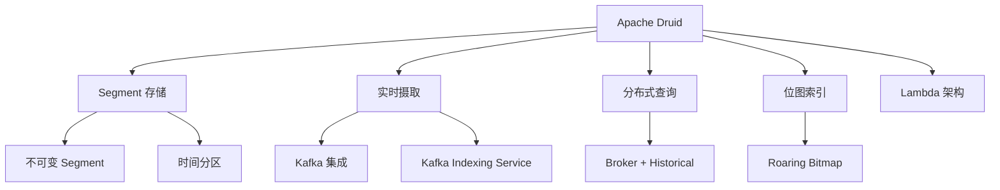
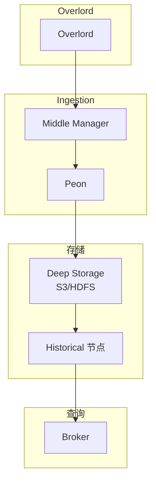

# Apache Druid 项目概览

## 学习目标

- 了解 Druid 作为实时 OLAP 数据库的定位
- 掌握 Druid 的 Segment 和 Lambda 架构

## 项目定位

> Apache Druid 是一个实时分析数据库，针对大规模数据的快速查询而设计。

**基本信息**：
- 开发方：Apache 基金会 / Imply
- 首次发布：2011 年
- 开源协议：Apache 2.0
- GitHub Stars：约 13k

## 核心设计

## 架构

## 要点总结

- Segment 列式存储
- 实时摄取 Kafka 数据
- 位图索引加速过滤
- Lambda 架构混合存储
