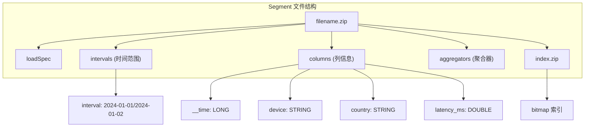
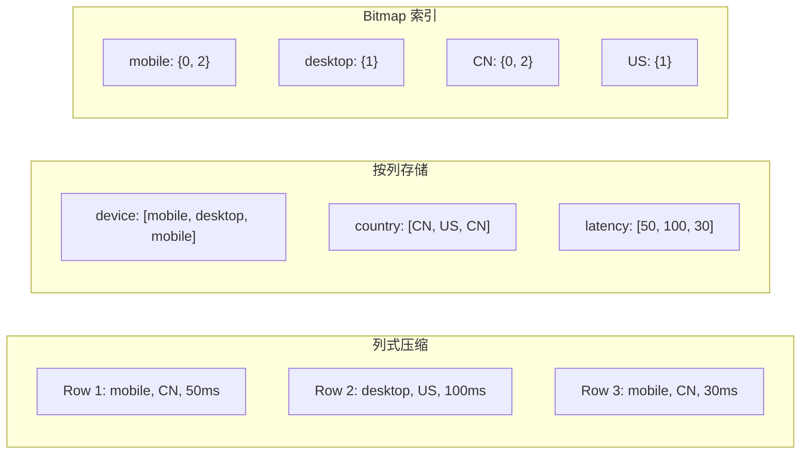
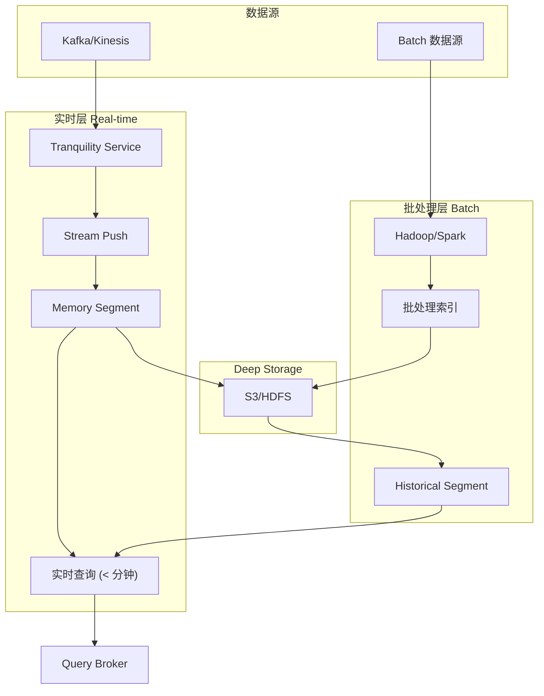
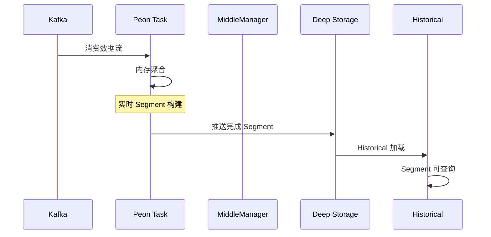
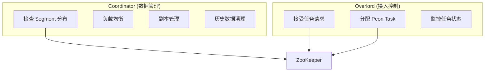
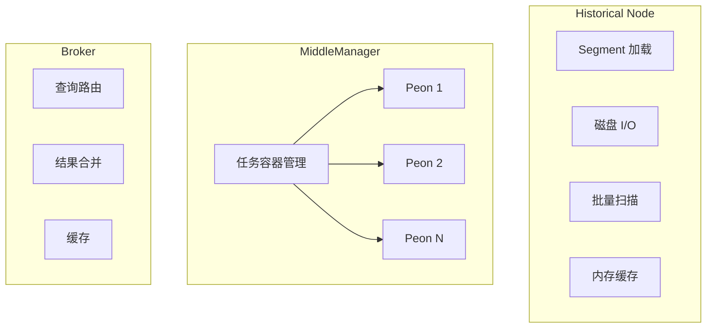
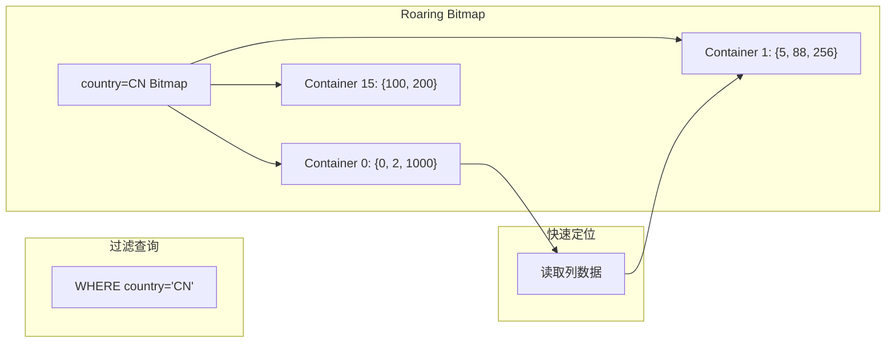
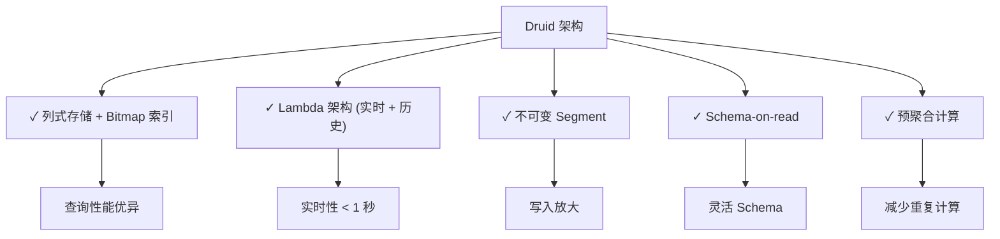

# Apache Druid 架构设计

## 学习目标

- 理解 Druid 的列式 Segment 存储结构
- 掌握 Druid 的 Lambda 架构设计
- 了解 Druid 节点类型和数据摄入流程

## Segment 列式存储

Druid 的核心是 Segment 数据结构，它是 Druid 查询性能的关键。



### Segment 格式

```json
{
  "type": "s3_zip",
  "bucket": "druid-storage",
  "key": "wikipedia/2024-01-01/2024-01-01_0.zip",

  "intervals": ["2024-01-01T00:00:00.000Z/2024-01-02T00:00:00.000Z"],

  "columns": {
    "__time":    { "type": "LONG",   "size": 1000000 },
    "device":    { "type": "STRING", "size": 500000 },
    "country":   { "type": "STRING", "size": 500000 },
    "latency":   { "type": "DOUBLE", "size": 8000000 }
  },

  "aggregators": {
    "count":     { "type": "count" },
    "latency_sum": { "type": "doubleSum", "fieldName": "latency" },
    "latency_min": { "type": "doubleMin", "fieldName": "latency" }
  },

  "index.zip": {
    "bitmap": {
      "device=mobile":  "RBM",
      "device=desktop": "RBM",
      "country=CN":     "RBM"
    }
  }
}
```

### 列存储设计



## Lambda 架构

Druid 采用 Lambda 架构，同时处理实时数据和历史数据。



### 实时层设计

```mermaid
graph LR
    subgraph "Tranquility"
        T[Tranquility Server]
        T --> T1[接收实时数据]
        T --> T2[内存聚合]
        T --> T3[发布 Segment"]
    end

    subgraph "MiddleManager/Peon"
        MM[MiddleManager]
        MM --> P1[Peon 1: Kafka Index Task]
        MM --> P2[Peon 2: Kafka Index Task]

        P1 --> S1[实时 Segment]
        P2 --> S2[实时 Segment]
    end

    T --> MM
```

## 数据摄入机制

### Kafka Indexing Service

```yaml
# ingestion/spec.json
{
  "type": "kafka",
  "dataSchema": {
    "dataSource": "pageviews",
    "parser": {
      "type": "string",
      "parseSpec": {
        "format": "json",
        "timestampSpec": { "column": "timestamp" },
        "dimensionsSpec": {
          "dimensions": ["page", "user", "country"]
        }
      }
    },
    "metricsSpec": [
      { "type": "count", "name": "views" },
      { "type": "doubleSum", "name": "latency", "fieldName": "latency_ms" }
    ]
  },
  "tuningConfig": {
    "taskCount": 1,
    "replicas": 0,
    "taskDuration": "PT1H"
  },
  "ioConfig": {
    "topic": "pageviews",
    "consumerProperties": { "bootstrap.servers": "kafka:9092" }
  }
}
```

### 摄入流程



## 节点类型

### 协调节点（Overlord/Coordinator）



### 数据节点



### 节点职责表

| 节点类型 | 职责 | 资源需求 |
|---------|------|----------|
| Coordinator | 管理 Segment 分布、负载均衡 | 低（1-2 核） |
| Overlord | 管理摄入任务 | 低（1-2 核） |
| Historical | 存储和查询历史 Segment | 高（内存密集） |
| MiddleManager | 运行实时摄入任务 | 中（计算密集） |
| Broker | 接收查询、路由、合并结果 | 中（网络密集） |

## 位图索引

Druid 使用 Roaring Bitmap 加速过滤查询。



### Bitmap 索引压缩

```cpp
// Roaring Bitmap 压缩类型

// 1. Array Container (低密度)
// 存储: [0, 5, 100] -> 3 * 2bytes = 6 bytes
// 适用: 基数 < 4096

// 2. Bitmap Container (高密度)
// 存储: [0-65535] -> 65536 bits = 8KB
// 适用: 基数 > 4096

// 3. Run-Length Encoding (连续值)
// 存储: [0-1000] -> run-length 编码
// 适用: 连续值序列
```

### 过滤执行

```sql
-- Druid 过滤查询
SELECT
    page,
    SUM(latency) AS total_latency
FROM pageviews
WHERE country = 'CN'
  AND device = 'mobile'
  AND __time >= '2024-01-01'
  AND __time < '2024-01-02'
GROUP BY page
LIMIT 100;

-- 执行流程
-- 1. country='CN' -> Bitmap A
-- 2. device='mobile' -> Bitmap B
-- 3. A AND B -> Bitmap C
-- 4. 时间范围过滤 -> 扫描列数据
-- 5. 聚合计算
```

## 架构设计要点



## 要点总结

1. **Segment 存储**：列式存储 + Bitmap 索引，支持快速过滤
2. **Lambda 架构**：实时层处理最近数据，历史层处理历史数据
3. **节点分工**：Coordinator/Overlord/Broker/Historical 各司其职
4. **数据摄入**：支持 Kafka Push/Pull，Tranquility 流式摄入
5. **位图索引**：Roaring Bitmap 高效压缩，支持位运算
6. **不可变性**：Segment 写入后不可变，简化并发控制

## 思考题

1. Druid 的 Segment 和 ClickHouse 的 MergeTree Part 有什么异同？
2. 为什么 Druid 选择 Roaring Bitmap 而不是普通 Bitmap？
3. Lambda 架构的实时层和批处理层如何保证数据一致性？
4. MiddleManager/Peon 架构相比直接启动进程有什么优势？
