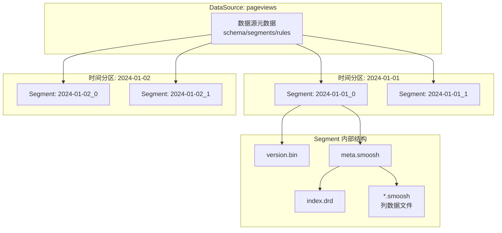
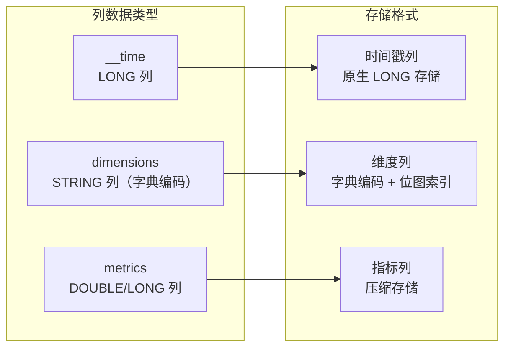
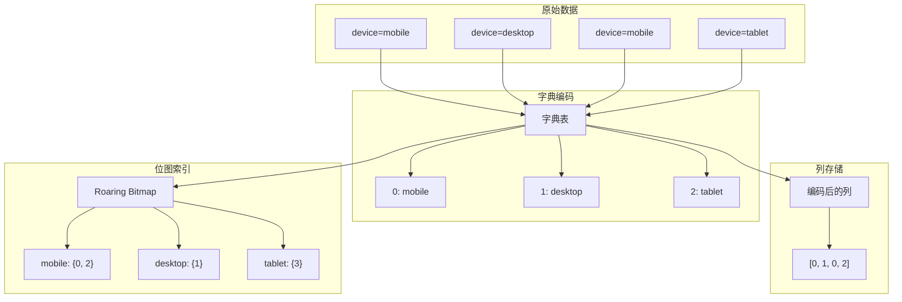
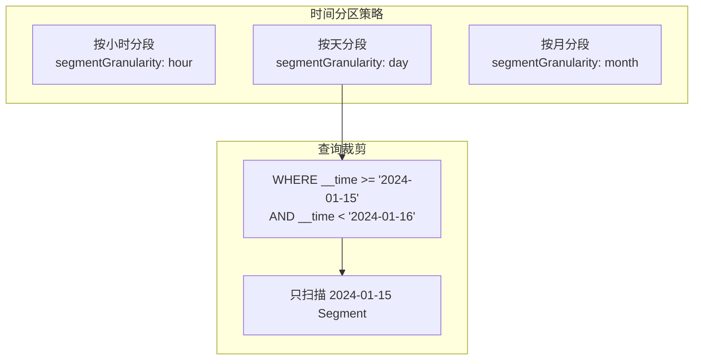
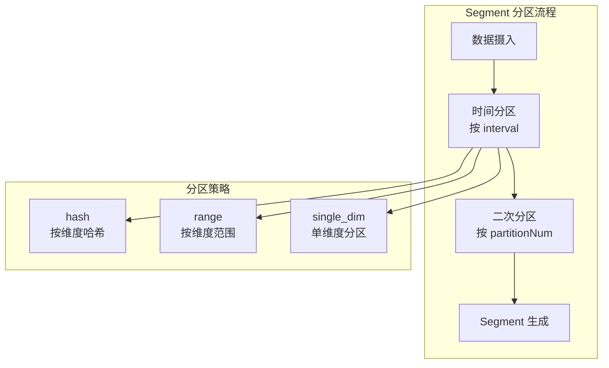
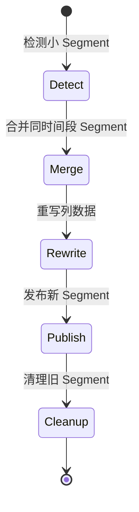
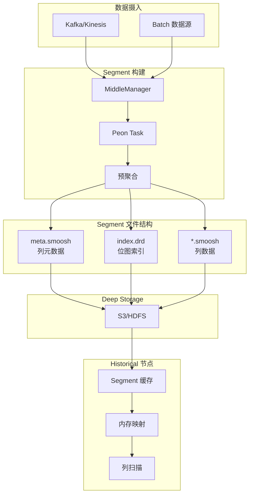

# Druid 列式存储引擎

## 学习目标

- 理解 Druid Segment 列式存储的核心设计
- 掌握数据压缩算法（LZ4、ZSTD、Delta、RLE 等）的原理与选型
- 理解数据分区与时间分片的设计及其对查询性能的影响
- 对比 Druid Segment 存储与本项目 storage/ 模块的设计差异

## Segment 存储架构

Druid 的核心存储单元是 **Segment**，它是不可变的列式存储文件，包含一段时间范围内的所有数据。

### 存储层次



### Segment 文件结构

一个完整的 Segment 包含以下核心文件：

| 文件 | 类型 | 说明 |
|------|------|------|
| `version.bin` | 元数据 | Segment 版本号 |
| `meta.smoosh` | 元数据 | 列元数据、索引偏移量 |
| `index.drd` | 索引 | 位图索引、字典索引 |
| `*.smoosh` | 数据 | 列数据文件，压缩存储 |

### Segment 命名规则

Segment 命名格式：`{dataSource}_{interval}_{version}_{partitionNum}`

- `pageviews_2024-01-01_2024-01-02_2024-01-01T00:00:00.000Z_1`
- `dataSource`: 数据源名称
- `interval`: 时间区间（ISO-8601 格式）
- `version`: 版本号（时间戳）
- `partitionNum`: 分区编号

## 列式存储设计

Druid 采用纯列式架构，每个列独立存储在 smoosh 文件中。

### 列类型与存储



### 维度列存储

维度列采用字典编码 + 位图索引的设计：



**字典编码的优势**：

| 优势 | 说明 |
|------|------|
| 存储压缩 | 字符串转整数，节省空间 |
| 快速比较 | 整数比较比字符串快 |
| 位图索引 | 支持高效位运算过滤 |

### 指标列存储

指标列支持多种存储格式：

| 类型 | 存储格式 | 说明 |
|------|---------|------|
| `LONG` | 原生或压缩 | 整数指标 |
| `DOUBLE` | 原生或压缩 | 浮点数指标 |
| `COMPLEX` | 自定义序列化 | HyperLogLog、Histogram 等 |

## 数据压缩算法

Druid 支持多种压缩算法，可在摄入时指定。

### 压缩算法总览

| 算法 | 类型 | 速度 | 压缩比 | 适用场景 |
|------|------|------|--------|----------|
| none | 无压缩 | 最快 | 1:1 | 热数据，高频查询 |
| lz4 | 通用 | 极快 | 2:1 ~ 3:1 | 默认，平衡场景 |
| lzf | 通用 | 快 | 2:1 ~ 3:1 | 中等压缩 |
| zstd | 通用 | 中等 | 3:1 ~ 5:1 | 冷数据，存储优化 |
| rle | 专用 | 极快 | 与数据相关 | 低基数、连续值 |
| delta | 专用 | 极快 | 与数据相关 | 有序时间戳 |

### LZ4 压缩

Druid 默认使用 LZ4 压缩列数据：

```
原始数据:    [100, 105, 110, 120, 131, 140, ...]
LZ4 编码:   [字面量 + 匹配指针]
             当数据有重复模式时压缩率更高
```

**LZ4 特点**：
- 压缩速度：~500 MB/s
- 解压速度：~1000 MB/s
- 压缩比：2:1 ~ 3:1（典型场景）

### RLE 编码

针对低基数列和连续值，RLE 编码效果极佳：

```
原始数据:    [0, 0, 0, 0, 1, 1, 1, 2, 2, 2, 2, 2]
RLE 编码:   [(0, 4), (1, 3), (2, 5)]
             值 + 连续出现次数
```

**适用场景**：
- 布尔列（true/false 交替）
- 状态列（有限状态值）
- 排序后的维度列

### Delta 编码

时间戳列通常使用 Delta 编码：

```
原始时间戳:  [1704067200000, 1704067201000, 1704067202000]
Delta 编码: [1704067200000, 1000, 1000]
             首值保留，后续存增量
```

### 压缩配置示例

```json
{
  "type": "index_parallel",
  "dataSchema": {
    "dataSource": "metrics",
    "metricsSpec": [
      {
        "type": "count",
        "name": "count"
      },
      {
        "type": "doubleSum",
        "name": "latency",
        "fieldName": "latency_ms"
      }
    ],
    "granularitySpec": {
      "segmentGranularity": "day",
      "queryGranularity": "hour"
    }
  },
  "tuningConfig": {
    "type": "index_parallel",
    "maxBytesInMemory": 536870912,
    "maxRowsPerSegment": 5000000
  }
}
```

## 数据分区与时间分片

Druid 以时间为核心分区键，支持多级分区策略。

### 时间分区



**时间粒度选择**：

| 粒度 | Segment 数量 | 适用场景 |
|------|-------------|----------|
| hour | 高（每天 24 个） | 实时监控，高频查询 |
| day | 中（每天 1 个） | 通用场景，日志分析 |
| month | 低（每月 1 个） | 归档数据，低频查询 |

### 二次分区（Secondary Partitioning）

除了时间分区，Druid 还支持二次分区：



### 分区配置示例

```json
{
  "dataSchema": {
    "dataSource": "events",
    "granularitySpec": {
      "type": "uniform",
      "segmentGranularity": "day",
      "queryGranularity": "hour"
    },
    "partitionSpec": {
      "type": "hashed",
      "numBuckets": 10,
      "partitionDimensions": ["user_id"]
    }
  }
}
```

## Segment 合并与压缩

Druid 后台会自动合并小 Segment，优化查询性能。

### Compact 任务



**Compact 触发条件**：

- Segment 数量超过阈值
- 单个 Segment 行数过少
- 手动触发 compact 任务

### 合并策略

| 策略 | 说明 | 适用场景 |
|------|------|----------|
| uniform | 统一时间粒度 | 实时摄入后的定期合并 |
| interval | 按时间区间合并 | 手动指定合并范围 |

## 与本项目 storage/ 模块的对比

### 项目列式存储实现

项目在 `engineering/include/db/core/columnar_store.h` 中实现了 Parquet 风格的列式存储：

```c
// 列式存储核心结构
typedef struct ColumnarStore_s {
    char *file_path;
    ColumnarFooter *footer;
    CompressionType compression;
    void *file_handle;
} ColumnarStore;

// 行组元数据
typedef struct RowGroupMeta_s {
    int64_t num_rows;
    int64_t total_size;
    ColumnChunkMeta *columns;
    size_t num_columns;
} RowGroupMeta;
```

### 架构对比

| 维度 | Druid Segment | 项目 columnar_store | 项目 ts_columnar |
|------|--------------|---------------------|------------------|
| 存储模型 | 列式，Segment 为单位 | 列式，行组为单位 | 列式，时间块为单位 |
| 索引 | 位图索引 + 字典 | MinMax 索引 | 块跳过索引 |
| 分区 | 时间分区 + 二次分区 | 行组逻辑分区 | 时间块分区 |
| 压缩 | LZ4/ZSTD/RLE/Delta | Snappy/GZip/ZSTD/LZ4 | Delta/RLE/Bitpack |
| 排序键 | 时间为主键 | 不支持 | 时间戳排序 |
| 不可变性 | Segment 不可变 | 可追加 | 可追加 |
| 位图索引 | Roaring Bitmap | 不支持 | 不支持 |

### 项目可借鉴的设计

1. **位图索引**：项目目前缺少位图索引，可扩展 Druid 风格的 Roaring Bitmap 过滤

```c
// 建议新增：engineering/include/db/core/bitmap_index.h

typedef struct BitmapIndex_s {
    char *column_name;
    RoaringBitmap **bitmaps;    // 每个唯一值一个位图
    char **values;               // 值字典
    size_t num_values;
} BitmapIndex;

// 位图过滤操作
void bitmap_and(BitmapIndex *idx1, BitmapIndex *idx2, RoaringBitmap *result);
void bitmap_or(BitmapIndex *idx1, BitmapIndex *idx2, RoaringBitmap *result);
```

2. **字典编码**：项目可借鉴 Druid 的字典编码，减少字符串存储开销

3. **Segment 不可变性**：项目可考虑引入 Segment 级别的不可变性，简化并发控制

## Segment 存储架构图



## 要点总结

1. **Segment 存储**：不可变列式存储，以时间为分区键
2. **列式架构**：维度列字典编码 + 位图索引，指标列压缩存储
3. **压缩算法**：LZ4（默认）、ZSTD（高压缩）、RLE（低基数）、Delta（时间戳）
4. **时间分区**：segmentGranularity 决定分区粒度，支持小时/天/月级别
5. **二次分区**：hash/range 分区策略，分散热点数据
6. **位图索引**：Roaring Bitmap 高效压缩，支持位运算加速过滤
7. **Segment 合并**：后台 Compact 任务合并小 Segment，优化查询性能
8. **项目对比**：项目已有列式存储基础，可借鉴位图索引、字典编码等设计

## 思考题

1. Druid 的 Segment 为什么设计为不可变？不可变性带来了哪些优势和劣势？
2. 字典编码在什么场景下会失效？高基数维度列应该如何处理？
3. Roaring Bitmap 与普通 Bitmap 相比，在什么情况下存储效率更高？
4. Segment 合并（Compact）对查询性能有什么影响？应该何时触发合并？
5. 项目 `columnar_store` 的 RowGroup 和 Druid 的 Segment 在概念上有何异同？如何将 Druid 的位图索引引入项目？