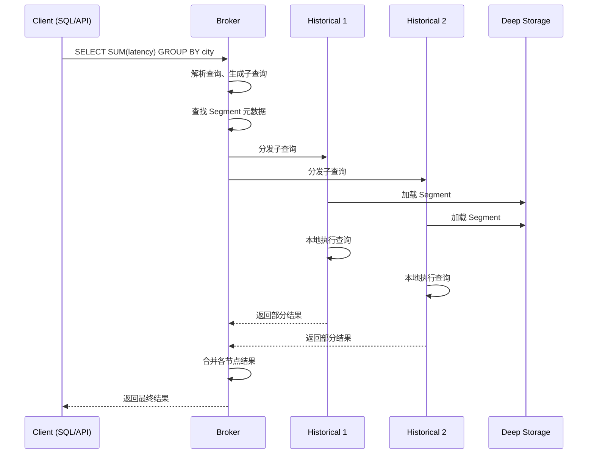
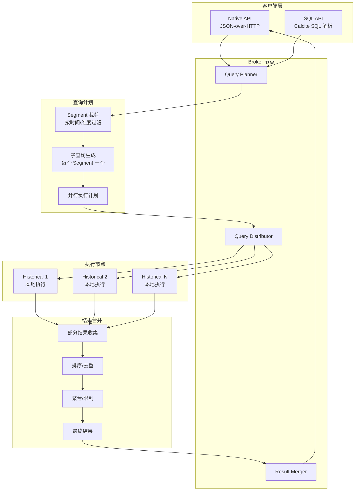
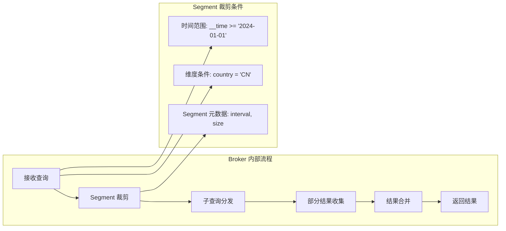
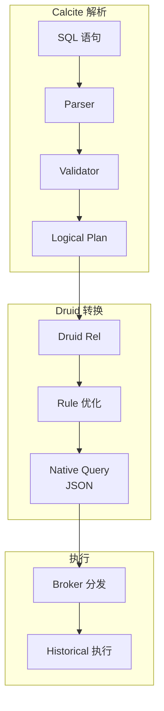
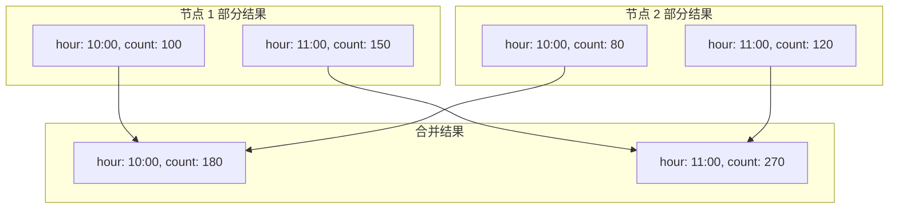
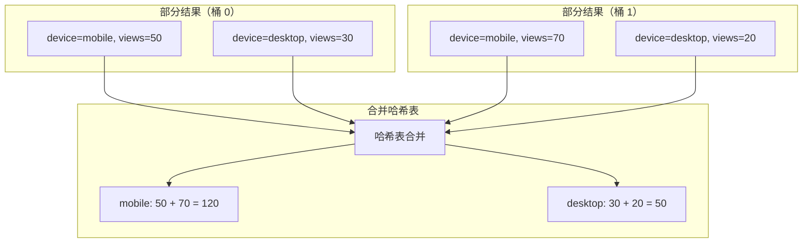
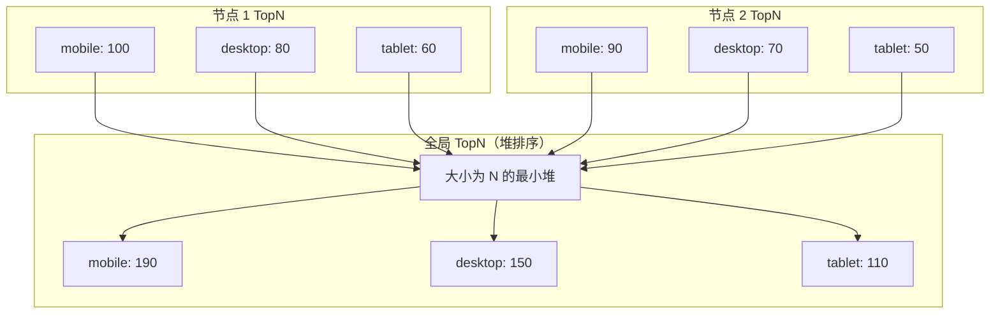
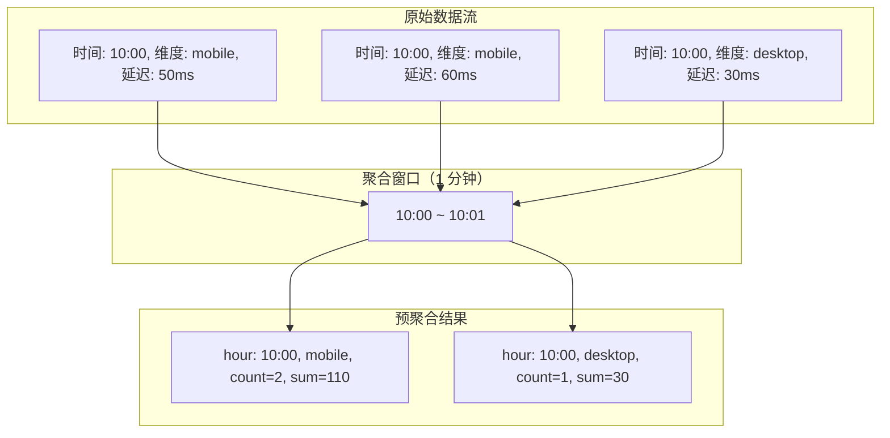
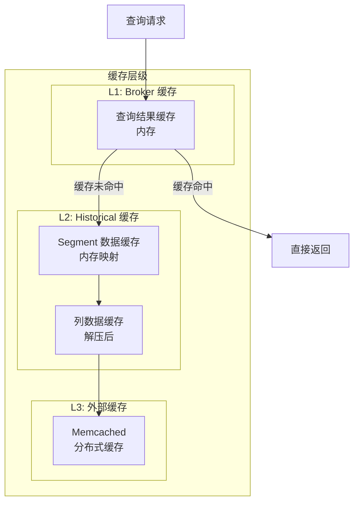
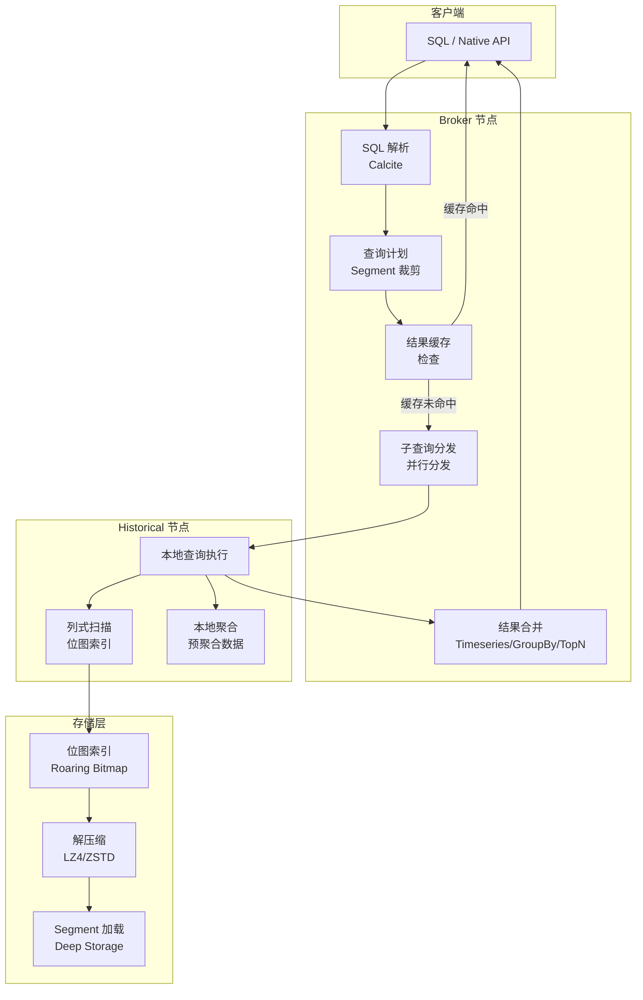

# Druid 查询执行引擎

## 学习目标

- 理解 Druid 的分布式查询执行流程
- 掌握 Broker 查询路由与结果合并机制
- 理解物化视图与预聚合的原理
- 分析与项目 algo/ 模块的关联与借鉴点

## 分布式查询架构

Druid 采用 Broker-Historical 架构，查询由 Broker 节点路由到多个 Historical 节点并行执行。

### 查询执行流程



### 查询引擎架构



## Broker 查询路由

Broker 是 Druid 查询的入口节点，负责解析、路由和合并。

### 查询生命周期



**Broker 的 Segment 裁剪流程**：

1. 根据查询的 `__time` 条件，筛选可能包含数据的 Segment
2. 根据维度条件，检查 Segment 的位图索引是否命中
3. 为每个命中的 Segment 生成子查询，分发到对应的 Historical 节点

### 查询类型与路由

| 查询类型 | 路由策略 | 合并方式 |
|---------|---------|----------|
| Timeseries | 时间序列聚合 | 按时间戳合并 |
| TopN | Top K 查询 | 堆排序合并 |
| GroupBy | 分组聚合 | 哈希聚合合并 |
| Scan | 数据扫描 | 行追加合并 |
| Search | 搜索查询 | 位图合并 |

## 查询执行模型

Druid 支持两种查询方式：原生 JSON API 和 SQL（基于 Calcite）。

### 原生查询示例

```json
{
  "queryType": "groupBy",
  "dataSource": "pageviews",
  "granularity": "hour",
  "dimensions": ["device"],
  "aggregations": [
    { "type": "count", "name": "views" },
    { "type": "doubleSum", "name": "total_latency", "fieldName": "latency" }
  ],
  "filter": {
    "type": "and",
    "fields": [
      {
        "type": "selector",
        "dimension": "country",
        "value": "CN"
      },
      {
        "type": "interval",
        "dimension": "__time",
        "intervals": ["2024-01-01T00:00:00.000Z/2024-01-02T00:00:00.000Z"]
      }
    ]
  },
  "limitSpec": {
    "type": "default",
    "limit": 100,
    "columns": [
      { "dimension": "total_latency", "direction": "descending" }
    ]
  }
}
```

### SQL 查询示例

Druid 使用 Apache Calcite 进行 SQL 解析，将 SQL 转换为原生查询：

```sql
SELECT
    TIME_FLOOR(__time, 'PT1H') AS hour,
    device,
    COUNT(*) AS views,
    SUM(latency) AS total_latency
FROM pageviews
WHERE country = 'CN'
  AND __time >= '2024-01-01'
  AND __time < '2024-01-02'
GROUP BY 1, 2
ORDER BY total_latency DESC
LIMIT 100;
```

**SQL 到原生查询的转换**：



## 结果合并机制

Druid 的查询结果合并采用分阶段策略。

### Timeseries 合并



### GroupBy 合并

GroupBy 合并采用分桶策略：



### TopN 合并

TopN 使用堆排序合并：



## 物化视图与预聚合

Druid 的预聚合是实时摄入的一部分，在数据摄入阶段完成部分聚合计算。

### 摄入时预聚合



### 预聚合配置

```json
{
  "dataSchema": {
    "dataSource": "pageviews",
    "timestampSpec": {
      "column": "timestamp",
      "format": "iso"
    },
    "dimensionsSpec": {
      "dimensions": ["page", "device", "country"]
    },
    "metricsSpec": [
      { "type": "count", "name": "views" },
      { "type": "doubleSum", "name": "latency", "fieldName": "latency_ms" },
      { "type": "doubleMin", "name": "min_latency", "fieldName": "latency_ms" },
      { "type": "doubleMax", "name": "max_latency", "fieldName": "latency_ms" }
    ],
    "granularitySpec": {
      "segmentGranularity": "day",
      "queryGranularity": "hour"
    }
  }
}
```

### 聚合函数类型

| 聚合函数 | 类型 | 说明 |
|---------|------|------|
| count | 内置 | 计数 |
| longSum/doubleSum | 内置 | 求和 |
| longMin/doubleMin | 内置 | 最小值 |
| longMax/doubleMax | 内置 | 最大值 |
| doubleFirst/doubleLast | 内置 | 首个/末个值 |
| cardinality | 内置 | 基数估计 |
| hyperUnique | 内置 | HyperLogLog 去重 |
| thetaSketch | 内置 | Theta Sketch 去重 |
| quantiles | 扩展 | 分位数估计 |

### 预聚合的优势

| 维度 | 无预聚合 | 有预聚合 |
|------|---------|----------|
| 存储量 | 1:1（原始数据） | 5:1 ~ 20:1 |
| 查询响应 | 秒级到分钟级 | 毫秒级到秒级 |
| 聚合计算 | 每次查询计算 | 摄入时已计算 |
| 数据量 | 原始行数 | 按时间窗口聚合后 |

### 聚合粒度配置

```json
{
  "granularitySpec": {
    "segmentGranularity": "day",
    "queryGranularity": "hour",
    "rollup": true
  }
}
```

- `segmentGranularity`: Segment 分区粒度（day/week/month）
- `queryGranularity`: 预聚合时间粒度（minute/hour/day）
- `rollup`: 是否开启预聚合（true/false）

## 缓存机制

Druid 使用多级缓存加速重复查询。

### 缓存层级



### 缓存策略

| 缓存类型 | 存储内容 | 过期策略 | 命中率 |
|---------|---------|----------|--------|
| Broker 结果缓存 | 查询最终结果 | 时间过期 | 高（重复查询） |
| Historical 数据缓存 | Segment 列数据 | Segment 生命周期 | 中（热点数据） |
| 外部 Memcached | 查询结果片段 | LRU | 高（分布式） |

## 与项目 algo/ 模块的关联

### 项目聚合实现现状

项目在 `engineering/include/db/core/agg.h` 中实现了基础聚合框架：

```c
// 项目聚合函数接口
typedef struct AggFunc_s {
    int (*init)(AggState *state);
    int (*process)(AggState *state, const void *values, size_t n);
    int (*finalize)(AggState *state, void *result);
} AggFunc;

// 现有聚合函数
AggFunc agg_count;       // 计数
AggFunc agg_sum;         // 求和
AggFunc agg_avg;         // 平均
AggFunc agg_min;         // 最小值
AggFunc agg_max;         // 最大值
```

### 可扩展的聚合算子

借鉴 Druid 的预聚合设计，项目可扩展以下能力：

```c
// 建议新增：engineering/include/db/core/pre_agg.h

// 预聚合时间窗口
typedef struct {
    int64_t window_start;       // 窗口起始时间戳
    int64_t window_end;         // 窗口结束时间戳
    size_t num_dimensions;      // 维度数量
    char **dimension_values;    // 维度值
    double sum_value;           // 预聚合和
    uint64_t count_value;       // 预聚合计数
    double min_value;           // 预聚合最小值
    double max_value;           // 预聚合最大值
} PreAggWindow;

// 预聚合结果写入
int pre_agg_write(const char *table_name, PreAggWindow *window);
```

### 项目 Broker 实现现状

项目在 Phase 9 中实现了分布式协调器和查询路由：

```c
// 项目查询路由接口（engineering/include/db/dist/coordinator.h）
typedef struct Coordinator_s {
    void (*register_node)(NodeInfo *node);
    void (*route_query)(const char *query, NodeInfo **targets, size_t *n);
    void (*merge_results)(void **partials, size_t n, void *final);
} Coordinator;
```

**借鉴 Druid 的扩展点**：

1. **Segment 裁剪**：项目可扩展 Segment 元数据查询，实现类似 Druid 的 Segment 裁剪

```c
// 建议新增：engineering/include/db/core/segment_prune.h

typedef struct {
    int64_t interval_start;     // Segment 时间范围起点
    int64_t interval_end;       // Segment 时间范围终点
    size_t num_rows;            // Segment 行数
    uint8_t *min_max_index;     // MinMax 索引
} SegmentMeta;

// Segment 裁剪：根据查询条件跳过无关 Segment
int segment_prune_filter(SegmentMeta *segments, size_t n,
                          int64_t query_start, int64_t query_end,
                          size_t *pruned_indices, size_t *num_pruned);
```

2. **结果合并**：项目可扩展两阶段合并，支持 Timeseries/TopN/GroupBy 等合并策略

```c
// 建议新增：engineering/include/db/core/result_merge.h

typedef enum {
    MERGE_TIMESERIES,   // 时间序列合并（按时间戳聚合）
    MERGE_TOPN,         // TopN 合并（堆排序）
    MERGE_GROUPBY,      // GroupBy 合并（哈希聚合）
    MERGE_SCAN          // Scan 合并（行追加）
} MergeStrategy;

typedef struct {
    MergeStrategy strategy;
    void (*merge_partial)(void *partials, size_t n, void *result);
    void (*sort_result)(void *result, size_t limit);
} ResultMerger;
```

3. **缓存系统**：项目可引入 Broker 级别的结果缓存和 Segment 级别的数据缓存

```c
// 建议新增：engineering/include/db/core/query_cache.h

typedef struct {
    uint8_t *cache_data;        // 缓存数据
    size_t cache_size;          // 缓存大小
    int64_t expire_time;        // 过期时间
    uint32_t query_hash;        // 查询哈希（用于查找）
} QueryCacheEntry;

// 缓存操作
QueryCacheEntry *query_cache_get(uint32_t query_hash);
void query_cache_put(uint32_t query_hash, const void *data, size_t size);
void query_cache_invalidate(const char *table_name);
```

## 查询执行流程图



## 要点总结

1. **分布式查询**：Broker 负责路由和合并，Historical 节点负责本地执行
2. **Segment 裁剪**：按时间范围和位图索引跳过无关 Segment
3. **结果合并**：Timeseries 按时间合并，GroupBy 哈希合并，TopN 堆排序合并
4. **SQL 支持**：基于 Apache Calcite，将 SQL 转换为原生 JSON 查询
5. **预聚合**：摄入时按时间窗口聚合，减少存储量和查询计算量
6. **多级缓存**：Broker 结果缓存 + Historical 数据缓存 + 外部 Memcached
7. **项目关联**：项目已有聚合框架和分布式协调器，可扩展 Segment 裁剪、结果合并和缓存系统

## 思考题

1. Druid 的 Broker 在查询合并时，为什么对 GroupBy 使用哈希合并而对 TopN 使用堆排序？
2. 预聚合的 rollup 机制在什么场景下会导致数据精度损失？如何处理？
3. Broker 的 Segment 裁剪能否做到精确裁剪？如果 Segment 的位图索引过期了怎么办？
4. Druid 的查询缓存失效策略是什么？在实时数据不断写入的情况下如何保证缓存一致性？
5. 项目的 `Coordinator` 接口如何扩展以支持类似 Druid 的 Segment 裁剪和结果合并？
6. 如果项目要引入预聚合机制，应该如何设计摄入时的聚合窗口？