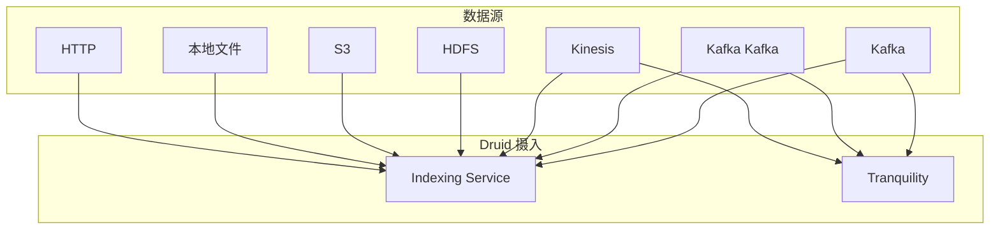
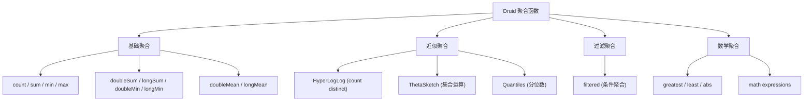
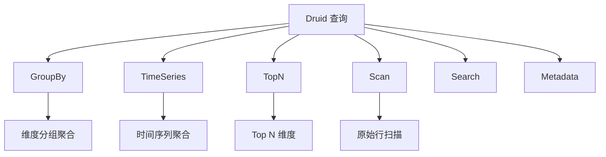
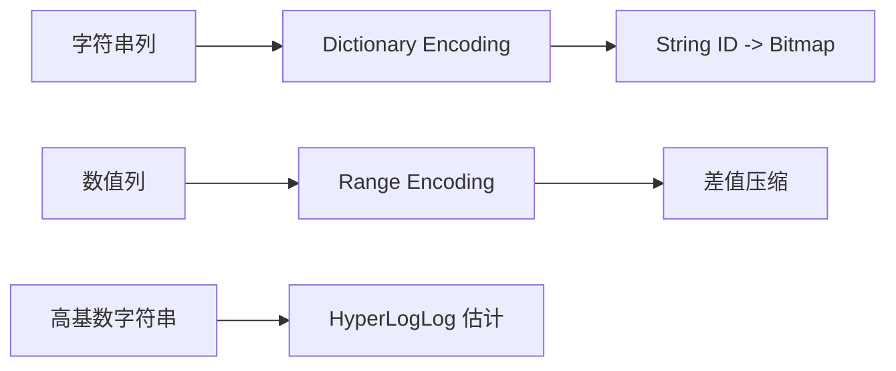

# Apache Druid 核心特性

## 学习目标

- 掌握 Druid 的多数据源摄入能力
- 理解 Druid 的聚合函数和查询类型
- 了解 Bitmap 索引和近似算法

## 多数据源支持

Druid 支持多种数据源的实时和批量摄入。



### Kafka 摄入

```json
// kafka supervisor 配置
{
  "type": "kafka",
  "spec": {
    "ioConfig": {
      "type": "kafka",
      "consumerProperties": {
        "bootstrap.servers": "kafka:9092"
      },
      "topic": "events",
      "inputFormat": {
        "type": "json"
      },
      "taskCount": 2,
      "replicas": 1,
      "taskDuration": "PT1H"
    },
    "tuningConfig": {
      "type": "kafka",
      "maxRowsInMemory": 1000000
    },
    "dataSchema": {
      "dataSource": "events",
      "timestampSpec": { "column": "ts" },
      "dimensionsSpec": {
        "dimensions": ["user_id", "event_type", "country"]
      },
      "metricsSpec": [
        { "type": "count", "name": "count" },
        { "type": "doubleSum", "name": "value", "fieldName": "value" }
      ]
    }
  }
}
```

### HDFS 批量摄入

```json
// HDFS 摄入任务
{
  "type": "index_hadoop",
  "spec": {
    "ioConfig": {
      "type": "hadoop",
      "inputSpec": {
        "type": "static",
        "paths": "hdfs://namenode/data/events/*.json"
      }
    },
    "tuningConfig": {
      "type": "hadoop",
      "partitionDimensions": ["country", "event_type"]
    },
    "dataSchema": {
      "dataSource": "events",
      "timestampSpec": { "column": "ts" },
      "dimensionsSpec": { "dimensions": ["user_id", "event_type"] },
      "metricsSpec": [{ "type": "count", "name": "count" }]
    }
  }
}
```

## 聚合函数

Druid 提供丰富的聚合函数，覆盖常见分析场景。



### 基础聚合

```sql
-- 计数
SELECT
    __time,
    COUNT(*) AS total,
    COUNT(DISTINCT user_id) AS unique_users
FROM events
WHERE __time >= '2024-01-01' AND __time < '2024-01-02'
GROUP BY __time
LIMIT 10;

-- 数值聚合
SELECT
    country,
    SUM(latency_ms) AS total_latency,
    MIN(latency_ms) AS min_latency,
    MAX(latency_ms) AS max_latency,
    AVG(latency_ms) AS avg_latency
FROM pageviews
WHERE __time >= '2024-01-01'
GROUP BY country;
```

### 近似聚合（大数据集）

```sql
-- HyperLogLog 去重（内存效率高）
SELECT
    country,
    HLL(player_id) AS user_sketch
FROM events
WHERE __time >= '2024-01-01'
GROUP BY country;

-- 查询时使用 HLL 结果
SELECT
    country,
    APPROX_COUNT_DISTINCT_DS_HLL(user_sketch) AS approx_users
FROM (
    SELECT country, HLLEstimate(build(HLL(user_id))) AS user_sketch
    FROM events
    GROUP BY country
) subquery;

-- ThetaSketch 集合运算
SELECT
    setOperation,  -- 'UNION', 'INTERSECT', 'DIFFERENCE'
    estimate(thetasetch) AS result
FROM (
    SELECT 'UNION' AS setOperation, THETA_SKETCH_UNION(10) AS thetasetch
    FROM events
    WHERE event_type IN ('type_a', 'type_b')
) subquery;
```

### 过滤聚合

```sql
-- 带过滤条件的聚合
SELECT
    COUNT(*) AS total,
    SUM(COUNT(*) FILTER (WHERE country = 'CN')) AS cn_count,
    SUM(COUNT(*) FILTER (WHERE device = 'mobile')) AS mobile_count,
    SUM(COUNT(*) FILTER (WHERE country = 'CN' AND device = 'mobile')) AS cn_mobile
FROM events
GROUP BY __time;

-- 使用 filtered 聚合器
SELECT
    country,
    SUM("value") AS total_value,
    FILTER(SUM("value"), "country" = 'CN') AS cn_value
FROM events
GROUP BY country;
```

## 查询类型

Druid 支持多种查询类型，覆盖 OLAP 常见场景。



### GroupBy 查询

```json
// GroupBy 查询
{
  "queryType": "groupBy",
  "dataSource": "events",
  "intervals": ["2024-01-01/2024-01-02"],
  "granularity": "hour",
  "dimensions": ["country", "device"],
  "aggregations": [
    { "type": "count", "name": "events" },
    { "type": "doubleSum", "fieldName": "latency", "name": "total_latency" }
  ],
  "having": {
    "type": "greaterThan",
    "aggregation": "events",
    "value": 100
  },
  "limitSpec": {
    "type": "default",
    "limit": 100,
    "columns": [{ "dimension": "events", "direction": "desc" }]
  }
}
```

### TimeSeries 查询

```json
// 时间序列查询
{
  "queryType": "timeseries",
  "dataSource": "events",
  "intervals": ["2024-01-01/2024-01-02"],
  "granularity": "hour",
  "aggregations": [
    { "type": "count", "name": "events" },
    { "type": "doubleSum", "fieldName": "latency", "name": "total" }
  ],
  "postAggregations": [
    {
      "type": "arithmetic",
      "name": "avg_latency",
      "fn": "/",
      "fields": [
        { "type": "fieldAccess", "fieldName": "total" },
        { "type": "fieldAccess", "fieldName": "events" }
      ]
    }
  ],
  "descending": "false"
}
```

### TopN 查询

```json
// TopN 查询（适合大基数维度）
{
  "queryType": "topN",
  "dataSource": "events",
  "intervals": ["2024-01-01/2024-01-02"],
  "granularity": "all",
  "dimension": "user_id",
  "threshold": 10,
  "metric": "total_value",
  "aggregations": [
    { "type": "doubleSum", "fieldName": "value", "name": "total_value" }
  ]
}
```

### Scan 查询

```json
// Scan 查询（返回原始行）
{
  "queryType": "scan",
  "dataSource": "events",
  "intervals": ["2024-01-01/2024-01-02"],
  "columns": ["user_id", "event_type", "timestamp"],
  "limit": 1000,
  "order": "timestamp"
}
```

## 数据压缩与 Bitmap 索引

### 列压缩

Druid 对不同类型的数据采用不同的压缩策略：



### Bitmap 索引

```cpp
// Roaring Bitmap 实现

// Container 类型选择策略
if (cardinality < 4096) {
    // Array Container: 低基数，高压缩
    container = new ArrayContainer(bitset);
} else if (cardinality > 65536 * 0.5) {
    // Bitmap Container: 高基数，快速位运算
    container = new BitmapContainer(bitset);
} else {
    // Run-Length Encoding: 连续值
    container = new RunContainer(bitset);
}

// 位运算示例
RoaringBitmap result = bitmap1 AND bitmap2;  // 交集
RoaringBitmap union = bitmap1 OR bitmap2;     // 并集
RoaringBitmap diff = bitmap1 AND NOT bitmap2; // 差集
```

### 查询执行

```sql
-- 复杂过滤查询
SELECT
    page,
    SUM(latency) AS total,
    COUNT(*) AS views
FROM pageviews
WHERE
    country IN ('CN', 'US', 'JP')           -- OR 过滤
    AND device = 'mobile'                    -- AND 过滤
    AND __time >= '2024-01-01 08:00:00'
    AND __time < '2024-01-02 08:00:00'
GROUP BY page
LIMIT 100;

-- 执行流程
-- 1. country IN ('CN', 'US', 'JP') -> Bitmap_CN OR Bitmap_US OR Bitmap_JP
-- 2. device = 'mobile' -> Bitmap_MOBILE
-- 3. Bitmap_CN_U_JP AND Bitmap_MOBILE -> Bitmap_FILTERED
-- 4. 时间范围过滤 -> 扫描满足条件的行
-- 5. GROUP BY page -> 聚合计算
```

## 多维分析

Druid 的列式存储天然适合多维分析场景。

```sql
-- 多维度切片分析
SELECT
    country,
    device,
    browser,
    COUNT(*) AS views,
    AVG(latency) AS avg_latency
FROM events
WHERE __time >= '2024-01-01'
GROUP BY CUBE(country, device, browser)
ORDER BY country, device, browser;

-- ROLLUP 聚合
SELECT
    country,
    device,
    time,
    SUM(views) AS total_views
FROM events
GROUP BY ROLLUP(country, device, time);

-- 嵌套 GROUP BY
WITH base AS (
    SELECT
        dateTrunc('hour', __time) AS hour,
        country,
        device,
        COUNT(*) AS views
    FROM events
    WHERE __time >= '2024-01-01'
    GROUP BY 1, 2, 3
)
SELECT
    hour,
    country,
    SUM(views) AS total_views
FROM base
GROUP BY hour, country
ORDER BY hour;
```

## 要点总结

1. **多数据源**：支持 Kafka/HDFS/S3/本地文件等多种摄入方式
2. **聚合函数**：基础聚合、近似聚合（HyperLogLog）、过滤聚合
3. **查询类型**：GroupBy/TimeSeries/TopN/Scan 覆盖 OLAP 场景
4. **Bitmap 索引**：Roaring Bitmap 高效压缩，支持位运算
5. **列压缩**：Dictionary/Range/Run-Length 多种编码
6. **多维分析**：支持 CUBE/ROLLUP 等多维聚合操作

## 思考题

1. Druid 的 GroupBy 和 TopN 查询分别在什么场景下更优？
2. HyperLogLog 的误差率与内存占用的关系是什么？
3. 为什么 Druid 的 Segment 存储需要预定义聚合器（aggregators）？
4. 在高并发查询场景下，Broker 节点如何缓存和路由查询？
