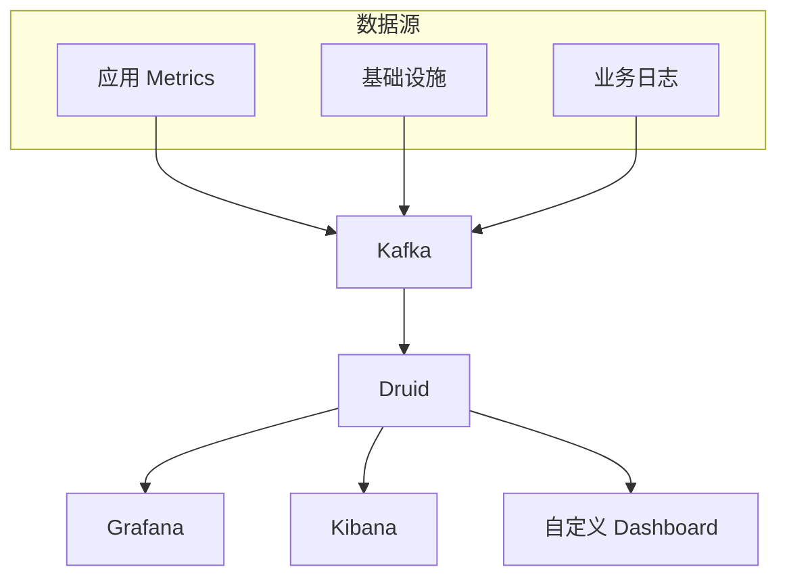
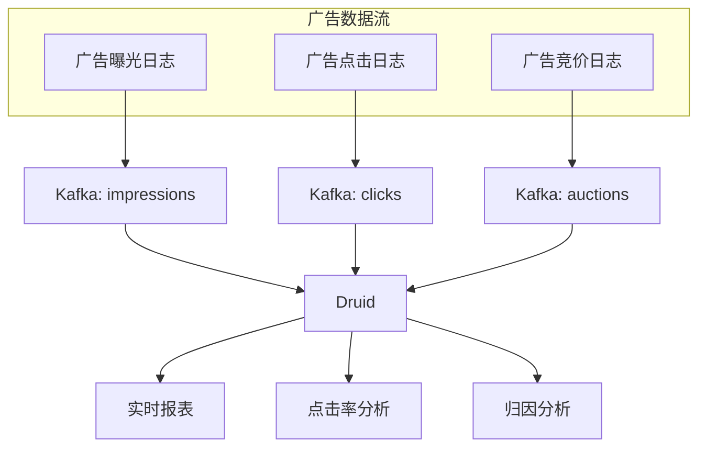
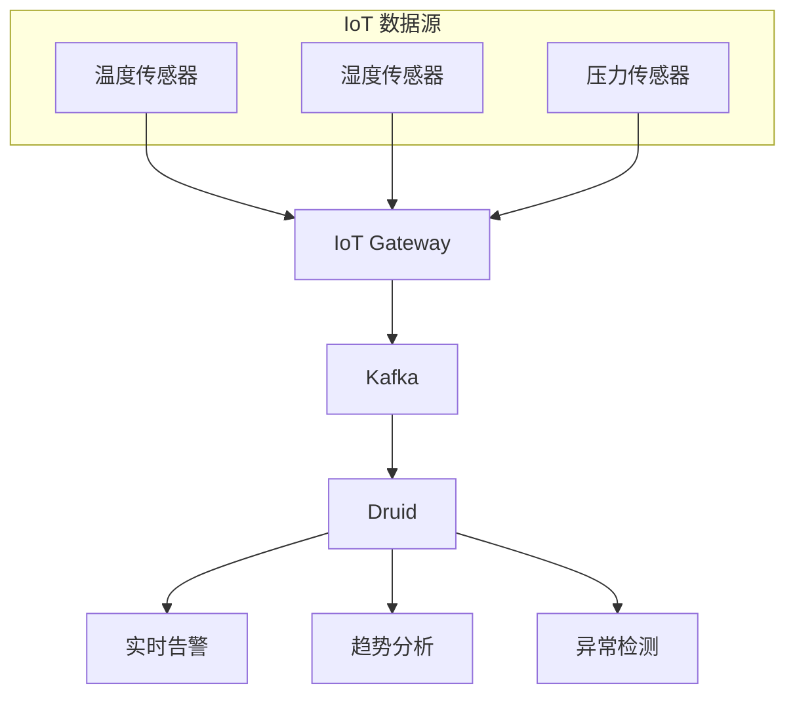
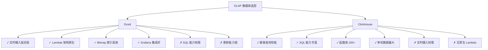
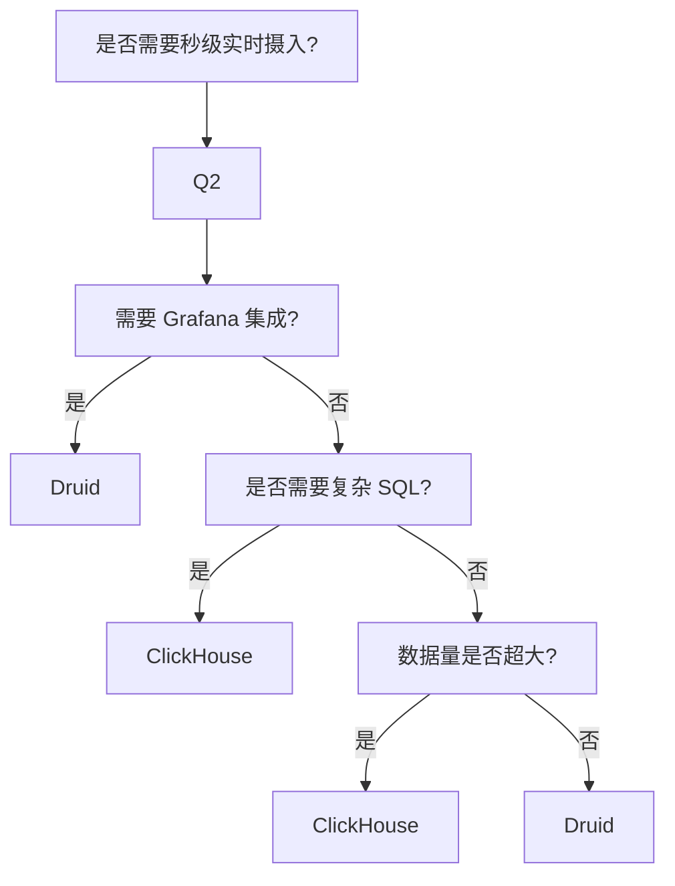

# Apache Druid 典型应用场景

## 学习目标

- 了解 Druid 在实时监控和 IoT 场景中的应用
- 掌握 Druid 与 ClickHouse/StarRocks 的对比选型
- 理解 Druid 的优势场景

## 实时监控面板

Druid 是实时监控看板的理想选择，特别适合 Grafana 集成。



### Grafana 集成

```json
// Grafana Druid 数据源配置
{
  "name": "Druid",
  "type": "druid",
  "url": "http://druid-broker:8082/druid/v2/sql",
  "jsonData": {
    "httpTimeout": "30s",
    "queryTimeout": "120s"
  }
}

// Grafana Panel 查询
{
  "query": {
    "queryType": "groupBy",
    "dataSource": "metrics",
    "intervals": ["$from/$to"],
    "granularity": "auto",
    "dimensions": ["service", "status"],
    "aggregations": [
      { "type": "count", "name": "count" }
    ]
  }
}
```

### 监控指标表设计

```sql
-- Druid 表定义
CREATE TABLE metrics (
    __time TIMESTAMP,
    service STRING,
    host STRING,
    status STRING,
    metric_name STRING,
    metric_value DOUBLE
) PARTITIONED BY DAY;
```

### 监控场景查询

```sql
-- 1. 服务 QPS 监控
SELECT
    FLOOR(__time TO MINUTE) AS minute,
    service,
    COUNT(*) AS qps,
    AVG(metric_value) AS avg_response_time
FROM metrics
WHERE metric_name = 'request_latency'
  AND __time >= NOW() - INTERVAL '1' HOUR
GROUP BY 1, 2
ORDER BY 1;

-- 2. 错误率监控
SELECT
    FLOOR(__time TO MINUTE) AS minute,
    SUM(COUNT(*) FILTER (WHERE status >= 500)) * 100.0 / SUM(COUNT(*)) AS error_rate
FROM metrics
WHERE __time >= NOW() - INTERVAL '15' MINUTE
GROUP BY 1
ORDER BY 1;

-- 3. Top 10 慢查询
SELECT
    service,
    AVG(metric_value) AS p99_latency
FROM metrics
WHERE metric_name = 'query_latency'
  AND __time >= NOW() - INTERVAL '5' MINUTE
GROUP BY service
ORDER BY p99_latency DESC
LIMIT 10;
```

## 广告分析

Druid 的实时分析能力非常适合广告点击流分析。



### 广告分析表

```sql
-- 广告曝光表
CREATE TABLE ad_impressions (
    __time TIMESTAMP,
    ad_id STRING,
    campaign_id STRING,
    advertiser_id STRING,
    publisher_id STRING,
    country STRING,
    device STRING,
    bid_amount DOUBLE,
    win_price DOUBLE
) PARTITIONED BY DAY;
```

### 广告分析查询

```sql
-- 1. 实时 CTR（点击率）分析
SELECT
    FLOOR(__time TO HOUR) AS hour,
    campaign_id,
    COUNT(*) AS impressions,
    SUM(COUNT(*) FILTER (WHERE event_type = 'click')) AS clicks,
    SUM(COUNT(*) FILTER (WHERE event_type = 'click')) * 100.0 / COUNT(*) AS ctr
FROM ad_events
WHERE __time >= NOW() - INTERVAL '24' HOUR
GROUP BY 1, 2
ORDER BY 1;

-- 2. 广告主维度分析
SELECT
    advertiser_id,
    campaign_id,
    COUNT(*) AS impressions,
    COUNT(DISTINCT user_id) AS unique_users,
    SUM(spend) AS total_spend,
    SUM(spend) / COUNT(*) AS cpm
FROM ad_impressions
WHERE __time >= NOW() - INTERVAL '7' DAYS
GROUP BY advertiser_id, campaign_id
ORDER BY total_spend DESC
LIMIT 20;

-- 3. 归因分析（点击到转化）
WITH clicks AS (
    SELECT
        user_id,
        ad_id,
        __time AS click_time,
        campaign_id
    FROM ad_events
    WHERE event_type = 'click'
      AND __time >= NOW() - INTERVAL '7' DAYS
),
conversions AS (
    SELECT
        user_id,
        campaign_id,
        __time AS conversion_time
    FROM ad_events
    WHERE event_type = 'conversion'
      AND __time >= NOW() - INTERVAL '7' DAYS
)
SELECT
    clicks.campaign_id,
    COUNT(DISTINCT clicks.user_id) AS clicks,
    COUNT(DISTINCT conversions.user_id) AS conversions,
    COUNT(DISTINCT conversions.user_id) * 100.0 / COUNT(DISTINCT clicks.user_id) AS cvr
FROM clicks
LEFT JOIN conversions
    ON clicks.user_id = conversions.user_id
    AND conversions.conversion_time <= clicks.click_time + INTERVAL '7' DAY
GROUP BY clicks.campaign_id
ORDER BY cvr DESC;
```

## IoT 时序数据

Druid 的时间序列能力适合 IoT 传感器数据分析。



### IoT 表设计

```sql
-- IoT 传感器数据表
CREATE TABLE iot_sensors (
    __time TIMESTAMP,
    device_id STRING,
    sensor_type STRING,
    location STRING,
    temperature DOUBLE,
    humidity DOUBLE,
    pressure DOUBLE,
    battery_level DOUBLE
) PARTITIONED BY DAY;
```

### IoT 分析查询

```sql
-- 1. 设备告警（温度超阈值）
SELECT
    device_id,
    location,
    MAX(temperature) AS max_temp,
    FLOOR(MAX(__time) TO MINUTE) AS alert_time
FROM iot_sensors
WHERE sensor_type = 'temperature'
  AND temperature > 80
  AND __time >= NOW() - INTERVAL '1' HOUR
GROUP BY device_id, location
ORDER BY max_temp DESC;

-- 2. 设备健康状态
SELECT
    device_id,
    AVG(battery_level) AS avg_battery,
    MIN(battery_level) AS min_battery,
    COUNT(*) AS readings,
    FLOOR(MIN(__time) TO HOUR) AS last_report
FROM iot_sensors
WHERE __time >= NOW() - INTERVAL '24' HOURS
GROUP BY device_id
HAVING AVG(battery_level) < 20
ORDER BY avg_battery;

-- 3. 传感器数据趋势
SELECT
    FLOOR(__time TO 15 MINUTE) AS bucket,
    AVG(temperature) AS avg_temp,
    MIN(temperature) AS min_temp,
    MAX(temperature) AS max_temp,
    STDDEV(temperature) AS std_temp
FROM iot_sensors
WHERE device_id = 'sensor_001'
  AND __time >= NOW() - INTERVAL '24' HOURS
GROUP BY bucket
ORDER BY bucket;
```

## Druid vs ClickHouse

两种数据库各有优势，选择取决于具体场景。



### 详细对比

| 维度 | Druid | ClickHouse |
|------|-------|-----------|
| **实时摄入延迟** | < 1 秒（原生 Kafka） | 秒级（表函数/物化视图） |
| **Lambda 架构** | 原生支持 | 需自行实现 |
| **查询性能** | 快 | 极快 |
| **SQL 能力** | 有限（GroupBy/TimeSeries） | 丰富（200+ 函数） |
| **更新能力** | 不支持 | ReplacingMergeTree |
| **副本机制** | ZooKeeper | ZooKeeper |
| **生态集成** | Grafana 原生 | 需适配 |
| **适用场景** | 监控、指标分析 | 日志分析、Ad-hoc |

### 选型决策树



## 场景选型建议

| 场景 | 推荐 | 原因 |
|------|------|------|
| 实时监控看板 | Druid | Grafana 原生集成、实时摄入快 |
| 指标分析 | Druid | Lambda 架构、Bitmap 索引 |
| 广告点击流 | ClickHouse | 漏斗分析、采样查询 |
| 日志分析 | ClickHouse | 高吞吐、丰富聚合函数 |
| IoT 时序数据 | Druid | 时间序列原生支持 |
| 用户行为分析 | ClickHouse | 高基数去重、物化视图 |
| 即席查询 | ClickHouse | SQL 能力丰富 |

## 要点总结

1. **实时监控**：Grafana 集成 + Kafka 实时摄入 + 秒级延迟
2. **广告分析**：CTR/CVR 分析 + 归因计算 + 多维度切片
3. **IoT 数据**：时序聚合 + 告警检测 + 趋势分析
4. **选型要点**：实时性优先选 Druid，SQL 能力优先选 ClickHouse
5. **Druid 优势**：实时摄入、Lambda 架构、Grafana 集成
6. **Druid 劣势**：SQL 能力有限、更新能力弱

## 思考题

1. Druid 的实时摄入延迟主要受哪些因素影响？
2. 在什么场景下 Druid 的 Bitmap 索引比 ClickHouse 的稀疏索引更有效？
3. 如何在 Druid 中实现 ClickHouse 的 SAMPLE BY 采样查询功能？
4. Lambda 架构中实时层和历史层的数据边界如何确定？
