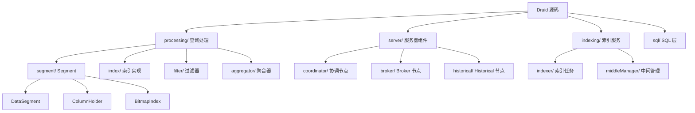
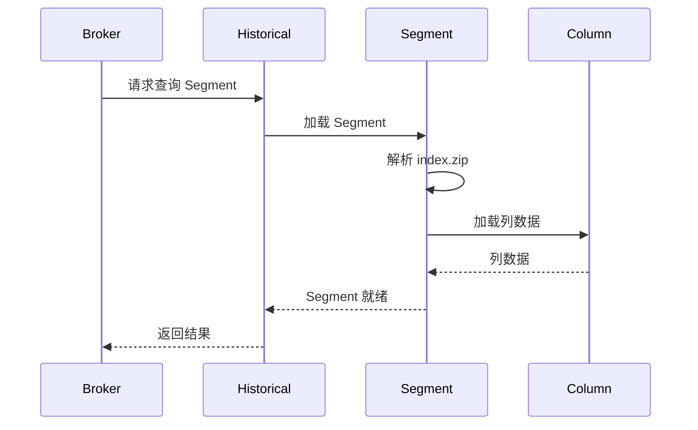

# Apache Druid 源码阅读指南

## 学习目标

- 掌握 Druid 源码的目录结构和核心模块
- 理解 Segment 结构和 IncrementalIndex 实现
- 了解 Roaring Bitmap 索引的实现细节

## 源码结构概览



### 核心模块

| 模块 | 路径 | 说明 |
|------|------|------|
| `processing/segment` | 查询段核心 | DataSegment, ColumnHolder, Cursor |
| `processing/index` | 内存索引 | IncrementalIndex, BitmapIndex |
| `processing/aggregator` | 聚合器 | Count, Sum, HyperLogLog 等 |
| `processing/filter` | 过滤器 | Selector, Range, Bound 等 |

## 核心文件详解

### DataSegment

```java
// processing/src/main/java/org/apache/druid/segment/DataSegment.java

public class DataSegment implements Sized {
    // 分区标识
    private final DataSegmentPlus dataSource;           // 数据源名称
    private final Interval interval;                     // 时间区间
    private final Version version;                       // 版本号
    private final ShardSpec shardSpec;                  // 分片规范

    // 数据位置
    private final LoadSpec loadSpec;                    // 加载规范（S3/HDFS/本地）
    private final SizeOf sizeOf;                        // 大小

    // 元数据
    private final Map<String, ColumnHolder> columns;    // 列信息
    private final Map<String, AggregatorFactory> aggregators;  // 聚合器

    // 加载 Segment
    public Segment getSegment(final SegmentConfig config) {
        return loadSpec.load(this, config);
    }
}
```

### Segment 加载流程



### IncrementalIndex

```java
// processing/src/main/java/org/apache/druid/segment/IndexMerger.java

// 内存中的增量索引
public class IncrementalIndex implements Closeable {
    // 时间列
    private final TimeAndDims key;

    // 聚合器
    private final Aggregator[] aggregators;

    // 行数据
    private final List<RowAdapter<TimeAndDims>> adapters;

    // 添加行
    public void add(uint64_t timestamp, Map<String, Object> row) {
        TimeAndDims key = new TimeAndDims(timestamp, dimensions);
        IncrementalIndexRow incrementalRow = new IncrementalIndexRow(key, aggregators);
        // 内存聚合
    }

    // 获取 Cursor
    public CursorHolder getCursor() {
        return new CursorHolder(buildColumns());
    }
}
```

### Roaring Bitmap 索引

```java
// processing/src/main/java/org/apache/druid/query/misc/EncodedBitmap.java

// Druid 的 Bitmap 接口
public interface BitmapIndex {
    // 获取指定值的 Bitmap
    Bitmap getBitmap(int valueIndex);

    // 获取基数
    int getCardinality();
}

// Roaring Bitmap 实现
public class RoaringBitmapIndex implements BitmapIndex {
    // Container 数组
    private RoaringBitmap[] bitmaps;

    // 字典编码
    private String[] dictionary;

    // 获取值的 Bitmap
    @Override
    public Bitmap getBitmap(int valueIndex) {
        return bitmaps[valueIndex];
    }

    // 获取值的 Bitmap（按字符串）
    public Bitmap getBitmap(String value) {
        int index = binarySearch(dictionary, value);
        return index >= 0 ? bitmaps[index] : EMPTY;
    }
}
```

### Container 类型

```java
// 内部实现细节

// Container 类型选择
public class ContainerBuilder {
    public Container build(int[] values) {
        // 1. Array Container（低基数）
        if (values.length < ARRAY_THRESHOLD) {
            return new ArrayContainer(values);
        }
        // 2. Bitmap Container（高基数）
        else if (values.length > BITMAP_THRESHOLD) {
            return new BitmapContainer(values);
        }
        // 3. Run-Length Encoding（连续值）
        else if (isRunLengthEncoded(values)) {
            return new RunContainer(values);
        }
    }
}

// Array Container
class ArrayContainer implements Container {
    short[] values;  // 存储值列表
}

// Bitmap Container
class BitmapContainer implements Container {
    long[] words;   // 65536 bits = 1024 longs
}

// Run Container
class RunContainer implements Container {
    short[] valuesLengths;  // 游程编码 [start, length, start, length, ...]
}
```

### 聚合器实现

```java
// processing/src/main/java/org/apache/druid/query/groupby/GroupByQuery.java

// 聚合器基类
public interface AggregatorFactory {
    Aggregator factorize(ColumnSelectorFactory factory);
    BufferAggregator factorizeBuffered(ColumnSelectorFactory factory);
}

// Count 聚合器
public class CountAggregator implements Aggregator {
    long count;

    @Override
    public void aggregate() {
        count++;
    }

    @Override
    public Object get() {
        return count;
    }
}

// Sum 聚合器
public class LongSumAggregator implements Aggregator {
    long sum;
    LongColumnSelector selector;

    @Override
    public void aggregate() {
        sum += selector.get().longValue();
    }
}
```

### HyperLogLog 聚合器

```java
// processing/src/main/java/org/apache/druid/query/aggregation/hll/HyperLogLogCollector.java

public class HyperLogLogCollector {
    // HyperLogLog 寄存器
    private final byte[] registers;

    // 添加值
    public void addLong(long value) {
        // 1. 计算哈希
        long hash = Murmur3.hash64(value);

        // 2. 取低 12 位作为桶索引
        int bucket = (int) (hash & 0xFFF);

        // 3. 取剩余位计算前导零
        int zeros = Long.numberOfLeadingZeros(hash >>> 12);

        // 4. 更新寄存器
        registers[bucket] = Math.max(registers[bucket], (byte) zeros);
    }

    // 基数估计
    public double estimateCardinality() {
        double sum = 0;
        for (byte b : registers) {
            sum += 1.0 / (1 << b);
        }
        double m = registers.length;
        return m * m / sum;
    }
}
```

## 源码阅读路径

### 路径 1: Segment 加载

```
processing/src/main/java/org/apache/druid/segment/
├── DataSegment.java           # Segment 标识和加载入口
├── Segment.java              # Segment 接口
├── segment/                  # Segment 实现
│   ├── QueryableIndexSegment.java
│   ├── IncrementalIndexSegment.java
│   └── CachedLayout.java
├── column/                   # 列实现
│   ├── StringColumn.java
│   ├── LongColumn.java
│   └── DoubleColumn.java
└── Cursor.java              # 数据游标
```

### 路径 2: Bitmap 索引

```
processing/src/main/java/org/apache/druid/query/
├── BitmapFactory.java        # Bitmap 工厂
├── misc/
│   └── EncodedBitmap.java    # Bitmap 接口
│   └── RoaringBitmapIndex.java  # Roaring Bitmap 实现
└── filter/
    └── BitmapIndexSelector.java  # Bitmap 选择器
```

### 路径 3: 聚合器

```
processing/src/main/java/org/apache/druid/query/groupby/
├── GroupByQuery.java         # GroupBy 查询定义
├── GroupByQueryEngine.java   # GroupBy 执行引擎
└── GroupByRowProcessor.java  # 行处理

processing/src/main/java/org/apache/druid/query/aggregation/
├── Aggregator.java           # 聚合器接口
├── AggregatorFactory.java    # 聚合器工厂
├── count/
│   └── CountAggregator.java
├── sum/
│   ├── LongSumAggregator.java
│   └── DoubleSumAggregator.java
└── hll/
    ├── HyperLogLogCollector.java
    └── HyperLogLogBuildAggregator.java
```

### 路径 4: 查询执行

```
processing/src/main/java/org/apache/druid/query/
├── Query.java                # 查询基类
├── QueryRunner.java          # 查询运行器
├── QueryToolChest.java       # 查询工具
└── QueryRunnerFactory.java  # 查询工厂

server/src/main/java/org/apache/druid/server/
├── QueryResource.java        # HTTP 查询接口
├── QueryScheduler.java      # 查询调度
└── ClientQuerySegmentWalker.java  # 客户端遍历器
```

## 关键文件速查表

| 文件 | 说明 |
|------|------|
| `DataSegment.java` | Segment 标识、加载入口 |
| `IncrementalIndex.java` | 内存增量索引 |
| `RoaringBitmapIndex.java` | Roaring Bitmap 实现 |
| `HyperLogLogCollector.java` | HyperLogLog 近似计数 |
| `GroupByQueryEngine.java` | GroupBy 执行引擎 |
| `BrokerQueryResource.java` | Broker 查询入口 |

## 推荐的阅读顺序

1. **DataSegment**：`processing/segment/DataSegment.java` - 理解 Segment 结构和加载
2. **BitmapIndex**：`RoaringBitmapIndex.java` - 理解 Bitmap 索引实现
3. **Aggregator**：`Aggregator.java` / `HyperLogLogCollector.java` - 理解聚合器
4. **Query Execution**：`GroupByQueryEngine.java` - 理解查询执行流程
5. **Server Components**：`BrokerQueryResource.java` - 理解节点间协作

## 外部资源

- 官方文档: https://druid.apache.org/docs/latest/
- GitHub: https://github.com/apache/druid
- 设计论文: https://arxiv.org/abs/1401.2946
- RoaringBitmap: https://roaringbitmap.org/

## 要点总结

1. **DataSegment**：Segment 的标识、加载和元数据管理
2. **IncrementalIndex**：内存中的增量索引，支持实时摄入
3. **RoaringBitmap**：高效的 Bitmap 实现，支持多种 Container 类型
4. **HyperLogLog**：基于概率的近似去重算法
5. **Aggregator**：基础聚合和近似聚合的实现
6. **Query Execution**：从 Broker 到 Historical 的查询路由

## 思考题

1. Druid 的 Roaring Bitmap 为什么比普通 Bitmap 更高效？
2. IncrementalIndex 和 QueryableIndex 的区别是什么？各自在什么阶段使用？
3. HyperLogLog 的 12 位桶是如何选择的？精度与内存的关系？
4. Broker 节点如何将查询路由到正确的 Historical 节点？
