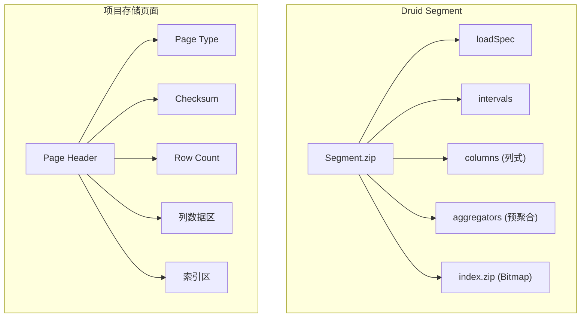
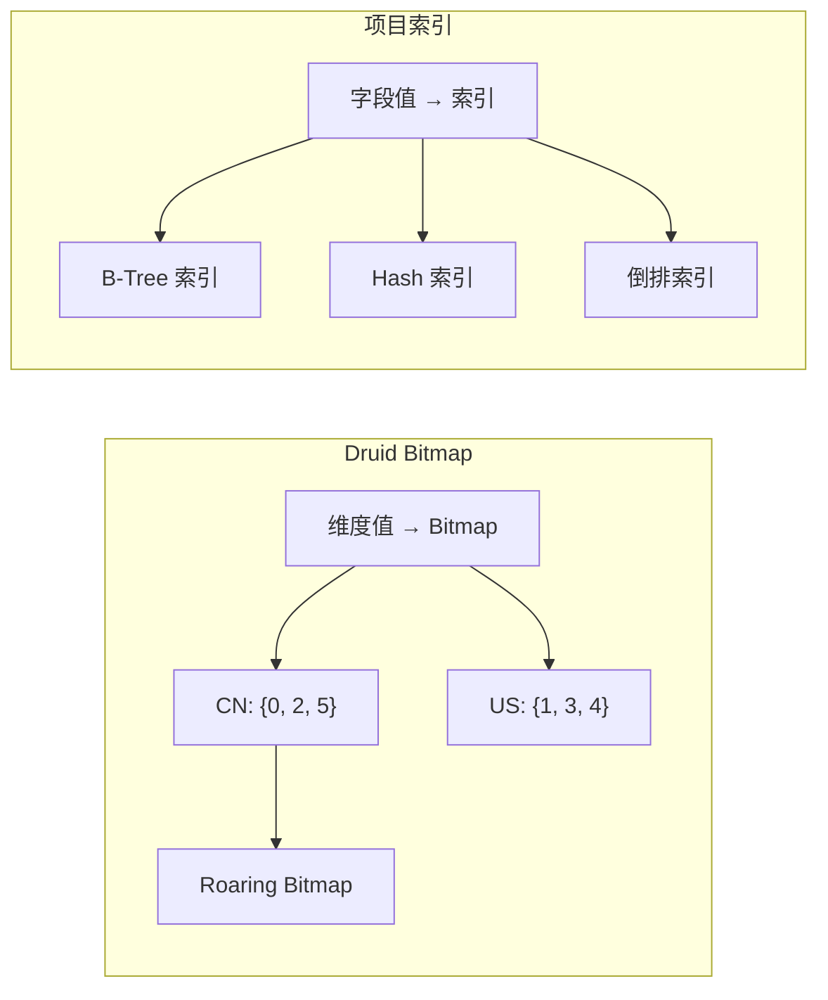
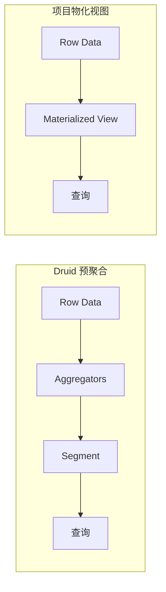

# Apache Druid 与项目关联

## 学习目标

- 理解 Druid 的 Segment 结构与项目存储页面的对应关系
- 掌握 Druid 的 Bitmap 索引与项目索引模块的关联
- 借鉴 Druid 设计优化项目存储架构

## Segment 结构与项目存储页面

### 架构对比



### 项目可设计的 Segment 页面

项目可以借鉴 Druid 的 Segment 结构设计列式存储页面：

```c
// 项目可设计的 Segment 页面格式
typedef struct {
    // 页面头部
    uint32_t magic;            // 魔数
    uint32_t version;          // 版本
    uint32_t page_type;        // PAGE_SEGMENT
    uint64_t row_count;       // 行数

    // 时间范围（用于裁剪）
    uint64_t min_timestamp;
    uint64_t max_timestamp;

    // 列元数据
    uint32_t column_count;
    ColumnMeta {
        uint32_t type;         // 列类型
        uint64_t offset;       // 偏移
        uint64_t size;         // 大小
        uint64_t null_count;   // 空值数
    } columns[MAX_COLUMNS];

    // 聚合器元数据
    uint32_t aggregator_count;
    AggregatorMeta {
        uint32_t type;         // 聚合类型
        uint64_t offset;       // 结果偏移
        uint64_t size;         // 结果大小
    } aggregators[MAX_AGGREGATORS];

    // Bitmap 索引偏移
    uint64_t bitmap_offset;

    // 数据区域
    uint8_t data[0];
} DruidLikeSegmentPage;
```

### 列式存储实现

```c
// 项目可实现的列式存储
#include "db/columnar.h"

// 列数据读取
typedef struct {
    const uint8_t *data;      // 列数据指针
    size_t size;              // 列大小
    ColumnType type;          // 列类型
    uint64_t null_count;      // 空值数
    const uint8_t *null_map;  // 空值位图
} ColumnData;

// 读取特定列
ColumnData *columnar_read_column(
    DruidLikeSegmentPage *page,
    uint32_t column_index);

// 列裁剪：只读取需要的列
ColumnData *columnar_read_columns(
    DruidLikeSegmentPage *page,
    uint32_t *needed_columns,
    uint32_t needed_count);
```

## Bitmap 索引与项目索引模块

### Bitmap 索引对比



### 项目可扩展的 Bitmap 索引

项目 `engineering/src/index/` 目录下可添加 Bitmap 索引支持：

```c
// 项目可实现的 Bitmap 索引
#include "index/bitmap_index.h"

// Bitmap 索引接口
typedef struct BitmapIndex BitmapIndex;

// 创建 Bitmap 索引
BitmapIndex *bitmap_create(uint32_t max_values);

// 添加值到索引
void bitmap_add(BitmapIndex *index, uint32_t row_id, uint32_t value);

// 合并 Bitmap
BitmapIndex *bitmap_or(const BitmapIndex *a, const BitmapIndex *b);

// 交集
BitmapIndex *bitmap_and(const BitmapIndex *a, const BitmapIndex *b);

// 获取满足条件的行 ID
uint32_t *bitmap_to_array(const BitmapIndex *index, uint32_t *count);

// 释放
void bitmap_destroy(BitmapIndex *index);
```

### Roaring Bitmap 实现（简化版）

```c
// 项目可实现的 Roaring Bitmap
#include "index/roaring_bitmap.h"

// Container 类型
typedef enum {
    CONTAINER_ARRAY,     // 低基数（< 4096）
    CONTAINER_BITMAP,    // 高基数（>= 4096）
    CONTAINER_RUN        // 游程编码
} ContainerType;

// Container 基类
typedef struct {
    ContainerType type;
    uint16_t card;       // 基数
} Container;

// Array Container（低基数）
typedef struct {
    Container base;
    uint16_t values[0];   // 可变长数组
} ArrayContainer;

// Bitmap Container（高基数）
typedef struct {
    Container base;
    uint64_t words[1024]; // 65536 bits
} BitmapContainer;

// Roaring Bitmap
typedef struct {
    Container *containers[65536]; // 65536 个 Container
} RoaringBitmap;

// 创建 Container
Container *container_create(uint16_t *values, uint32_t count) {
    if (count < 4096) {
        return create_array_container(values, count);
    } else if (density_is_high(values, count)) {
        return create_bitmap_container(values, count);
    } else {
        return create_run_container(values, count);
    }
}

// 位运算
RoaringBitmap *roaring_and(const RoaringBitmap *a, const RoaringBitmap *b) {
    RoaringBitmap *result = roaring_create();

    for (int i = 0; i < 65536; i++) {
        if (a->containers[i] && b->containers[i]) {
            result->containers[i] = container_and(
                a->containers[i], b->containers[i]);
        }
    }

    return result;
}
```

## 预聚合与项目物化视图

### Druid 预聚合机制



### 项目可实现的预聚合

```c
// 项目可实现的预聚合机制
#include "db/materialized_view.h"

// 预聚合类型
typedef enum {
    AGG_COUNT,
    AGG_SUM,
    AGG_MIN,
    AGG_MAX,
    AGG_AVG,
    AGG_HLL      // HyperLogLog
} AggregationType;

// 聚合器接口
typedef struct {
    AggregationType type;
    uint32_t column_index;
    void *state;              // 聚合状态

    void (*init)(void *state);
    void (*add)(void *state, const void *value);
    void *(*finalize)(void *state);
} Aggregator;

// 物化视图定义
typedef struct {
    char name[256];
    TableSchema *source;       // 源表

    Dimension *dimensions;     // 分组维度
    uint32_t dim_count;

    Aggregator *aggregators;   // 聚合器
    uint32_t agg_count;

    RefreshPolicy policy;      // 刷新策略
    Interval refresh_interval;
} MaterializedView;
```

## HyperLogLog 与项目去重

### 项目可实现的 HyperLogLog

```c
// 项目可实现的 HyperLogLog
#include "algo/hll/hyperloglog.h"

// HyperLogLog 配置
#define HLL_PRECISION 12        // 12 位 = 4096 个寄存器
#define HLL_REGISTERS (1 << HLL_PRECISION)

// HyperLogLog 结构
typedef struct {
    uint8_t registers[HLL_REGISTERS];  // 寄存器
    uint32_t count;                    // 添加的值的数量
} HyperLogLog;

// MurmurHash3（用于散列）
uint64_t murmur3_hash(const void *data, size_t len);

// 创建 HyperLogLog
HyperLogLog *hll_create(void) {
    HyperLogLog *hll = malloc(sizeof(HyperLogLog));
    memset(hll->registers, 0, HLL_REGISTERS);
    hll->count = 0;
    return hll;
}

// 添加值
void hll_add(HyperLogLog *hll, uint64_t value) {
    // 1. 计算哈希
    uint64_t hash = murmur3_hash(&value, sizeof(value));

    // 2. 取低 P 位作为桶索引
    uint32_t bucket = hash & (HLL_REGISTERS - 1);

    // 3. 取剩余位计算前导零 + 1
    uint8_t leading_zeros = 64 - __builtin_clzll(hash >> HLL_PRECISION) + 1;
    leading_zeros = leading_zeros > HLL_MAX_REGISTER ? HLL_MAX_REGISTER : leading_zeros;

    // 4. 更新寄存器（保留最大值）
    if (leading_zeros > hll->registers[bucket]) {
        hll->registers[bucket] = leading_zeros;
    }

    hll->count++;
}

// 基数估计（线性计数 + HyperLogLog 估计）
double hll_estimate(const HyperLogLog *hll) {
    double sum = 0.0;
    int zero_count = 0;

    for (int i = 0; i < HLL_REGISTERS; i++) {
        sum += 1.0 / (1 << hll->registers[i]);
        if (hll->registers[i] == 0) zero_count++;
    }

    double m = HLL_REGISTERS;

    // 线性计数（小基数时更准确）
    if (zero_count > 0) {
        double linear_estimate = m * log(m / zero_count);
        if (linear_estimate <= 2.5 * m) {
            return linear_estimate;
        }
    }

    // HyperLogLog 估计
    double hll_estimate = m * m / sum;

    // 修正（小基数）
    if (hll->count < 2.5 * m) {
        double alpha = 0.673;
        return alpha * m * m / sum;
    }

    return hll_estimate;
}
```

## Lambda 架构借鉴

### 项目可实现的 Lambda 架构

```c
// 项目可实现的 Lambda 架构
#include "db/lambda_storage.h"

// 数据层
typedef enum {
    LAYER_REALTIME,    // 实时层
    LAYER_BATCH        // 批处理层
} DataLayer;

// 实时层（内存）
typedef struct {
    BufferPool *mem_pool;
    uint64_t max_rows;
    AggregationType *agg_types;
} RealtimeLayer;

// 批处理层（磁盘）
typedef struct {
    char data_dir[256];
    uint64_t segment_rows;
} BatchLayer;

// Lambda 存储
typedef struct {
    RealtimeLayer *realtime;
    BatchLayer *batch;
    MergePolicy merge_policy;
} LambdaStorage;

// 查询执行
QueryResult *lambda_query(LambdaStorage *storage, Query *query) {
    // 1. 查询实时层
    QueryResult *rt_result = query_realtime_layer(
        storage->realtime, query);

    // 2. 查询批处理层
    QueryResult *batch_result = query_batch_layer(
        storage->batch, query);

    // 3. 合并结果
    QueryResult *merged = merge_results(rt_result, batch_result,
        storage->merge_policy);

    return merged;
}

// 触发批处理
void lambda_flush_realtime(LambdaStorage *storage) {
    // 1. 将实时层数据写入批处理层
    write_batch_layer(storage->batch, storage->realtime);

    // 2. 清空实时层
    reset_realtime_layer(storage->realtime);
}
```

## 设计模式借鉴

### Visitor 模式（查询执行）

Druid 使用 Visitor 模式遍历数据：

```java
// Druid 的 Cursor/ColumnHolder 模式
public interface ColumnHolder {
    <T> T accept(ColumnHolderVisitor<T> visitor);
}

public class StringColumnHolder implements ColumnHolder {
    @Override
    public <T> T accept(ColumnHolderVisitor<T> visitor) {
        return visitor.visit(this);
    }
}

public interface ColumnHolderVisitor<T> {
    T visit(StringColumnHolder holder);
    T visit(LongColumnHolder holder);
    T visit(DoubleColumnHolder holder);
}
```

项目可借鉴此模式：

```c
// 项目可实现的 Visitor 模式
#include "db/column.h"

typedef struct Column Column;

// Column 访问者
typedef void *(*ColumnVisitor)(Column *col, void *ctx);

typedef struct {
    void *(*visit_string)(Column *col, void *ctx);
    void *(*visit_int64)(Column *col, void *ctx);
    void *(*visit_double)(Column *col, void *ctx);
} ColumnVTable;

// 聚合访问者
void *aggregate_column(Column *col, void *ctx) {
    switch (col->type) {
        case COLUMN_STRING:
            return col->vtable->visit_string(col, ctx);
        case COLUMN_INT64:
            return col->vtable->visit_int64(col, ctx);
        case COLUMN_DOUBLE:
            return col->vtable->visit_double(col, ctx);
    }
}
```

## 要点总结

1. **Segment 结构**：列式存储 + Bitmap 索引 + 预聚合元数据
2. **Bitmap 索引**：Roaring Bitmap 高效压缩，支持位运算
3. **HyperLogLog**：近似去重算法，适合大数据集
4. **Lambda 架构**：实时层 + 批处理层的混合架构
5. **Visitor 模式**：ColumnHolder 访问模式便于扩展
6. **项目扩展点**：`engineering/src/index/` 添加 Bitmap 索引

## 思考题

1. 项目如何设计一个兼容 Druid Segment 格式的导入导出接口？
2. 在项目中实现 Roaring Bitmap 时，如何选择 Container 类型？
3. HyperLogLog 的精度如何根据内存限制调整？
4. Lambda 架构中，实时层和批处理层的数据边界如何确定？
