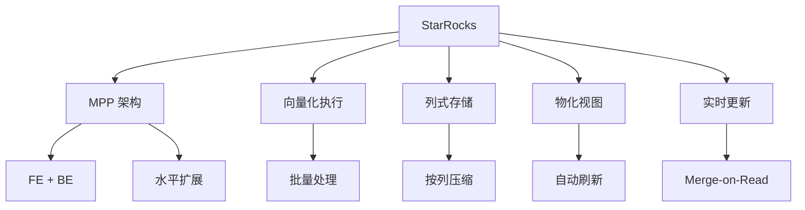

# StarRocks 项目概览

## 学习目标

- 了解 StarRocks 作为国产高性能 OLAP 数据库的定位
- 掌握 StarRocks 的 MPP 架构和向量化执行

## 项目定位

> StarRocks 是国产开源的高性能 OLAP 数据库，以极速查询和实时分析著称。

**基本信息**：
- 开发方：StarRocks 社区（原鼎石科技）
- 首次发布：2020 年
- 开源协议：Apache 2.0
- GitHub Stars：约 8k

## 核心设计



## 核心特性

```sql
-- 创建表
CREATE TABLE sensor_data (
    event_date DATE,
    sensor_id INT,
    temperature DOUBLE,
    humidity DOUBLE
) ENGINE = OLAP
DUPLICATE KEY(event_date, sensor_id)
PARTITION BY RANGE(event_date) (...)
DISTRIBUTED BY HASH(sensor_id) BUCKETS 10;

-- 聚合查询
SELECT
    event_date,
    COUNT(DISTINCT sensor_id) AS sensors,
    AVG(temperature) AS avg_temp
FROM sensor_data
WHERE event_date >= '2024-01-01'
GROUP BY event_date
ORDER BY event_date;

-- 物化视图
CREATE MATERIALIZED VIEW sensor_agg AS
SELECT
    event_date,
    sensor_id,
    AVG(temperature) AS avg_temp
FROM sensor_data
GROUP BY event_date, sensor_id;
```

## 要点总结

- MPP 架构，线性扩展
- 向量化执行加速
- 列式存储高压缩
- 物化视图自动刷新
