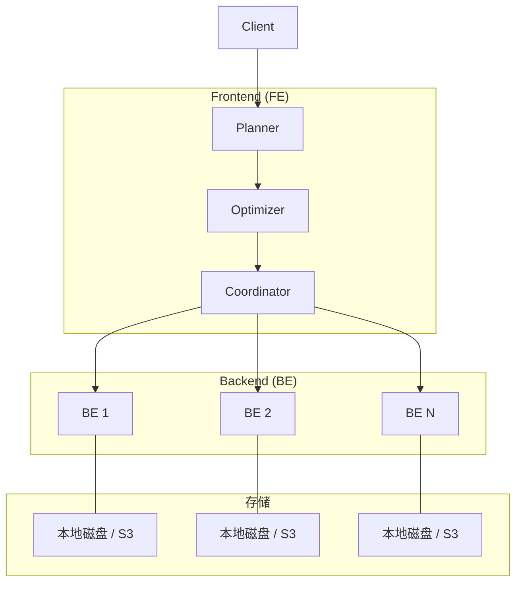
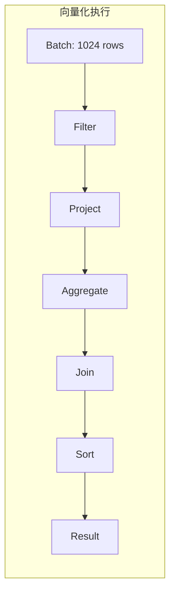
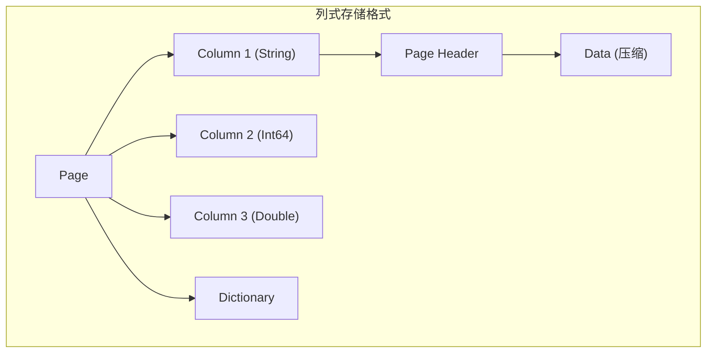
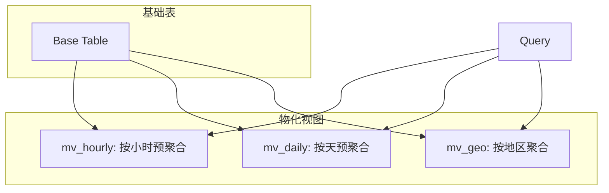
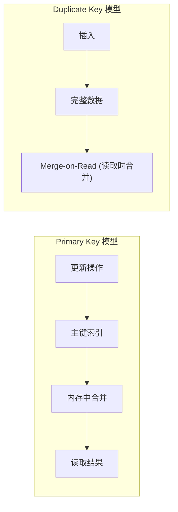
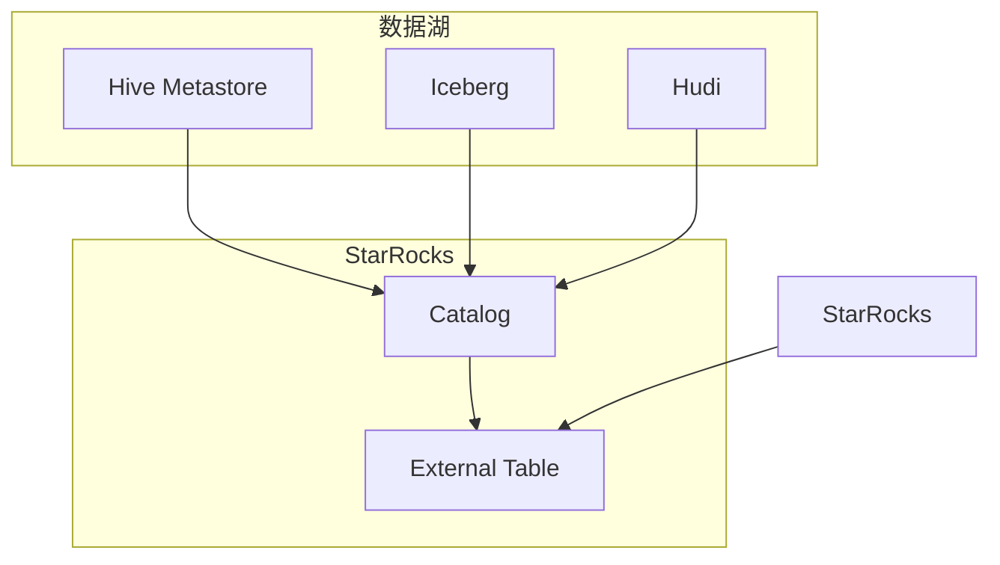

# StarRocks 架构设计

## 学习目标

- 理解 StarRocks 的 MPP 架构和向量化执行引擎
- 掌握 StarRocks 的列式存储和物化视图设计
- 了解主键模型和数据湖分析能力

## MPP 分布式架构

StarRocks 采用 MPP（Massively Parallel Processing）架构，Frontend 和 Backend 分离。



### FE 和 BE 职责

| 组件 | 职责 | 扩展方式 |
|------|------|----------|
| **FE** | SQL 解析、优化、调度 | 部署多个实现高可用 |
| **BE** | 数据存储、查询执行 | 水平扩展 |

### 数据分片

```sql
-- 建表时指定分桶策略
CREATE TABLE user_events (
    event_date DATE,
    user_id INT,
    event_type VARCHAR(50),
    payload VARCHAR(200)
)
ENGINE = OLAP
DUPLICATE KEY(event_date, user_id)
PARTITION BY RANGE(event_date) (
    PARTITION p202401 VALUES LESS THAN ('2024-02-01'),
    PARTITION p202402 VALUES LESS THAN ('2024-03-01'),
    PARTITION p202403 VALUES LESS THAN ('2024-04-01')
)
DISTRIBUTED BY HASH(user_id) BUCKETS 10;
```

## 向量化执行引擎

StarRocks 是真正的全链向量化数据库，所有算子都基于向量化执行。



### 向量化实现

```cpp
// StarRocks 向量化执行核心

// 向量化列块
class VectorizedChunk {
public:
    // 列数据
    std::vector<ColumnPtr> columns;

    // 行数
    size_t num_rows() const { return columns.empty() ? 0 : columns[0]->size(); }
};

// 向量化过滤
class VectorizedFilter {
public:
    // SIMD 优化的批量过滤
    static Status filter(const ColumnPtr& input, Buffer<uint8_t>& result) {
        const uint8_t* data = input->raw_data();
        size_t size = input->size();

        // SIMD 比较
        for (size_t i = 0; i < size; i += 16) {
            __m128 mask = _mm_loadu_ps(&data[i]);
            // ... SIMD 位运算
        }
    }
};

// 向量化聚合
class VectorizedGroupByAggregator {
public:
    void update_batch(const VectorizedChunk& chunk) {
        // 批量更新聚合状态
        for (size_t i = 0; i < chunk.num_rows(); i += 1024) {
            // SIMD 批量聚合
        }
    }
};
```

### 向量化算子

```sql
-- 这些操作在 StarRocks 中都会利用向量化执行
SELECT
    date_trunc('hour', event_time) AS hour,
    count(*),
    sum(amount),
    avg(latency),
    percentile_approx(latency, 0.95)
FROM events
WHERE event_time >= '2024-01-01'
GROUP BY 1
ORDER BY 1;
```

## 列式存储

StarRocks 采用列式存储，支持多种压缩算法。



### 存储结构

```cpp
// StarRocks 存储格式
struct OLAPHeader {
    // 列信息
    std::vector<ColumnPB> schema;

    // 索引信息
    PrimaryIndex index;

    // 分段信息
    std::vector<SegmentPB> segments;
};

struct ColumnPB {
    string name;
    TypeDescriptor type;
    uint32_t id;
    CompressionTypePB compression;
};

struct SegmentPB {
    string file_name;
    uint32_t row_count;
    uint64_t data_size;
    // 列文件映射
    map<uint32_t, ColumnFilePB> columns;
};
```

### 压缩算法

```sql
-- 指定列的压缩算法
CREATE TABLE events (
    event_date DATE,
    event_type VARCHAR(50),
    payload STRING
)
ENGINE = OLAP
DUPLICATE KEY(event_date)
PROPERTIES (
    "compression" = "ZSTD"  -- 全表压缩
);

-- 或指定列压缩
ALTER TABLE events MODIFY COLUMN payload STRING
SET (compression = 'LZ4');
```

支持的压缩算法：ZSTD、LZ4、ZLIB、ZSTD

## 物化视图

StarRocks 的物化视图支持同步和异步刷新，显著加速查询。



### 同步物化视图

```sql
-- 创建同步物化视图
CREATE MATERIALIZED VIEW hourly_sales AS
SELECT
    date_trunc('hour', order_time) AS hour,
    product_id,
    sum(amount) AS total_amount,
    count(*) AS order_count
FROM orders
GROUP BY 1, 2;

-- 自动刷新：数据写入基表时自动更新
INSERT INTO orders VALUES ('2024-01-01 10:30:00', 1001, 500.00);

-- 查询自动路由到物化视图
SELECT
    hour,
    sum(total_amount)
FROM hourly_sales
WHERE hour >= '2024-01-01 00:00:00'
GROUP BY hour;
```

### 异步物化视图

```sql
-- 创建异步物化视图（支持外部数据源）
CREATE MATERIALIZED VIEW mv_external
BUILD REFRESH ASYNC
AS
SELECT
    o.order_id,
    o.amount,
    c.customer_name,
    c.region
FROM orders o
JOIN customer c ON o.customer_id = c.id;

-- 手动刷新
ALTER MATERIALIZED VIEW mv_external REFRESH;

-- 定时刷新
ALTER MATERIALIZED VIEW mv_external REFRESH ASYNC EVERY(INTERVAL 1 HOUR);
```

## 主键模型

StarRocks 的主键模型支持高效更新，区别于 ClickHouse 的 Merge-on-Read。



### 主键模型表

```sql
-- 创建主键模型表
CREATE TABLE user_status (
    user_id INT PRIMARY KEY,
    username VARCHAR(50),
    email VARCHAR(100),
    status INT,
    last_login DATETIME,
    update_time DATETIME
)
ENGINE = OLAP
PRIMARY KEY(user_id)
ORDER BY user_id
DISTRIBUTED BY HASH(user_id) BUCKETS 10;

-- 更新操作
INSERT INTO user_status VALUES (1, 'alice', 'alice@test.com', 1, NOW(), NOW());

UPDATE user_status
SET last_login = NOW(), status = 2
WHERE user_id = 1;

-- 批量 upsert
INSERT INTO user_status (user_id, last_login, status)
VALUES (1, NOW(), 3), (2, NOW(), 1)
ON DUPLICATE KEY UPDATE
    last_login = VALUES(last_login),
    status = VALUES(status);
```

### 主键模型 vs 聚合模型

| 特性 | Primary Key | Duplicate Key | Aggregate Key |
|------|-------------|---------------|---------------|
| **更新支持** | 高效更新 | Merge-on-Read | 预聚合 |
| **主键唯一性** | 保证 | 不保证 | 不保证 |
| **查询性能** | 适中 | 高（点查） | 高（聚合） |
| **适用场景** | 实时更新 | 历史分析 | 预聚合查询 |

## 数据湖分析

StarRocks 支持直接分析 Hive/Iceberg/Hudi 等数据湖。



### 外部 Catalog

```sql
-- 创建 Hive Catalog
CREATE EXTERNAL CATALOG hive_catalog PROPERTIES (
    "type" = "hive",
    "hive.metastore.uris" = "thrift://hive-metastore:9083"
);

-- 创建 Iceberg Catalog
CREATE EXTERNAL CATALOG iceberg_catalog PROPERTIES (
    "type" = "iceberg",
    "iceberg.catalog.type" = "hive",
    "iceberg.catalog.hive.metastore.uris" = "thrift://hive-metastore:9083"
);

-- 查询外部数据
SELECT * FROM hive_catalog.db.table LIMIT 10;

-- 联邦查询
SELECT
    s.order_id,
    s.amount,
    h.customer_name
FROM starrocks_db.orders s
JOIN hive_catalog.hive_db.customers h ON s.customer_id = h.id;
```

## 要点总结

1. **MPP 架构**：FE 负责 SQL 解析和调度，BE 负责存储和计算
2. **向量化执行**：全链路向量化，SIMD 批量处理
3. **列式存储**：按列压缩存储，支持多种压缩算法
4. **物化视图**：同步/异步刷新，自动查询改写
5. **主键模型**：支持高效更新，区别于 Merge-on-Read
6. **数据湖**：原生支持 Hive/Iceberg/Hudi 联邦查询

## 思考题

1. StarRocks 的 MPP 架构与 ClickHouse 的 Shared-nothing 架构有什么异同？
2. 主键模型的「内存中合并」和 Duplicate Key 的「Merge-on-Read」各有什么优缺点？
3. 同步物化视图和异步物化视图分别在什么场景下使用？
4. StarRocks 如何实现向量化执行？有哪些关键优化点？
