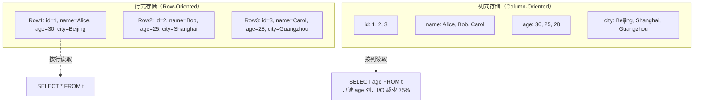
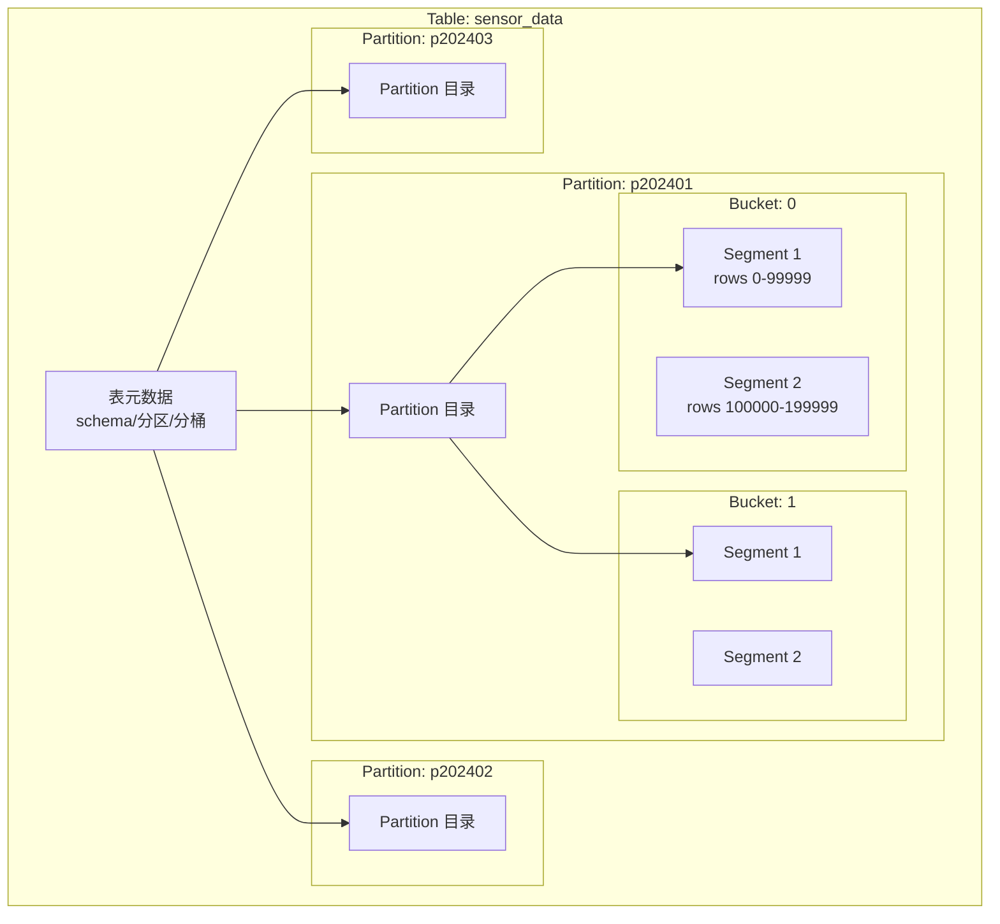
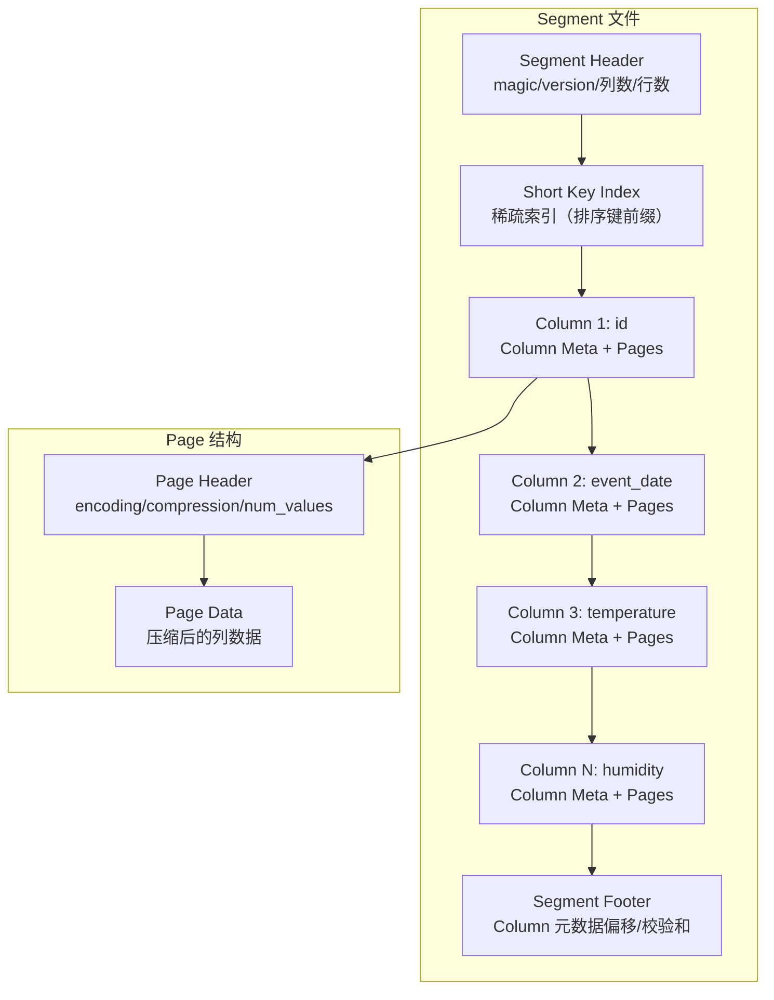
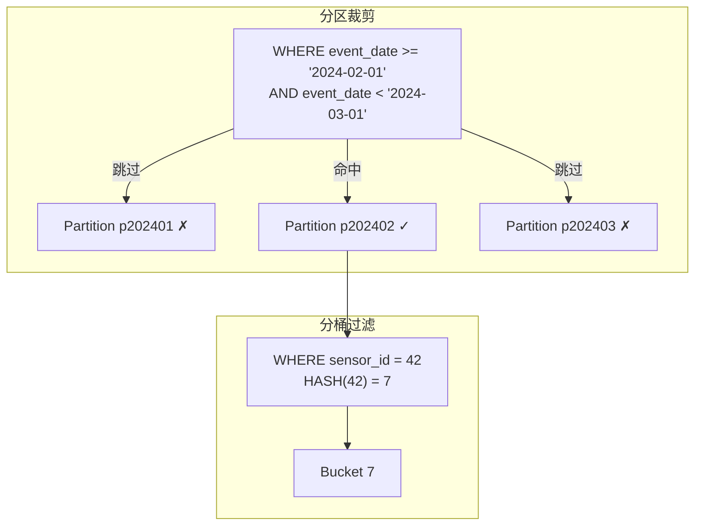
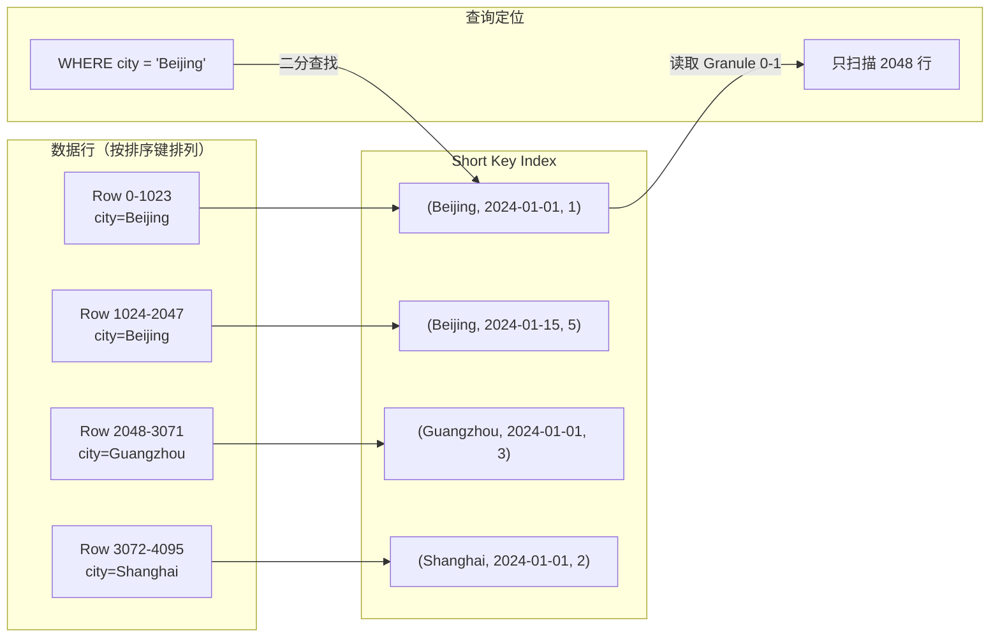

# StarRocks 列式存储引擎

## 学习目标

- 理解 StarRocks 列式存储的核心设计（Segment 文件结构、列式格式）
- 掌握数据压缩算法（LZ4、ZSTD、Delta、Bit-shuffle 等）的原理与选型
- 理解数据分区、分桶与排序键的设计及其对查询性能的影响
- 对比 StarRocks 列式存储与本项目 storage/ 模块的设计差异

## 列式存储的基本概念

与传统行式存储不同，列式存储将同一列的数据连续存储在磁盘上。StarRocks 采用纯列式架构，每个列数据独立存储在 Segment 文件中。

### 行式 vs 列式



**列式存储的核心优势**：

| 优势 | 说明 | 量化效果 |
|------|------|----------|
| 列裁剪 | 只读取查询涉及的列，跳过无关列 | I/O 减少 50%-90% |
| 高压缩比 | 同类型数据连续存储，局部性极好 | 压缩比 5:1 到 20:1 |
| 向量化执行 | SIMD 指令批量处理同列数据 | 吞吐提升 5-10 倍 |
| 聚合高效 | COUNT/SUM/AVG 只需读取目标列 | 聚合查询秒级响应 |

## Segment 文件结构

StarRocks 采用 **Segment** 作为基本存储单元，每个 Segment 包含多个列的数据。

### 存储层次



**数据组织层次**：

```
Table → Partition → Tablet (Bucket) → Segment → Column → Page
```

### Segment 内部结构



**Segment 核心文件**：

| 组件 | 说明 |
|------|------|
| **Segment Header** | 文件魔数、版本号、列数、行数等基本信息 |
| **Short Key Index** | 排序键前缀的稀疏索引，用于快速定位数据范围 |
| **Column Meta** | 每列的元数据（类型、编码方式、压缩算法、Page 列表） |
| **Column Pages** | 列数据按 Page 分块存储，每个 Page 独立压缩 |
| **Segment Footer** | 各列元数据的偏移量和校验和 |

### Page 的类型与设计

StarRocks 将列数据划分为 **Page**（默认 64KB），每种 Page 类型采用不同的编码策略：

| Page 类型 | 用途 | 编码方式 |
|-----------|------|----------|
| **Data Page** | 普通数据 | 按列类型选择最优编码 |
| **Dictionary Page** | 字典编码的字典数据 | 存储去重后的值列表 |
| **Index Page** | 列级索引（ORDINAL/RANGE） | 行号到偏移的映射 |

## 数据编码方式

StarRocks 在压缩之前先进行编码，编码可以显著减少数据量，提高后续压缩效率。

### 编码方式总览

| 编码 | 类型 | 适用场景 | 压缩比 |
|------|------|----------|--------|
| **Plain** | 原始 | 无法高效编码的场景 | 1:1 |
| **Bit-shuffle** | 整形 | INT/BIGINT 列，值分布规律 | 2:1 ~ 5:1 |
| **Dict** | 字符串 | 低基数字符串列（< 10000 唯一值） | 3:1 ~ 10:1 |
| **RLE** | 重复值 | 重复值多的列 | 3:1 ~ 20:1 |
| **Delta** | 时序 | 有序时间戳/自增 ID | 2:1 ~ 8:1 |
| **Prefix** | 字符串 | 共享前缀的字符串列 | 2:1 ~ 4:1 |

### Bit-shuffle 编码

Bit-shuffle 将相同 bit 位的数据重新排列，适用于整数类型。

```
原始值 (int32):
  0x12345678 = 0001 0010 0011 0100 0101 0110 0111 1000
  0x23456789 = 0010 0011 0100 0101 0110 0111 1000 1001

Bit-shuffle 后:
  Bit 31: 00...
  Bit 30: 00...
  ...
  Bit 0:  01...   ← 相同 bit 位连续存储
```

**效果**：Bit-shuffle 后数据局部性更好，配合 LZ4/ZSTD 可获得更高压缩比。

### Dict 编码

适用于低基数（Low-Cardinality）字符串列。

```
原始值: ["Beijing", "Shanghai", "Beijing", "Guangzhou", "Shanghai", ...]
字典:   {0: "Beijing", 1: "Shanghai", 2: "Guangzhou"}
编码:   [0, 1, 0, 2, 1, ...]    ← 用索引替代原始字符串
```

**效果**：字符串长度从平均 8 bytes 降为 1-4 bytes，压缩比 2:1 ~ 10:1。

### RLE 编码

适用于重复值较多的列，如状态码、分区键。

```
原始值: [200, 200, 200, 200, 500, 500, 200, 200, 200]
RLE:    [(200, 4), (500, 2), (200, 3)]  ← (值, 重复次数)
```

**效果**：连续重复值越多，压缩效果越好。

## 数据压缩算法

StarRocks 在 Page 级别使用通用压缩算法，压缩在编码之后进行。

### 压缩算法总览

| 算法 | 速度 | 压缩比 | 适用场景 |
|------|------|--------|----------|
| **LZ4** | 极快（~500 MB/s） | 2:1 ~ 3:1 | 默认压缩，高频查询的热数据 |
| **LZ4HC** | 压缩慢，解压快 | 3:1 ~ 4:1 | 冷数据写入优化 |
| **ZSTD** | 快（~200 MB/s） | 3:1 ~ 5:1 | 平衡场景，默认推荐 |
| **ZSTD(1-22)** | 可调 | 3:1 ~ 8:1 | 按压缩比需求调节 |
| **ZLIB** | 慢（~80 MB/s） | 3:1 ~ 6:1 | 兼容场景 |

### 压缩配置

```sql
-- 创建表时指定压缩算法
CREATE TABLE sensor_data (
    event_date DATE,
    sensor_id INT,
    temperature DOUBLE,
    humidity DOUBLE,
    payload STRING
) ENGINE = OLAP
DUPLICATE KEY(event_date, sensor_id)
PARTITION BY RANGE(event_date) (...)
DISTRIBUTED BY HASH(sensor_id) BUCKETS 10
PROPERTIES (
    "compression" = "ZSTD"   -- 全表默认压缩算法
);

-- 动态修改压缩算法
ALTER TABLE sensor_data
SET ("compression" = "LZ4");
```

**压缩算法选择原则**：

1. **查询频率优先**：热数据用 LZ4，冷数据用 ZSTD
2. **数据类型匹配**：数值列用 Bit-shuffle + LZ4，字符串列用 Dict + ZSTD
3. **压缩级别权衡**：ZSTD(1) 与 ZSTD(22) 压缩时间相差 10 倍，压缩比相差 1.5 倍

### 编码 + 压缩组合效果

| 列类型 | 编码 | 压缩 | 预期压缩比 |
|--------|------|------|-----------|
| INT（ID 列） | Bit-shuffle | LZ4 | 3:1 ~ 5:1 |
| BIGINT（时间戳） | Delta | ZSTD | 4:1 ~ 8:1 |
| VARCHAR（城市名） | Dict | LZ4 | 5:1 ~ 10:1 |
| DOUBLE（温度） | Plain | ZSTD | 2:1 ~ 3:1 |
| STRING（日志） | Plain | ZSTD(9) | 3:1 ~ 6:1 |

## 数据分区与分桶

StarRocks 使用两层数据分布策略：分区（Partition）和分桶（Bucket）。

### 分区策略

分区将数据按时间或其他范围划分到不同目录，支持分区裁剪。



```sql
-- 按时间分区
CREATE TABLE events (
    event_date DATE,
    event_type VARCHAR(50),
    user_id INT
) ENGINE = OLAP
DUPLICATE KEY(event_date, user_id)
PARTITION BY RANGE(event_date) (
    PARTITION p202401 VALUES LESS THAN ('2024-02-01'),
    PARTITION p202402 VALUES LESS THAN ('2024-03-01'),
    PARTITION p202403 VALUES LESS THAN ('2024-04-01'),
    PARTITION p202404 VALUES LESS THAN ('2024-05-01')
)
DISTRIBUTED BY HASH(user_id) BUCKETS 16;
```

**分区策略对比**：

| 分区粒度 | 优点 | 缺点 | 适用场景 |
|----------|------|------|----------|
| 按天 | 精细控制，裁剪高效 | 分区数过多，管理复杂 | 高频写入，实时查询 |
| 按月 | 分区适中，管理方便 | 裁剪粒度较粗 | 通用场景 |
| 按年 | 分区极少 | 裁剪太粗 | 归档数据 |

### 分桶策略

分桶通过哈希将数据分布到多个 Tablet，实现数据并行处理。

```sql
-- 哈希分桶
DISTRIBUTED BY HASH(user_id) BUCKETS 16

-- 随机分桶（适用于无合适哈希键的场景）
DISTRIBUTED BY RANDOM BUCKETS 10
```

**分桶数选择原则**：

- 每个 Tablet 数据量建议 1GB-10GB
- 分桶数 = 数据总量 / 目标 Tablet 大小
- 分桶数建议为 2 的幂，便于数据重分布
- 单表分桶数不宜超过 1000

### 分区 + 分桶的协同

```
查询: SELECT AVG(temperature) FROM sensor_data
      WHERE event_date = '2024-02-15'
        AND sensor_id = 42

执行过程:
1. 分区裁剪 → 只扫描 p202402 分区
2. 分桶路由 → 定位到 HASH(42) % 16 = 10 的 Tablet
3. 索引过滤 → 在 Segment 的 Short Key Index 中定位数据范围
4. 列读取 → 只读取 temperature 列的 Pages
```

## 排序键（ORDER BY）

排序键是 StarRocks 最核心的设计决策之一，它决定了数据的物理存储顺序。

### 排序键的作用

```sql
CREATE TABLE sensor_data (
    event_date DATE,
    sensor_id INT,
    temperature DOUBLE,
    city VARCHAR(50)
) ENGINE = OLAP
DUPLICATE KEY(event_date, sensor_id)
ORDER BY(city, event_date, sensor_id)
DISTRIBUTED BY HASH(sensor_id) BUCKETS 10;
```

**排序键的作用**：

1. **稀疏索引**：排序键前缀作为 Short Key Index，每 1024 行记录一个索引项
2. **数据局部性**：相同排序键值的数据物理连续，提升压缩率
3. **前缀过滤优化**：对排序键前缀的 WHERE 条件可以高效定位
4. **分片内有序**：每个 Tablet 内数据按排序键有序存储

### Short Key Index



**查询性能差异**：

```sql
-- 高效：排序键前缀过滤，直接定位 Granule
SELECT * FROM sensor_data
WHERE city = 'Beijing' AND event_date >= '2024-01-01';

-- 低效：不是排序键前缀，需要全量扫描
SELECT * FROM sensor_data WHERE temperature > 30.0;
```

### 排序键设计原则

1. **区分度高的列放在前面**：先过滤掉更多数据
2. **查询频繁的等值条件列放在最前**：如 `city = 'Beijing'`
3. **排序键列数不宜过多**：建议 3-5 列
4. **选择稳定的列**：避免频繁更新排序键值

## 数据模型与存储选择

StarRocks 提供三种数据模型，每种模型对应不同的存储策略。

### 三种数据模型

| 模型 | 存储方式 | 适用场景 |
|------|----------|----------|
| **Duplicate Key** | 追加写入，不合并 | 全量历史数据，无需更新 |
| **Aggregate Key** | 预聚合写入 | 报表统计，SUM/MAX/MIN |
| **Unique Key** | 主键去重 | 实时更新，点查 |

### 聚合模型的列式存储

```sql
-- Aggregate Key 模型：数据写入时预聚合
CREATE TABLE site_stats (
    site_id INT,
    event_date DATE,
    pv BIGINT SUM,        -- SUM 聚合
    uv BIGINT REPLACE_IF_NOT_NULL,  -- 去重
    city VARCHAR(50) REPLACE
) ENGINE = OLAP
AGGREGATE KEY(site_id, event_date)
DISTRIBUTED BY HASH(site_id) BUCKETS 10;
```

**聚合模型存储优势**：

- 数据写入时自动聚合，减少存储量
- 查询时直接读取聚合结果，无需重新计算
- 适合固定维度的预聚合场景

### 主键模型的列式存储

```sql
-- Unique Key 模型：主键去重
CREATE TABLE user_status (
    user_id INT,
    username VARCHAR(50),
    status INT,
    last_login DATETIME
) ENGINE = OLAP
PRIMARY KEY(user_id)
DISTRIBUTED BY HASH(user_id) BUCKETS 10;
```

**主键模型存储特点**：

- 使用 Delete+Insert 实现更新
- 主键索引保存在内存中，支持快速点查
- 后台 Compaction 合并版本

## 与项目 storage/ 模块的对比

### 项目列式存储实现

项目在 `engineering/include/db/core/columnar_store.h` 中实现了 Parquet 风格的列式存储：

```c
// 列式存储核心结构
typedef struct ColumnarStore_s {
    char *file_path;
    ColumnarFooter *footer;
    CompressionType compression;
    void *file_handle;
} ColumnarStore;

// 行组元数据
typedef struct RowGroupMeta_s {
    int64_t num_rows;
    int64_t total_size;
    ColumnChunkMeta *columns;
    size_t num_columns;
} RowGroupMeta;
```

项目时序引擎 `ts_columnar.h` 还实现了 Delta 编码、RLE 编码、Bit-packing 等专用压缩算法。

### 架构对比

| 维度 | StarRocks Segment | 项目 columnar_store | 项目 ts_columnar |
|------|-------------------|---------------------|------------------|
| 存储模型 | 列式，Segment 为单位 | 列式，行组为单位 | 列式，时间块为单位 |
| 索引 | Short Key Index + MinMax | MinMax 索引 | 块跳过索引 |
| 分区 | 物理分区 + 哈希分桶 | 行组逻辑分区 | 时间块分区 |
| 编码 | Bit-shuffle/Dict/RLE/Delta/Prefix | 无（仅压缩） | Delta/RLE/Bitpack/Gorilla |
| 压缩 | LZ4/ZSTD/ZLIB | Snappy/GZip/ZSTD/LZ4 | Delta/RLE/Bitpack/Gorilla |
| 排序键 | 物理排序 + Short Key Index | 不支持 | 时间戳排序 |
| Compaction | 后台自动合并 | 不支持 | 不支持 |
| 分桶 | 哈希分桶，支持并行扫描 | 不支持 | 不支持 |

### 项目可借鉴的设计

1. **Short Key Index**：项目已有 MinMax 索引，可扩展为排序键前缀的稀疏索引
2. **Bit-shuffle 编码**：项目已有 Bit-packing，可增加 Bit-shuffle 预处理
3. **Dict 编码**：项目已有 Dictionary 编码基础，可集成到列式存储
4. **哈希分桶**：项目可增加哈希分桶支持，实现并行数据扫描
5. **Compaction 机制**：项目暂时没有后台合并机制，大量小文件写入后性能会退化

```c
// 项目可实现的 Short Key Index（借鉴 StarRocks）
typedef struct {
    uint64_t index_granularity;   // 索引粒度，默认 1024
    uint64_t num_granules;        // Granule 数量

    struct {
        void   *key_value;        // 排序键前缀值
        uint64_t page_offset;     // Page 在 .bin 中的偏移
        uint64_t page_size;       // Page 压缩大小
    } *short_key_index;           // 稀疏索引数组
} ShortKeyIndex;

// 项目可实现的 Bit-shuffle 编码
int bit_shuffle_encode(const uint8_t *input, size_t num_values,
                       size_t type_size, uint8_t *output);
int bit_shuffle_decode(const uint8_t *input, size_t num_values,
                       size_t type_size, uint8_t *output);
```

## 要点总结

1. **列式存储**：每列独立存储，支持列裁剪、高压缩比、向量化执行
2. **Segment 结构**：Segment 是基本存储单元，包含列数据、索引、元数据
3. **Page 存储**：列数据按 Page（64KB）分块，每块独立编码和压缩
4. **编码方式**：Bit-shuffle（整数）、Dict（低基数字符串）、RLE（重复值）、Delta（有序值）
5. **压缩算法**：LZ4（高速）、ZSTD（平衡）、ZLIB（兼容）
6. **分区**：按时间范围物理分区，支持分区裁剪跳过无关数据
7. **分桶**：哈希分桶到 Tablet，支持并行扫描和数据分布
8. **排序键**：决定物理存储顺序，作为 Short Key Index 的键，前缀过滤效率最高
9. **数据模型**：Duplicate Key（追加）、Aggregate Key（预聚合）、Unique Key（主键去重）
10. **项目对比**：项目已有列式存储和压缩基础，可借鉴 Short Key Index、Bit-shuffle、Dict 编码、哈希分桶等设计

## 思考题

1. StarRocks 的 Segment 和 ClickHouse 的 Part 在概念上有何异同？各自的优势是什么？
2. Short Key Index 的粒度为什么默认是 1024 行？如果改为 256 或 4096 会有什么影响？
3. Bit-shuffle 编码在什么场景下压缩效果最好？什么场景下效果有限？
4. 哈希分桶数如何选择？分桶数过多或过少各有什么影响？
5. 项目 `columnar_store` 的 RowGroup 和 StarRocks 的 Segment 在文件组织上有什么异同？
6. 如何将 StarRocks 的 Compaction 机制引入项目的列式存储中？