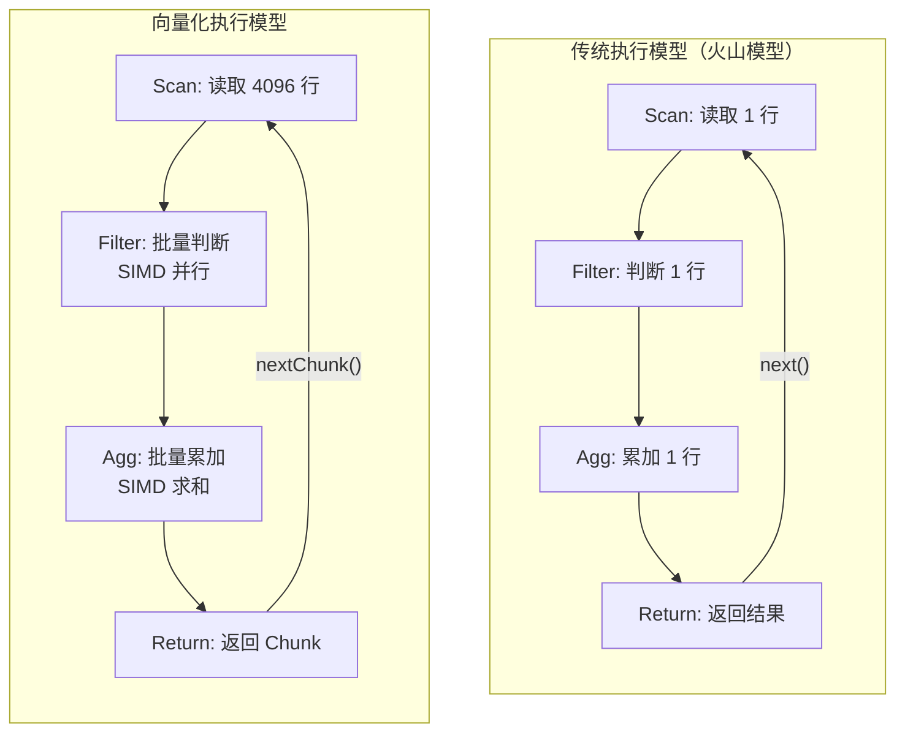
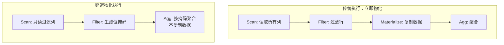
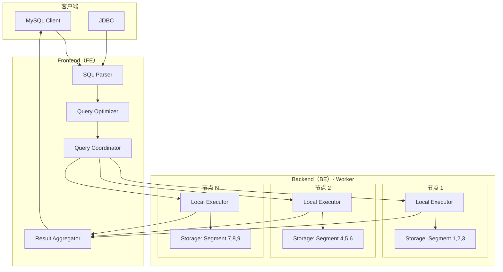
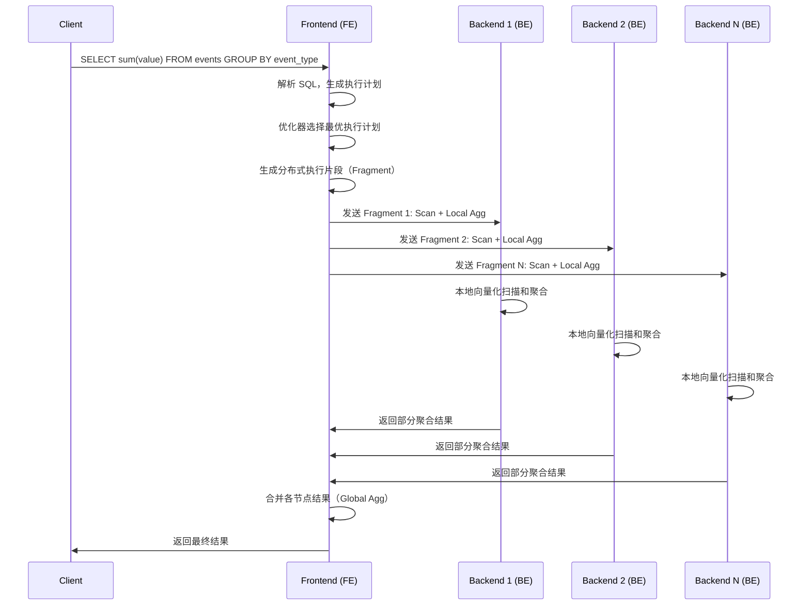
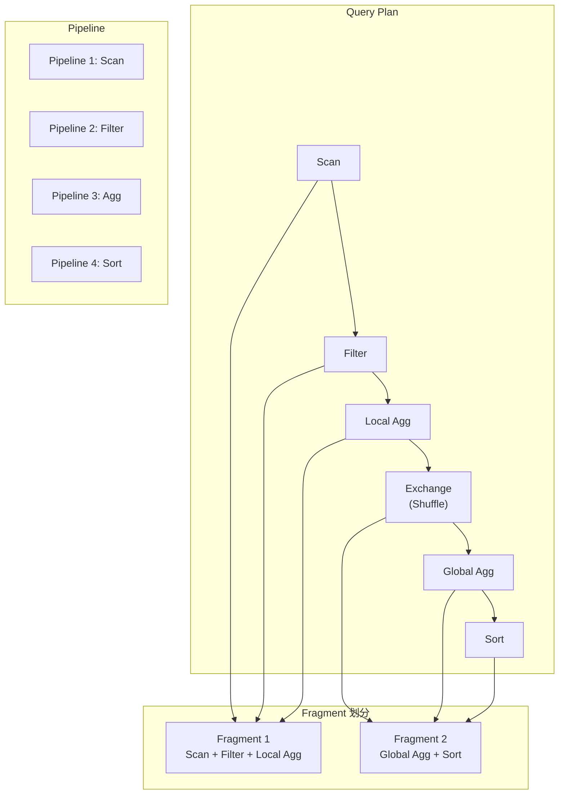
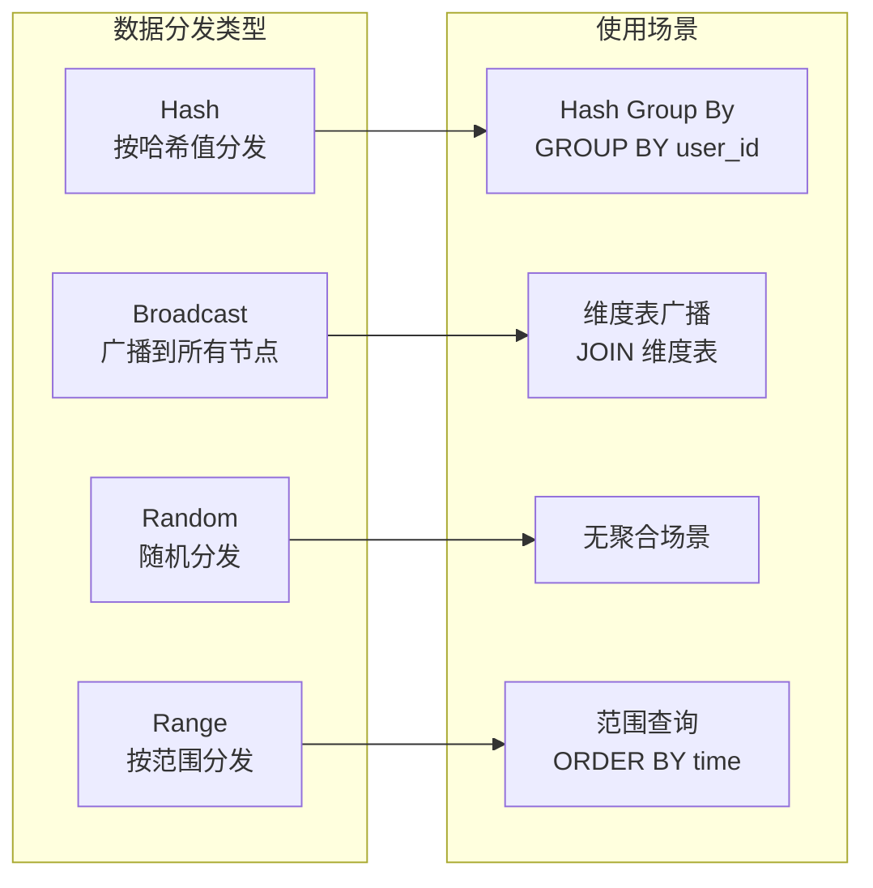
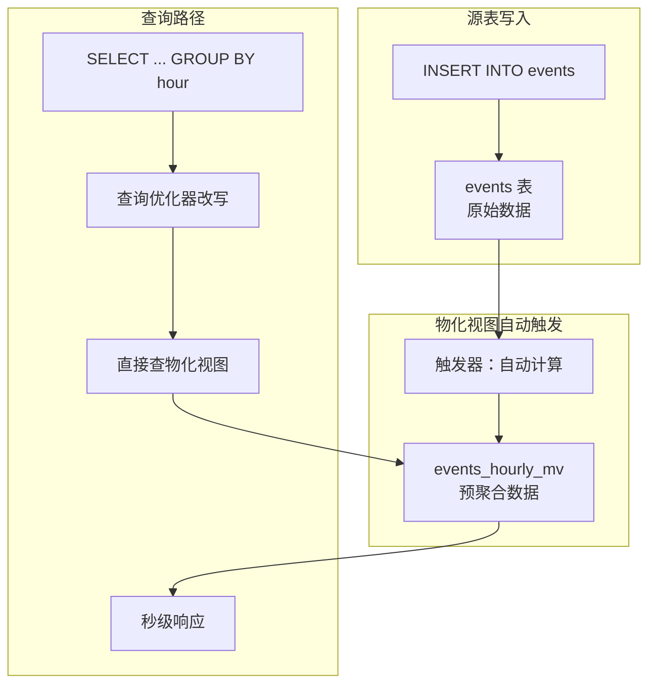
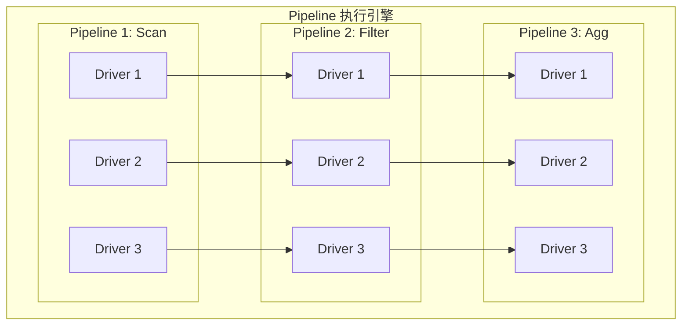
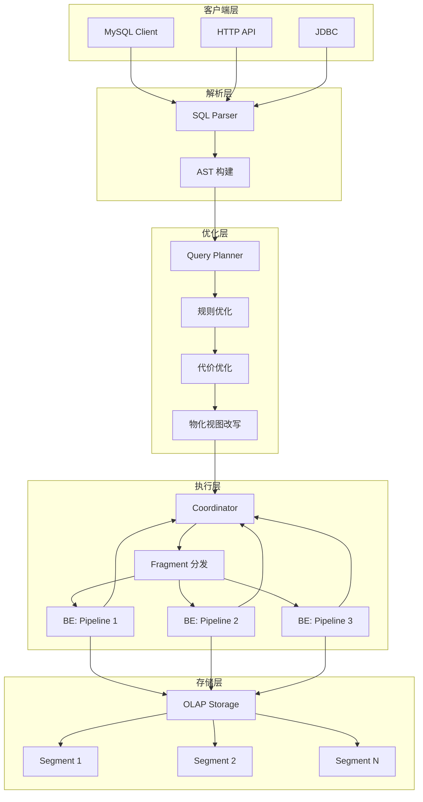

# StarRocks 查询执行引擎

## 学习目标

- 理解向量化查询执行的原理与 SIMD 加速机制
- 掌握 MPP 分布式查询调度的设计
- 理解物化视图与预聚合的原理和应用
- 分析与项目 algo/ 模块的关联与借鉴点

## 向量化查询执行

StarRocks 采用全链路向量化执行模型，利用 SIMD 指令集批量处理数据，是高性能分析查询的核心技术。

### 向量化 vs 传统执行



**性能对比**：

| 维度 | 传统火山模型 | 向量化执行 |
|------|-------------|-----------|
| 函数调用开销 | 每行调用一次 | 每 4096 行调用一次 |
| CPU 缓存 | 指针跳转，缓存失效 | 顺序访问，缓存友好 |
| SIMD 利用 | 难以利用 | 天然适配 SIMD 批量处理 |
| 分支预测 | 频繁分支 | 分支减少，预测准确 |
| 吞吐量 | ~1M 行/秒/核 | ~100M+ 行/秒/核 |

### Chunk 数据结构

StarRocks 的基本处理单位是 **Chunk**，包含多个列，每个列包含相同数量的行。

```cpp
// StarRocks Chunk 结构（简化）
class Chunk {
public:
    std::vector<ColumnPtr> columns;  // 列数据数组
    std::vector<std::string> names;   // 列名
    size_t num_rows;                   // 所有列行数一致

    // 批量操作
    void append(const Chunk& other);
    void filter(const Buffer<uint8_t>& selection);
    void swap_chunk(Chunk& other);
};

// 列数据接口（Column）
class IColumn {
public:
    // 批量操作
    virtual void append(const IColumn& src, size_t offset, size_t count) = 0;
    virtual void filter(const Buffer<uint8_t>& selection) = 0;
    virtual size_t size() const = 0;
};
```

### SIMD 加速示例

StarRocks 大量使用 AVX2/AVX512/NEON 等 SIMD 指令集加速计算。

```cpp
// 批量整数比较（伪代码，展示 SIMD 思想）
void filterInt32Vector(const int32_t *data, size_t n, int32_t threshold,
                       uint8_t *result_mask) {
    const __m256i v_threshold = _mm256_set1_epi32(threshold);

    for (size_t i = 0; i < n; i += 8) {
        // 加载 8 个 int32
        __m256i v_data = _mm256_loadu_si256((__m256i*)(data + i));

        // SIMD 比较：data[i] > threshold
        __m256i v_cmp = _mm256_cmpgt_epi32(v_data, v_threshold);

        // 将比较结果转换为位掩码
        uint32_t mask = _mm256_movemask_ps(_mm256_castsi256_ps(v_cmp));
        *(uint32_t*)(result_mask + i / 8) = mask;
    }
}

// 批量浮点数求和（伪代码）
float sumFloat32Vector(const float *data, size_t n) {
    __m256 v_sum = _mm256_setzero_ps();

    for (size_t i = 0; i < n; i += 8) {
        __m256 v_data = _mm256_loadu_ps(data + i);
        v_sum = _mm256_add_ps(v_sum, v_data);  // 8 个 float32 同时累加
    }

    // 水平求和：将 8 个通道的和合并
    float result[8];
    _mm256_storeu_ps(result, v_sum);
    return result[0] + result[1] + result[2] + result[3] +
           result[4] + result[5] + result[6] + result[7];
}
```

**SIMD 加速效果**：

- 单条指令处理 4-16 个数据元素
- 结合向量化执行模型，吞吐提升 5-10 倍
- 典型场景：聚合（sum/avg/min/max）、比较（WHERE 条件）、排序（部分）

### 向量化聚合

StarRocks 的聚合函数设计为批量处理接口。

```cpp
// 聚合函数接口（简化）
class AggregateFunction {
public:
    // 批量添加数据（SIMD 友好）
    virtual void update_batch(size_t start, size_t end,
                               const Column** columns,
                               AggDataPtr* places) = 0;

    // 合并多个聚合状态
    virtual void merge(AggDataPtr to, const AggDataPtr from) = 0;

    // 序列化/反序列化聚合状态
    virtual void serialize(const AggDataPtr to, std::string& buf) = 0;
    virtual void deserialize(AggDataPtr to, const std::string& buf) = 0;

    // 获取结果
    virtual void finalize(const AggDataPtr to, Column* to_col) = 0;
};
```

**典型聚合函数实现**：

| 聚合函数 | SIMD 加速 | 说明 |
|---------|----------|------|
| `sum` | SSE/AVX 加法 | 批量累加，水平求和 |
| `avg` | sum + count | 分别 SIMD 加速，最后除法 |
| `min/max` | SSE/AVX 比较 | 并行比较，保留极值 |
| `count` | 位掩码统计 | 对位掩码 popcount |
| `count(distinct)` | 哈希表 | 批量插入哈希表 |
| `percentile` | TDigest | 近似分位数 |

### 延迟物化

StarRocks 在可能的情况下尽量延迟列的物化，减少内存分配和复制。



**延迟物化的关键优化**：

1. **Filter Pushdown**：WHERE 条件下推到存储层，只读取满足条件的 Page
2. **Column Pruning**：只读取 SELECT 中出现的列
3. **Projection Pushdown**：在存储层完成投影，避免复制
4. **Early Aggregation**：在数据源附近完成部分聚合，减少数据传输

## MPP 分布式查询调度

StarRocks 采用 Shared-nothing 的 MPP（Massively Parallel Processing）架构，查询在各节点并行执行。

### 分布式查询架构



### 查询执行流程



### Fragment 与 Pipeline

StarRocks 将查询计划划分为 **Fragment**（执行片段），每个 Fragment 包含一组 Pipeline。



**Fragment 和 Pipeline 的作用**：

| 概念 | 说明 | 调度单位 |
|------|------|----------|
| **Fragment** | 一组可以本地执行的算子 | 分布式调度到 BE 节点 |
| **Pipeline** | Fragment 内的算子流水线 | 线程池内并行执行 |
| **Operator** | 单个算子（Scan/Filter/Join/Agg） | 批量处理数据 |

### 两阶段聚合

分布式聚合采用两阶段设计：

1. **本地聚合（Local Agg）**：各 BE 节点在本地完成部分聚合
2. **全局聚合（Global Agg）**：FE 或指定 BE 合并各节点的部分聚合结果

```sql
-- 第一阶段（各节点本地执行）
SELECT event_type, sum(value) AS partial_sum, count() AS partial_count
FROM events_local
WHERE event_date = '2024-01-01'
GROUP BY event_type;

-- 第二阶段（协调节点执行）
SELECT event_type, sum(partial_sum) AS total_sum, sum(partial_count) AS total_count
FROM received_partial_results
GROUP BY event_type;
```

**两阶段聚合的优势**：

- 减少网络传输：只传输聚合结果，不传输原始数据
- 并行计算：各节点独立执行，无锁竞争
- 线性扩展：增加节点即可提升聚合吞吐

### Exchange 算子

Exchange 算子负责 Fragment 之间的数据传输。



## 物化视图与预聚合

物化视图是 StarRocks 实现预聚合的核心机制，显著加速重复查询。

### 物化视图原理



### 同步物化视图

```sql
-- 源表
CREATE TABLE events (
    event_time DATETIME,
    event_type VARCHAR(50),
    user_id INT,
    value BIGINT
) ENGINE = OLAP
DUPLICATE KEY(event_time, event_type)
PARTITION BY date_trunc('day', event_time)
DISTRIBUTED BY HASH(user_id) BUCKETS 10;

-- 同步物化视图：按小时预聚合
CREATE MATERIALIZED VIEW events_hourly_mv
AS SELECT
    date_trunc('hour', event_time) AS hour,
    event_type,
    sum(value) AS total_value,
    count() AS event_count,
    count(distinct user_id) AS unique_users
FROM events
GROUP BY hour, event_type;

-- 插入数据到源表，物化视图自动更新
INSERT INTO events VALUES
    ('2024-01-01 10:05:00', 'purchase', 1, 100),
    ('2024-01-01 10:15:00', 'purchase', 2, 200),
    ('2024-01-01 10:25:00', 'click', 3, 1);

-- 查询预聚合结果（自动路由到物化视图）
SELECT hour, total_value, unique_users
FROM events_hourly_mv
WHERE hour >= '2024-01-01 10:00:00';
```

### 异步物化视图

```sql
-- 异步物化视图（支持外部数据源）
CREATE MATERIALIZED VIEW mv_external
BUILD REFRESH ASYNC EVERY(INTERVAL 1 HOUR)
AS SELECT
    o.order_id,
    o.amount,
    c.customer_name,
    c.region
FROM orders o
JOIN customer c ON o.customer_id = c.id;

-- 手动刷新
ALTER MATERIALIZED VIEW mv_external REFRESH;

-- 查看物化视图状态
SHOW MATERIALIZED VIEW;
```

### 物化视图类型

| 类型 | 刷新方式 | 适用场景 |
|------|----------|----------|
| **同步物化视图** | 数据写入时同步更新 | 实时聚合，高写入吞吐 |
| **异步物化视图** | 定时刷新 | 跨数据源联邦查询 |
| **多表物化视图** | 异步刷新 | 跨表 JOIN 预计算 |

### 查询改写

StarRocks 的查询优化器会自动将查询改写到物化视图：

```sql
-- 原始查询
SELECT
    date_trunc('hour', event_time) AS hour,
    event_type,
    sum(value) AS total_value
FROM events
WHERE event_time >= '2024-01-01'
GROUP BY hour, event_type;

-- 优化器自动改写为
SELECT hour, event_type, total_value
FROM events_hourly_mv
WHERE hour >= '2024-01-01';
```

**查询改写条件**：

- 物化视图的 SELECT 列包含查询需要的列
- 物化视图的 GROUP BY 列包含查询的分组列
- 物化视图的 WHERE 条件是查询 WHERE 条件的子集

## Pipeline 执行引擎

StarRocks 2.0+ 引入 Pipeline 执行引擎，进一步优化查询性能。

### Pipeline 执行模型



**Pipeline 执行优势**：

1. **去执行锁**：无传统火山模型的 `next()` 调用锁
2. **批处理**：每次处理一批数据，减少虚函数调用
3. **流水线并行**：多个 Pipeline 并行执行
4. **自适应调度**：根据运行时统计动态调整并行度

### Driver 与执行队列

```cpp
// Pipeline Driver（简化）
class PipelineDriver {
public:
    Pipeline* pipeline;           // 所属 Pipeline
    size_t driver_id;             // Driver ID

    // 输入输出队列
    std::unique_ptr<ResultQueue> input_queue;
    std::unique_ptr<ResultQueue> output_queue;

    // 执行状态
    DriverState state;
    size_t schedule_times;
};
```

**Driver 调度策略**：

| 状态 | 说明 | 调度行为 |
|------|------|----------|
| **READY** | 有输入数据，可以执行 | 加入就绪队列 |
| **INPUT_EMPTY** | 输入队列为空 | 等待上游生产数据 |
| **OUTPUT_FULL** | 输出队列已满 | 等待下游消费数据 |
| **FINISHED** | 执行完成 | 从调度器移除 |

## 与项目 algo/ 模块的关联

### 项目 SIMD 实现现状

项目在 `engineering/src/algo-prod/distance/distance.c` 中已有 SIMD 距离计算实现：

```c
// 项目 SIMD 欧氏距离计算
#include <immintrin.h>

#if defined(DISTANCE_USE_AVX)
static float distance_l2sqr_simd(const float *lhs, const float *rhs, int32_t dims) {
    __m256 acc = _mm256_setzero_ps();
    float result;
    int32_t i;

    for (i = 0; i <= dims - 8; i += 8) {
        __m256 lhs_vec = _mm256_loadu_ps(lhs + i);
        __m256 rhs_vec = _mm256_loadu_ps(rhs + i);
        __m256 diff = _mm256_sub_ps(lhs_vec, rhs_vec);
        acc = _mm256_fmadd_ps(diff, diff, acc);  // FMA: diff^2 + acc
    }

    // 水平求和
    float temp[8];
    _mm256_storeu_ps(temp, acc);
    result = 0.0f;
    for (int j = 0; j < 8; j++) {
        result += temp[j];
    }
    // 处理剩余元素
    for (; i < dims; i++) {
        float diff = lhs[i] - rhs[i];
        result += diff * diff;
    }
    return result;
}
#endif
```

### 项目向量化执行器

项目在 `engineering/include/db/core/vector_exec.h` 中已有向量化执行框架：

```c
// 项目向量化执行器
typedef struct VectorScanExecState_s {
    struct PlanState_s *ps;   /**< 计划状态 */
    VectorExecMode mode;      /**< 执行模式 */
    int batch_size;           /**< 批次大小 */
    VectorBatch *batch;       /**< 当前批次 */
    int current_row;          /**< 当前行 */
    struct Expr_s *filter_expr; /**< 过滤表达式 */
} VectorScanExecState;

// SIMD 距离计算
float vector_distance_l2_simd(const float *a, const float *b, int dim);
float vector_distance_cosine_simd(const float *a, const float *b, int dim);

// SIMD 过滤
void vector_filter_int_simd(const int32_t *a, int32_t b,
                           int num_elements,
                           CompareOp op,
                           uint64_t *result);
void vector_filter_float_simd(const float *a, float b,
                            int num_elements,
                            CompareOp op,
                            uint64_t *result);
```

### 可扩展的向量化操作

借鉴 StarRocks 的向量化执行设计，项目可扩展以下操作：

```c
// 建议新增：engineering/include/algo/simd/simd_aggregate.h

// 向量化求和（已有基础）
void simd_float_sum(const float *data, size_t n, float *result);

// 向量化最大值
void simd_float_max(const float *data, size_t n, float *result);

// 向量化最小值
void simd_float_min(const float *data, size_t n, float *result);

// 向量化计数（条件满足）
size_t simd_count_greater_than(const float *data, size_t n, float threshold);

// 向量化过滤
size_t simd_filter_greater_than(const float *data, size_t n,
                                 float threshold,
                                 float *output, size_t max_output);

// 向量化位掩码生成
void simd_generate_mask(const float *data, size_t n,
                         float threshold,
                         uint8_t *mask);
```

### 两阶段聚合在项目中的应用

项目的分布式层（Phase 9）已实现分布式事务和协调器，可以借鉴两阶段聚合：

```c
// 建议新增：engineering/include/db/dist/dist_agg.h

// 部分聚合结果
typedef struct {
    char group_key[256];        // 分组键
    double partial_sum;         // 部分和
    uint64_t partial_count;     // 部分计数
    double partial_min;         // 部分最小值
    double partial_max;         // 部分最大值
} PartialAggResult;

// 分布式聚合接口
typedef struct {
    // 本地聚合（第一阶段）
    void (*local_agg)(const void *data, size_t n, PartialAggResult *out);

    // 全局聚合（第二阶段）
    void (*global_agg)(const PartialAggResult *partials, size_t n,
                       void *final_result);

    // 合并两个部分结果
    void (*merge_partial)(PartialAggResult *to, const PartialAggResult *from);
} DistAggFuncs;
```

### 项目物化视图实现

项目在 `engineering/include/db/storage/ts/ts_mview.h` 中已有时序物化视图实现：

```c
// 项目时序物化视图
typedef struct TsMView_s {
    char name[64];                      // 视图名称
    char target_table[64];              // 目标表名
    char select_sql[512];               // 预计算 SQL

    // 刷新策略
    TsMViewRefreshPolicy refresh_policy;
    uint64_t refresh_interval_ms;

    // 触发器
    bool trigger_on_insert;             // 插入时触发
    bool trigger_on_time;               // 定时触发
} TsMView;
```

**可借鉴 StarRocks 的扩展**：

1. **多表物化视图**：支持跨表 JOIN 的预计算
2. **增量更新**：只处理新增数据，避免全量重算
3. **聚合状态存储**：支持存储 aggState，实现增量聚合
4. **级联物化视图**：物化视图可以依赖其他物化视图

## 查询执行流程图



## 要点总结

1. **向量化执行**：以 Chunk（4096 行）为单位批量处理，减少函数调用开销，提高 CPU 缓存命中率
2. **SIMD 加速**：利用 AVX2/AVX512 等指令集，单条指令处理 4-16 个数据元素
3. **延迟物化**：用位掩码表示过滤结果，延迟到必要时才复制数据
4. **MPP 架构**：Shared-nothing 设计，FE 负责调度，BE 负责存储和计算
5. **Fragment**：查询计划划分为 Fragment，每个 Fragment 在 BE 上并行执行
6. **Pipeline**：Fragment 内部用 Pipeline 组织算子，流水线并行执行
7. **两阶段聚合**：本地聚合 + 全局聚合，减少网络传输，线性扩展
8. **物化视图**：预聚合加速重复查询，支持同步和异步刷新
9. **查询改写**：优化器自动将查询改写到物化视图
10. **项目关联**：项目已有 SIMD 距离计算和向量化执行框架，可扩展聚合算子和两阶段分布式聚合

## 思考题

1. 向量化执行模型中，Chunk 大小为什么选择 4096 行？如果改为 1024 或 16384 会有什么影响？
2. SIMD 加速对哪些聚合函数效果最明显？对哪些聚合函数效果有限？
3. 两阶段聚合在什么场景下会退化为单阶段聚合？如何避免？
4. 物化视图的写入放大问题如何缓解？是否有一种"按需刷新"的机制？
5. 项目的 `simd_float_euclidean_distance` 实现是否可以用于查询执行引擎中的距离过滤？如何集成到向量化执行框架中？
6. Pipeline 执行引擎与传统火山模型相比，在什么场景下优势最明显？
7. 如果项目要实现类似 StarRocks 的 Fragment 调度，需要哪些关键组件？