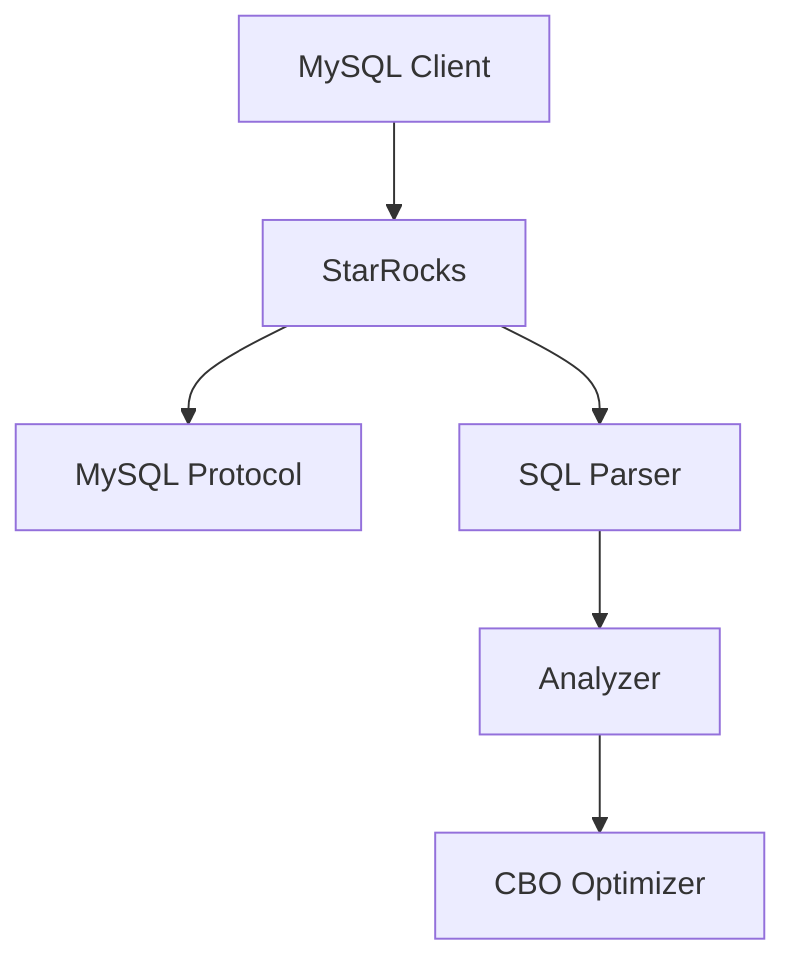
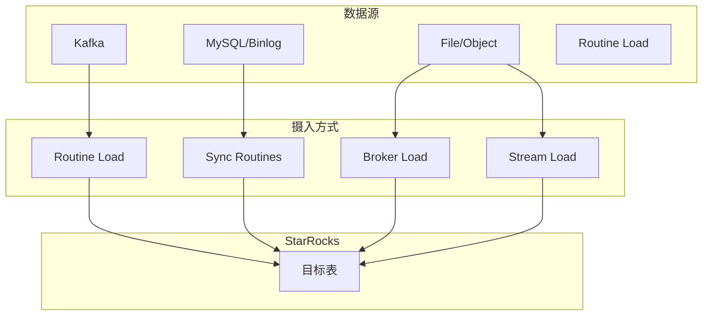
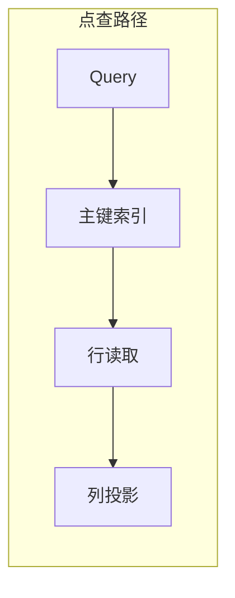
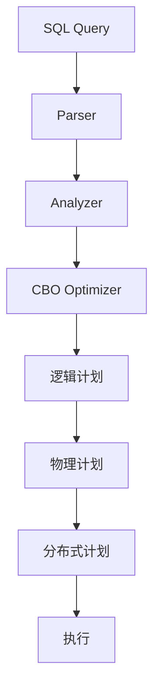

# StarRocks 核心特性

## 学习目标

- 掌握 StarRocks 的 SQL 兼容性和 MySQL 协议
- 理解 StarRocks 的实时数据摄入能力
- 了解 CBO 优化器和物化视图的高级特性

## SQL 兼容性

StarRocks 高度兼容 MySQL 协议和语法，降低迁移成本。



### MySQL 兼容语法

```sql
-- 常用 MySQL 语法
SHOW DATABASES;
SHOW TABLES;
SHOW CREATE TABLE users;
DESCRIBE users;

-- 常见函数
SELECT concat('Hello', ' ', 'World');
SELECT coalesce(null, 'default');
SELECT if(status = 1, 'active', 'inactive');

-- 窗口函数
SELECT
    user_id,
    amount,
    row_number() OVER (PARTITION BY user_id ORDER BY amount DESC) AS rank
FROM orders;

-- CTAS
CREATE TABLE new_users AS
SELECT * FROM users WHERE status = 1;
```

### 连接方式

```bash
# 使用 MySQL 客户端连接 StarRocks
mysql -h 127.0.0.1 -P 9030 -u root -p

# JDBC 连接
# Class: com.mysql.cj.jdbc.Driver
# URL: jdbc:mysql://127.0.0.1:9030
```

## 实时数据摄入

StarRocks 提供多种实时数据摄入方式。



### Routine Load

Kafka 实时摄入的最佳方式：

```sql
-- 创建 Routine Load
CREATE ROUTINE LOAD routine_orders ON orders
COLUMNS (order_id, user_id, amount, order_time)
PROPERTIES (
    "desired_concurrent_number" = "3",
    "max_batch_interval" = "20",
    "max_batch_rows" = "100000",
    "max_error_number" = "1000"
)
FROM KAFKA (
    "kafka_broker_list" = "kafka1:9092,kafka2:9092",
    "kafka_topic" = "orders",
    "kafka_partitions" = "0,1,2,3",
    "kafka_offsets" = "OFFSET_BEGINNING"
);

-- 查看负载状态
SHOW ROUTINE LOAD;

-- 暂停/恢复负载
PAUSE ROUTINE LOAD FOR routine_orders;
RESUME ROUTINE LOAD FOR routine_orders;
```

### Stream Load

文件快速导入：

```bash
# 通过 HTTP 导入 CSV 文件
curl -X PUT -u root: \
    -H "Expect:100-continue" \
    -H "column_separator:," \
    -H "row_separator:\n" \
    -T /tmp/orders.csv \
    http://127.0.0.1:8030/api/db/orders/_stream_load

# 导入 JSON 格式
curl -X PUT -u root: \
    -H "format: json" \
    -H "strip_outer_array: true" \
    -T /tmp/orders.json \
    http://127.0.0.1:8030/api/db/orders/_stream_load
```

### Broker Load

大数据量导入：

```sql
-- 创建 Broker Load 作业
LOAD LABEL db.order_load (
    DATA INFILE("hdfs://namenode/data/orders/*.csv")
    INTO TABLE orders
    COLUMNS TERMINATED BY ","
    (order_id, user_id, amount, order_time)
)
WITH BROKER broker_name (
    "hadoop.security.authentication" = "kerberos",
    "kerberos_principal" = "user@REALM"
)
PROPERTIES (
    "timeout" = "3600",
    "max_filter_ratio" = "0.1"
);

-- 查看导入状态
SHOW LOAD WHERE label = 'order_load';
```

## 高并发点查

StarRocks 针对高并发点查场景进行了专门优化。



### 点查优化

```sql
-- 主键模型支持高效点查
CREATE TABLE user_sessions (
    user_id BIGINT,
    session_id VARCHAR(64),
    last_activity DATETIME,
    status INT
)
ENGINE = OLAP
PRIMARY KEY(user_id, session_id)
ORDER BY user_id, session_id
DISTRIBUTED BY HASH(user_id) BUCKETS 10;

-- 点查优化
SELECT * FROM user_sessions
WHERE user_id = 12345
  AND session_id = 'abc123';

-- 批量点查
SELECT * FROM user_sessions
WHERE (user_id, session_id) IN (
    (12345, 'abc123'),
    (12346, 'def456'),
    (12347, 'ghi789')
);
```

### 主键索引

```cpp
// StarRocks 主键索引实现

class PrimaryIndex {
public:
    // 主键查找
    Status get(const Slice& key, uint64_t* rowset_id, uint32_t* row_id);

    // 批量查找
    Status get_batch(const std::vector<Slice>& keys,
                     std::vector<uint64_t>* rowset_ids,
                     std::vector<uint32_t>* row_ids);

    // 更新
    Status upsert(uint64_t rowset_id, uint32_t row_id, const Slice& key);

    // 删除
    Status erase(const Slice& key);
};
```

## CBO 优化器

StarRocks 使用基于代价的优化器（CBO）生成高效执行计划。



### 优化规则

```sql
-- 自动优化示例

-- 1. 谓词下推
SELECT * FROM orders o
JOIN customers c ON o.customer_id = c.id
WHERE c.country = 'CN';

-- 优化为：
-- 先过滤 customers（谓词下推）
-- 再与 orders join

-- 2. 列裁剪
SELECT count(*) FROM orders;

-- 优化为：只读取需要的 count 列

-- 3. Join 重排
SELECT * FROM a, b, c
WHERE a.id = b.a_id AND b.id = c.b_id;

-- CBO 自动选择最优 Join 顺序
```

### 统计信息

```sql
-- 手动收集统计信息
ANALYZE TABLE orders;

-- 查看统计信息
SHOW TABLE STATS orders;

-- 采样收集
ANALYZE TABLE orders SAMPLE 100000 ROWS;

-- 自动收集
CREATE STATISTICS AUTO ON orders;
```

## 物化视图高级特性

### 多表物化视图

```sql
-- 创建多表 Join 物化视图
CREATE MATERIALIZED VIEW mv_user_orders AS
SELECT
    c.customer_id,
    c.country,
    o.order_date,
    SUM(o.amount) AS total_amount,
    COUNT(*) AS order_count
FROM customers c
JOIN orders o ON c.customer_id = o.customer_id
WHERE c.country IN ('CN', 'US', 'JP')
GROUP BY c.customer_id, c.country, o.order_date;

-- 查询自动改写
SELECT
    country,
    SUM(total_amount) AS total
FROM mv_user_orders
GROUP BY country;
```

### 分区物化视图

```sql
-- 按分区增量刷新
CREATE MATERIALIZED VIEW mv_hourly
PARTITION BY date_trunc('day', order_time)
BUILD REFRESH ASYNC
AS
SELECT
    date_trunc('hour', order_time) AS hour,
    product_id,
    SUM(amount) AS total
FROM orders
GROUP BY 1, 2;
```

### 物化视图函数

```sql
-- 时间滚动物化视图
CREATE MATERIALIZED VIEW mv_daily
PARTITION BY date_trunc('day', order_time)
AS
SELECT
    date_trunc('day', order_time) AS day,
    user_id,
    COUNT(*) AS cnt,
    APPROX_COUNT_DISTINCT(session_id) AS unique_sessions
FROM events
GROUP BY 1, 2;
```

## 数据导入导出

### 导出到 S3/HDFS

```sql
-- 导出到 S3
EXPORT TABLE orders
TO "s3://bucket/export/orders"
WITH (FORMAT = "parquet")
PROPERTIES (
    "aws.s3.access_key" = "xxx",
    "aws.s3.secret_key" = "xxx",
    "aws.s3.region" = "us-east-1"
);
```

### 数据格式

```sql
-- 支持的数据格式
-- CSV, Parquet, ORC, JSON

-- 导入 Parquet
curl -X PUT -u root: \
    -H "format: parquet" \
    -T /tmp/orders.parquet \
    http://127.0.0.1:8030/api/db/orders/_stream_load
```

## 要点总结

1. **MySQL 兼容**：协议和语法高度兼容，迁移成本低
2. **实时摄入**：Routine Load/Stream Load/Broker Load 多种方式
3. **高并发点查**：主键索引优化，支持批量点查
4. **CBO 优化器**：基于代价的查询优化，自动选择最优计划
5. **物化视图**：多表 Join、分区增量刷新、查询自动改写
6. **数据湖**：原生支持 Hive/Iceberg/Hudi 联邦查询

## 思考题

1. Routine Load 和 Stream Load 分别适合什么场景？
2. StarRocks 的 CBO 优化器如何估算代价？关键统计信息有哪些？
3. 物化视图的查询改写是如何实现的？
4. 在高并发点查场景下，StarRocks 如何保证低延迟？
