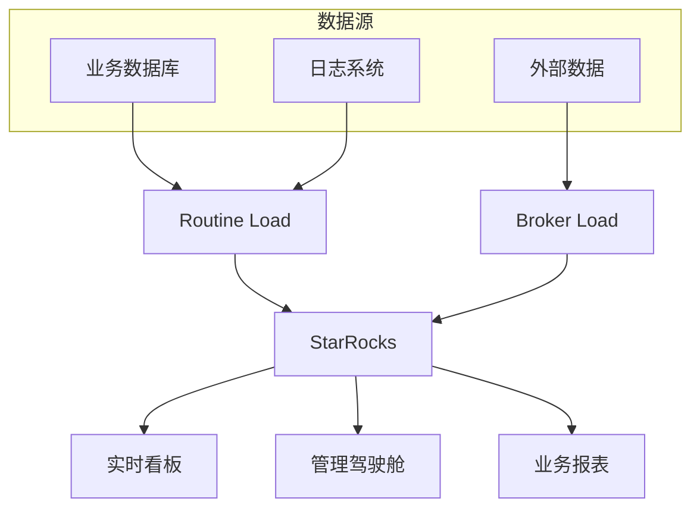
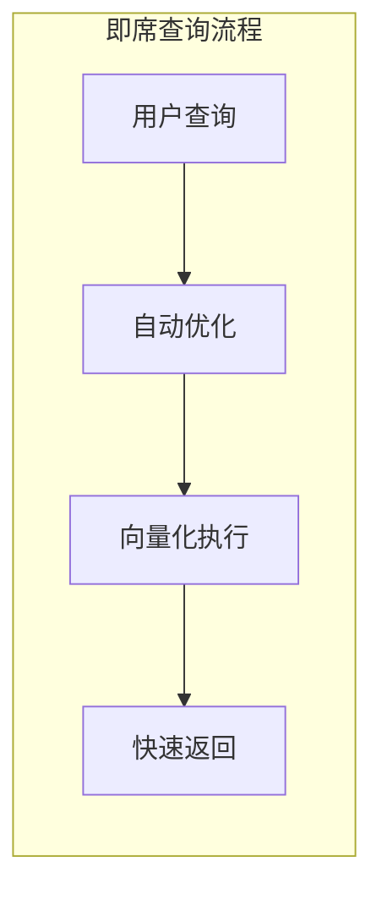
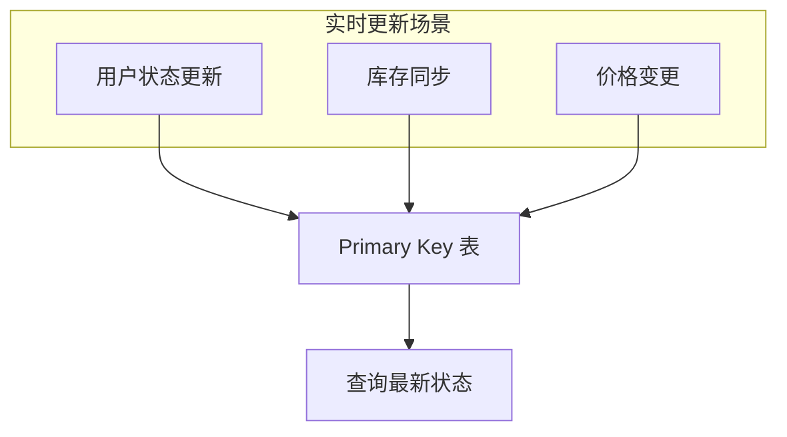
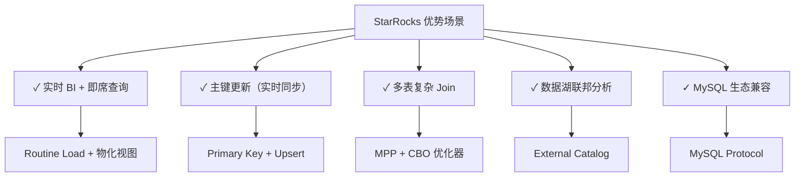

# StarRocks 典型应用场景

## 学习目标

- 了解 StarRocks 在实时 BI 分析中的应用
- 掌握 StarRocks 的即席查询和主键更新场景
- 理解 StarRocks 与其他 OLAP 数据库的选型对比

## 实时 BI 分析

StarRocks 是实时 BI 分析的理想选择，兼顾实时性和查询性能。



### 实时 BI 表设计

```sql
-- 创建实时订单表
CREATE TABLE dwd_orders (
    order_id BIGINT,
    order_time DATETIME,
    user_id BIGINT,
    product_id BIGINT,
    category_id BIGINT,
    brand_id BIGINT,
    amount DECIMAL(12, 2),
    quantity INT,
    status TINYINT
)
ENGINE = OLAP
DUPLICATE KEY(order_id, order_time)
PARTITION BY RANGE (order_time) (
    PARTITION p202401 VALUES LESS THAN ('2024-02-01'),
    PARTITION p202402 VALUES LESS THAN ('2024-03-01'),
    PARTITION p202403 VALUES LESS THAN ('2024-04-01')
)
DISTRIBUTED BY HASH(order_id) BUCKETS 10;

-- 创建实时指标表
CREATE TABLE ads_daily_metrics (
    stat_date DATE,
    hour INT,
    category_id BIGINT,
    brand_id BIGINT,
    order_count BIGINT,
    order_amount DECIMAL(16, 2),
    user_count BIGINT
)
ENGINE = OLAP
AGGREGATE KEY(stat_date, hour, category_id, brand_id)
DISTRIBUTED BY HASH(stat_date, hour) BUCKETS 10;

-- 创建预聚合物化视图
CREATE MATERIALIZED VIEW mv_hourly_category AS
SELECT
    date_trunc('hour', order_time) AS hour,
    category_id,
    brand_id,
    SUM(amount) AS total_amount,
    COUNT(*) AS order_count,
    COUNT(DISTINCT user_id) AS user_count
FROM dwd_orders
GROUP BY 1, 2, 3;
```

### 实时 BI 查询

```sql
-- 1. 实时 GMV 监控
SELECT
    date_trunc('minute', NOW()) AS minute,
    SUM(amount) AS gmv,
    COUNT(*) AS orders
FROM dwd_orders
WHERE order_time >= DATE_SUB(NOW(), INTERVAL 1 HOUR);

-- 2. 分品类实时销售排名
SELECT
    category_id,
    SUM(amount) AS total_amount,
    COUNT(*) AS order_count
FROM dwd_orders
WHERE DATE(order_time) = CURRENT_DATE
GROUP BY category_id
ORDER BY total_amount DESC
LIMIT 20;

-- 3. 用户实时画像
SELECT
    c.category_name,
    COUNT(DISTINCT o.user_id) AS buyers,
    SUM(o.amount) AS gmv
FROM dwd_orders o
JOIN dim_category c ON o.category_id = c.id
WHERE o.order_time >= DATE_SUB(NOW(), INTERVAL 24 HOUR)
GROUP BY c.category_name
ORDER BY gmv DESC;
```

## 即席查询

StarRocks 的向量化执行引擎非常适合即席查询场景。



### 即席查询场景

```sql
-- 场景 1: 跨维度分析
SELECT
    date_trunc('week', order_time) AS week,
    CASE
        WHEN amount < 100 THEN 'small'
        WHEN amount < 1000 THEN 'medium'
        ELSE 'large'
    END AS order_type,
    COUNT(*) AS cnt
FROM dwd_orders
WHERE order_time >= DATE_SUB(CURRENT_DATE, INTERVAL 90 DAY)
GROUP BY 1, 2
ORDER BY 1, 2;

-- 场景 2: 用户行为分析
WITH session_events AS (
    SELECT
        user_id,
        session_id,
        MIN(order_time) AS session_start,
        MAX(order_time) AS session_end,
        COUNT(*) AS event_count
    FROM events
    WHERE order_time >= DATE_SUB(CURRENT_DATE, INTERVAL 7 DAY)
    GROUP BY user_id, session_id
)
SELECT
    DATE(session_start) AS date,
    AVG(TIMESTAMPDIFF(MINUTE, session_start, session_end)) AS avg_session_minutes,
    AVG(event_count) AS avg_events_per_session
FROM session_events
GROUP BY DATE(session_start)
ORDER BY date;

-- 场景 3: 漏斗分析
WITH funnel AS (
    SELECT
        user_id,
        MAX(CASE WHEN step = 1 THEN 1 ELSE 0 END) AS viewed,
        MAX(CASE WHEN step = 2 THEN 1 ELSE 0 END) AS added_to_cart,
        MAX(CASE WHEN step = 3 THEN 1 ELSE 0 END) AS checkout,
        MAX(CASE WHEN step = 4 THEN 1 ELSE 0 END) AS purchased
    FROM user_funnel
    WHERE event_date = CURRENT_DATE
    GROUP BY user_id
)
SELECT
    'conversion' AS metric,
    SUM(viewed) AS views,
    SUM(added_to_cart) AS carts,
    SUM(checkout) AS checkouts,
    SUM(purchased) AS purchases,
    ROUND(SUM(purchased) * 100.0 / SUM(viewed), 2) AS overall_cvr
FROM funnel;
```

### 查询性能对比

| 查询类型 | StarRocks | ClickHouse | Druid |
|---------|-----------|------------|-------|
| 单表聚合 | 快 | 极快 | 快 |
| 多表 Join | 快 | 中 | 慢 |
| 复杂子查询 | 快 | 中 | 慢 |
| 即席 Ad-hoc | 快 | 快 | 中 |
| 点查 | 中 | 慢 | 快 |

## 主键更新场景

StarRocks 的主键模型非常适合需要频繁更新的场景。



### 用户状态同步

```sql
-- 创建用户状态表
CREATE TABLE dim_user_status (
    user_id BIGINT PRIMARY KEY,
    username VARCHAR(50),
    email VARCHAR(100),
    phone VARCHAR(20),
    vip_level TINYINT,
    balance DECIMAL(12, 2),
    status TINYINT,
    last_login DATETIME,
    update_time DATETIME
)
ENGINE = OLAP
PRIMARY KEY(user_id)
ORDER BY user_id
DISTRIBUTED BY HASH(user_id) BUCKETS 10
PROPERTIES (
    "replication_num" = "1"
);

-- 同步用户状态（Upsert）
INSERT INTO dim_user_status (user_id, username, vip_level, status, last_login, update_time)
VALUES
    (10001, 'alice', 3, 1, NOW(), NOW()),
    (10002, 'bob', 2, 1, NOW(), NOW())
ON DUPLICATE KEY UPDATE
    vip_level = VALUES(vip_level),
    status = VALUES(status),
    last_login = VALUES(last_login),
    update_time = VALUES(update_time);

-- 查询最新状态
SELECT * FROM dim_user_status WHERE user_id = 10001;
```

### 实时库存管理

```sql
-- 创建库存表
CREATE TABLE fact_inventory (
    sku_id BIGINT,
    warehouse_id BIGINT,
    quantity INT,
    reserved INT,
    update_time DATETIME
)
ENGINE = OLAP
PRIMARY KEY(sku_id, warehouse_id)
ORDER BY sku_id, warehouse_id
DISTRIBUTED BY HASH(sku_id) BUCKETS 10;

-- 扣减库存
INSERT INTO fact_inventory (sku_id, warehouse_id, quantity, reserved, update_time)
VALUES (1001, 1, -1, 0, NOW())
ON DUPLICATE KEY UPDATE
    quantity = quantity + VALUES(quantity),
    update_time = VALUES(update_time);

-- 查询可用库存
SELECT
    sku_id,
    warehouse_id,
    quantity - reserved AS available
FROM fact_inventory
WHERE sku_id IN (1001, 1002, 1003);
```

### 订单状态流转

```sql
-- 创建订单状态表
CREATE TABLE dwd_order_status (
    order_id BIGINT PRIMARY KEY,
    user_id BIGINT,
    status INT,
    payment_status TINYINT,
    shipping_status TINYINT,
    create_time DATETIME,
    update_time DATETIME
)
ENGINE = OLAP
PRIMARY KEY(order_id)
ORDER BY order_id
DISTRIBUTED BY HASH(order_id) BUCKETS 10;

-- 更新订单状态
UPDATE dwd_order_status
SET payment_status = 2,
    update_time = NOW()
WHERE order_id = 12345
  AND payment_status = 1;

-- 批量更新
INSERT INTO dwd_order_status (order_id, payment_status, update_time)
SELECT order_id, 2, NOW()
FROM pending_payments
ON DUPLICATE KEY UPDATE
    payment_status = VALUES(payment_status),
    update_time = VALUES(update_time);
```

## 场景选型建议

| 场景 | StarRocks | ClickHouse | Druid |
|------|-----------|------------|-------|
| 实时 BI 报表 | 推荐 | 可选 | 可选 |
| 即席查询 | 推荐 | 推荐 | 中 |
| 主键更新 | **首选** | 不推荐 | 不支持 |
| 日志分析 | 可选 | **首选** | 可选 |
| 用户行为分析 | 推荐 | **首选** | 可选 |
| 实时监控 | 可选 | 可选 | **首选** |
| 数据湖分析 | **首选** | 需配置 | 有限 |
| 多表 Join | **首选** | 中 | 慢 |

## StarRocks 优势场景



## 要点总结

1. **实时 BI**：Routine Load + 物化视图 + 秒级延迟
2. **即席查询**：向量化执行 + CBO 优化 + 快速响应
3. **主键更新**：Primary Key 模型 + 高效 Upsert
4. **场景选型**：主键更新选 StarRocks，海量日志选 ClickHouse
5. **MySQL 兼容**：协议和语法兼容，迁移成本低
6. **数据湖**：原生支持 Hive/Iceberg/Hudi 联邦查询

## 思考题

1. 在实时 BI 场景中，如何设计表结构和物化视图来平衡实时性和查询性能？
2. StarRocks 的主键模型与 MySQL 的主键有什么本质区别？
3. 在什么场景下应该使用聚合模型而不是主键模型？
4. StarRocks 如何保证多副本间的数据一致性？
