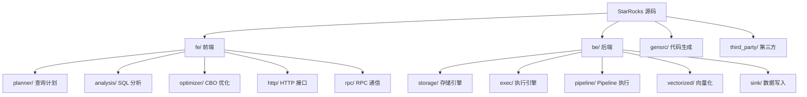
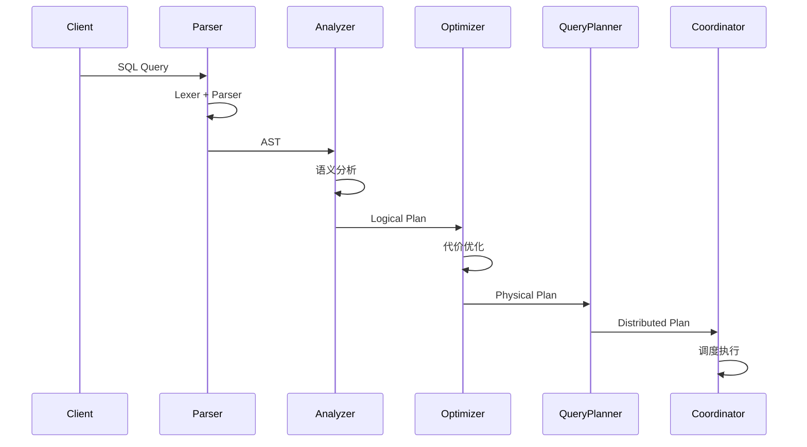
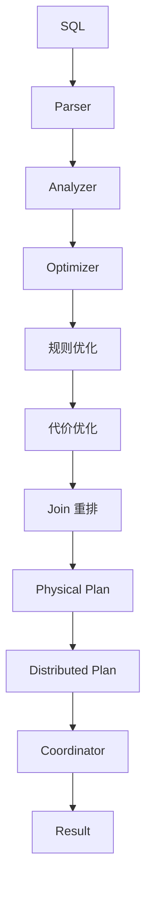
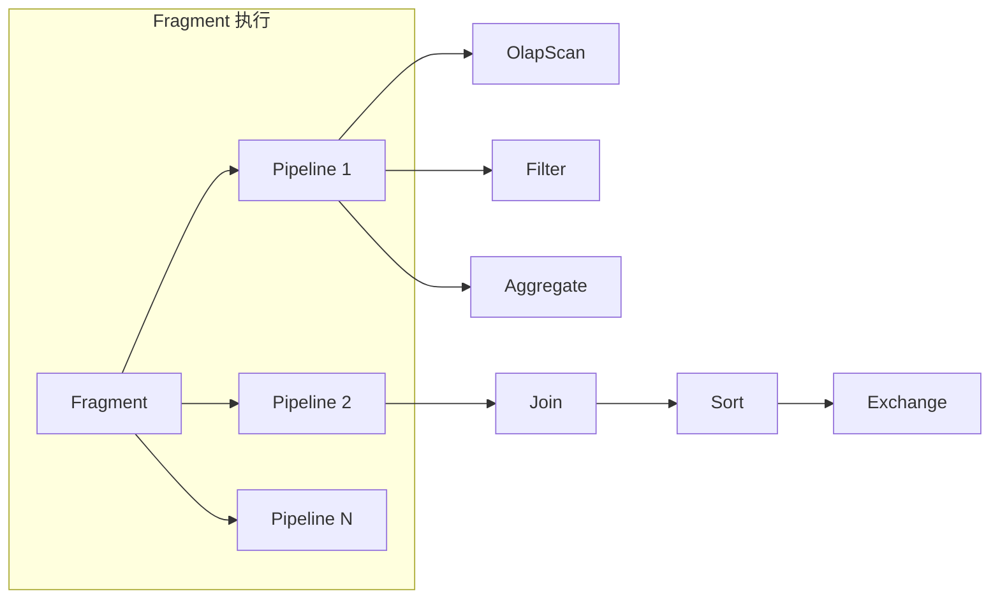

# StarRocks 源码阅读指南

## 学习目标

- 掌握 StarRocks 源码的目录结构和核心模块
- 理解 FE 端 Planner 和 BE 端 Storage 的实现
- 了解向量化执行引擎的关键代码

## 源码结构概览



### 核心目录

| 目录 | 说明 |
|------|------|
| `fe/fe-core/src/main/java/com/starrocks/planner/` | 查询计划器 |
| `fe/fe-core/src/main/java/com/starrocks/optimizer/` | CBO 优化器 |
| `be/src/storage/` | 存储引擎核心 |
| `be/src/exec/` | 执行引擎 |
| `be/src/runtime/` | 运行时环境 |

## Frontend 核心模块

### 查询解析与计划



### Planner 核心类

```java
// fe/fe-core/src/main/java/com/starrocks/planner/

// 查询计划器
public class QueryPlanner {
    // 单表查询规划
    public SingleNodePlanner createSingleNodePlan();

    // 分布式查询规划
    public DistributedPlanPlan createDistributedPlan();
}

// 扫描计划节点
public class OlapScanNode extends ScanNode {
    // 表信息
    private OlapTable table;

    // 分区选择
    private List<Long> selectedPartitionIds;

    // 分桶选择
    private List<Long> selectedBucketSeqs;

    // 列投影
    private List<Integer> outputColumnIndexes;
}
```

### CBO 优化器

```java
// fe/fe-core/src/main/java/com/starrocks/optimizer/

// 基于代价的优化器
public class Optimizer {
    // 1. 规则优化（RBO）
    public Memo memo;

    // 2. 代价估算
    public StatsCalculator statsCalculator;

    // 3. 优化规则应用
    public RuleDispatcher ruleDispatcher;

    // 执行优化
    public OptExpression optimize(OptExpression root);
}

// 代价模型
public class CostModel {
    // 扫描代价
    public CostEstimate computeScanCost(OlapScanNode node);

    // Join 代价
    public CostEstimate computeJoinCost(JoinNode node);

    // 聚合代价
    public CostEstimate computeAggCost(AggregationNode node);
}

// 统计信息
public class TableStats {
    public long rowCount;           // 行数
    public Map<ColumnRef, ColumnStats> columnStats;  // 列统计
}
```

### 关键文件

```java
// 关键文件速查
fe/fe-core/src/main/java/com/starrocks/
├── planner/
│   ├── QueryPlanner.java        # 查询计划入口
│   ├── SingleNodePlanner.java   # 单节点规划
│   ├── DistributedPlanner.java  # 分布式规划
│   ├── OlapScanNode.java       # Olap 扫描节点
│   └── AggregationNode.java    # 聚合节点
├── optimizer/
│   ├── Optimizer.java          # CBO 优化器入口
│   ├── cost/
│   │   └── CostModel.java      # 代价模型
│   ├── stats/
│   │   └── StatsCalculator.java # 统计计算
│   └── rule/
│       └── PushDownAggRule.java # 下推规则
└── analysis/
    └── Analyzer.java            # 语义分析
```

## Backend 核心模块

### 存储引擎

```cpp
// be/src/storage/

// Tablet 元数据
class Tablet {
    // 分片信息
    std::vector<RowsetMetaPB> rowsets;

    // 版本信息
    std::vector<Version> versions;
    std::vector<Version> missed_versions;
};

// Rowset 数据行集
class Rowset {
    // 列数据
    std::vector<ColumnReaderPtr> column_readers;

    // 索引数据
    std::vector<ColumnReaderPtr> index_readers;

    // 行数
    size_t num_rows();
};

// Segment 列数据
class Segment {
    // 列数据读取
    Status read_column(const Column& column, vectorized::Column* column_data);

    // 索引读取
    Status read_index(const Column& key, vectorized::Column* index_data);
};
```

### 向量化执行

```cpp
// be/src/exec/vectorized/

// 向量化扫描
class OlapScanner {
public:
    // 批量读取
    Status get_next(vectorized::Chunk* chunk);

private:
    // 列读取
    Status _read_column(const TabletColumn& column, vectorized::Column* column_data);

    // 谓词过滤
    Status _eval_conjuncts(vectorized::Chunk* chunk);
};

// 向量化聚合
class AggregateStreamSinkOperator {
public:
    // 批量更新聚合状态
    Status prepare(RuntimeState* state);

    // 添加批次
    Status push_chunk(RuntimeState* state, vectorized::Chunk* chunk);
};
```

### Pipeline 执行引擎

```cpp
// be/src/pipeline/

// Pipeline 执行框架
class Pipeline {
    // 操作符列表
    std::vector<std::unique_ptr<OperatorFactory>> _operators;

    // 执行片段
    std::shared_ptr<PipelineFragmentContext> _fragment_context;
};

// 执行上下文
class PipelineFragmentContext {
    // 调度器
    PipelineDriverScheduler* _scheduler;

    // 本地执行
    Status execute_local();
};

// 调度器
class PipelineDriverScheduler {
    // 提交 Driver
    Status submit(PipelineDriver* driver);

    // 轮询执行
    void schedule();
};
```

### 关键文件

```cpp
// 关键文件速查
be/src/
├── storage/
│   ├── tablet.h/cpp             # Tablet 核心
│   ├── rowset.h/cpp            # Rowset 实现
│   ├── segment.h/cpp           # Segment 实现
│   ├── column_reader.h/cpp     # 列读取器
│   └── primary_index.h/cpp     # 主键索引
├── exec/
│   ├── olap_scan_node.h/cpp    # Olap 扫描节点
│   ├── aggregate_stream_sink.h.cpp  # 聚合算子
│   └── join_node.h/cpp         # Join 算子
├── pipeline/
│   ├── pipeline.h/cpp          # Pipeline 定义
│   ├── pipeline_driver.h/cpp   # Driver 执行
│   └── pipeline_fragment_context.h/cpp  # 片段上下文
└── runtime/
    ├── row_batch.h/cpp         # 行批次
    └── query_statistics.h/cpp  # 查询统计
```

## 查询执行流程

### FE 端流程



### BE 端流程



## 源码阅读路径

### 路径 1: FE Planner

```
fe/fe-core/src/main/java/com/starrocks/planner/
├── QueryPlanner.java          # 查询计划入口
│   ├── analyze                 # 语义分析
│   ├── createSingleNodePlan   # 单节点计划
│   └── createDistributedPlan  # 分布式计划
│
├── SingleNodePlanner.java     # 单节点规划
│   ├── createOlapScanPlan    # Olap 扫描
│   ├── createAggPlan         # 聚合计划
│   └── createJoinPlan        # Join 计划
│
└── DistributedPlanner.java    # 分布式规划
    ├── createFragments        # 创建片段
    └── computeFragmentInstances  # 计算实例
```

### 路径 2: BE Storage

```
be/src/storage/
├── tablet_manager.h/cpp       # Tablet 管理
│   ├── create_tablet         # 创建 Tablet
│   ├── get_tablet            # 获取 Tablet
│   └── load_tablet           # 加载 Tablet
│
├── tablet.h/cpp               # Tablet 核心
│   ├── version_manager       # 版本管理
│   ├── rowset_manager        # Rowset 管理
│   └── cursor                # 扫描游标
│
├── rowset.h/cpp              # Rowset 实现
│   ├── load                  # 加载 Rowset
│   └── make_snapshot         # 快照
│
└── segment.h/cpp             # Segment 实现
    ├── read_column           # 读取列
    └── read_index            # 读取索引
```

### 路径 3: 向量化执行

```
be/src/exec/vectorized/
├── olap_scan_node.h/cpp      # Olap 扫描节点
│   ├── prepare               # 准备阶段
│   ├── open                  # 打开
│   └── get_next              # 获取下一批
│
├── aggregate_stream_sink.h/cpp  # 聚合算子
│   ├── prepare               # 准备聚合器
│   ├── sink                  # 接收数据
│   └── close                 # 关闭
│
└── join_node.h/cpp           # Join 节点
    ├── build                 # 构建哈希表
    └── probe                 # 探测
```

## 关键文件速查表

| 文件 | 语言 | 说明 |
|------|------|------|
| `fe/planner/QueryPlanner.java` | Java | FE 查询计划入口 |
| `fe/optimizer/Optimizer.java` | Java | CBO 优化器 |
| `be/storage/tablet.h` | C++ | Tablet 核心 |
| `be/storage/rowset.h` | C++ | Rowset 实现 |
| `be/exec/vectorized/olap_scan_node.cpp` | C++ | Olap 扫描 |
| `be/pipeline/pipeline_driver.h` | C++ | Pipeline 执行 |

## 推荐的阅读顺序

1. **FE Planner**：`QueryPlanner.java` - 理解查询计划生成
2. **CBO Optimizer**：`Optimizer.java` - 理解代价优化
3. **BE Storage**：`tablet.h/cpp` - 理解 Tablet 管理
4. **向量化扫描**：`olap_scan_node.cpp` - 理解向量化执行
5. **Pipeline**：`pipeline_driver.h/cpp` - 理解并行执行

## 外部资源

- 官方文档: https://docs.starrocks.io/
- GitHub: https://github.com/StarRocks/starrocks
- 技术博客: https://www.starrocks.io/blog
- 社区: https://forum.starrocks.io/

## 要点总结

1. **FE 模块**：Planner + Optimizer + Coordinator
2. **BE 模块**：Storage + Pipeline + Vectorized Execution
3. **CBO 优化器**：基于代价的查询优化
4. **存储引擎**：Tablet + Rowset + Segment 层次结构
5. **向量化执行**：批量处理 + SIMD 加速
6. **Pipeline**：算子流水线并行执行

## 思考题

1. StarRocks 的 CBO 优化器与 Apache Calcite 的关系是什么？
2. Tablet 的版本管理机制是如何实现的？
3. 向量化执行中如何处理 NULL 值？
4. Pipeline 执行引擎的调度策略是什么？
