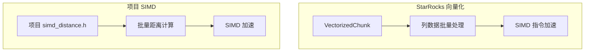
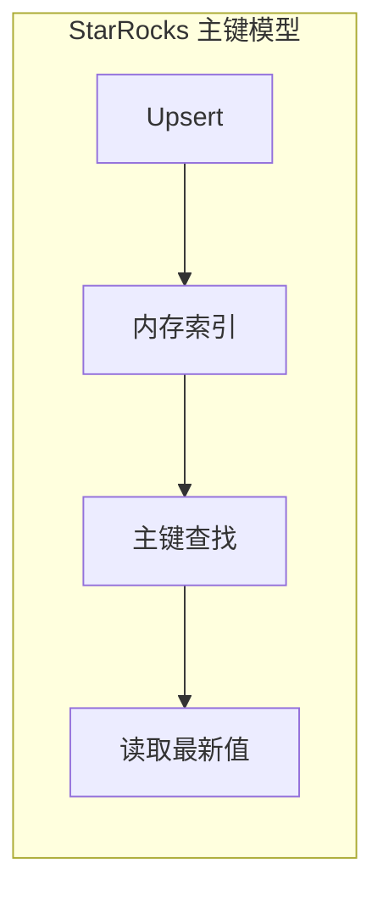

# StarRocks 与项目关联

## 学习目标

- 理解 StarRocks 的向量化执行与项目 SIMD 优化的对应关系
- 掌握 StarRocks 主键模型与项目 MVCC 设计的关联
- 借鉴 StarRocks 设计优化项目存储架构

## 向量化执行与项目 SIMD 优化

### 架构对比



### 项目已有 SIMD 实现

项目 `engineering/src/algo/simd/` 目录下已有 SIMD 算法：

```c
// 项目 SIMD 接口
#include "algo/simd/simd_distance.h"

// 欧氏距离（已有实现）
void simd_float_euclidean_distance(
    const float *a,
    const float *b,
    float *result,
    size_t n);

// 曼哈顿距离（可扩展）
void simd_float_manhattan_distance(
    const float *a,
    const float *b,
    float *result,
    size_t n);
```

### StarRocks 向量化模式借鉴

StarRocks 的向量化执行模式可以借鉴到项目中：

```c
// 项目可实现的向量化执行模式
#include "exec/vectorized_executor.h"

// 向量块（Column Batch）
typedef struct {
    Column **columns;        // 列数组
    uint32_t num_columns;     // 列数
    uint32_t num_rows;         // 行数
    uint64_t capacity;        // 容量
} VectorizedChunk;

// 向量化扫描器
typedef struct {
    TableScanOperator base;

    // 列数据
    VectorizedChunk *chunk;

    // 谓词过滤
    Expr *predicate;

    // 批量读取
    Status (*next_batch)(VectorizedScanOperator *op, uint32_t batch_size);
} VectorizedScanOperator;

// 向量化过滤
typedef struct {
    Expr *expr;               // 过滤表达式
    uint8_t *result_mask;     // 结果位图
} VectorizedFilter;

// SIMD 优化的批量过滤
static inline void simd_filter(
    const uint8_t *data,
    size_t n,
    uint8_t predicate,
    uint8_t *result) {
    // SIMD 批量比较
    for (size_t i = 0; i < n; i += 16) {
        __m128 mask = _mm_set1_epi8(predicate);
        __m128 chunk = _mm_loadu_si128((__m128i *)&data[i]);
        __m128 cmp = _mm_cmpeq_epi8(chunk, mask);
        _mm_storeu_si128((__m128i *)&result[i], cmp);
    }
}
```

### 项目可扩展的向量化算子

```c
// 项目可实现的向量化聚合
#include "exec/vectorized_aggregate.h"

// 向量聚合器接口
typedef struct {
    AggregationType type;      // SUM/COUNT/MIN/MAX/AVG
    void *state;             // 聚合状态

    // 批量更新
    void (*update_batch)(
        void *state,
        const VectorizedChunk *chunk,
        uint32_t col_idx);

    // 获取结果
    void *(*finalize)(void *state);
} VectorizedAggregator;

// 向量化 SUM
static void vec_sum_batch(
    int64_t *state,
    const int64_t *data,
    size_t n) {
    // SIMD 批量求和
    __m256i sum = _mm256_setzero_si256();

    for (size_t i = 0; i < n; i += 8) {
        __m256i chunk = _mm256_loadu_si256((__m256i *)&data[i]);
        sum = _mm256_add_epi64(sum, chunk);
    }

    // 水平加法
    int64_t result[4];
    _mm256_storeu_si256((__m256i *)result, sum);
    *state = result[0] + result[1] + result[2] + result[3];
}
```

## 主键模型与项目 MVCC 设计

### StarRocks 主键模型



### 项目 MVCC 设计

项目可借鉴 StarRocks 的主键模型设计 MVCC：

```c
// 项目可实现的 MVCC 设计
#include "db/mvcc.h"

// 版本链
typedef struct VersionNode {
    uint64_t version_id;       // 版本号
    uint64_t txn_id;          // 事务 ID
    uint8_t *data;            // 版本数据
    struct VersionNode *prev; // 前一个版本
    struct VersionNode *next; // 后一个版本
    bool is_visible;          // 是否可见
} VersionNode;

// MVCC 记录
typedef struct {
    uint64_t primary_key;     // 主键
    VersionNode *version_chain;  // 版本链

    // 主键索引
    uint64_t rowset_id;       // 所属 Rowset
    uint32_t row_id;          // 行号
} MVVCRow;

// 可见性判断
bool mvcc_is_visible(
    MVCCTransaction *txn,
    VersionNode *version) {
    // 1. 检查版本号
    if (version->txn_id > txn->snapshot.max_tid) {
        return false;  // 未来版本
    }

    // 2. 检查事务状态
    if (txn->is_active(version->txn_id)) {
        return false;  // 未提交事务的版本
    }

    // 3. 检查隔离级别
    if (txn->isolation_level == READ_COMMITTED) {
        return true;
    } else if (txn->isolation_level == REPEATABLE_READ) {
        return version->txn_id <= txn->snapshot.min_active_tid;
    }

    return false;
}

// 主键查找
Status mvcc_get(
    MVCCStorage *storage,
    uint64_t primary_key,
    uint64_t txn_id,
    uint8_t *result) {
    // 1. 查找主键索引
    MVVCRow *row = primary_index_get(
        &storage->primary_index,
        primary_key);

    if (row == NULL) {
        return Status::NotFound();
    }

    // 2. 遍历版本链查找可见版本
    VersionNode *visible = NULL;
    for (VersionNode *v = row->version_chain; v != NULL; v = v->next) {
        if (mvcc_is_visible_txn(storage, txn_id, v)) {
            visible = v;
            break;
        }
    }

    if (visible == NULL) {
        return Status::NotVisible();
    }

    // 3. 复制数据
    memcpy(result, visible->data, visible->size);
    return Status::OK();
}
```

### 写入时复制（Copy-on-Write）

```c
// 项目可实现的 CoW 写入
Status mvcc_write(
    MVCCStorage *storage,
    uint64_t primary_key,
    const uint8_t *data,
    size_t size) {
    // 1. 查找现有版本
    MVVCRow *row = primary_index_get(
        &storage->primary_index,
        primary_key);

    // 2. 创建新版本
    VersionNode *new_version = alloc_version_node(size);
    memcpy(new_version->data, data, size);
    new_version->txn_id = storage->current_txn_id;

    // 3. 插入版本链头部
    if (row != NULL) {
        new_version->next = row->version_chain;
    }
    row->version_chain = new_version;

    // 4. 标记新版本可见
    new_version->is_visible = true;

    return Status::OK();
}
```

## 物化视图与项目预聚合

### StarRocks 物化视图

```sql
-- StarRocks 物化视图
CREATE MATERIALIZED VIEW mv_hourly AS
SELECT
    date_trunc('hour', order_time) AS hour,
    product_id,
    SUM(amount) AS total_amount
FROM orders
GROUP BY 1, 2;
```

### 项目可实现的预聚合

```c
// 项目可实现的预聚合机制
#include "db/materialized_view.h"

// 物化视图定义
typedef struct {
    char name[256];
    TableSchema *source_schema;

    // 聚合维度
    Dimension *dimensions;
    uint32_t num_dimensions;

    // 聚合函数
    Aggregation *aggregations;
    uint32_t num_aggregations;

    // 目标表
    Table *target_table;

    // 刷新策略
    RefreshPolicy policy;
} MaterializedView;

// 刷新策略
typedef enum {
    REFRESH_IMMEDIATE,     // 立即刷新
    REFRESH_DEFERRED,      // 延迟刷新
    REFRESH_ASYNC,         // 异步刷新
    REFRESH_SCHEDULED      // 定时刷新
} RefreshPolicy;

// 物化视图刷新
Status mv_refresh(MaterializedView *mv) {
    // 1. 获取源表快照
    TableSnapshot *snapshot = table_snapshot(mv->source_table);

    // 2. 执行预聚合查询
    QueryPlan *plan = build_aggregation_plan(
        mv->dimensions,
        mv->aggregations,
        snapshot);

    // 3. 执行计划
    Chunk *result = execute_plan(plan);

    // 4. 写入目标表
    table_write(mv->target_table, result);

    return Status::OK();
}
```

## Pipeline 执行与项目并行查询

### StarRocks Pipeline 架构

```c
// StarRocks Pipeline 简化模型
typedef struct PipelineDriver {
    Pipeline *pipeline;           // 算子流水线
    size_t driver_id;             // Driver ID
    DriverQueue *queue;           // 调度队列

    // 执行状态
    PipelineDriverState state;
    size_t schedule_times;
} PipelineDriver;
```

### 项目可实现的并行查询

```c
// 项目可实现的并行查询
#include "exec/parallel_executor.h"

// 并行扫描任务
typedef struct {
    ScanRange *range;             // 扫描范围
    uint32_t thread_id;           // 线程 ID
    Chunk *result;                // 结果
} ScanTask;

// 并行扫描执行器
typedef struct {
    ThreadPool *pool;             // 线程池
    size_t num_threads;           // 并行度

    // 提交扫描任务
    Status (*submit)(ParallelExecutor *exec, ScanTask *task);

    // 等待完成
    Status (*wait)(ParallelExecutor *exec);
} ParallelExecutor;

// 并行扫描
Status parallel_scan(
    Table *table,
    ScanRange *ranges,
    size_t num_ranges,
    Chunk **results,
    size_t num_threads) {
    // 1. 创建执行器
    ParallelExecutor *exec = parallel_executor_create(num_threads);

    // 2. 提交任务到线程池
    for (size_t i = 0; i < num_ranges; i++) {
        ScanTask *task = scan_task_create(&ranges[i], &results[i]);
        parallel_executor_submit(exec, task);
    }

    // 3. 等待完成
    parallel_executor_wait(exec);

    return Status::OK();
}
```

## 列式存储与项目页面格式

### 项目可扩展的列式页面

```c
// 项目可实现的列式存储页面
#include "storage/columnar_page.h"

// 列式页面格式
typedef struct {
    // 页面头部
    uint32_t magic;               // 魔数
    uint32_t version;             // 版本
    uint16_t column_count;        // 列数
    uint32_t row_count;           // 行数
    CompressionCodec codec;        // 压缩算法

    // 列元数据
    ColumnMeta {
        ColumnType type;          // 列类型
        uint64_t offset;         // 数据偏移
        uint64_t size;           // 数据大小
        EncodingType encoding;   // 编码类型
        Statistics stats;        // 统计信息
    } columns[MAX_COLUMNS];

    // 数据区域
    uint8_t data[0];
} ColumnarPage;

// 读取列数据
Status columnar_page_read(
    const ColumnarPage *page,
    uint32_t col_idx,
    uint32_t offset,
    uint32_t count,
    void *result) {
    // 1. 获取列元数据
    const ColumnMeta *meta = &page->columns[col_idx];

    // 2. 计算数据位置
    const uint8_t *col_data = page->data + meta->offset + offset;

    // 3. 解压缩
    if (meta->codec != CODEC_NONE) {
        decompress(col_data, meta->size, result);
    } else {
        memcpy(result, col_data, count * get_type_size(meta->type));
    }

    return Status::OK();
}
```

## 要点总结

1. **向量化执行**：SIMD 批量处理，可借鉴到项目的 `algo/simd/` 模块
2. **主键模型**：MVCC 版本链设计，可实现 `db/mvcc.h`
3. **物化视图**：预聚合表，可实现 `db/materialized_view.h`
4. **Pipeline**：并行查询框架，可实现 `exec/parallel_executor.h`
5. **列式存储**：页面格式设计，可实现 `storage/columnar_page.h`
6. **项目扩展**：在现有模块基础上扩展新功能

## 思考题

1. 项目如何设计一个兼容 StarRocks 格式的导入导出接口？
2. MVCC 的版本链在什么情况下需要压缩？
3. 如何设计一个支持向量化执行和 SIMD 加速的聚合算子？
4. 物化视图的增量刷新如何实现？
