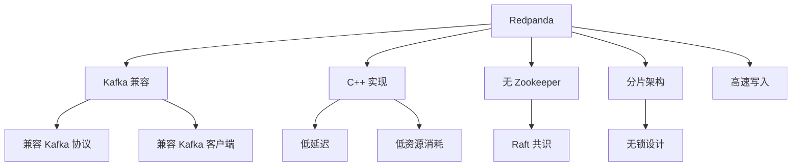

# Redpanda 项目概览

## 学习目标

- 了解 Redpanda 作为 Kafka 兼容高性能消息队列的定位
- 掌握 Redpanda 的 C++ 无 JVM 设计

## 项目定位

> Redpanda 是一个 Kafka 兼容的流数据平台，使用 C++ 实现，无 Zookeeper 依赖，性能更高。

**基本信息**：
- 开发方：Redpanda Data Inc.
- 首次发布：2021 年
- 开源协议：BSL 1.1
- GitHub Stars：约 9k

## 核心设计



## 核心特性

```bash
# Docker 启动
docker run -d --name redpanda \
  -p 9092:9092 -p 9644:9644 \
  docker.redpanda.com/redpandadata/redpanda:latest \
  redpanda start \
  --overprovisioned \
  --smp 1 \
  --memory 1G

# 创建主题
rpk topic create my-topic

# 生产消息
echo "hello, redpanda" | rpk topic produce my-topic

# 消费消息
rpk topic consume my-topic

# 查看集群状态
rpk cluster info
```

## 要点总结

- Kafka 100% 兼容
- C++ 实现，无 JVM
- Raft 自管理集群
- 分片架构，线性扩展
