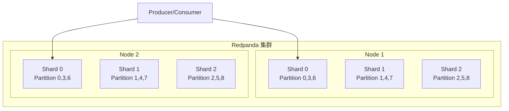
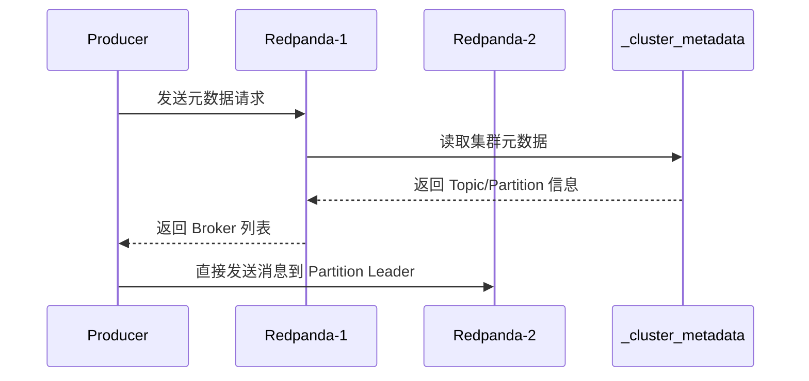
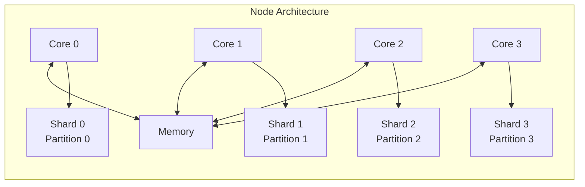
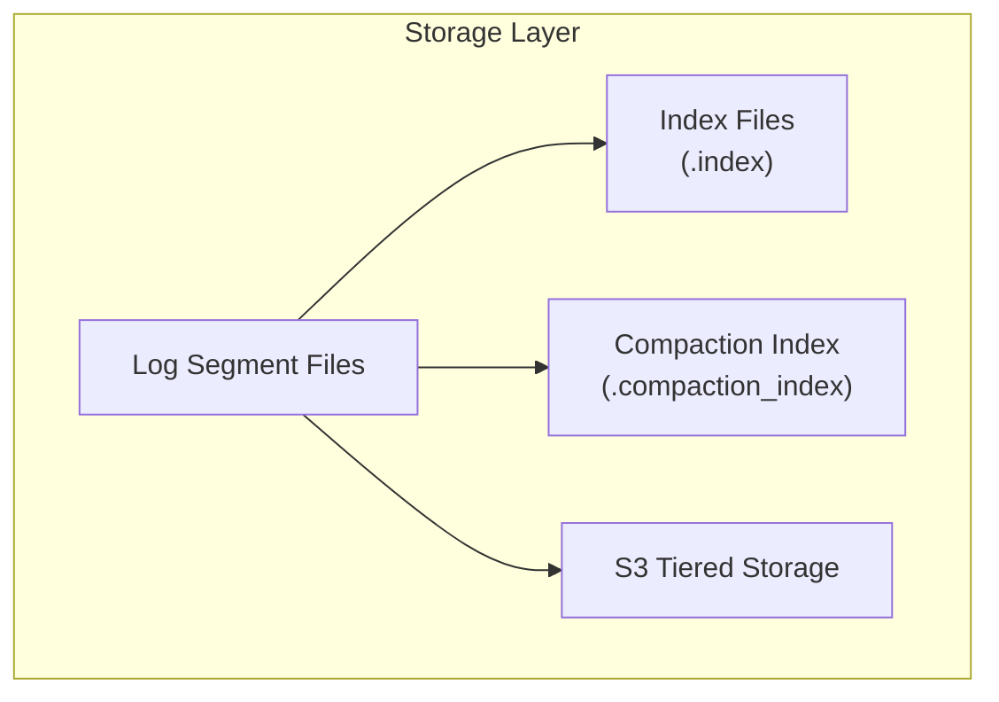
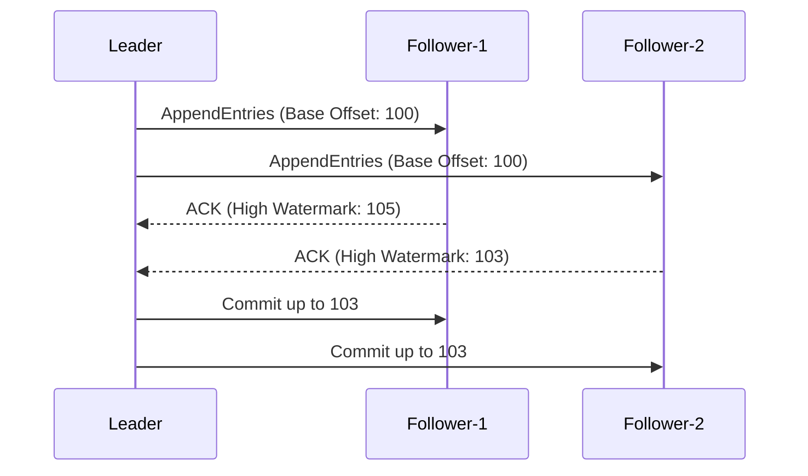

# Redpanda 架构

## 学习目标

- 理解 Redpanda 的核心架构设计理念（shard-per-core）
- 掌握 Redpanda 如何通过 Seastar 框架实现高性能异步 I/O
- 了解 Redpanda 的 Raft 复制和存储层设计

## 正文

### 1. 架构概览

Redpanda 是一个用 C++ 实现的高性能流数据平台，专为现代云原生环境设计。与传统 Kafka 基于 JVM 的架构不同，Redpanda 从零开始构建，追求极致性能和无运维负担。



### 2. 无 Zookeeper 设计

Redpanda 摒弃了 Kafka 对 Zookeeper 的依赖，将元数据管理内化到集群自身：

- **内部 Topic 存储元数据**：`_cluster_metadata` Topic 存储所有主题、分区、副本位置
- **Raft 自我协调**：利用 Raft 协议在 broker 之间选举 leader
- **简化运维**：无需额外部署和运维 Zookeeper 集群



### 3. Shard-per-Core 分片架构

Redpanda 的核心设计理念是 **每个 CPU 核运行一个独立线程处理一个分片**：

- **NUMA 友好**：线程绑定到特定 CPU 核心，减少跨核内存访问
- **无锁设计**：每个分片独立处理，无跨分片竞争
- **线性扩展**：增加 CPU 核数即可线性提升吞吐量



### 4. Seastar 框架

Redpanda 基于 [Seastar](https://www.seastar.io/) 构建，这是一个高性能的异步框架：

- **Future/Promise 模型**：非阻塞异步编程
- **Fiber 调度**：轻量级协程，避免线程阻塞
- **SMP 支持**：充分利好多核处理器

```cpp
// Seastar Future 示例
seastar::future<> handle_produce(produce_request request) {
    return do_with(std::move(request), [this](auto& req) {
        return get_partition(req.topic, req.partition)
            .then([this, &req](partition* p) {
                return p->append(req.record);
            });
    });
}
```

### 5. 存储层架构



**存储组件**：

| 组件 | 说明 |
|------|------|
| Log Segment | 消息数据的物理存储文件 |
| Index | 消息偏移量到物理位置的索引 |
| Compaction Index | 支持日志压缩的索引 |
| Tiered Storage | S3 兼容对象存储，冷热数据分离 |

### 6. Raft 副本同步

Redpanda 使用 Raft 协议实现分布式一致性：



**Raft 在 Redpanda 中的特点**：

- 无需外部协调服务
- 领导者选举自动进行
- 副本复制保证数据持久性

## 要点总结

1. **C++ 原生实现**：无 JVM 开销，内存布局优化，CPU 缓存友好
2. **Shard-per-Core**：每个 CPU 核独立处理分片，无锁并发
3. **无 Zookeeper**：元数据存储在内部 Topic，运维更简单
4. **Seastar 异步框架**：Future/Promise 模型支持高并发
5. **Raft 一致性**：内置分布式一致性协议，无外部依赖

## 思考题

1. 为什么 Redpanda 选择 C++ 而非 Java/Scala 实现？这对性能有何影响？
2. Shard-per-Core 架构如何避免跨分片的消息顺序问题？
3. Redpanda 如何在没有 Zookeeper 的情况下保证元数据的一致性？
