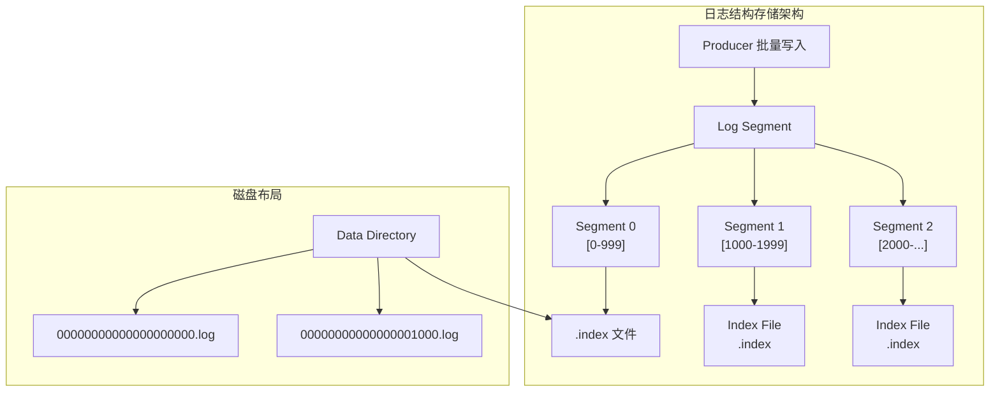
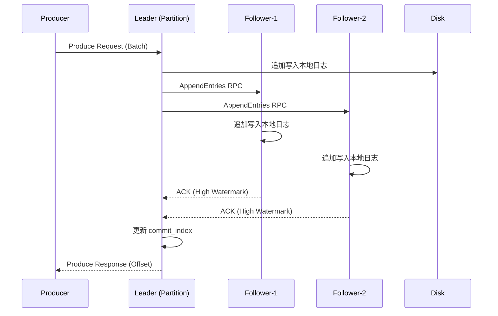
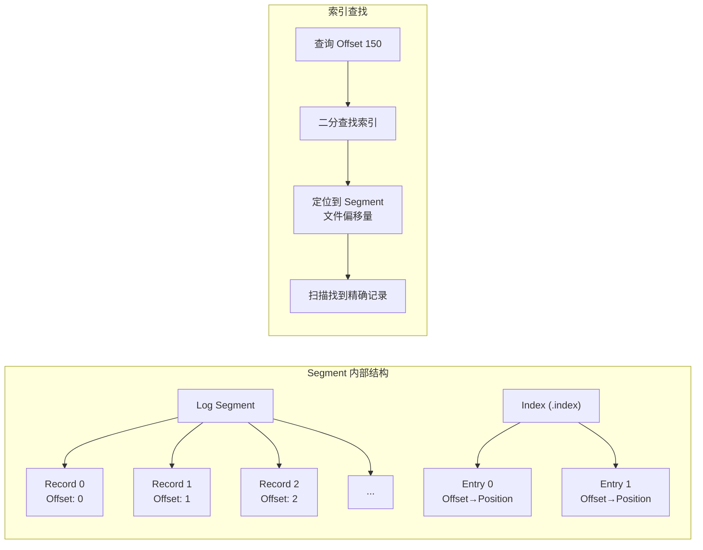
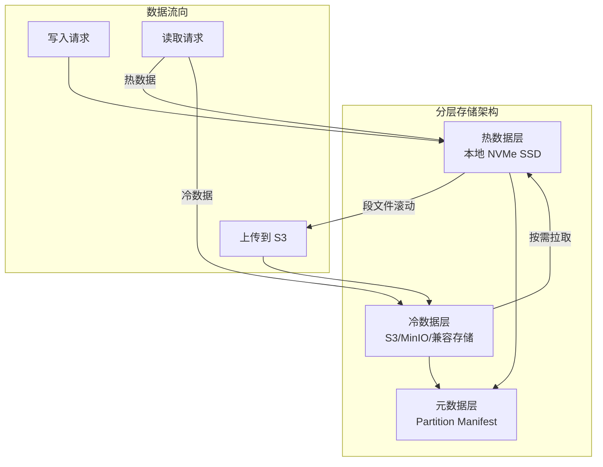
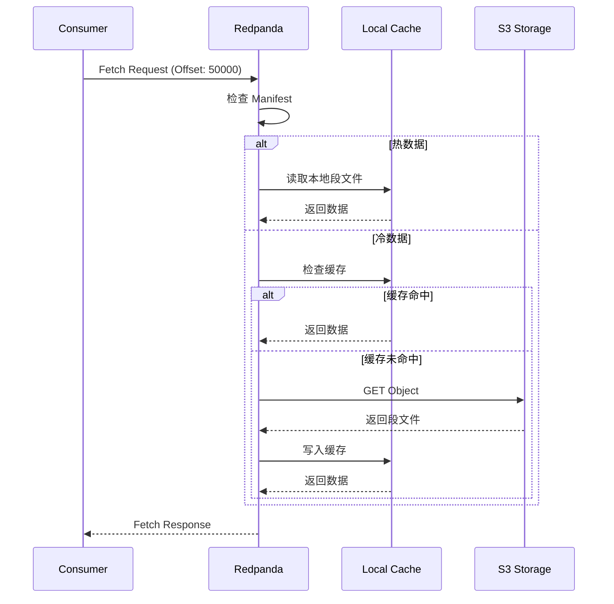
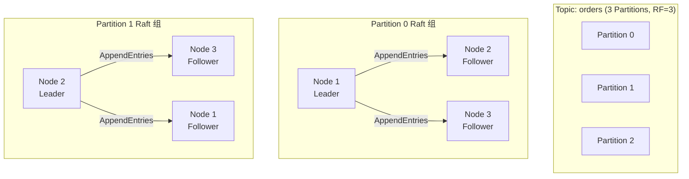
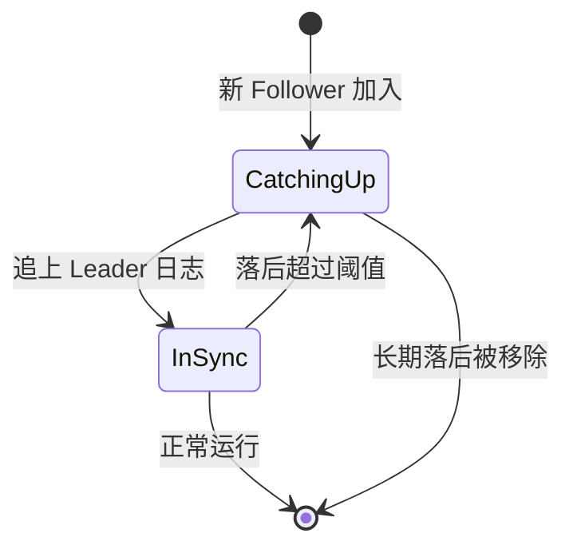
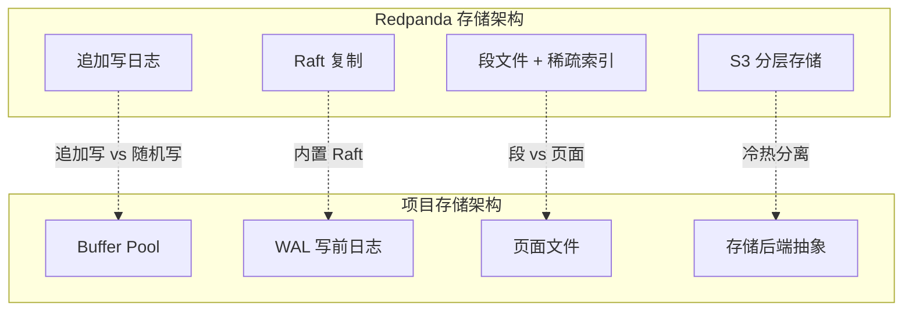
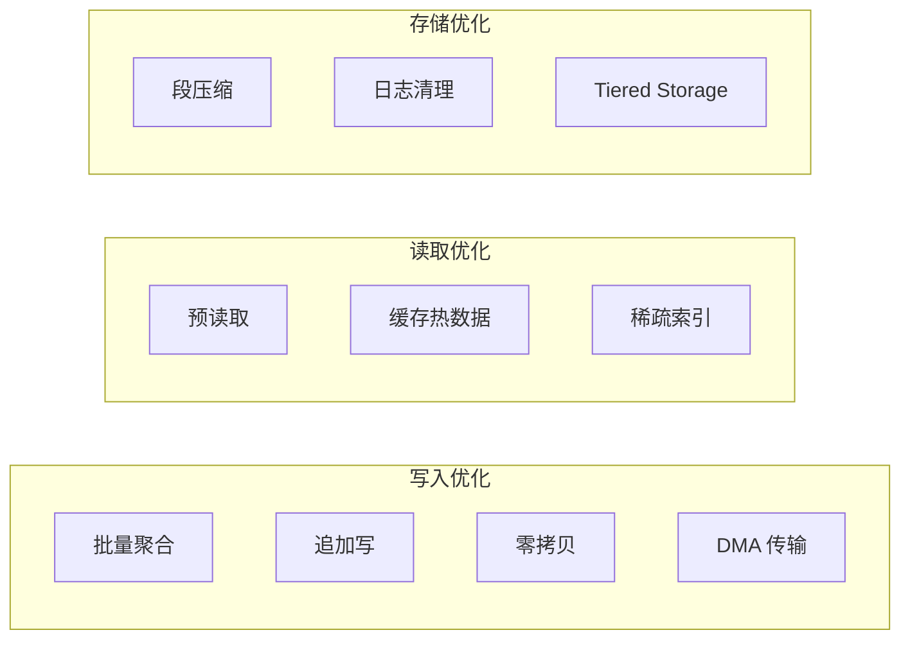

# Redpanda 流式存储引擎

## 学习目标

- 理解 Redpanda 的日志结构存储架构
- 掌握 Raft 日志与追加写机制
- 了解分层存储（S3 Tiered Storage）的设计原理
- 对比 Redpanda 存储与项目 storage/ 模块的异同

## 正文

### 1. 日志结构存储概览

Redpanda 采用日志结构存储（Log-Structured Storage）作为核心存储模型。所有消息以追加写方式写入日志文件，支持高吞吐量的顺序写入。



**核心设计原则**：

| 原则 | 说明 |
|------|------|
| 追加写 | 所有写入操作追加到日志末尾，避免随机写 |
| 顺序 I/O | 利用磁盘顺序读写的高带宽特性 |
| 不可变 | 已写入的日志段文件不可修改 |
| 分段管理 | 日志按大小或时间切分为多个段文件 |

### 2. Raft 日志与追加写

Redpanda 将 Raft 日志与消息日志统一，每个 Partition 对应一个 Raft 复制组：



**追加写的关键优势**：

1. **零随机写**：所有写入都在文件末尾，最大化利用磁盘带宽
2. **批量聚合**：多个小消息合并为大批量，减少 I/O 次数
3. **WAL 语义**：日志本身即 WAL，无需额外写前日志
4. **崩溃恢复**：通过日志重放恢复数据

```cpp
// 伪代码：追加写核心逻辑
future<offset_t> partition::append(batch_t batch) {
    // 1. 分配偏移量
    offset_t base_offset = _last_offset + 1;
    
    // 2. 追加到活跃段
    co_await _active_segment->append(batch);
    
    // 3. 更新索引
    _index.append(base_offset, file_position);
    
    // 4. Raft 复制
    co_await _raft->replicate(batch);
    
    // 5. 更新 last_offset
    _last_offset = base_offset + batch.size() - 1;
    
    co_return base_offset;
}
```

### 3. Log Segment 与索引

每个 Partition 由多个 Log Segment 组成，每个 Segment 有独立的索引文件：



**索引结构**：

| 索引类型 | 文件后缀 | 用途 |
|----------|----------|------|
| Offset Index | `.index` | 偏移量到文件位置的映射 |
| Time Index | `.timeindex` | 时间戳到偏移量的映射 |
| Compaction Index | `.compaction_index` | 日志压缩支持 |

**索引稀疏性**：

索引采用稀疏索引策略，每隔 N 条记录创建一个索引项（默认 4096 字节）。查找时先通过索引定位大致位置，再顺序扫描找到目标记录。

### 4. 分层存储（S3 Tiered Storage）

Redpanda 支持将历史数据卸载到 S3 兼容的对象存储，实现冷热数据分离：



**Tiered Storage 配置示例**：

```yaml
# redpanda.yaml
cloud_storage_enabled: true
cloud_storage_region: us-east-1
cloud_storage_bucket: my-bucket
cloud_storage_access_key: ${AWS_ACCESS_KEY_ID}
cloud_storage_secret_key: ${AWS_SECRET_ACCESS_KEY}
```

**分层存储策略**：

| 参数 | 说明 | 默认值 |
|------|------|--------|
| `segment_size` | 段文件大小 | 128MB |
| `retention_time` | 本地保留时间 | 24h |
| `upload_threshold` | 上传阈值 | 段滚动后立即上传 |
| `cache_size` | 本地缓存大小 | 1GB |

**读取路径**：



### 5. 数据分区与复制

Redpanda 的 Partition 对应一个 Raft 复制组：



**复制策略**：

| 参数 | 说明 |
|------|------|
| `replication_factor` | 副本数（通常 3） |
| `acks` | 生产者确认级别（0/1/-1/all） |
| `min_isr` | 最小同步副本数 |

**ISR（In-Sync Replicas）管理**：



### 6. 与项目 storage/ 模块对比



**对比分析**：

| 维度 | Redpanda | 项目 storage/ 模块 |
|------|----------|-------------------|
| 存储模型 | 日志结构追加写 | 页面结构随机写 |
| 缓存机制 | OS Page Cache | Buffer Pool (Clock-Sweep) |
| 日志机制 | 日志即数据（统一） | WAL + 数据文件（分离） |
| 复制协议 | 内置 Raft | 需外部集成 |
| 冷数据存储 | S3 Tiered Storage | 暂无（可扩展） |
| 索引类型 | 稀疏索引 + 顺序扫描 | BTree/Hash 精确索引 |

**项目 storage 模块关键组件**：

```c
// storage_backend.h - 存储后端抽象
typedef struct storage_backend_ops {
    page_id_t (*alloc_page)(void *ctx);
    int (*read_page)(void *ctx, page_id_t page_id, page_t *page);
    int (*write_page)(void *ctx, page_id_t page_id, const page_t *page);
    int (*batch_write)(void *ctx, const page_id_t *page_ids,
                       const page_t **pages, int count);
    int (*sync)(void *ctx);
} storage_backend_ops_t;

// 支持多种后端
// - STORAGE_BACKEND_MEMORY: 纯内存
// - STORAGE_BACKEND_PAGE_FILE: 页面文件
// - STORAGE_BACKEND_MMAP: 内存映射文件
// - STORAGE_BACKEND_FAISS: Faiss 格式
```

**可借鉴的设计**：

1. **追加写日志**：项目可引入 append-only log 用于流式数据场景
2. **稀疏索引**：适合大规模顺序扫描场景
3. **分层存储**：将冷数据卸载到对象存储
4. **段文件管理**：简化日志清理和压缩

### 7. 存储性能优化



**性能优化技术**：

| 技术 | 说明 | 效果 |
|------|------|------|
| 批量聚合 | 合并小消息为大批次 | 减少 I/O 次数 |
| 追加写 | 避免随机写 | 最大化磁盘带宽 |
| 零拷贝 | sendfile 系统调用 | 减少 CPU 和内存拷贝 |
| 稀疏索引 | 减少索引内存占用 | 降低内存压力 |
| 预读取 | 顺序读取时预取 | 提高读取吞吐 |

## 要点总结

1. **日志结构存储**：追加写模式，顺序 I/O，高吞吐
2. **Raft 日志统一**：消息日志即 Raft 日志，无需额外 WAL
3. **分层存储**：热数据本地 SSD，冷数据 S3 对象存储
4. **稀疏索引**：平衡内存占用和查找效率
5. **与项目对比**：追加写 vs 随机写，日志统一 vs WAL 分离

## 思考题

1. 日志结构存储相比传统页面存储有哪些优势？适用场景是什么？
2. Redpanda 如何在没有独立 WAL 的情况下保证数据持久性？
3. 分层存储的冷热数据边界如何确定？读取延迟如何控制？
4. 项目的 storage/ 模块能否引入追加写模式？需要哪些改造？
