# Redpanda 流式查询引擎

## 学习目标

- 理解 Redpanda 的持续查询（Continuous Query）机制
- 掌握窗口函数的类型与计算原理
- 了解物化视图的增量更新策略
- 对比 Redpanda 查询与项目流处理模块的关联

## 正文

### 1. 持续查询（Continuous Query）

Redpanda 作为消息队列，主要提供消息的生产和消费能力。持续查询通常由下游流处理引擎（如 Flink、Kafka Streams、RisingWave）实现，Redpanda 作为数据源提供数据流。

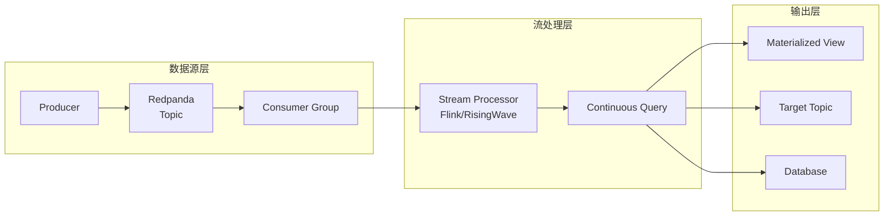

**持续查询特点**：

| 特点 | 说明 |
|------|------|
| 无界数据 | 处理永不结束的数据流 |
| 增量计算 | 新数据到达时更新结果 |
| 状态管理 | 维护中间状态支持复杂计算 |
| 容错恢复 | 通过 Checkpoint 机制恢复状态 |

**Redpanda 在流处理中的角色**：

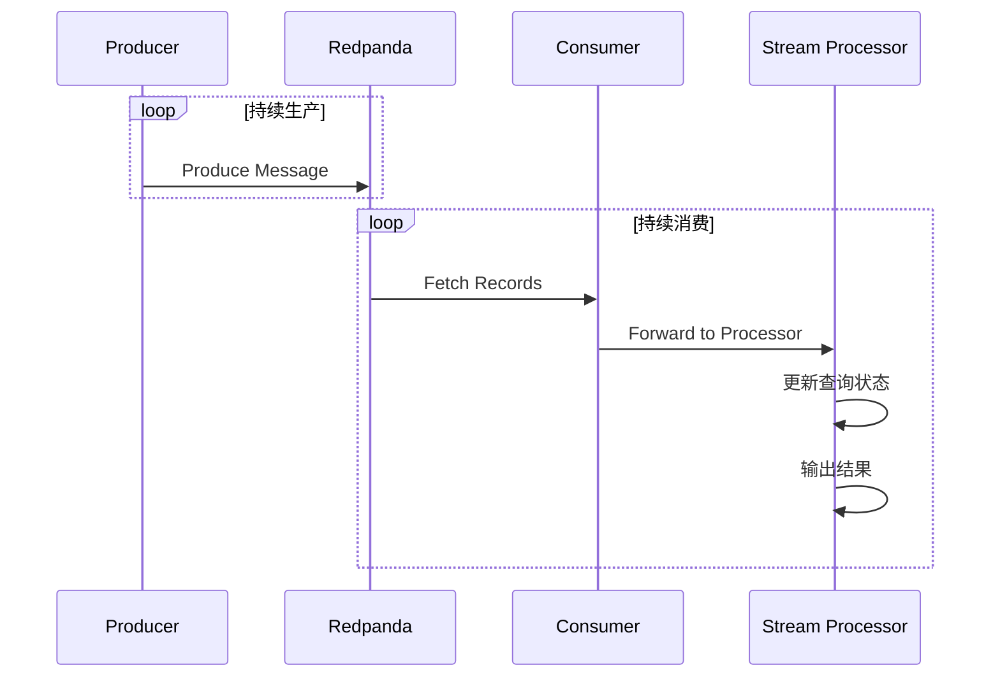

### 2. 窗口函数

流处理中的窗口将无界数据流划分为有限的数据块进行计算。常见窗口类型包括：

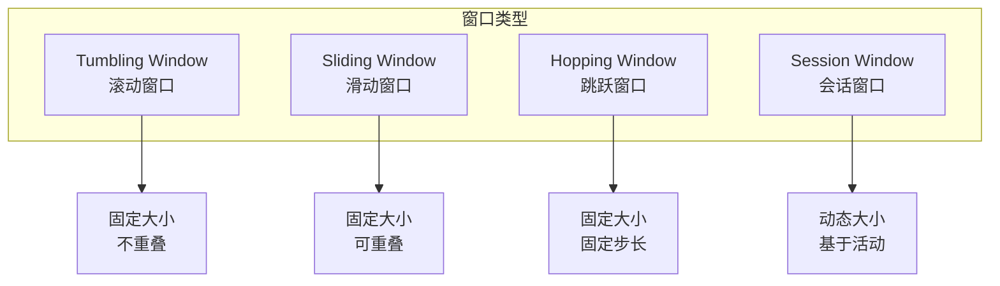

#### 2.1 Tumbling Window（滚动窗口）

滚动窗口是最简单的窗口类型，窗口大小固定，窗口之间不重叠：

```mermaid
gantt
    title 滚动窗口示例（窗口大小 10s）
    dateFormat X
    axisFormat %s
    
    section 数据流
    Event 1 :0, 3
    Event 2 :4, 5
    Event 3 :7, 8
    Event 4 :12, 13
    Event 5 :15, 16
    Event 6 :18, 19
    
    section 窗口
    Window 1 [0-10] :0, 10
    Window 2 [10-20] :10, 20
    Window 3 [20-30] :20, 30
```

**滚动窗口计算逻辑**：

```sql
-- 每分钟计算订单数量
SELECT 
    TUMBLE_START(event_time, INTERVAL '1' MINUTE) AS window_start,
    TUMBLE_END(event_time, INTERVAL '1' MINUTE) AS window_end,
    COUNT(*) AS order_count,
    SUM(amount) AS total_amount
FROM orders
GROUP BY TUMBLE(event_time, INTERVAL '1' MINUTE);
```

#### 2.2 Sliding Window（滑动窗口）

滑动窗口窗口大小固定，但窗口可以重叠，适合计算移动平均等指标：

```mermaid
gantt
    title 滑动窗口示例（窗口大小 10s，滑动步长 5s）
    dateFormat X
    axisFormat %s
    
    section 数据流
    Event 1 :0, 3
    Event 2 :4, 5
    Event 3 :7, 8
    Event 4 :12, 13
    
    section 窗口
    Window 1 [0-10] :0, 10
    Window 2 [5-15] :5, 15
    Window 3 [10-20] :10, 20
```

**滑动窗口特点**：

- 窗口大小：`window_size`
- 滑动步长：`slide`（通常 `slide < window_size`）
- 数据可能属于多个窗口

```sql
-- 每 5 秒计算过去 10 秒的平均值
SELECT 
    HOP_START(event_time, INTERVAL '5' SECOND, INTERVAL '10' SECOND) AS window_start,
    HOP_END(event_time, INTERVAL '5' SECOND, INTERVAL '10' SECOND) AS window_end,
    AVG(temperature) AS avg_temp
FROM sensor_data
GROUP BY HOP(event_time, INTERVAL '5' SECOND, INTERVAL '10' SECOND);
```

#### 2.3 Hopping Window（跳跃窗口）

跳跃窗口是滑动窗口的特例，滑动步长等于窗口大小时即变为滚动窗口：

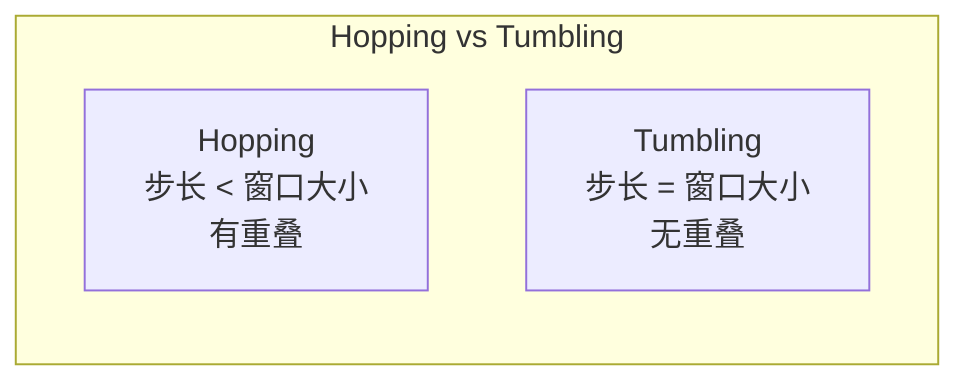

#### 2.4 Session Window（会话窗口）

会话窗口根据数据活动动态划分，无活动时窗口关闭：

```mermaid
gantt
    title 会话窗口示例（间隙 5s）
    dateFormat X
    axisFormat %s
    
    section 数据流
    Event 1 :0, 1
    Event 2 :2, 3
    Event 3 :4, 5
    Event 4 :15, 16
    Event 5 :17, 18
    
    section 窗口
    Session 1 [0-5] :0, 6
    Session 2 [15-18] :15, 19
```

**会话窗口计算逻辑**：

```sql
-- 按用户会话计算事件数
SELECT 
    SESSION_START(event_time, INTERVAL '5' SECOND) AS session_start,
    SESSION_END(event_time, INTERVAL '5' SECOND) AS session_end,
    user_id,
    COUNT(*) AS event_count
FROM user_events
GROUP BY user_id, SESSION(event_time, INTERVAL '5' SECOND);
```

### 3. 物化视图增量更新

流处理中的物化视图（Materialized View）维护查询结果的持久化状态，当新数据到达时增量更新：

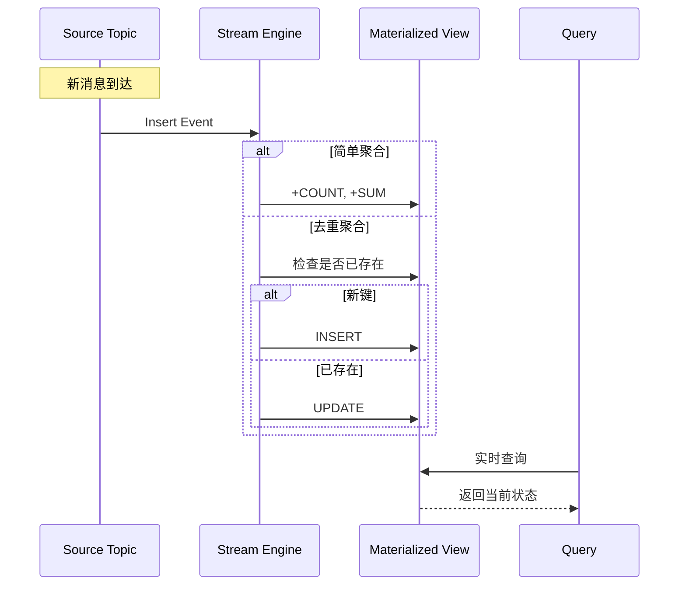

**增量更新策略**：

| 策略 | 适用场景 | 复杂度 |
|------|----------|--------|
| 直接聚合 | COUNT, SUM, MIN, MAX | O(1) |
| 去重聚合 | DISTINCT COUNT | O(N) 或 O(1) with HyperLogLog |
| Join 维护 | Stream-Table Join | O(N) |
| 窗口维护 | 时间窗口聚合 | O(W) 窗口大小 |

**增量更新示例**：

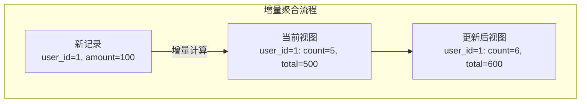

```sql
-- 创建物化视图
CREATE MATERIALIZED VIEW order_summary AS
SELECT 
    user_id,
    COUNT(*) AS order_count,
    SUM(amount) AS total_amount,
    AVG(amount) AS avg_amount
FROM orders
GROUP BY user_id;

-- 增量更新（内部实现）
-- 新订单 (user_id=1, amount=100) 到达时：
-- order_count += 1
-- total_amount += 100
-- avg_amount = total_amount / order_count
```

### 4. 与项目流处理模块关联

项目中已有流处理执行器框架，实现了基础的窗口计算：

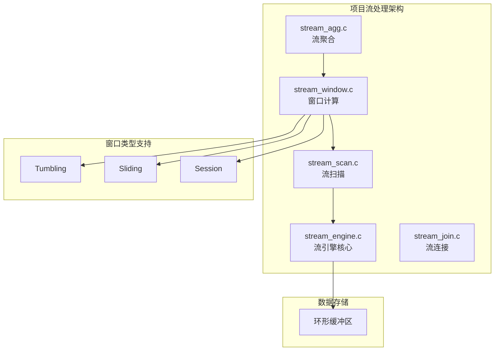

**项目流处理接口**：

```c
// stream_window.h - 窗口算子接口
StreamWindowState *exec_stream_window_init(PlanState *parent,
    int64_t window_size, int64_t slide, int window_type);

TupleTableSlot *exec_stream_window_next(StreamWindowState *state);

void exec_stream_window_close(StreamWindowState *state);

// stream_agg.h - 聚合算子接口
StreamAggState *exec_stream_agg_init(PlanState *parent,
    int agg_type, int64_t window_size);

TupleTableSlot *exec_stream_agg_next(StreamAggState *state);

void exec_stream_agg_close(StreamAggState *state);
```

**窗口计算实现**：

项目 `stream_window.c` 已实现三种窗口类型：

| 窗口类型 | window_type | 实现函数 |
|----------|-------------|----------|
| Tumbling | 0 | `compute_tumbling_window()` |
| Sliding | 1 | `compute_sliding_window()` |
| Session | 2 | `compute_session_window()` |

```c
// 窗口计算核心逻辑（简化版）
static TupleTableSlot *compute_tumbling_window(
    StreamWindowState *state, stream_window_internal_t *internal)
{
    // 1. 初始化窗口边界
    if (internal->current_window_end == 0) {
        stream_record_t *first = &internal->buffer[0];
        internal->current_window_start = 
            (first->timestamp / internal->window_size) * internal->window_size;
        internal->current_window_end = 
            internal->current_window_start + internal->window_size;
    }
    
    // 2. 遍历记录，计算窗口内数量
    while (internal->current_index < internal->buffer_count) {
        stream_record_t *record = &internal->buffer[internal->current_index];
        
        if (record->timestamp < internal->current_window_end) {
            internal->current_window_count++;
            internal->current_index++;
        } else {
            // 3. 输出当前窗口，移动到下一个窗口
            // 返回 (window_start, window_end, count)
            // ...
        }
    }
}
```

**与 Redpanda 对比**：

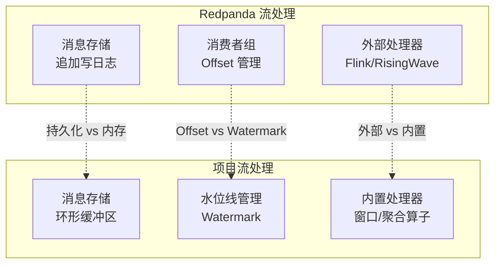

| 维度 | Redpanda + 外部引擎 | 项目内置引擎 |
|------|---------------------|--------------|
| 数据存储 | 持久化日志文件 | 内存环形缓冲区 |
| 状态管理 | 外部引擎管理 | 内置状态管理 |
| 窗口计算 | 外部引擎实现 | 内置算子实现 |
| 容错机制 | Checkpoint + 重放 | 暂无 |
| 扩展性 | 可插拔外部引擎 | 内置有限扩展 |

### 5. 查询执行流程

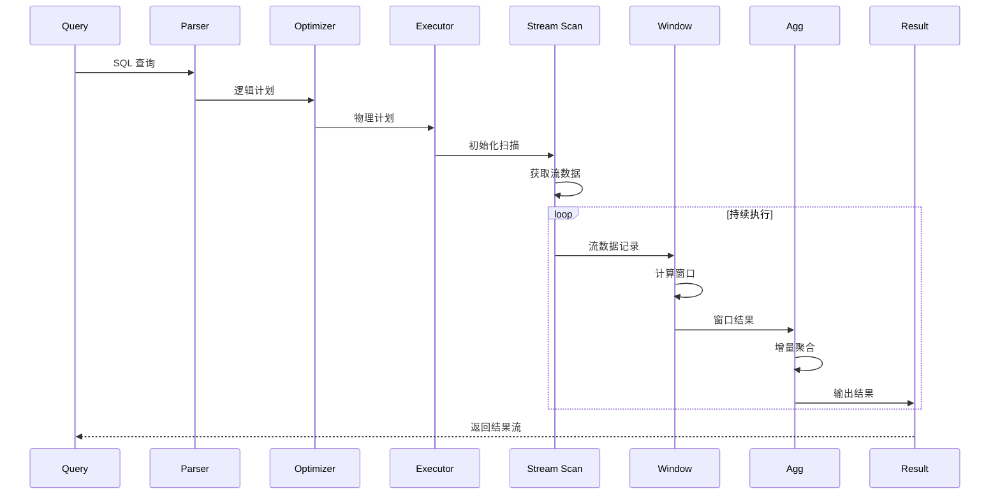

**执行器状态流转**：

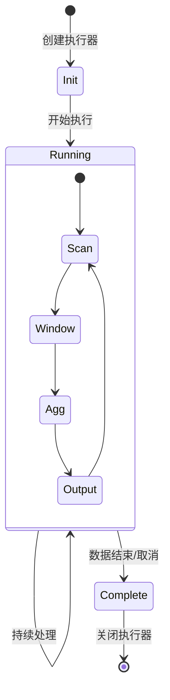

### 6. 性能优化技术

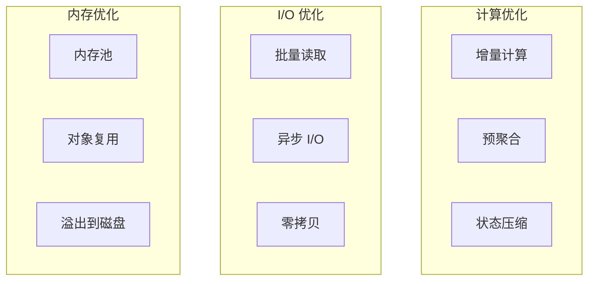

**优化技术对比**：

| 技术 | Redpanda | 项目实现 |
|------|----------|----------|
| 批量处理 | Record Batch | 单记录迭代 |
| 异步 I/O | Seastar Future | 同步阻塞 |
| 零拷贝 | sendfile DMA | 内存拷贝 |
| 状态管理 | RocksDB | 内存结构 |

## 要点总结

1. **持续查询**：处理无界数据流，增量更新结果
2. **窗口函数**：滚动/滑动/跳跃/会话四种类型，将无界流划分为有限块
3. **物化视图**：维护查询状态，增量更新避免全量重算
4. **项目关联**：已实现窗口算子和流聚合，可扩展状态管理和容错机制

## 思考题

1. 滚动窗口和滑动窗口各适用于什么场景？性能差异如何？
2. 物化视图的增量更新如何处理 Retract（撤回）操作？
3. 项目的环形缓冲区存储有哪些限制？如何扩展支持持久化？
4. 如何在项目中实现流处理的容错机制（Checkpoint + 恢复）？
