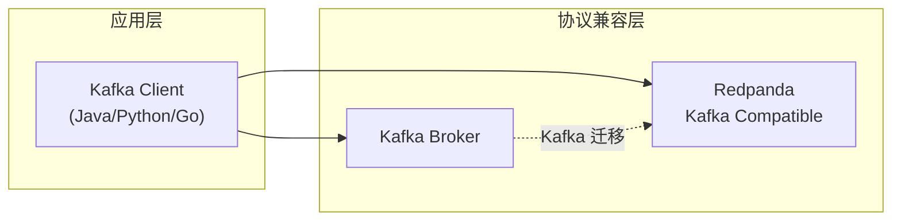
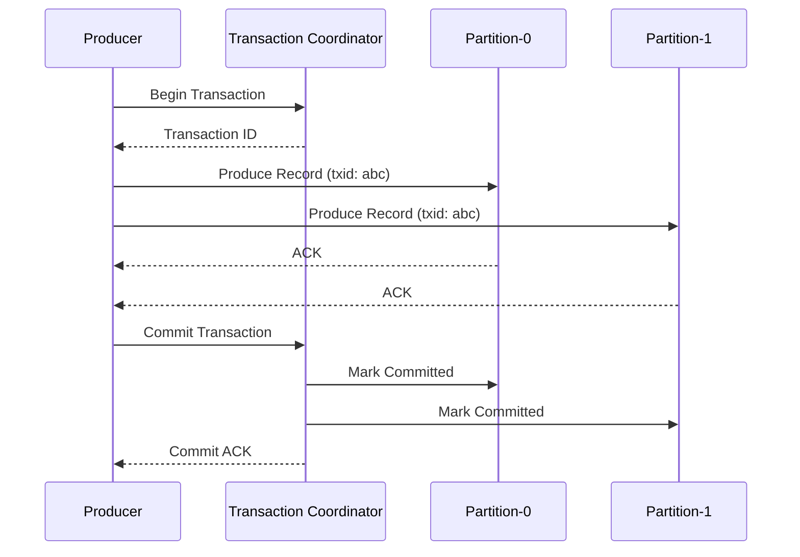
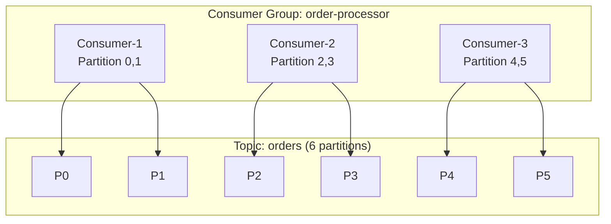
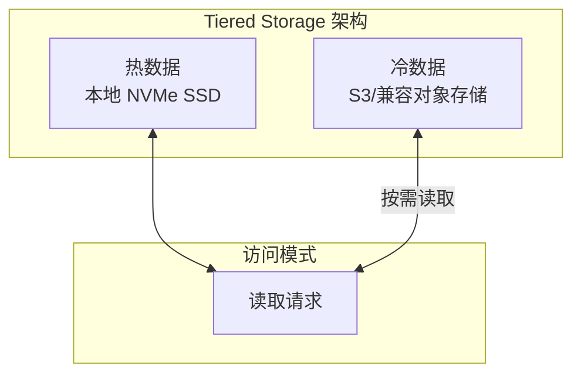

# Redpanda 核心特性

## 学习目标

- 掌握 Redpanda 与 Kafka 的协议兼容性
- 了解 Redpanda 的事务支持和 Exactly-Once 语义
- 熟悉 Tiered Storage 和监控体系

## 正文

### 1. Kafka 协议兼容性

Redpanda 实现了与 Apache Kafka 协议的完整兼容：

| Kafka 特性 | Redpanda 支持 | 说明 |
|------------|---------------|------|
| Producer API | ✅ | 二进制兼容 |
| Consumer API | ✅ | 二进制兼容 |
| Admin API | ✅ | 主题创建/删除/配置 |
| Connect API | ✅ |  connector 框架 |
| REST Proxy | ✅ | HTTP 接口 |

**优势**：
- 现有 Kafka 应用无需修改代码即可迁移
- 可以直接使用 Kafka 生态工具（kafkacat、schema-registry-ui 等）



### 2. Schema Registry

Redpanda 内置 Schema Registry，支持 Avro 和 Protobuf：

```bash
# 注册 Schema
curl -X POST http://localhost:8081/subjects/orders-value/versions \
  -H "Content-Type: application/vnd.schemaregistry.v1+json" \
  -d '{
    "schema": "{\"type\":\"record\",\"name\":\"Order\",\"fields\":[{\"name\":\"id\",\"type\":\"long\"},{\"name\":\"amount\",\"type\":\"double\"}]}"
  }'

# 获取 Schema
curl http://localhost:8081/subjects/orders-value/versions/latest
```

**功能**：
- Schema 版本管理
- Schema 兼容性检查
- 自动序列化/反序列化

### 3. 事务支持（Exactly-Once）



**幂等性保证**：
- 开启 `enable.idempotence: true` 后，单分区消息不重复
- 事务开启后，跨分区消息原子提交

### 4. 消费者组



**消费者组特性**：
- Rebalance 自动分区再分配
- Offset 自动提交或手动提交
- 多消费者负载均衡

### 5. Tiered Storage

Redpanda 支持将历史数据卸载到 S3 兼容存储：

```bash
# 配置 Tiered Storage
rpk topic create my-topic --redpanda.remote.write=true --redpanda.remote.read=true
```

**优势**：
- 降低本地存储成本
- 支持超大规模数据保留
- 热数据本地访问，冷数据远程读取



### 6. 监控指标

Redpanda 提供丰富的 Prometheus 指标：

```bash
# 暴露指标
curl http://localhost:9644/metrics
```

**关键指标**：

| 指标名称 | 说明 |
|----------|------|
| `redpanda_produce_messages_total` | 生产消息总数 |
| `redpanda_consume_messages_total` | 消费消息总数 |
| `redpanda_kafka_request_latencies_seconds` | 请求延迟 |
| `redpanda_disk_used_bytes` | 磁盘使用量 |
| `redpanda_rpc_request_errors_total` | RPC 错误数 |

## 要点总结

1. **Kafka 兼容**：二进制兼容，现有应用零修改迁移
2. **Schema Registry**：内置 Avro/Protobuf 支持
3. **Exactly-Once**：完整事务支持，跨分区原子提交
4. **消费者组**：自动 Rebalance，负载均衡
5. **Tiered Storage**：冷热数据分离，降低存储成本
6. **Prometheus 监控**：丰富指标，便于运维

## 思考题

1. Redpanda 的 Kafka 兼容性与 Kafka 的 Broker 兼容模式有何区别？
2. 在什么场景下需要开启事务支持？事务对性能有何影响？
3. Tiered Storage 如何实现冷数据的按需读取和缓存？
