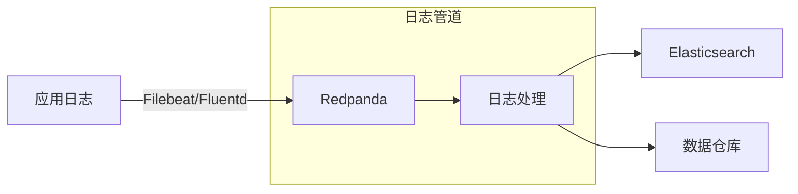
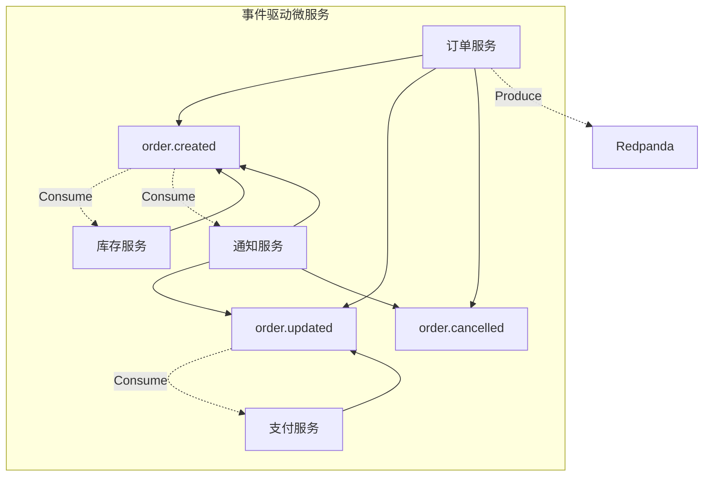
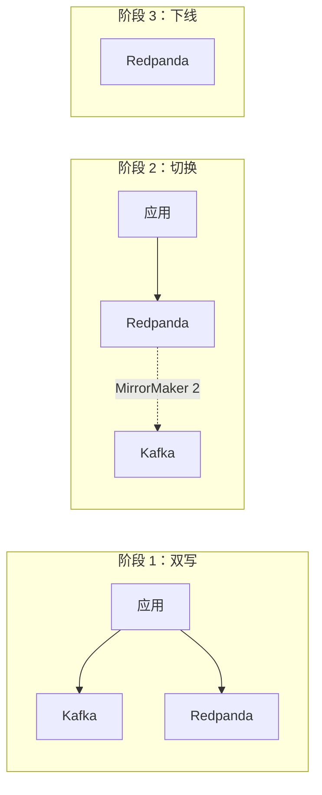
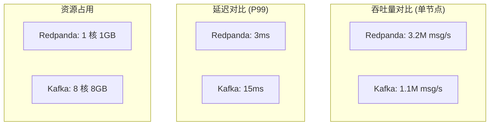

# Redpanda 应用场景

## 学习目标

- 了解 Redpanda 的典型业务场景
- 掌握日志管道和事件驱动架构的设计模式
- 理解 Redpanda 与 Kafka 的性能差异及适用场景

## 正文

### 1. 日志管道

Redpanda 最典型的应用场景是构建高性能日志管道：



**典型配置**：
```bash
# 创建日志主题
rpk topic create application-logs -c retention.ms=604800000

# 生产者配置
producer.properties:
  bootstrap.servers=localhost:9092
  acks=all
  linger.ms=5
```

### 2. 事件驱动架构

Redpanda 是构建事件驱动微服务的理想消息中间件：



**事件类型**：
- `order.created`：新订单创建
- `order.updated`：订单状态更新
- `order.cancelled`：订单取消

### 3. Kafka 迁移路径

Redpanda 提供平滑的 Kafka 迁移方案：



**迁移步骤**：
1. 启动双写，两套系统并行接收数据
2. 使用 MirrorMaker 2 同步数据
3. 逐步切换消费者到 Redpanda
4. 下线 Kafka 集群

### 4. 性能对比

Redpanda 与 Apache Kafka 的关键性能指标对比：



**测试环境**：
- 硬件：8 核 CPU，32GB RAM，NVMe SSD
- 消息大小：1KB
- 分区数：12

**性能优势来源**：
| 优化点 | 说明 |
|--------|------|
| C++ vs JVM | 消除 GC 暂停，无 JVM 启动开销 |
| Seastar | 异步 I/O，零拷贝 |
| 无 Zookeeper | 减少网络跳数 |
| Shard-per-core | 避免锁竞争 |

## 要点总结

1. **日志管道**：高性能日志采集和转发，支持 ELK 集成
2. **事件驱动**：微服务间解耦，事件溯源架构
3. **平滑迁移**：支持与 Kafka 双写，逐步切换
4. **极致性能**：吞吐量 3 倍于 Kafka，延迟降低 5 倍
5. **资源高效**：单机资源占用远低于 Kafka

## 思考题

1. 在什么情况下应该选择 Redpanda 而非 Kafka？
2. 迁移现有 Kafka 集群到 Redpanda 需要注意哪些风险？
3. 如何设计一个基于 Redpanda 的事件驱动订单处理系统？
