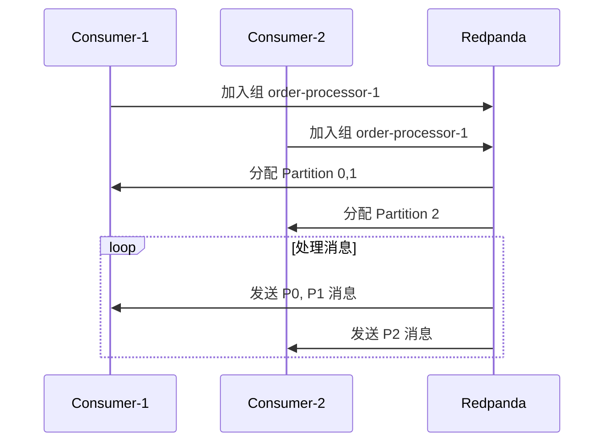

# Redpanda 实践实验

## 学习目标

- 掌握 Redpanda 的 Docker 部署方式
- 熟练使用 rpk 命令行工具管理主题和消费者
- 理解消费者组和 Kafka 兼容性的实际表现

## 正文

### 1. 环境准备

#### 实验 1.1：Standalone 模式部署

```bash
# 启动单节点 Redpanda
docker run -d --name=redpanda \
  --network=host \
  redpandadata/redpanda:latest \
  redpanda start \
    --advertise-kafka-addr 127.0.0.1:9092 \
    --pandaproxy-addr 127.0.0.1:8082
```

#### 实验 1.2：集群模式部署

```bash
# 启动三个节点的 Redpanda 集群
for i in 1 2 3; do
  docker run -d --name=redpanda-$i \
    --network=redpanda-net \
    -p 909$i:909$i \
    -p 964$i:964$i \
    redpandadata/redpanda:latest \
    redpanda start \
      --node-id $i \
      --kafka-addr 0.0.0.0:9092 \
      --advertise-kafka-addr redpanda-$i:9092 \
      --rpc-addr redpanda-$i:33145 \
      --seed-ips redpanda-1:33145
done

docker network create redpanda-net
```

### 2. 生产者实验

#### 实验 2.1：基本消息生产

```bash
# 创建主题
rpk topic create orders --partitions 3 --replicas 1

# 使用 rpk 生产消息
rpk topic produce orders
# 输入消息内容，每行一条
{"order_id": 1001, "amount": 99.99}
{"order_id": 1002, "amount": 149.50}
^D  # Ctrl+D 结束

# 验证消息
rpk topic describe orders
```

#### 实验 2.2：使用命令行参数生产

```bash
# 批量生产消息
for i in {1..100}; do
  echo "Message $i" | rpk topic produce orders -t key=$i
done

# 生产带时间戳的消息
rpk topic produce orders -f "%k %v %T"
```

### 3. 消费者实验

#### 实验 3.1：基本消息消费

```bash
# 消费所有消息（从头开始）
rpk topic consume orders --offset start

# 消费最新消息
rpk topic consume orders --offset end

# 指定消费条数
rpk topic consume orders -n 10
```

#### 实验 3.2：消费者组

```bash
# 启动第一个消费者
rpk topic consume orders --group order-processor-1

# 新开终端，启动第二个消费者
rpk topic consume orders --group order-processor-1

# 查看消费者组状态
rpk group describe order-processor-1
```



### 4. 主题管理实验

```bash
# 列出所有主题
rpk topic list

# 查看主题配置
rpk topic describe orders -a

# 修改主题配置
rpk topic alter-config orders --set retention.ms=86400000

# 删除主题
rpk topic delete old-topic
```

### 5. Kafka 兼容性实验

#### 实验 5.1：使用 Kafka 客户端连接 Redpanda

```bash
# Python Kafka 客户端测试
pip install kafka-python

python3 << 'EOF'
from kafka import KafkaProducer, KafkaConsumer

# 生产者
producer = KafkaProducer(
    bootstrap_servers=['localhost:9092'],
    value_serializer=lambda v: json.dumps(v).encode('utf-8')
)

producer.send('orders', {'order_id': 1001, 'amount': 99.99})
producer.flush()

# 消费者
consumer = KafkaConsumer('orders', bootstrap_servers=['localhost:9092'])
for msg in consumer:
    print(f"Received: {msg.value}")
EOF
```

#### 实验 5.2：Schema Registry 兼容性

```bash
# 使用 confluent schema registry 工具测试
kafka-schema-registry test-schema.avsc

# 验证 Avro 序列化
python3 << 'EOF'
from confluent_kafka import Deserializer
import avro.schema

schema = avro.schema.parse(open("test-schema.avsc").read())
reader = AvroDeserializer(schema)
EOF
```

## 实验报告

完成以下实验并记录结果：

| 实验 | 命令/操作 | 预期结果 | 实际结果 |
|------|----------|----------|----------|
| 1.1 | Standalone 启动 | 服务正常启动 | |
| 1.2 | 集群启动 | 3 节点加入集群 | |
| 2.1 | 生产消息 | 消息写入成功 | |
| 2.2 | 批量生产 | 100 条消息写入 | |
| 3.1 | 消费消息 | 消息正确接收 | |
| 3.2 | 消费者组 | 分区自动分配 | |
| 4 | 主题管理 | 配置变更生效 | |
| 5.1 | Kafka 客户端 | 正常生产消费 | |

## 思考题

1. 当消费者组中某个消费者下线时，分区如何重新分配？
2. 如何调整分区数以优化消费者并行度？
3. Tiered Storage 在实验环境中如何配置？
