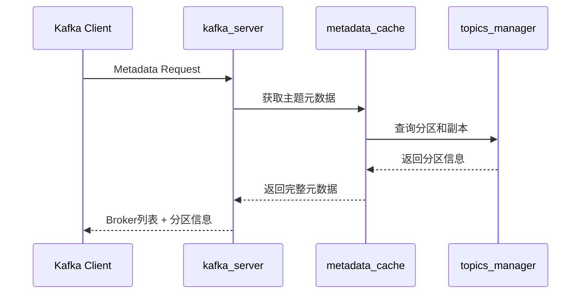
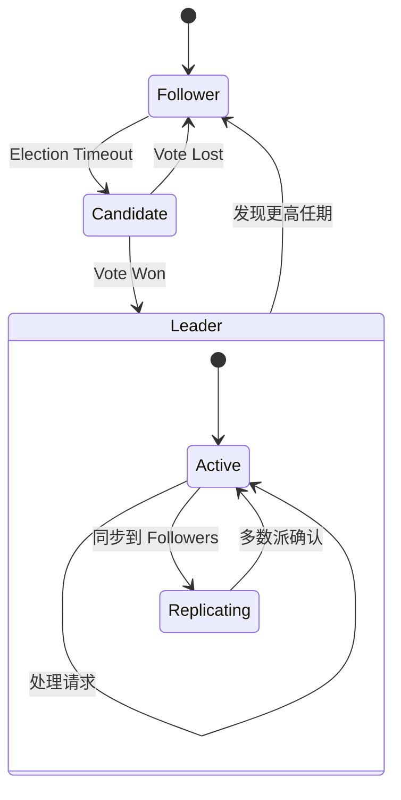

# Redpanda 源码阅读

## 学习目标

- 掌握 Redpanda 源码的目录结构和模块划分
- 理解 Kafka 协议兼容层的实现原理
- 了解 Seastar 框架在 Redpanda 中的应用

## 正文

### 1. 源码目录结构

```
redpanda/
├── src/
│   ├── v/
│   │   └── kafka/           # Kafka 协议兼容层
│   │       ├── protocol/
│   │       │   ├── produce.cc
│   │       │   ├── fetch.cc
│   │       │   ├── metadata.cc
│   │       │   └── api_versions.cc
│   │       ├── server.cc
│   │       └── errors.cc
│   │
│   ├── raft/               # Raft 协议实现
│   │   ├── replication.cc
│   │   ├── consensus.cc
│   │   ├── types.h
│   │   └── raft.cc
│   │
│   ├── storage/            # 存储层
│   │   ├── log.h
│   │   ├── segment.cc
│   │   ├── index_state.h
│   │   └── compaction.cc
│   │
│   ├── seastar/            # Seastar 集成
│   │   ├── app.cc
│   │   ├── reactor.cc
│   │   └── future_util.cc
│   │
│   └── redpanda/
│       ├── main.cc         # 入口
│       └── redpanda.cc     # 主服务
│
├── include/
│   └── redpanda/
│       ├── api.hh
│       └── types.hh
│
└── tests/
    └── kafka/
```

### 2. Kafka 协议兼容层

#### 2.1 主入口：kafka_server.cc

```cpp
// src/v/kafka/server.cc
class kafka_server {
public:
    // 处理 Kafka 协议请求
    ss::future<response_ptr>
    handle_request(request_ptr req, ss::shard_id shard) {
        return with_scheduling_group(sg_, [this, req]() {
            return route(std::move(req));
        });
    }
    
private:
    // 请求路由表
    std::unique_ptr<pandora::request_router> router_;
};
```

#### 2.2 生产请求处理

```cpp
// src/v/kafka/protocol/produce.cc
ss::future<produce_response>
produce_handler::handle(request_context&& ctx) {
    // 1. 验证请求
    co_await ctx.security().authorize(operation::produce);
    
    // 2. 分配分片
    auto shard = _partition_manager.shard_id(
        model::topic_partition(ctx.topic(), ctx.partition()));
    
    // 3. 转发到对应分片处理
    co_return co_await ctx.shard().submit(
        std::move(ctx),
        [this](produce_request&& req) {
            return invoke_partition_handlers(std::move(req));
        });
}
```

#### 2.3 元数据请求



### 3. Raft 协议实现

#### 3.1 副本复制

```cpp
// src/raft/replication.cc
ss::future<replicate_result>
replicate_entries(replicate_request req) {
    // 1. 检查领导者状态
    if (!is_leader()) {
        return make_error(raft_error::not_leader);
    }
    
    // 2. 批量写入日志
    std::vector<ss::future<append_entries_reply>> futures;
    for (auto& follower : config().followers()) {
        futures.push_back(send_append_entries(follower, req));
    }
    
    // 3. 等待多数派确认
    auto results = co_await wait_for_majority(
        std::move(futures),
        quorum_write_timeout);
    
    // 4. 提交日志
    co_await commit_up_to(results.min_offset());
    co_return replicate_result{.last_offset = results.last_offset()};
}
```

#### 3.2 领导者选举



### 4. 存储层实现

#### 4.1 日志段结构

```cpp
// src/storage/log.h
class log {
public:
    // 追加记录
    ss::future<append_result> append(record_batch batch);
    
    // 读取记录
    ss::future<read_result> read(start_offset, end_offset);
    
private:
    segment_set segments_;        // 分段集合
    index_state index_;           // 索引状态
    compaction_controller ctrl_;  // 压缩控制器
};
```

#### 4.2 索引实现

```cpp
// src/storage/index_state.h
struct index_state {
    // 偏移量 -> 物理位置映射
    std::vector<index_entry> entries;
    
    // 二分查找快速定位
    std::optional<size_t> find_offset(model::offset offset) {
        return binary_search(entries, offset);
    }
};
```

### 5. Seastar 集成

```cpp
// src/seastar/app.cc
int main(int argc, char** argv) {
    return app_template()
        .run(argc, argv(), [] {
            // 创建 Kafka 服务器
            return create_server().then([] (auto server) {
                // 在每个 CPU 核上启动分片
                return ss::smp::run_on_all([] {
                    return start_kafka_server();
                }).then([server] {
                    return server->start();
                });
            });
        });
}
```

## 关键文件速查

| 文件路径 | 功能 | 关键类/函数 |
|----------|------|-------------|
| `src/v/kafka/server.cc` | Kafka 服务器主入口 | `kafka_server` |
| `src/v/kafka/protocol/produce.cc` | 生产请求处理 | `produce_handler` |
| `src/v/kafka/protocol/fetch.cc` | 消费请求处理 | `fetch_handler` |
| `src/raft/replication.cc` | 副本复制 | `replicate_entries` |
| `src/raft/consensus.cc` | Raft 共识 | `consensus` |
| `src/storage/log.cc` | 日志存储 | `log` |
| `src/storage/segment.cc` | 分段管理 | `segment` |

## 进阶阅读

1. **Seastar 框架**：[https://www.seastar.io/](https://www.seastar.io/)
2. **Raft 论文实现**：`src/raft/` 目录完整实现了 Raft 协议
3. **Kafka 协议规范**：参考 `src/v/kafka/protocol/` 中的各请求处理器

## 思考题

1. Redpanda 如何处理 Kafka 协议中的批次压缩请求？
2. Raft 协议在 Redpanda 中的领导者选举超时是如何配置的？
3. Seastar 的 shard-per-core 模型如何与 partition 对应？
