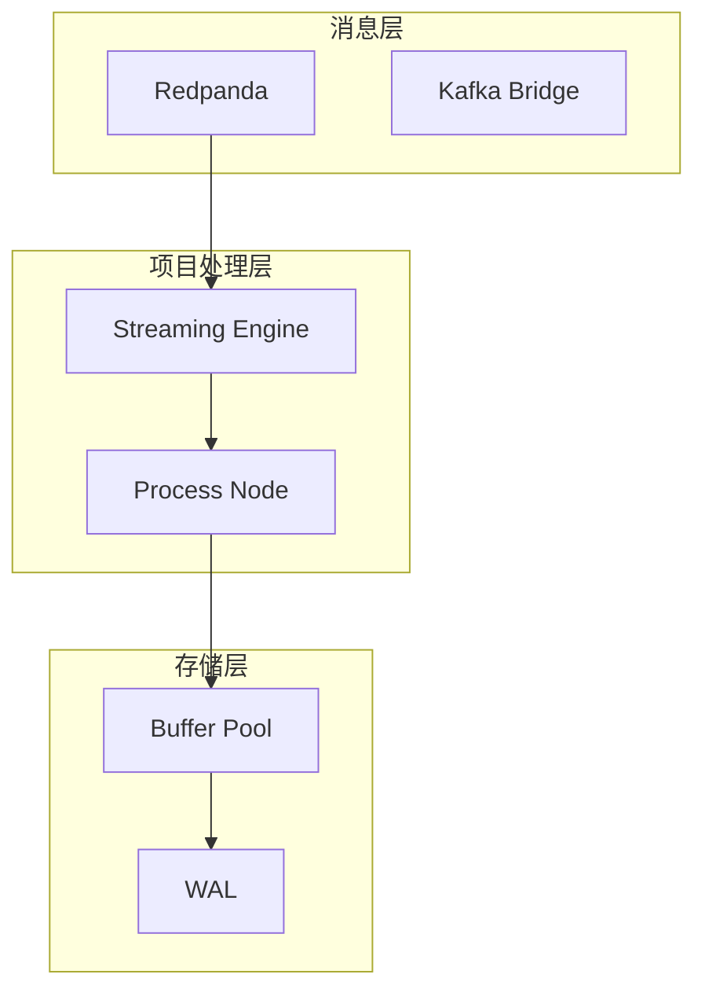
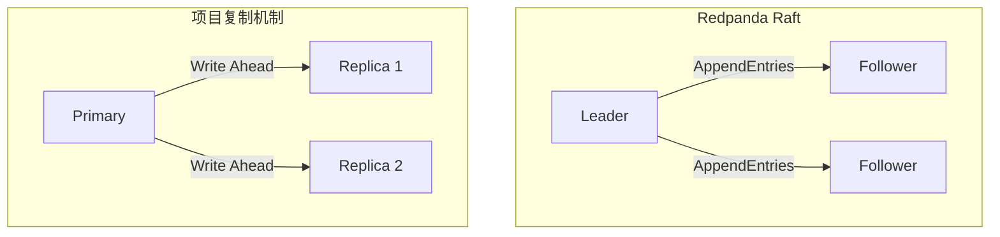
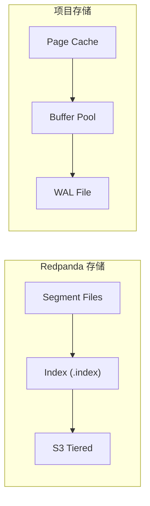

# Redpanda 与项目流处理引擎

## 学习目标

- 理解 Redpanda 的设计理念如何影响项目架构
- 掌握 Raft 协议在不同系统中的实现差异
- 了解消息队列与流处理引擎的协同模式

## 正文

### 1. 与项目流处理引擎的关联

项目中的流处理引擎与 Redpanda 在架构设计上有以下关联：

### 2. 设计理念对比

| 设计维度 | Redpanda | 项目流处理引擎 |
|----------|----------|----------------|
| 语言 | C++ | C |
| 消息存储 | 分段日志 + 索引 | Buffer Pool + WAL |
| 协调机制 | Raft 自管理 | 内部状态管理 |
| 消费者模型 | Pull 模式 | Push/Pull 混合 |
| 分区策略 | 固定分区 | 动态分区 |

### 3. Raft 协议实现对比

Redpanda 使用 Raft 实现分布式一致性，项目中的 BTree 索引也涉及类似的复制概念：

**共同点**：
- 多数派确认写入
- 日志先行写入
- 领导者协调写操作

**差异点**：
- Redpanda：Raft 协议，支持成员变更
- 项目：简化复制，更适合单机场景

### 4. 存储架构对比

### 5. 性能优化对比

| 优化技术 | Redpanda | 项目 |
|----------|----------|------|
| 零拷贝 | Seastar DMA | Buffer 直接映射 |
| 批量 I/O | 合并写入 | 页面批量刷盘 |
| 异步模型 | Future/Promise | 事件驱动 |
| NUMA 感知 | shard-per-core | CPU 亲和性 |

### 6. 可借鉴的设计

项目中可以借鉴 Redpanda 的以下设计：

1. **分层存储**：冷热数据分离，热数据 NVMe，冷数据对象存储
2. **无锁设计**：每个分片独立处理，避免竞争
3. **批量操作**：合并小 I/O 为大 I/O，提高吞吐
4. **元数据内聚**：减少外部依赖，自管理元数据

## 要点总结

1. Redpanda 的 C++ 高性能设计为项目提供了参考方向
2. Raft 协议的简化实现适合项目规模
3. 分层存储和批量操作是通用的性能优化手段
4. 项目可以引入 Redpanda 作为外部消息队列

## 思考题

1. 项目流处理引擎如何与 Redpanda 集成？
2. 如何设计一个适合项目规模的简化 Raft 实现？
3. 在项目中使用消息队列 vs 内置消息处理的权衡是什么？
