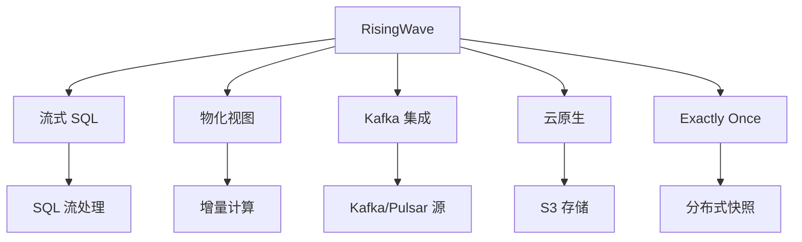

# RisingWave 项目概览

## 学习目标

- 了解 RisingWave 作为流处理数据库的定位
- 掌握 RisingWave 的流式物化视图设计

## 项目定位

> RisingWave 是一个云原生流处理数据库，以 SQL 实现流式计算，降低了实时流处理的门槛。

**基本信息**：
- 开发方：RisingWave Labs
- 首次发布：2021 年
- 开源协议：Apache 2.0
- GitHub Stars：约 7k

## 核心设计



## 核心特性

```sql
-- 创建源（Kafka）
CREATE SOURCE IF NOT EXISTS user_behavior (
    user_id BIGINT,
    item_id BIGINT,
    behavior VARCHAR
) WITH (
    connector = 'kafka',
    topic = 'user_behavior',
    properties.bootstrap.server = 'localhost:9092'
) FORMAT PLAIN ENCODE JSON;

-- 创建物化视图（实时流式聚合）
CREATE MATERIALIZED VIEW hourly_stats AS
SELECT
    window_start,
    COUNT(*) AS total_events,
    COUNT(DISTINCT user_id) AS unique_users
FROM TUMBLE(user_behavior, event_time, INTERVAL '1 HOUR')
GROUP BY window_start;

-- 查询物化视图（秒级延迟）
SELECT * FROM hourly_stats ORDER BY window_start;
```

## 要点总结

- SQL 定义流处理管道
- 物化视图实时增量更新
- Kafka 原生集成
- Exactly Once 语义
