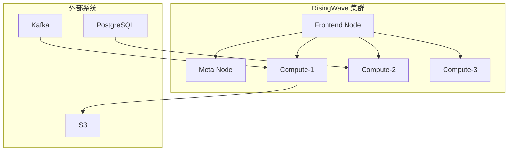
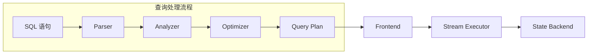
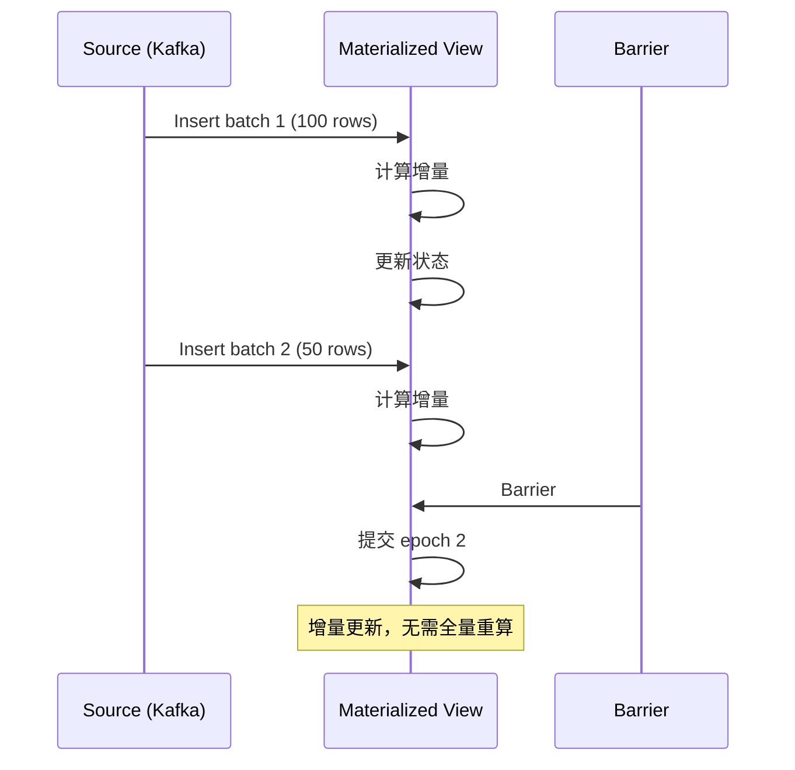
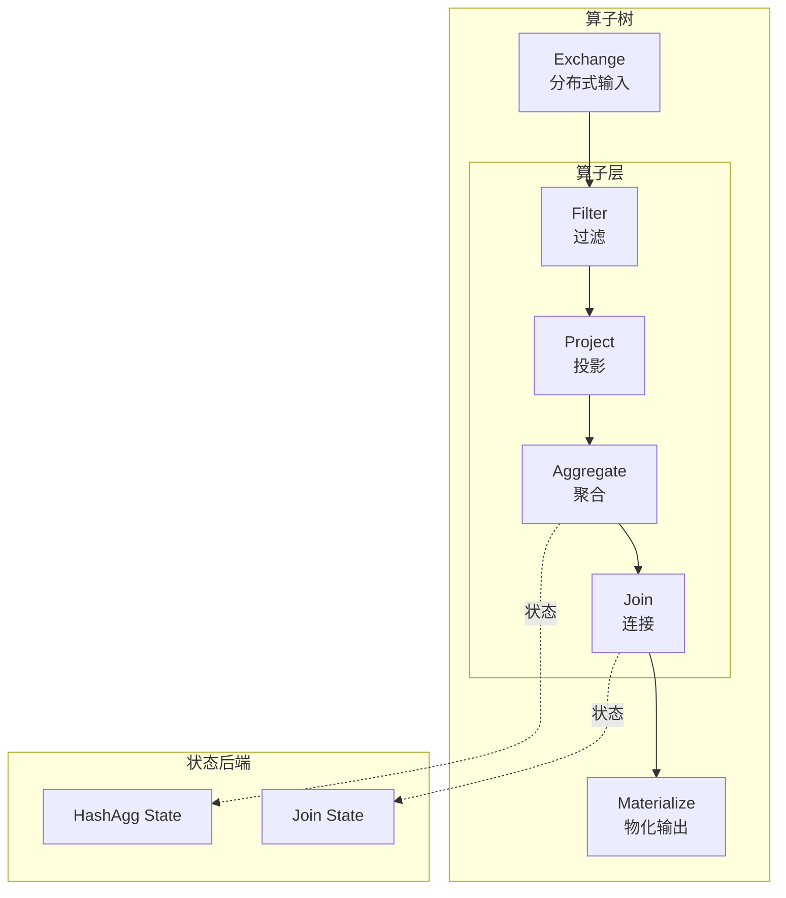
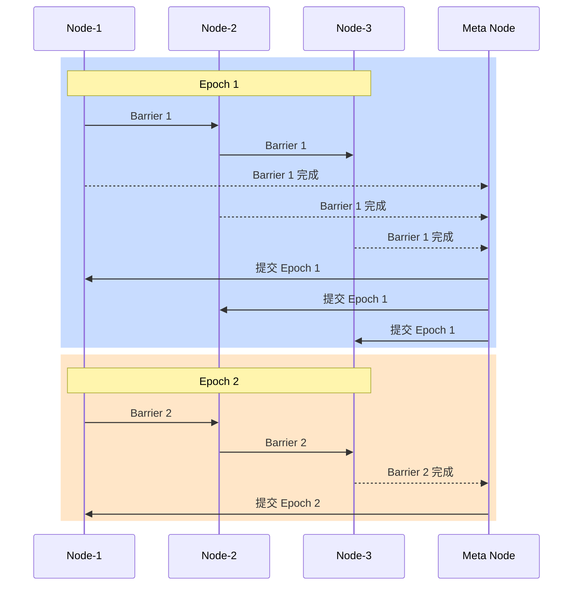
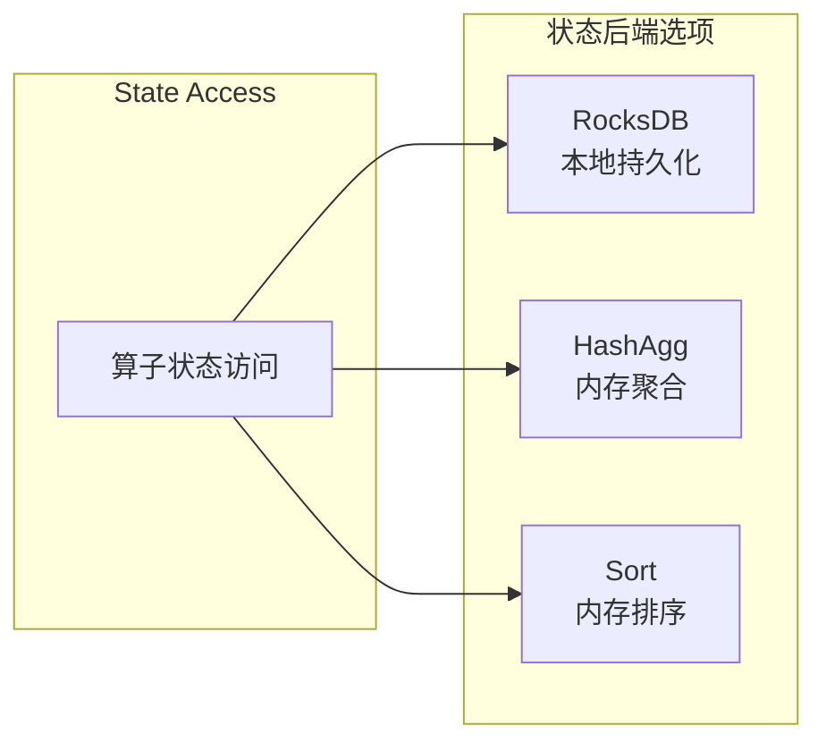

# RisingWave 架构

## 学习目标

- 理解 RisingWave 作为流处理数据库的核心定位
- 掌握物化视图增量计算的实现原理
- 了解 Epoch/Barrier 机制如何实现 Exactly-Once 语义

## 正文

### 1. 架构概览

RisingWave 是一个专为流处理设计的分布式 SQL 数据库，核心特点是 **持续物化视图**：

### 2. 核心组件

| 组件 | 职责 |
|------|------|
| Frontend | SQL 解析、优化、查询计划生成 |
| Meta Node | 集群管理、Worker 调度、DDL 执行 |
| Compute Node | 流处理算子执行、状态管理 |

### 3. 物化视图增量更新

RisingWave 的核心创新是 **增量视图维护（Incremental View Maintenance）**：

**对比传统批处理**：
- 传统：每次更新触发全量重算
- RisingWave：只计算变化的部分

### 4. 算子树结构

RisingWave 将 SQL 查询编译为流处理算子树：

**核心算子**：
| 算子 | 功能 |
|------|------|
| Exchange | 数据分片和重分布 |
| Filter | 条件过滤 |
| Project | 列选择和计算 |
| Aggregate | 聚合计算（Sum/Avg/Count/Max/Min） |
| Join | 流与流、流与表的连接 |
| Materialize | 结果物化到状态后端 |

### 5. Epoch/Barrier 机制

RisingWave 使用 **Barrier** 实现分布式快照和 Exactly-Once 语义：

**Barrier 作用**：
1. 标记一个 Epoch 的开始
2. 协调所有算子的进度
3. 触发状态快照
4. 支持故障恢复

### 6. 状态后端

RisingWave 支持多种状态后端：

**状态管理特点**：
- RocksDB：支持大状态，持久化可靠
- 内存状态：高性能，适合小状态
- 增量 Checkpoint：定期保存状态快照

## 要点总结

1. **SQL-based 流处理**：使用标准 SQL 定义流计算
2. **增量计算**：物化视图只计算变化部分，避免全量重算
3. **Exactly-Once**：Barrier 机制保证端到端一致性
4. **分布式执行**：算子树在多节点并行执行
5. **灵活状态**：支持多种状态后端适应不同场景

## 思考题

1. RisingWave 的增量计算与传统批处理系统相比有何优势？
2. Barrier 机制如何保证在节点故障时的状态一致性？
3. 算子树中的 Exchange 算子如何实现数据的均匀分布？
