# RisingWave 流式存储引擎

## 学习目标

- 理解 RisingWave 的日志结构存储架构
- 掌握 Raft 日志与追加写机制
- 了解分层存储（S3 Tiered Storage）的设计原理
- 对比 RisingWave 存储与项目 storage/ 模块的异同

## 正文

### 1. 日志结构存储概览

RisingWave 采用 Hummock 作为其状态存储引擎，基于 LSM Tree（Log-Structured Merge Tree）设计。核心思想是**追加写 + 后台合并**，所有写入操作先写入内存 MemTable，再异步刷盘到 SST 文件。

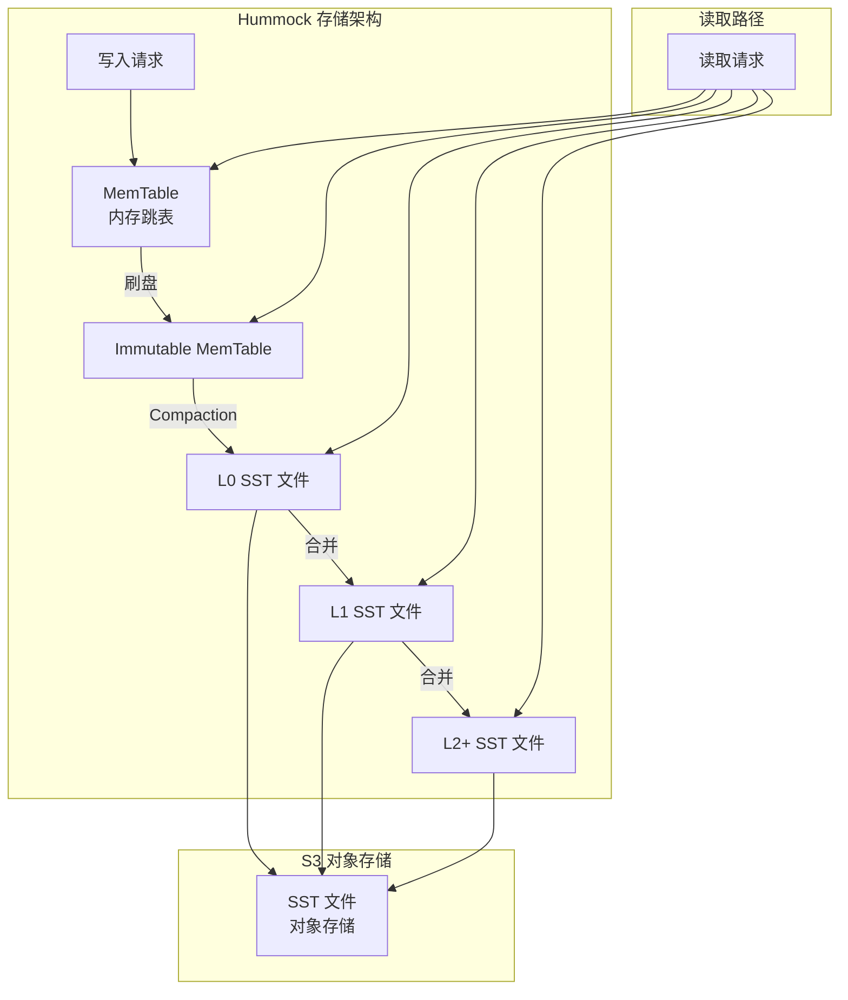

**核心设计原则**：

| 原则 | 说明 |
|------|------|
| 追加写 | 所有写入追加到 MemTable，避免随机写 |
| 顺序刷盘 | MemTable 刷盘时顺序写入 SST 文件 |
| 后台合并 | Compaction 在后台异步执行 |
| 分层组织 | 数据按热度分层，热数据在内存，冷数据在深层 SST |

### 2. Raft 日志与追加写

RisingWave 的流处理状态管理依赖内部的状态存储，不直接使用 Raft 日志作为数据存储。但 Barrier 机制与 Raft 的日志复制有相似的设计理念。

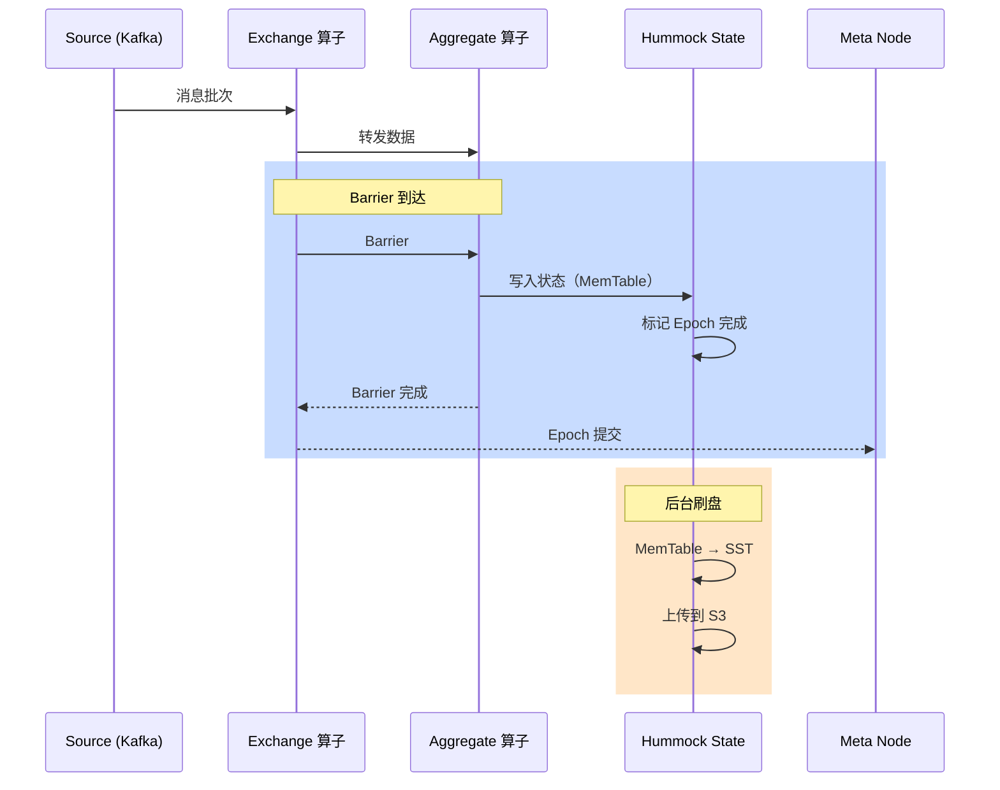

**追加写的优势**：

1. **高写入吞吐**：顺序 I/O 充分利用磁盘带宽
2. **写放大低**：批量刷盘减少随机写入
3. **状态持久化**：SST 文件存储在 S3，支持故障恢复
4. **分层存储**：热数据在本地 SSD，冷数据在 S3

```cpp
// 伪代码：Hummock 写入流程
future<void> hummock::write(StateKey key, StateValue value) {
    // 1. 写入 MemTable
    _memtable->put(key, value);
    
    // 2. 检查是否需要刷盘
    if (_memtable->size() > MEMTABLE_THRESHOLD) {
        // 3. 冻结当前 MemTable
        auto immutable = _memtable->freeze();
        
        // 4. 创建新 MemTable
        _memtable = new MemTable();
        
        // 5. 异步刷盘
        co_await flush_to_sst(immutable);
    }
}
```

### 3. Log Segment 与索引

Hummock 的 SST 文件采用有序结构，支持高效的键值查找：

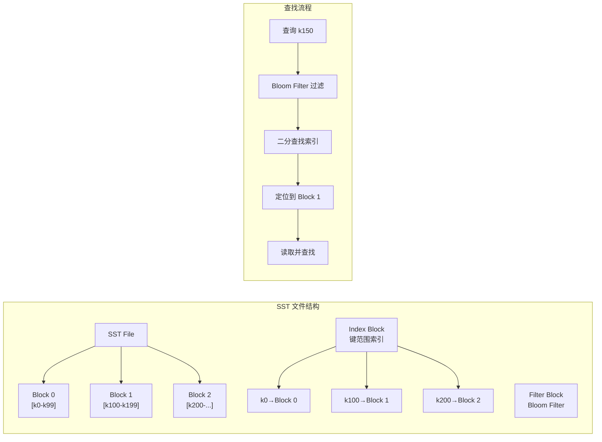

**索引与过滤**：

| 组件 | 用途 |
|------|------|
| Bloom Filter | 快速判断键是否不存在，减少 I/O |
| Index Block | 键范围索引，快速定位数据块 |
| Data Block | 实际数据存储，按键有序排列 |
| Footer | 文件元信息，索引块位置 |

**SST 文件特点**：

- **有序性**：数据按键排序，支持范围查询
- **不可变**：写入后不再修改，通过 Compaction 合并
- **压缩**：支持 Block 级压缩（LZ4/Zstd）
- **Bloom Filter**：加速点查询，减少无效 I/O

### 4. 分层存储（S3 Tiered Storage）

RisingWave 的 Hummock 原生支持 S3 对象存储，实现计算存储分离：

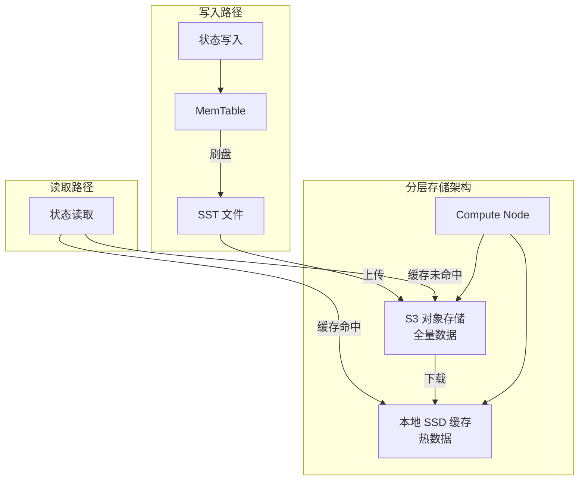

**分层存储配置示例**：

```yaml
# RisingWave 配置
hummock:
  data_directory: "hummock"
  s3_bucket: "risingwave-state"
  s3_region: "us-east-1"
  block_cache_size: "1GB"
  meta_cache_size: "512MB"
```

**存储分层策略**：

| 层级 | 存储介质 | 数据类型 | 访问延迟 |
|------|----------|----------|----------|
| MemTable | 内存 | 最新写入 | 纳秒级 |
| Block Cache | 本地 SSD | 热数据块 | 微秒级 |
| S3 | 对象存储 | 全量数据 | 毫秒级 |

**读取路径优化**：

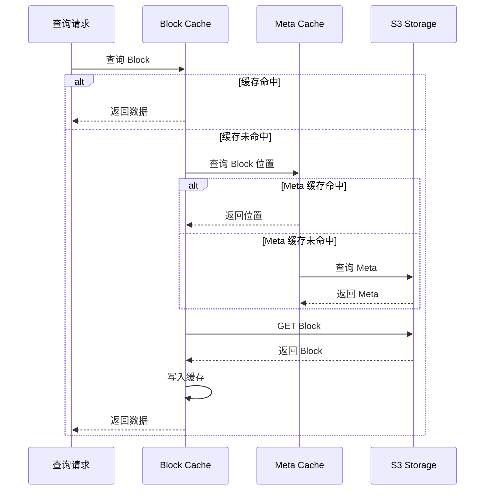

### 5. 数据分区与复制

RisingWave 采用分布式架构，状态数据分片存储在多个 Compute Node：

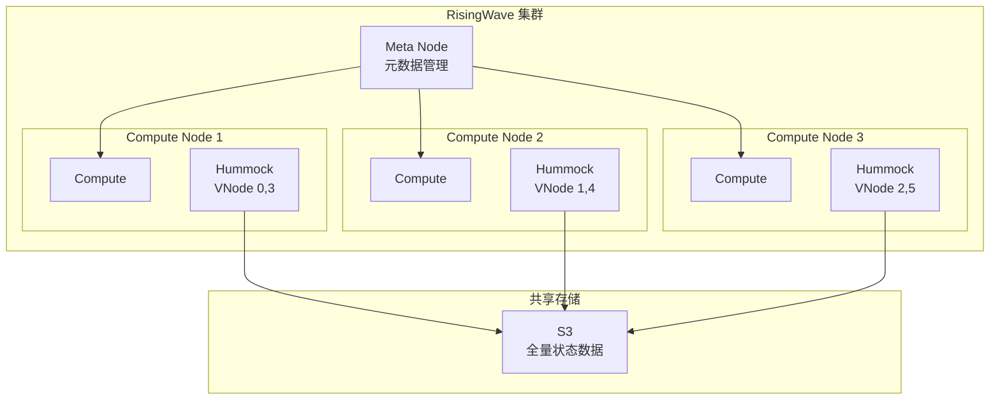

**分片策略**：

| 概念 | 说明 |
|------|------|
| VNode | 虚拟节点，状态分片单元 |
| Parallel Unit | 并行计算单元，对应 VNode |
| Barrier | 同步点，保证一致性 |

**故障恢复机制**：

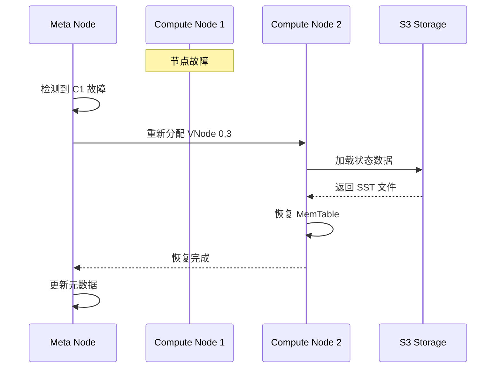

### 6. 与项目 storage/ 模块对比

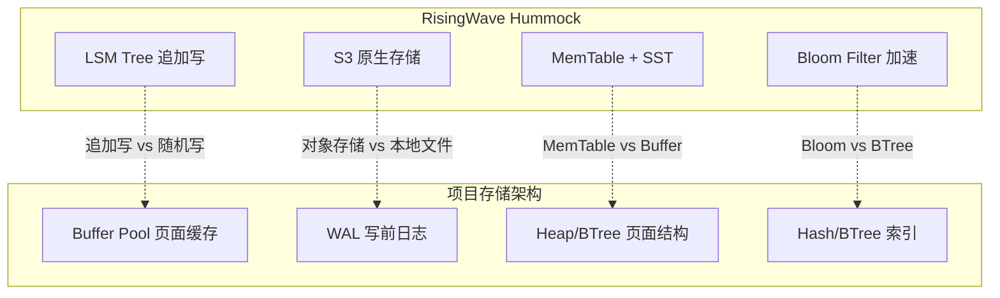

**对比分析**：

| 维度 | RisingWave Hummock | 项目 storage/ 模块 |
|------|-------------------|-------------------|
| 存储模型 | LSM Tree 追加写 | 页面结构随机写 |
| 缓存机制 | Block Cache (LRU) | Buffer Pool (Clock-Sweep) |
| 日志机制 | MemTable + WAL（统一） | WAL + 数据文件（分离） |
| 持久化存储 | S3 对象存储 | 本地页面文件 |
| 索引类型 | Bloom Filter + 有序 SST | BTree/Hash 精确索引 |
| 合并机制 | 后台 Compaction | 无（原地更新） |
| 适用场景 | 流处理状态、时序数据 | OLTP 事务、点查询 |

**项目 storage 模块关键组件**：

```c
// storage_backend.h - 存储后端抽象
typedef struct storage_backend_ops {
    page_id_t (*alloc_page)(void *ctx);
    int (*read_page)(void *ctx, page_id_t page_id, page_t *page);
    int (*write_page)(void *ctx, page_id_t page_id, const page_t *page);
    int (*batch_write)(void *ctx, const page_id_t *page_ids,
                       const page_t **pages, int count);
    int (*sync)(void *ctx);
} storage_backend_ops_t;

// 支持多种后端
// - STORAGE_BACKEND_MEMORY: 纯内存
// - STORAGE_BACKEND_PAGE_FILE: 页面文件
// - STORAGE_BACKEND_MMAP: 内存映射文件
```

**可借鉴的设计**：

1. **LSM 追加写模式**：适合流处理和时序数据场景
2. **S3 分层存储**：冷热数据分离，降低存储成本
3. **Bloom Filter**：加速点查询，减少无效 I/O
4. **后台 Compaction**：异步合并，减少写放大

**项目扩展方向**：

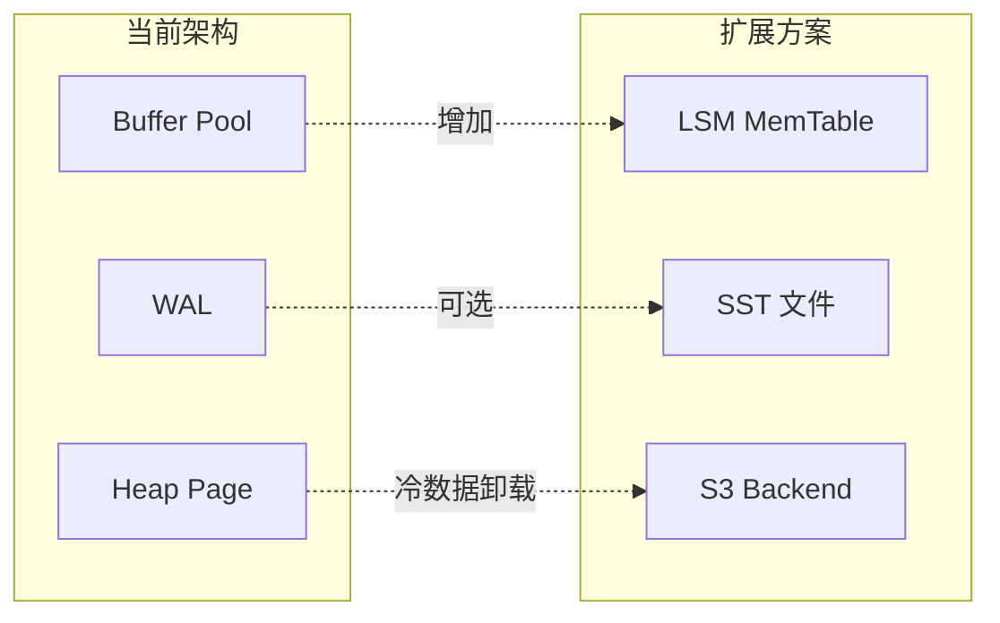

### 7. 存储性能优化

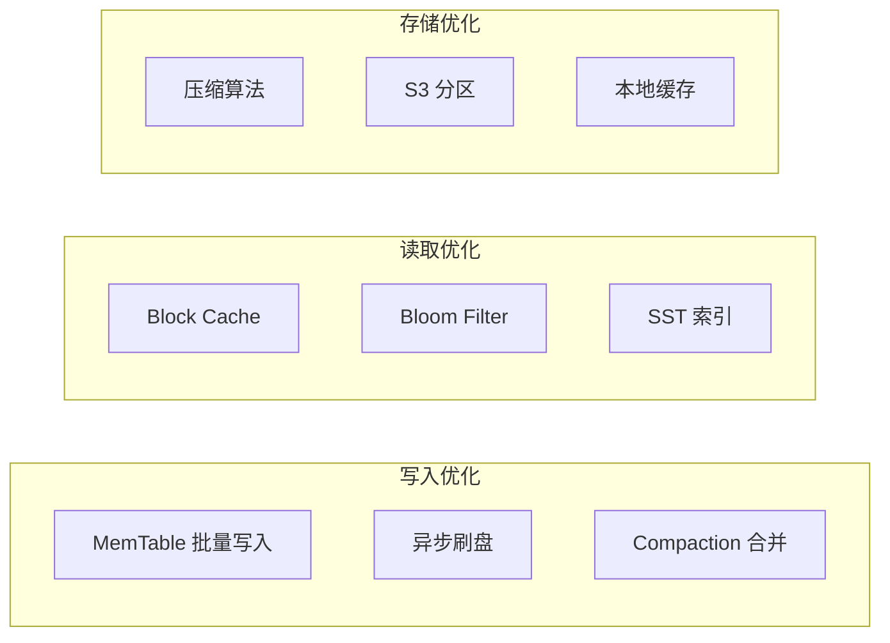

**性能优化技术**：

| 技术 | 说明 | 效果 |
|------|------|------|
| MemTable | 内存写入缓冲 | 高写入吞吐 |
| Block Cache | 热数据缓存 | 减少远程读取 |
| Bloom Filter | 快速过滤 | 减少无效 I/O |
| Compaction | 后台合并 | 减少读放大 |
| 压缩 | Block 级压缩 | 节省存储空间 |

**Compaction 策略**：

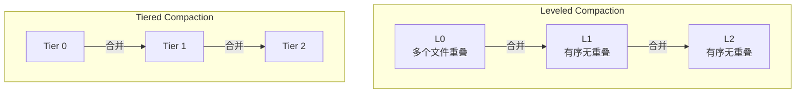

## 要点总结

1. **LSM Tree 架构**：追加写 + 后台合并，高写入吞吐
2. **Hummock 存储引擎**：MemTable + SST + S3，计算存储分离
3. **分层存储**：热数据本地缓存，冷数据 S3 存储
4. **Bloom Filter**：加速点查询，减少远程 I/O
5. **与项目对比**：追加写 vs 随机写，对象存储 vs 本地文件

## 思考题

1. LSM Tree 的追加写模式相比 BTree 的原地更新，在哪些场景下更有优势？
2. RisingWave 如何通过 Barrier 机制保证分布式状态下的一致性？
3. 分层存储中，如何确定热数据和冷数据的边界？读取延迟如何控制？
4. 项目的 storage/ 模块能否引入 LSM 追加写模式？需要哪些改造？
5. Compaction 过程中的写放大问题如何解决？Leveled vs Tiered 策略如何选择？
