# RisingWave 流式查询引擎

## 学习目标

- 理解 RisingWave 的持续查询（Continuous Query）机制
- 掌握窗口函数的类型与计算原理
- 了解物化视图的增量更新策略
- 对比 RisingWave 查询引擎与项目 algo/ 模块的关联

## 正文

### 1. 持续查询（Continuous Query）

RisingWave 的持续查询是流处理数据库的核心能力。用户通过 SQL 定义查询后，系统持续处理输入数据，增量更新查询结果。

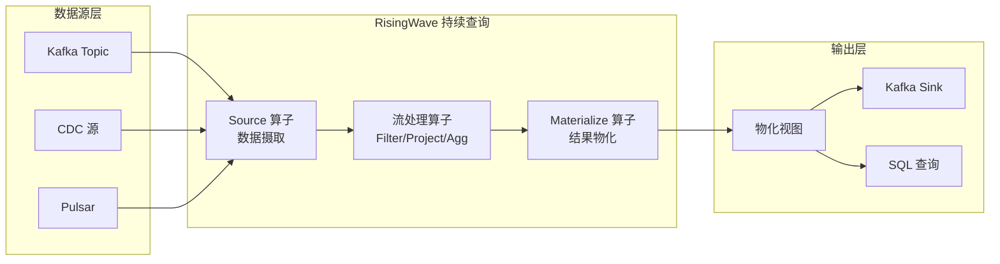

**持续查询特点**：

| 特点 | 说明 |
|------|------|
| 无界数据 | 处理永不结束的数据流 |
| 增量计算 | 新数据到达时更新结果 |
| 状态管理 | 维护中间状态支持复杂计算 |
| Exactly-Once | Barrier 机制保证精准一次 |

**持续查询执行流程**：

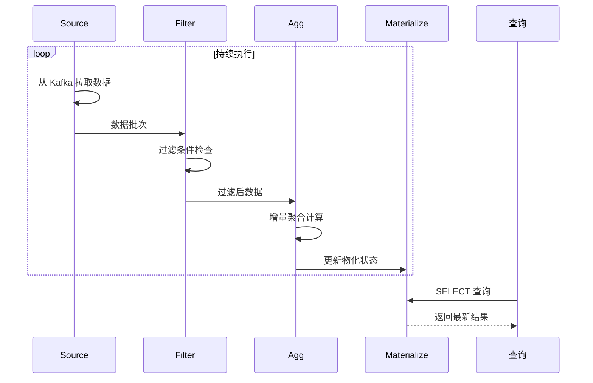

### 2. 窗口函数

RisingWave 支持丰富的窗口函数，将无界数据流划分为有限的数据块进行计算。

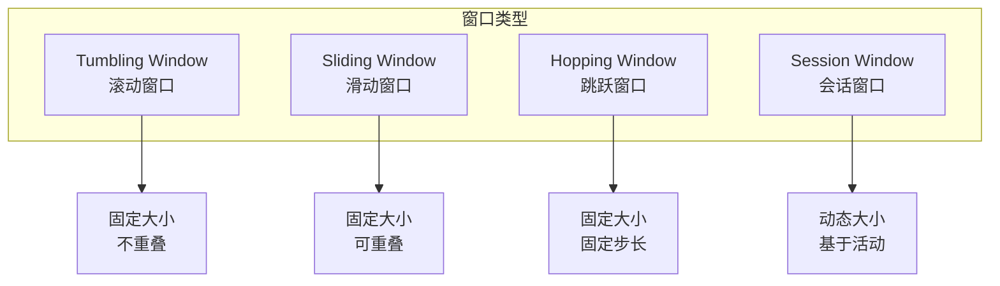

#### 2.1 Tumbling Window（滚动窗口）

滚动窗口固定大小、不重叠，是最常用的窗口类型：

```mermaid
gantt
    title 滚动窗口示例（窗口大小 10s）
    dateFormat X
    axisFormat %s
    
    section 数据流
    Event 1 :0, 3
    Event 2 :4, 5
    Event 3 :7, 8
    Event 4 :12, 13
    Event 5 :15, 16
    Event 6 :18, 19
    
    section 窗口
    Window 1 [0-10] :0, 10
    Window 2 [10-20] :10, 20
    Window 3 [20-30] :20, 30
```

**RisingWave SQL 示例**：

```sql
-- 每分钟统计事件数
CREATE MATERIALIZED VIEW hourly_stats AS
SELECT
    window_start,
    window_end,
    COUNT(*) AS total_events,
    COUNT(DISTINCT user_id) AS unique_users
FROM TUMBLE(user_behavior, event_time, INTERVAL '1 HOUR')
GROUP BY window_start, window_end;

-- 查询结果（秒级延迟）
SELECT * FROM hourly_stats ORDER BY window_start;
```

#### 2.2 Sliding Window（滑动窗口）

滑动窗口窗口大小固定，窗口之间可重叠，适合计算移动平均：

```mermaid
gantt
    title 滑动窗口示例（窗口大小 10s，滑动步长 5s）
    dateFormat X
    axisFormat %s
    
    section 数据流
    Event 1 :0, 3
    Event 2 :4, 5
    Event 3 :7, 8
    Event 4 :12, 13
    
    section 窗口
    Window 1 [0-10] :0, 10
    Window 2 [5-15] :5, 15
    Window 3 [10-20] :10, 20
```

**滑动窗口特点**：

- 窗口大小：`window_size`
- 滑动步长：`slide`（通常 `slide < window_size`）
- 数据可能属于多个窗口

```sql
-- 每 5 秒计算过去 10 秒的平均温度
CREATE MATERIALIZED VIEW avg_temp_5s AS
SELECT
    window_start,
    window_end,
    AVG(temperature) AS avg_temp,
    MAX(temperature) AS max_temp
FROM HOP(sensor_data, event_time, INTERVAL '5' SECOND, INTERVAL '10' SECOND)
GROUP BY window_start, window_end;
```

#### 2.3 Hopping Window（跳跃窗口）

跳跃窗口是滑动窗口的特例，滑动步长等于窗口大小时即变为滚动窗口：

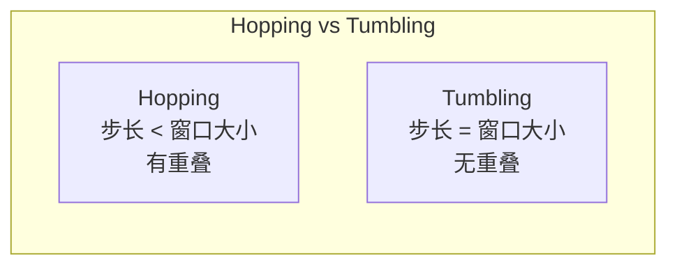

#### 2.4 Session Window（会话窗口）

会话窗口根据数据活动动态划分，无活动时窗口关闭：

```mermaid
gantt
    title 会话窗口示例（间隙 5s）
    dateFormat X
    axisFormat %s
    
    section 数据流
    Event 1 :0, 1
    Event 2 :2, 3
    Event 3 :4, 5
    Event 4 :15, 16
    Event 5 :17, 18
    
    section 窗口
    Session 1 [0-5] :0, 6
    Session 2 [15-18] :15, 19
```

```sql
-- 按用户会话计算事件数
CREATE MATERIALIZED VIEW user_sessions AS
SELECT
    session_start,
    session_end,
    user_id,
    COUNT(*) AS event_count,
    SUM(duration) AS total_duration
FROM SESSION(user_events, event_time, INTERVAL '5' SECOND)
GROUP BY user_id, session_start, session_end;
```

#### 2.5 窗口函数性能对比

| 窗口类型 | 计算复杂度 | 内存占用 | 适用场景 |
|----------|-----------|----------|----------|
| Tumbling | O(1) 增量 | 低 | 周期性统计、报表 |
| Sliding | O(N) | 高 | 移动平均、趋势分析 |
| Hopping | O(N) | 中 | 介于 Tumbling 和 Sliding 之间 |
| Session | O(N) | 中 | 用户行为分析、异常检测 |

### 3. 物化视图增量更新

RisingWave 的物化视图是其核心创新，支持**持续增量更新**：

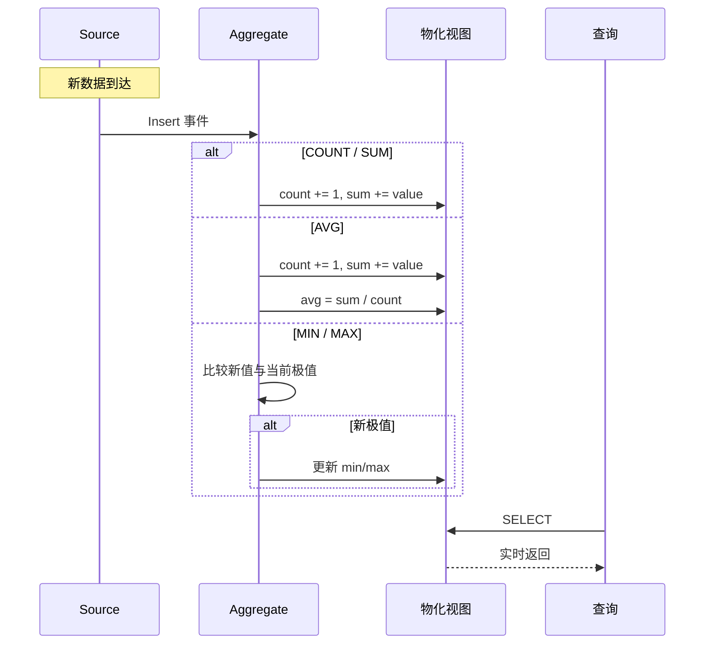

**增量更新策略**：

| 聚合函数 | 增量策略 | 复杂度 |
|----------|----------|--------|
| COUNT | `count += 1` | O(1) |
| SUM | `sum += value` | O(1) |
| AVG | `sum += value, count += 1` | O(1) |
| MIN | 比较当前 min，更新 | O(1) |
| MAX | 比较当前 max，更新 | O(1) |
| DISTINCT COUNT | HyperLogLog 或精确哈希 | O(1) 或 O(N) |

**增量更新示例**：

```sql
-- 创建物化视图
CREATE MATERIALIZED VIEW order_summary AS
SELECT
    user_id,
    COUNT(*) AS order_count,
    SUM(amount) AS total_amount,
    AVG(amount) AS avg_amount,
    MIN(amount) AS min_amount,
    MAX(amount) AS max_amount
FROM orders
GROUP BY user_id;

-- 增量更新（内部实现）
-- 新订单 (user_id=1, amount=100) 到达时：
-- order_count += 1
-- total_amount += 100
-- avg_amount = total_amount / order_count
-- min_amount = MIN(min_amount, 100)
-- max_amount = MAX(max_amount, 100)
```

**Retract（撤回）处理**：

流处理中，数据可能需要撤回（例如去重延迟到达的数据）：

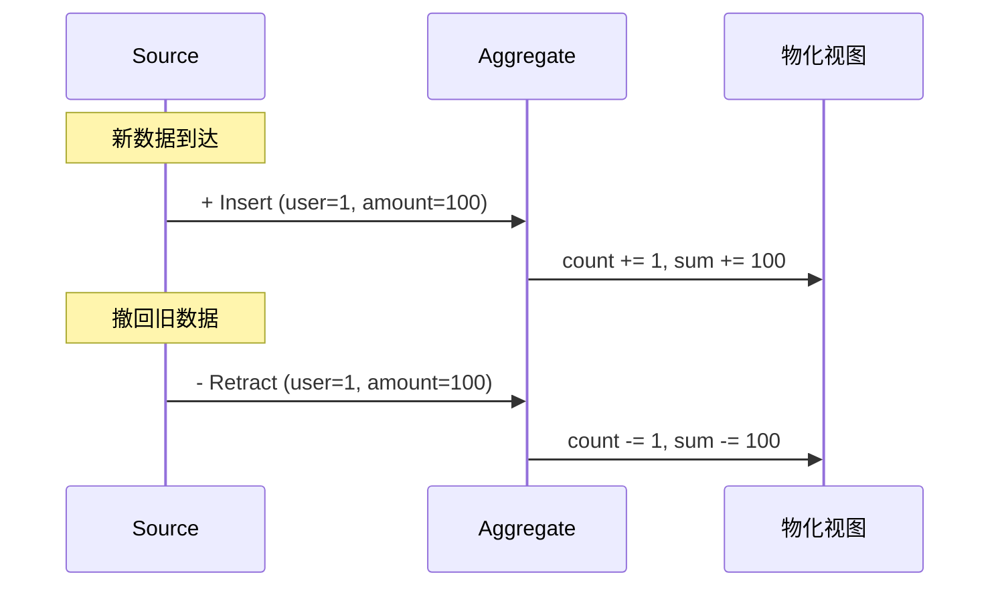

### 4. 查询执行流程

RisingWave 将 SQL 查询编译为流处理算子树，持续执行：

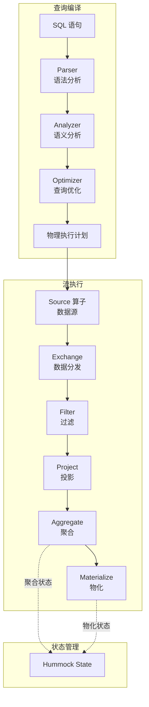

**算子执行流程**：

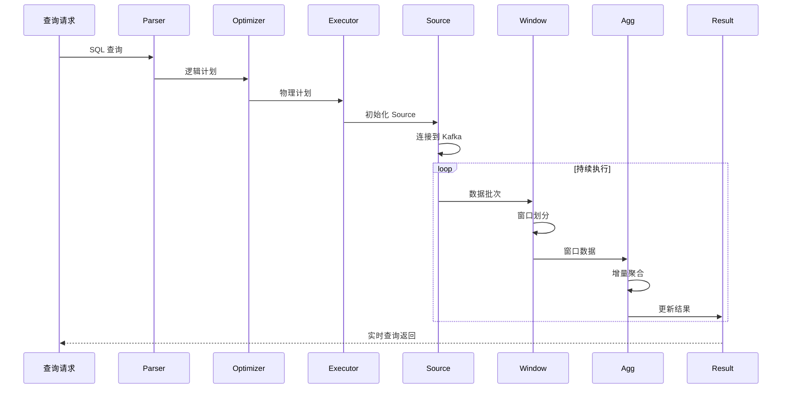

**执行器状态流转**：

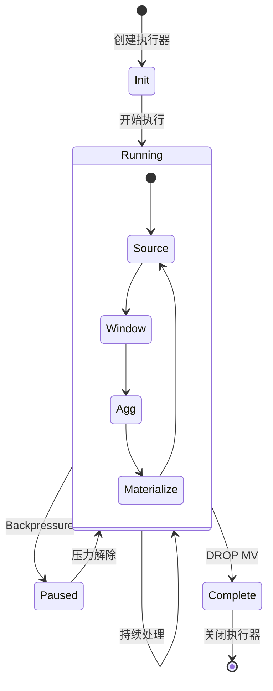

### 5. 与项目 algo/ 模块的关联

项目中的流引擎模块实现了基础的流处理算子，与 RisingWave 的查询引擎有相似的架构：

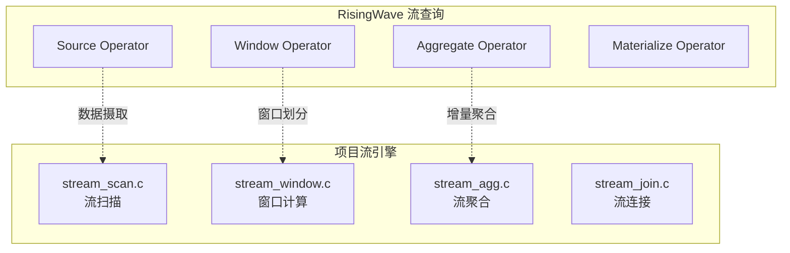

**接口对应关系**：

| RisingWave | 项目流引擎 | 功能 |
|------------|-----------|------|
| Source | `stream_engine.c` | 流数据管理、环形缓冲区 |
| Filter/Project | `stream_scan.c` | 流扫描、过滤、投影 |
| Window | `stream_window.c` | 窗口计算（Tumbling/Sliding/Session） |
| Aggregate | `stream_agg.c` | 增量聚合 |
| Join | `stream_join.c` | 流-流连接、流-表连接 |

**项目流引擎接口**：

```c
// stream_window.h - 窗口算子接口
StreamWindowState *exec_stream_window_init(PlanState *parent,
    int64_t window_size, int64_t slide, int window_type);

TupleTableSlot *exec_stream_window_next(StreamWindowState *state);

void exec_stream_window_close(StreamWindowState *state);

// stream_agg.h - 聚合算子接口
StreamAggState *exec_stream_agg_init(PlanState *parent,
    int agg_type, int64_t window_size);

TupleTableSlot *exec_stream_agg_next(StreamAggState *state);

void exec_stream_agg_close(StreamAggState *state);
```

**项目流引擎窗口计算**（`stream_window.c`）：

| 窗口类型 | window_type | 实现函数 |
|----------|-------------|----------|
| Tumbling | 0 | `compute_tumbling_window()` |
| Sliding | 1 | `compute_sliding_window()` |
| Session | 2 | `compute_session_window()` |

```c
// 窗口计算核心逻辑（简化版）
static TupleTableSlot *compute_tumbling_window(
    StreamWindowState *state, stream_window_internal_t *internal)
{
    // 1. 初始化窗口边界
    if (internal->current_window_end == 0) {
        stream_record_t *first = &internal->buffer[0];
        internal->current_window_start = 
            (first->timestamp / internal->window_size) * internal->window_size;
        internal->current_window_end = 
            internal->current_window_start + internal->window_size;
    }
    
    // 2. 遍历记录，计算窗口内数量
    while (internal->current_index < internal->buffer_count) {
        stream_record_t *record = &internal->buffer[internal->current_index];
        
        if (record->timestamp < internal->current_window_end) {
            internal->current_window_count++;
            internal->current_index++;
        } else {
            // 3. 输出当前窗口，移动到下一个窗口
            // ...
        }
    }
}
```

**对比分析**：

| 维度 | RisingWave | 项目流引擎 |
|------|------------|-----------|
| 数据存储 | Hummock（LSM + S3） | 内存环形缓冲区 |
| 状态管理 | 持久化状态后端 | 内存状态 |
| 窗口计算 | SQL 窗口函数 | C 算子实现 |
| 容错机制 | Barrier + S3 Checkpoint | 暂无 |
| 数据源 | Kafka/Pulsar/CDC | 内存插入 |
| 物化视图 | 支持 | 不支持 |

**项目中可借鉴的设计**：

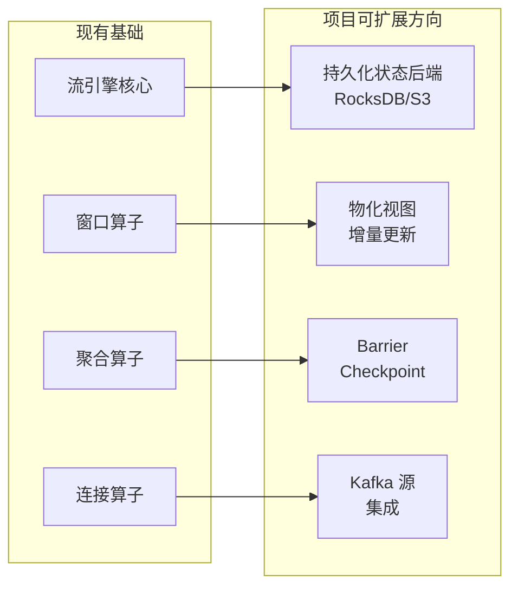

### 6. 性能优化技术

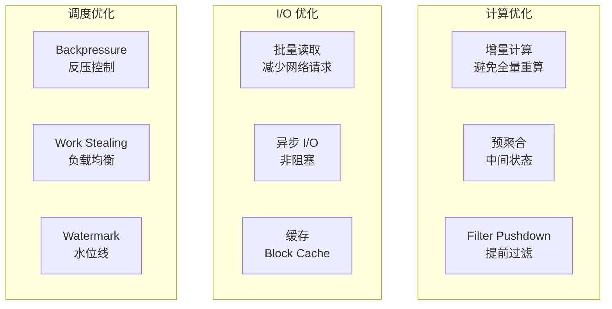

**优化技术对比**：

| 技术 | RisingWave | 项目实现 |
|------|-----------|----------|
| 增量计算 | 算子级增量 | 需手动实现 |
| 批处理 | Record Batch | 单记录迭代 |
| 缓存 | Block Cache | 无 |
| 反压 | 基于 Backpressure | 环形缓冲区满 |
| 容错 | Barrier Checkpoint | 无 |
| Watermark | 事件时间语义 | 基本水位线 |

## 要点总结

1. **持续查询**：SQL 定义流处理管道，增量更新结果
2. **窗口函数**：Tumbling/Sliding/Hopping/Session 四种类型
3. **物化视图**：增量更新避免全量重算，支持 Retract
4. **项目关联**：已实现窗口算子和流聚合，可扩展状态管理和容错

## 思考题

1. 滚动窗口和滑动窗口各适用于什么场景？性能差异如何？
2. 物化视图的增量更新如何处理 Retract（撤回）操作？
3. 项目的环形缓冲区存储有哪些限制？如何扩展支持持久化？
4. 如何在项目中实现流处理的容错机制（Barrier Checkpoint + 恢复）？
5. RisingWave 的物化视图增量更新与项目的流引擎算子如何集成？