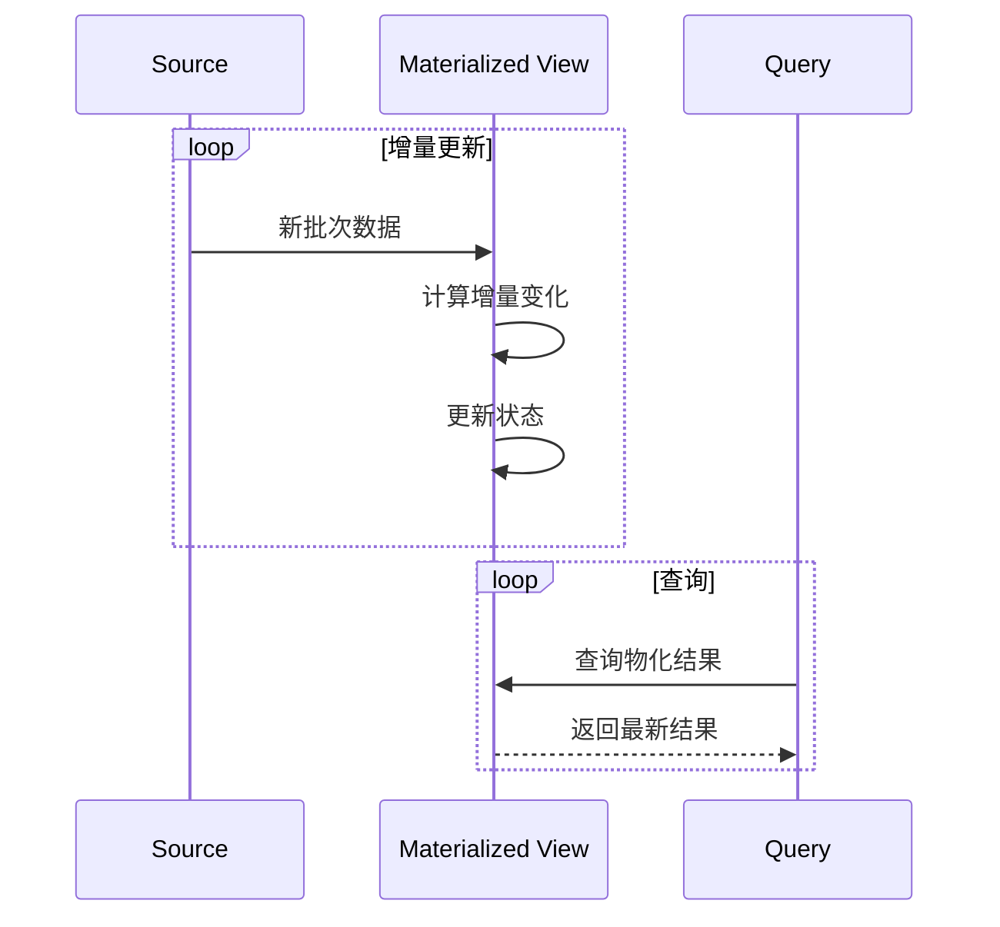
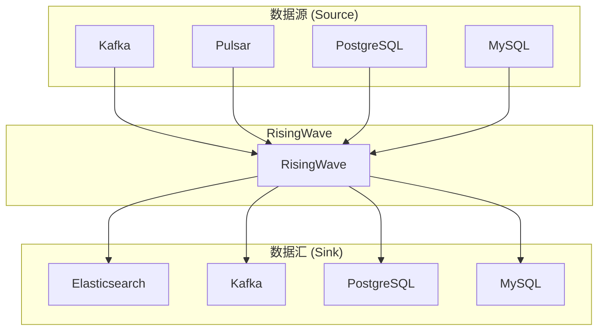
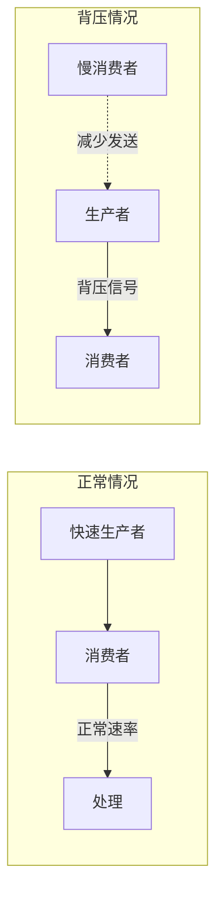

# RisingWave 核心特性

## 学习目标

- 掌握 RisingWave 的 SQL 流处理语法
- 了解时间窗口和持续物化视图的使用
- 理解 CDC 和 UPSERT 功能的实现

## 正文

### 1. 完整 SQL 支持

RisingWave 支持标准 SQL 语法定义流处理任务：

```sql
-- 创建数据源
CREATE SOURCE orders (
    order_id BIGINT,
    customer_id BIGINT,
    amount DECIMAL,
    created_at TIMESTAMP
) WITH (
    connector = 'kafka',
    topic = 'orders',
    properties.bootstrap.server = 'localhost:9092'
) FORMAT PLAIN ENCODE JSON;

-- 创建物化视图
CREATE MATERIALIZED VIEW order_stats AS
SELECT 
    customer_id,
    COUNT(*) as order_count,
    SUM(amount) as total_amount,
    AVG(amount) as avg_amount
FROM orders
GROUP BY customer_id;

-- 查询物化视图
SELECT * FROM order_stats WHERE order_count > 10;
```

### 2. 时间窗口

RisingWave 支持三种时间窗口：

#### 2.1 滚动窗口（Tumbling Window）

```sql
-- 每小时销售额
CREATE MATERIALIZED VIEW hourly_sales AS
SELECT 
    window_start,
    window_end,
    SUM(amount) as total_sales
FROM TUMBLING(
    SELECT * FROM orders,
    LATERAL TABLE(table_windowHopping(order_id, INTERVAL '1' HOUR, INTERVAL '1' DAY))
) AS t(window_start, window_end, order_id, amount)
GROUP BY window_start, window_end;
```

#### 2.2 跳跃窗口（Hopping Window）

```sql
-- 每小时统计最近24小时的累计销售额
CREATE MATERIALIZED VIEW daily_sales AS
SELECT 
    window_start,
    window_end,
    SUM(amount) as total_sales
FROM HOPPING(
    orders,
    LATERAL TABLE(table_windowHopping(created_at, INTERVAL '1' HOUR, INTERVAL '24' HOUR))
) AS t(window_start, window_end, order_id, amount, created_at)
GROUP BY window_start, window_end;
```

#### 2.3 滑动窗口（Sliding Window）

```sql
-- 每分钟更新最近5分钟的平均价格
CREATE MATERIALIZED VIEW sliding_avg AS
SELECT 
    TUMBLE_START(created_at, INTERVAL '1' MINUTE) as window,
    AVG(amount) as avg_amount
FROM orders
GROUP BY TUMBLE(created_at, INTERVAL '1' MINUTE);
```



```mermaid
gantt
    title 时间窗口类型
    dateFormat X
    axisFormat %s min
    
    section 滚动窗口
    每小时: 0, 60
    下一小时: 60, 120
    
    section 跳跃窗口
    窗口1: 0, 60
    窗口2: 30, 90
    窗口3: 60, 120
    
    section 滑动窗口
    1min: 0, 10
    1min: 10, 20
    1min: 20, 30
```

### 3. 持续物化视图

物化视图自动增量更新：



**特点**：
- 自动增量维护，无需手动刷新
- 毫秒级延迟
- 支持任意复杂 SQL

### 4. UPSERT 支持

支持 Debezium CDC 格式的 UPSERT 操作：

```sql
-- 创建 UPSERT SOURCE
CREATE SOURCE customer_updates (
    customer_id BIGINT,
    name VARCHAR,
    email VARCHAR,
    _ Debezium operation VARCHAR
) WITH (
    connector = 'kafka',
    topic = 'dbz.customers',
    properties.bootstrap.server = 'localhost:9092'
) FORMAT DEBEZIUM ENCODE JSON;

-- UPSERT 物化视图
CREATE MATERIALIZED VIEW latest_customers AS
SELECT customer_id, name, email
FROM customer_updates
GROUP BY customer_id;
```

**操作类型映射**：
| Debezium Op | 语义 |
|-------------|------|
| r (read) | 插入 |
| c (create) | 插入 |
| u (update) | 更新 |
| d (delete) | 删除 |

### 5. 连接器支持

RisingWave 支持多种数据源和数据汇：



### 6. 背压机制

RisingWave 实现智能背压防止数据积压：



**背压策略**：
- 上游减慢发送速率
- Buffer 满时暂停消费
- 动态调整并行度

## 要点总结

1. **完整 SQL**：使用标准 SQL 定义流处理逻辑
2. **三种时间窗口**：滚动/跳跃/滑动满足不同时序需求
3. **增量物化**：无需全量重算，自动维护结果
4. **CDC 支持**：完美支持 Debezium UPSERT 语义
5. **丰富连接器**：Kafka/Pulsar/数据库全覆盖
6. **智能背压**：防止数据积压和内存溢出

## 思考题

1. 如何选择合适的时间窗口类型？
2. UPSERT 语义在分布式环境如何保证一致性？
3. 背压机制如何避免死锁和资源浪费？
